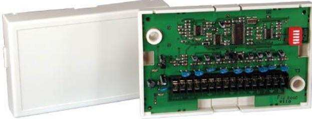

# **DS7432 Expansionsenhet med åtta sektioner**

- ▶ **Adresserar upp till åtta sektioner**
- ▶ **Dubbelbalanserad (DS7432E)**

DS7432-serien med expansionsenhet för åtta sektioner består av modellerna DS7432 och DS7432E. Båda expansionsenheterna adresserar upp till åtta sektioner för konventionella kontakter till centralapparatens multiplexbuss. DS7432E har dubbelbalanserade sektioner. DS7432E adresserar upp till 16 inkommande kontakter (larm och sabotage för varje slinga). DS7432 använder en 47 kΩ-resistor per sektion. DS7432E använder 22 kΩ + 47 kΩ per sektion.

# **Certifikat och godkännanden**

- Modell Certifieringar och godkännanden DS7432 UL AMCX: Larmenheter för larmcentraler (UL1610) UL AOTX: Lokala larmenheter (UL609) UL APAW: Polisstationens larmenheter (UL365) UL NBSX: Larmsystem för inbrott i hemmet (UL1023) UL UOXX: Kontrollenhetstillbehör, system (UL864) UL UTOU: Kontrollenheter och tillbehör - hemmasystem (UL985) X
# Modell Certifieringar och godkännanden

DS7432E X

# **Installations-/konfigurationsanteckningar**

# **Kompatibilitetsinformation**

Expansionsenheterna i DS7432-serien kan endast anslutas till följande centralapparater med bussinterface.

| Centralapparater | D9412GV2 Centralapparat                                                                                                |
|------------------|------------------------------------------------------------------------------------------------------------------------|
|                  | D7412GV2 Centralapparat                                                                                                |
|                  | D9412G Centralapparat                                                                                                  |
|                  | D7412G Centralapparat                                                                                                  |
|                  | DS7400XiV4 Centralapparat                                                                                              |
|                  | DS7400Xi Centralapparat                                                                                                |
| Bussinterface    | D8125MUX Bussinterface                                                                                                 |
|                  | DS7430 Bussinterface för adresserbara enhe ter                                                                      |
|                  | DS7436 Bussinterface med två utgångar för adresserbara enheter                                                      |
| Obs!             | DS7432E är kompatibel med D9412GV2, D9412G, D7412GV2 och D7412G när kretskortsbygeln är placerat i DS7432-läget. |

# **Antal expansionsenheter**

Antalet expansionsenheter som kan anslutas till ett system beror på centralapparaten

DS7400Xi DS7400XiV4 D9412GV2, D9412G D7412GV2, D7412G

# Centralapparat Antal expansionsenheter som kan anslutas Upp till 15 Upp till 30 Upp till 30 Upp till 8

# **Anslutningar**

Information om krav på multiplexledningsdragning finns i bussinterfacens referensguide.

| Avstånd (cirka) | Storlek |
|-----------------|---------|
| 76 m            | 0,65 mm |
| 193 m           | 1,02 mm |
| 250 ft          | 22 AWG  |
| 600 ft          | 18 AWG  |

Rekommenderad kabel till centralapparaten är en fyrledad kabel. Använd inte skärmad eller partvinnad kabel.

| Obs! | 18 AWG-ledning krävs för i   |
|------|------------------------------|
|      | brandvarningsinstallationer. |

# **Delar som medföljer**

# Mängd Komponent

- 1 Expansionsenhet med 8 sektioner
1 Manual

# **Tekniska specifikationer**

# **Kretsparametrar**

| Kretstyp för startenhet:                             | Klass B, typ A            |  |  |  |
|------------------------------------------------------|---------------------------|--|--|--|
| Typ av ledningskrets för signalering: Klass B, typ 4 |                           |  |  |  |
| Miljöspecifikationer                                 |                           |  |  |  |
| Temperatur (vid drift):                              | 0 till +50 °C (32–122 °F) |  |  |  |
| Strömspecifikationer                                 |                           |  |  |  |
| Strömförbrukning:                                    | Maximalt 10 mA            |  |  |  |
| DS7432-slutmotstånd                                  | 47 kΩ                     |  |  |  |
| DS7432E-slutmotstånd                                 | 22 kΩ+47 kΩ per sektion   |  |  |  |
|                                                      |                           |  |  |  |

# **Beställningsinformation**

plexbuss.

Spänning: 12 V DC, nominellt

| DS7432E Expansionsenhet med åtta sektioner Konfigurerad som dubbelbalanserad. Adres serar upp till 16 ingångskontakter (larm och sabotage för varje loop). | DS7432E |
|---------------------------------------------------------------------------------------------------------------------------------------------------------------------|---------|
| DS7432 Expansionsenhet med 8 sektioner Adresserar upp till 8 sektioner för konventio nella kontakter till centralapparatens multi                             | DS7432  |

Bosch Security Systems AB Vestagatan 2 416 64 Göteborg Phone: +46 31 722 5300 Fax: +46 31 722 5340 se.securitysystems@bosch.com www.boschsecurity.se

Sweden:

Represented by

© Bosch Security Systems 2006 | data kan ändras utan föregående meddelande F1574221579 | Cur: sv-SE, V2, 18 Jul 2006