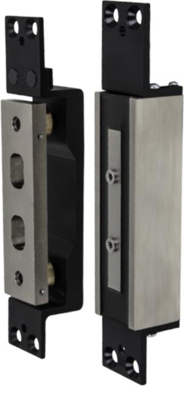
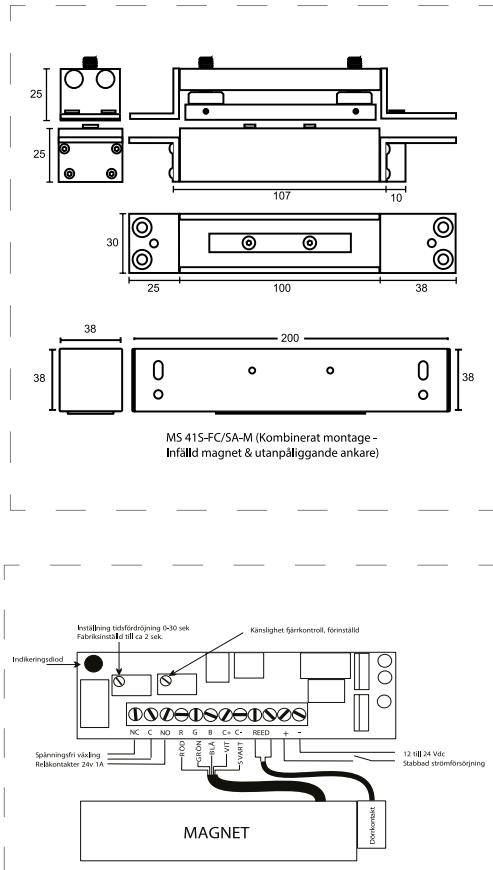

### KVALITÉ OCH INNOVATION FRÅN SVERIGE

## D Ö R R M A G N E T MS 41

# Dörrmagnet för slag-, skjutoch pendeldörrar

MS 41 är ett elektromagnetiskt säkerhetslås av typen Shearloc. Låset kan monteras på alla typer av dörrar, såväl slag-, skjut som pendeldörrar. Shearloc är det idealiska låset för pendeldörrar och övervakade nödutrymningsdörrar.

Låset kan monteras både horisontellt och vertikalt. Genom att kombinera magnetiska och mekaniska krafter uppnås hög hållkraft, upp till 1000 kg belastning.

### Kraftfull låsning

Trots sin lilla storlek håller MS 41 1000 kg i brythållfasthet.

### Övervakning

MS 41 har dörrstatusindikering vilket kan plockas ut antingen NO eller NC.

### Infälld montering

Ger en dold och estiskt bättre installation.

### Multispänning

MS 41 har automatisk omställning mellan 12 och 24 VDC.

### D Ö R R M A G N E T MS 41

### EGENSKAPER

- Multispänning 12-24 VDC
- Infällt montage
- Kombinerat montage: infälld mag. och utanpåliggande ankare (S-SC/SA-M)
- Integrerad dörravkänningsrelä (NC/NO)
- Klarar 3-8 mm avstånd mellan dörr och dörrkarm
- Tidsfördröjning ställbar 0-30 sekunder
- Diodindikering:
- Grön: frånreglad dörr
- Röd: förreglad dörr

### TEKNISKA DATA

- 12 VDC/24 VDC
- Strömförbrukning:
- 12 VDC: 1,5 A under 2 sek därefter 500 mA
- 24 VDC: 1,5 A under 2 sek därefter 500 mA
- Relä 1A vid 24 VDC
- Hållkraft upp till 1000 kg

### BENÄMNING ART NR

- MS 41 SFM, infällt montage 202 144 535 MS 41 S-SC/SA-M, kombinerat montage 202 144 537
#### **SAFETRON AB**

Säterivägen 18 P.O. Box 2096 65002 Karlstad Sweden

Tel: +46 54 19 02 45 Email: info@safetron.com

Du hittar alltid det senaste på safetron.com