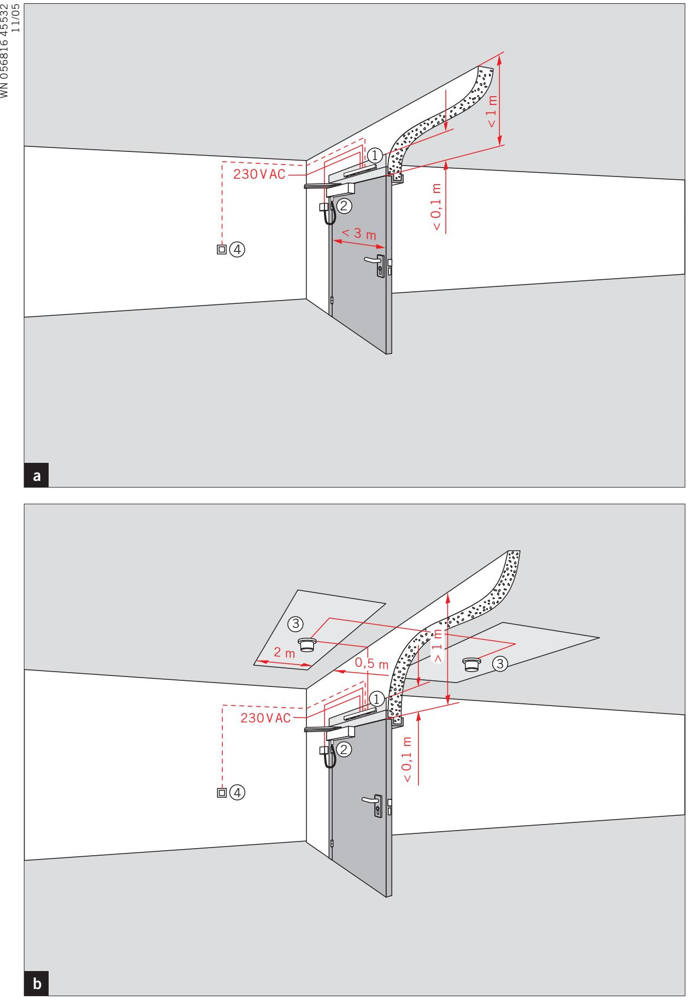

**L**

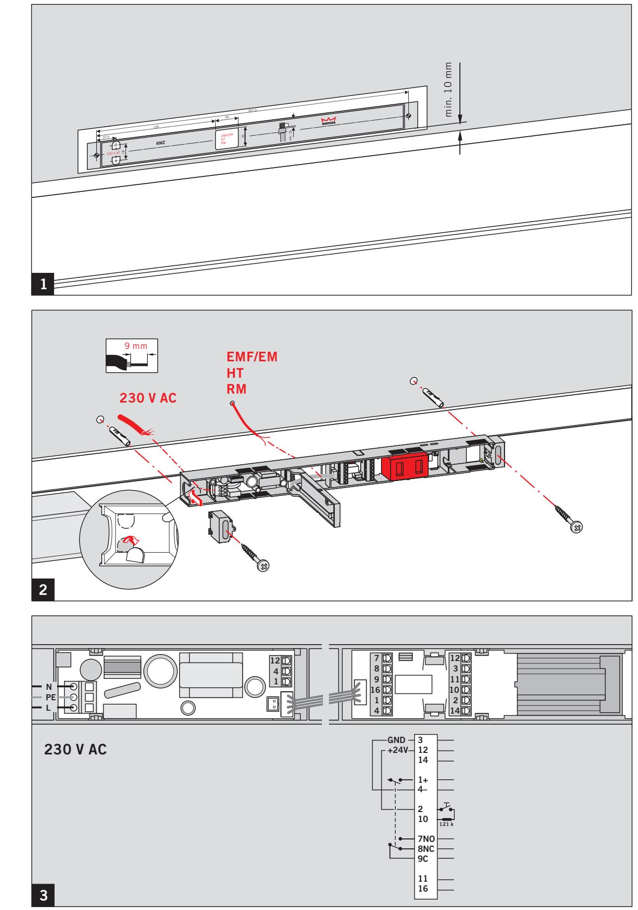

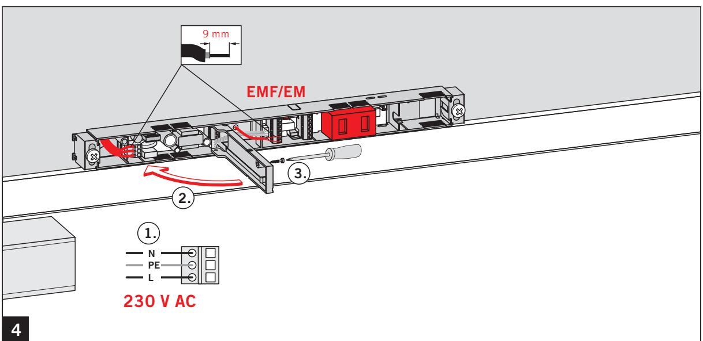

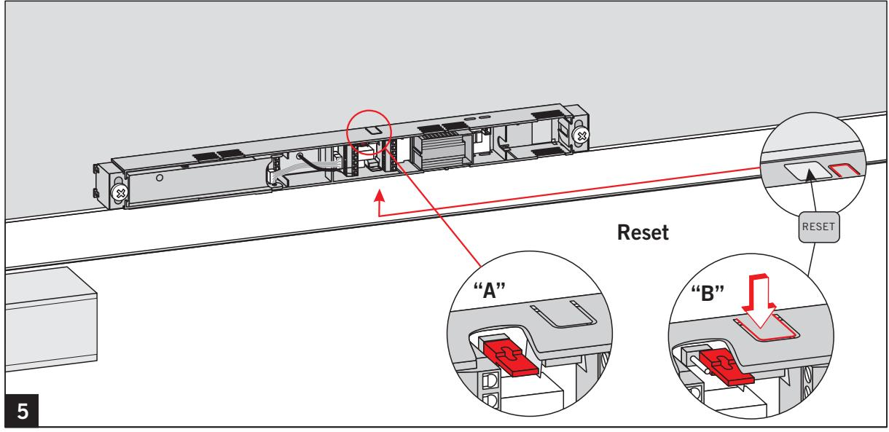

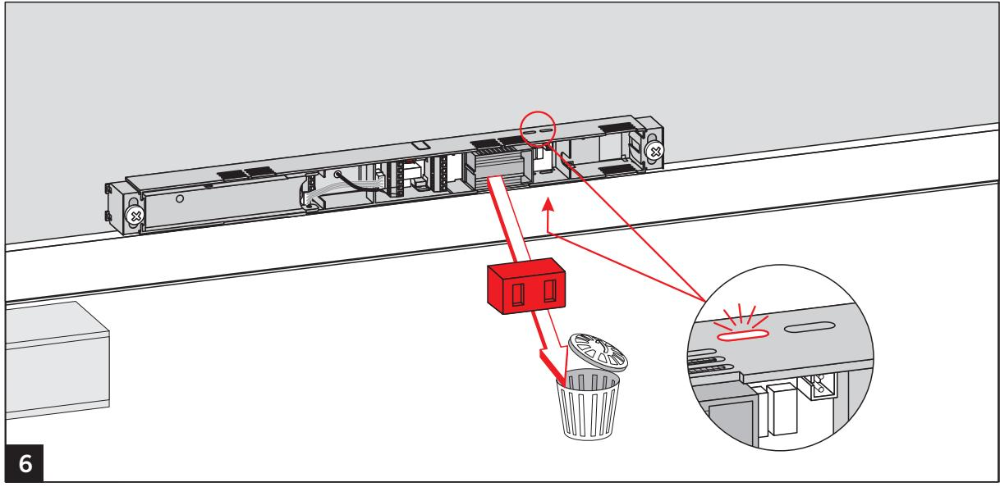

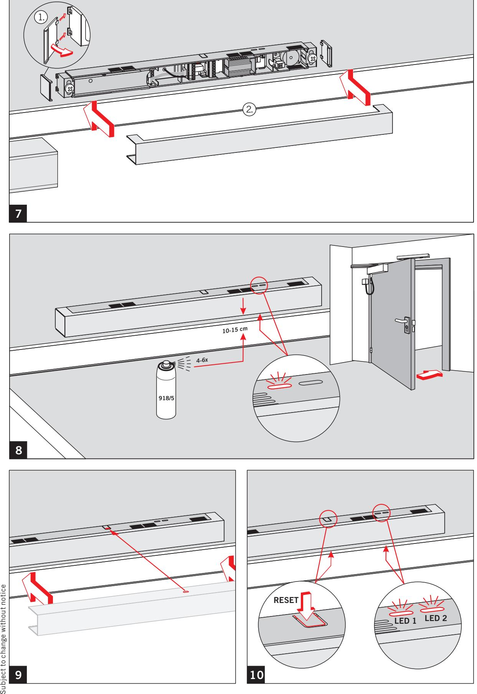

**9 10**

Änderungen vorbehalten

**DORMA GmbH + Co.KG** Postfach 40 09 D-58247 Ennepetal • Breckerfelder Straße 42-48 D-58256 Ennepetal **Door Control Division** Tel. +49 (0) 23 33 / 793-0 • Fax +49 (0) 23 33 / 79 34 95 • www.dorma.com

# RMZ —

## Monteringsanvisning

### **Tekniska data RMZ**

| Inspänning:     | 230 V AC +10% / –15%                             |
|-----------------|--------------------------------------------------|
|                 | 120 mA / 28 VA / 50 Hz                           |
| Utspänning:     | 24 V DC / 460 mA / 11 W                          |
| Kapslingsklass: | IP 30                                            |
| Skyddsklass:    | II                                               |
| Rökdetektor:    | 24 V DC / 50 mA                                  |
| Temperatur:     | –20°C / +40°C                                    |
|                 | Rel. luftfuktighet: max. 93 % utan kondenserande |

**Arbete på elektriska anläggningar får endast utföras av utbildade elektriker.**

- **Kontrollera att spänningen till strömförsörjningen (230 VAC) är frånslagen.**
- **I matningskretsen måste en automatsäkring 10A finnas. Denna fungerar samtidigt som frånskiljare för att göra RMZ spänningslös.**
- **Nätkabeln måste vara ordentligt dragavlastad före RMZ.**
- **Nätkabelns area (NYM) får vara max 1,5 mm2. Skyddsjorden används inte elektriskt. Plinten (PE) skall emellertid användas om skyddsjord finns.**
- **Rökdetektorcentralen RMZ får bara monteras direkt över dörröppningen och bara användas fast monterad på vägg.**
- **Rökdetektorer för uppställningsanläggningar får inte styra andra larmsystem (t ex överföringssystem för brandlarm).**+ **1)**
- **Om larmmodulen används som option, skall förbindningskabeln till rökdetektorn ledas in genom mätkammaren så att röken inte hindras att tränga in.**
	- À Rökdetektorcentral
	- Á Elektromagnetisk uppställningsanordning
	- Â Rökdetektor
	- Ã DORMA HT Manuell utlösningsknapp för uppställningsanordningar (option) – krävs för fasthållningsmagneter och frilöpande dörrstängare. Denna får inte döljas av den uppställda dörren. + 1)

**a** Montera karmdetektorn RMZ, om takets undre yta på en eller på båda sidor av dörren ligger mindre än 1 m över karmöverstyckets underkant. + 1) För tillhörande inkopplingsanvsningar, se separat blad. **b** Om takets undre yta på en eller på båda sidor av dörren ligger mindre än 1 m över karmöverstyckets underkant, skall förutom karmdetektor även två takdetektorer anbringas. + 1) För tillhörande inkopplingsanvsningar, se separat blad. **1** Rökdetektorcentralen RMZ monteras omedelbart (min. 10 mm) över dörröppningen. Det lodräta avståndet över övre karmens underkant får vara max 0,1 m. Markera och borra upp fästpunkter och erforderliga kabelgenomföringar för matningsledningen 230 V, uppställningsanordningen, takdetektorn och den manuella knappen. Förlägg tillhörande kablar **2** För att garantera skyddsklass II (skyddsisolering), skall 230 V-kabeln förläggas dubbelisolerad fram till anslutningsplinten. Avisolera kabeln. Bryt loss anvisningen för kabelgenomföring. Stick på ändkåpor och skruva dit rökdetektorcentralen. **3** Plintbeläggning **3** Anslutning av externa detektorer med slutmotstånd 2) Total uteffekt max. 9,8 W **12 14 1 +** Utgång 24 V DC **4 –** Uppställningsanordning(ar) **2** Extern utlösningsknapp med slutmotstånd 2) **10 7 NO** Potentialfri växlingskontakt Klenspänning (SELV) 24 V AC/DC, 1 A **8 NC 9 C 11** Potentialfri plint **16** Bus 2) se anslutningsscheman **SV Funktioner DIP-brytare 1** OFF = automatisk återställning ON = manuell återställning **2** OFF = 1 Stickdrift (linje) ON = 2 Stickdrift (stjärna) **3** OFF = utan takdetektor ON = med takdetektor **4** OFF = utan handbrytare

- ON = med handbrytare.
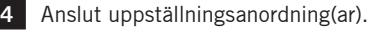

Anslut eventuellt befintliga takdetektorer och/eller manuell knapp – se kopplingsritningar. Se till att rätt slutmotstånd kopplas in!

Sätt in och anslut en RS-larmmodul (option). En larmmodul kan inte användas, om reläkontakterna 7, 8, 9 redan är upptagna.

Anslut kabeln för strömförsörjning. Stäng till och skruva fast beröringsskyddet.

**5.1 Automatisk återställning (leveranstillstånd)** Rökdetekteringscentralen återställer sig själv automatiskt efter utlösning, så snart det inte finns någon rök eller provgas kvar i rökkammaren. Driftindikatorn lyser åter grönt.

## **5.2 Manuell Reset**

Manuell återställning föreskrivs vid användning

- i uppställningsanordningar med automatisk drivning, t ex DORMA ED 200, ED 100, ED 250 (enligt DIN 18263 del 4)
- i säkringssystem för utrymningsvägar (enligt IfBt Mitteilung 5/98, punkt 3.1.4).

 Driftindikatorn blinkar grönt, så snart det inte finns någon rök eller provgas kvar i rökkammaren. Återaktivering sker via Reset-knappen Vid detta funktionssätt skall bifogade etikett klistras på höljet.

**8** Funktionsprovning

#### **Följ användnings- och säkerhetsanvisningarna på provgasen och säkerhetsdatabladet.**

 Öppna och ställ upp dörrbladet. Spraya provgas (Hekatron 918/5) från ca 10-15 cm avstånd i riktning mot rökkammaren. Efter ca 4-6 korta spraystötar slår driftindikatorn om till larm (röd). Om RMZ är utrustad med RS-larmmodul (option) ges larm också akustiskt. Spänningen bryts till uppställningsanordningen och dörren stängs.

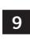

**9** Sätt på den medlevererade dammskyddskåpan, så att damm inte kan komma in i rökdetektorn under byggarbeten i lokalen.

**När dammskyddskåpan är påsatt, skall anläggningen göras spänningslös, eftersom då också nätdelens luftningsslitsar är övertäckta. Innan anläggningen tas i drift slutgiltigt, skall dammskyddskåpan avlägsnas och en ytterligare funktionsprovning utföras enligt punkt 8.**

**10 Lysdiodernas funktioner** LED till LED från **Driftindikator lysdiod 1 (grön/röd)** 

| Normal drift: grön                            |  |
|-----------------------------------------------|--|
| Larm brandvarnare: röd                        |  |
| Larm handbrytare: röd                         |  |
| Underhållsindikator lysdiod 2 (gul)           |  |
| Tid för underhåll: blinkar                    |  |
| Nedsmutsning: blinkar                         |  |
| Störning: blinkar                             |  |
| fel kabeldragning till rökvarnare/handbrytare |  |
| DIP-brytare ändring efter idrifttagning:      |  |
| LED 1: blinkar                                |  |

|  | LED 2: blinkar |  |  |  |  |
|--|----------------|--|--|--|--|

Ändringar övertas först efter Reset-brytaren har tryckts.

## **LEVERANSBESIKTNING OCH UNDERHÅLL**

- Informationsblad över användningen av uppställningsanläggningar.
- **Om karmdetektorn RMZ monteras i mycket dammiga utrymmen, måste de föreskrivna serviceintervallen ovillkorligen innehållas eller till och med förkortas, eftersom dammavlagringar i rökdetektorn kan medföra felaktiga utlösningar.**
- **Brandvarnaren måste byta ut efter 8 år enligt DIN 14677. När utbytestiden har uppnåtts visas detta kontinuerligt med lysdioden LED 2.**

## **YTTERLIGARE ANVISNINGAR / FÖRESKRIFTER**

- Allmänna krav och testprinciper för låssystem (AAuPZF)
av Deutschen Instituts für Bautechnik, Berlin.

Ändringar förbehålles

**Dansk Brand- og sikringsteknisk Institut: DBI retningslinie 231-1. udgave august 2010.** 

**Retningslinien omhandler automatisk branddørlukningsanlæg (ABDL) med indbygget røgdetektor monteret på dørkarm. Afhængig af rumforholdene kan anlægget anvendes alene (se pkt. 2.11) ellers monteres ekstra DORMA RM-N (se pkt. 2.4) røgdetektorer på hver side af dørpartiet og tilsluttes branddørlukningsanlægget. Anlægget kan anvendes til både 1- og 2- fløjede døre i henhold til retningslinie og godkendelse.**

**Bemærk: Pkt. 2.11 og 2.4 er en direkte afskrift af senest revideret DBI retningslinie nr. 231-1. udgave august 2010. Der kan senere forekomme rettelser, der ikke er medtaget i denne brochure. Kontakt venligst DBI for ajourføring eller ved evt. spørgsmål om fortolkning.**

### **2.11 Automatiske branddørlukkere**

En automatisk branddørlukker er et ABDL-anlæg, hvor dørlukker, centraludstyr og røgdetektor er sammenbygget.

Denne anlægstype kan anvendes med følgende begrænsninger: Arealet af de enkelte rum, der støder op til døren, må ikke overstige 50 m2.

Rumhøjden må ikke overstige 4,5 m. Højde fra åbning til underkant loft må ikke overstige 1,0 m.

Enheden må alene aktivere en-fløjede døre, hvis åbningsbredde ikke overstiger 1,0. Dog kan enheden aktivere to-fløjede døre, hver med en maksimal bredde på 1,0 såfremt dette fremgår af systemgodkendelsen.

Enheden skal monteres på dørkarm med detektorplacering inden for åbningens midterste tredjedel. Installeres supplerende detektorer til enheden, skal bestemmelserne for placering i afsnit 2.4. følges. Krav til dørlukningstryk er angivet i afsnit 2.8.

#### **2.4 Røgdetektorer**

Der skal installeres en røgdetektor på hver side af døren hørende til samme anlæg, i en vandret afstand på mindst 0,5 m og op til 6,0 m, målt fra ethvert punkt i døråbningen. Såfremt en røgdetektor ikke kan overvåge hele døråbningen, skal der installeres yderligere røgdetektorer.

Røgdetektorer installeres i en afstand på mindst 1,0 m fra kanten af indblæsning- og udsugningsåbninger for klima – og / eller ventilationsanlæg.

Røgdetektorer kan uden begrænsninger anvendes ved lufthastigheder, der til stadighed er mindre end 1, m/s.

Ved installation af røgdetektorer skal der tages hensyn til, at mange arbejdsprocesser udvikler røg, støv eller damp.

Placering af røgdetektorer under nedhængt loft loft kan undlades, når åbningerne i det nedhængte loft udgør mindst 40% af det samlede areal og er jævnt fordelt, og der samtidig er installeret detektorer over det nedhængte loft.

Røgdetektorer skal placeres i højest beliggende del af loftet, såfremt lofthøjden er mindre end eller lig med 4,5 m inden for 6,0 m fra døren.

Overstiger lofthøjden 4,5 m, kan røgdetektorer placeres enten i højest beliggende del af loftet eller på beslag placeret over dør. Røgdetektorer tillades ikke installeret højere end 11,0 m.

Monteres røgdetektorer på beslag over dør, skal følgende være opfyldt:

Den lodrette afstand fra overkant af dør til røgdetektor skal være min. 0,5 m, se figur 2.4.

Den vandrette afstand fra røgdetektor til væg skal være min. 0,5 m og max. 1,0 m, se figur 2.5.

Ved rumhøjder over 6,0 m og lofthældninger større end 20° kan røgdetektorer ofte ikke installeres direkte på loftet, men skal installeres på et beslag, således at afstanden mellem loftet og røgdetektoren opfylder mindsteafstanden i tabel 2.1.

Hvis røgdetektorer installeres på beslag over dør, skal tabel 2.1 ikke anvendes.

## **Tabel 2.1**

| Rumhøjde h0 (m) i detekto |      | Tilladelig loft / detektorafstand a0 (m) med loftshældning i delområdet på |      |                |      |                              |      |  |
|------------------------------|------|-------------------------------------------------------------------------------|------|----------------|------|------------------------------|------|--|
| rens lodrette centerlinie |      | Højst 20°                                                                     |      | Større end 20° |      | men højst 45° Større end 45° |      |  |
| min.                         | max. | min.                                                                          | max. | min.           | max. | min.                         | max. |  |
| 0,00                         | 3,0  | 0,03                                                                          | 0,20 | 0,03           | 0,20 | 0,03                         | 0,20 |  |
| 3,01                         | 6,0  | 0,03                                                                          | 0,20 | 0,20           | 0,30 | 0,30                         | 0,50 |  |
| 6,01                         | 8,0  | 0,07                                                                          | 0,25 | 0,25           | 0,40 | 0,40                         | 0,60 |  |
| 8,01                         | 10,0 | 0,10                                                                          | 0,30 | 0,30           | 0,50 | 0,50                         | 0,70 |  |
| 10,01                        | 11,0 | 0,15                                                                          | 0,35 | 0,35           | 0,60 | 0,60                         | 0,80 |  |

Tabel 2.1 viser afstanden mellem loftet og røgdetektoren ved forskellige lofthøjder og lofthældninger. Afstanden måles mellem loft og åbning i detektor for røgindtrængning.

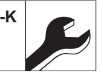

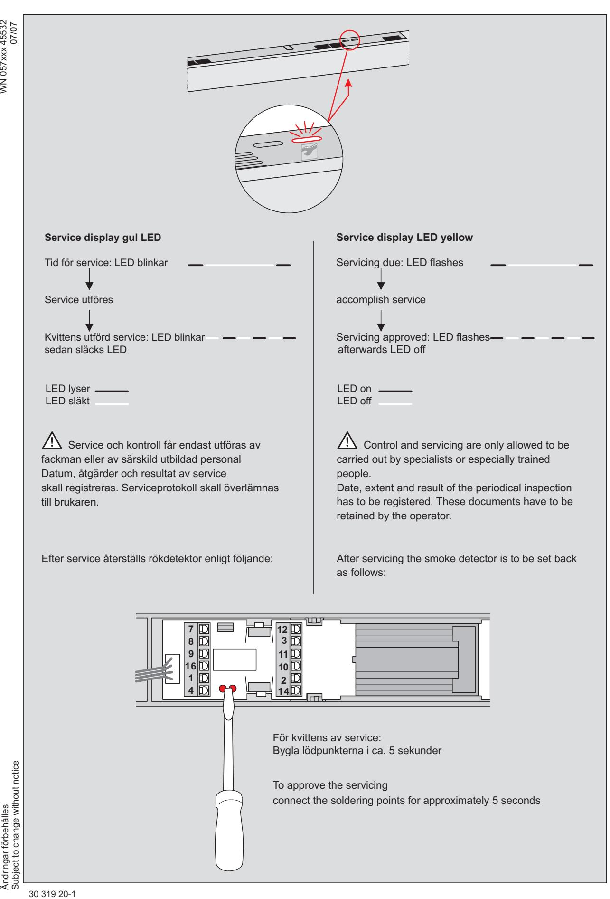

**DORMA GmbH + Co.KG** Postfach 40 09 D-58247 Ennepetal • Breckerfelder Straße 42-48 D-58256 Ennepetal **Door Control Division** Tel. +49 (0) 23 33 / 793-0 • Fax +49 (0) 23 33 / 79 34 95 • www.dorma.com

RMZ —

WN 058995 45532, 10/16

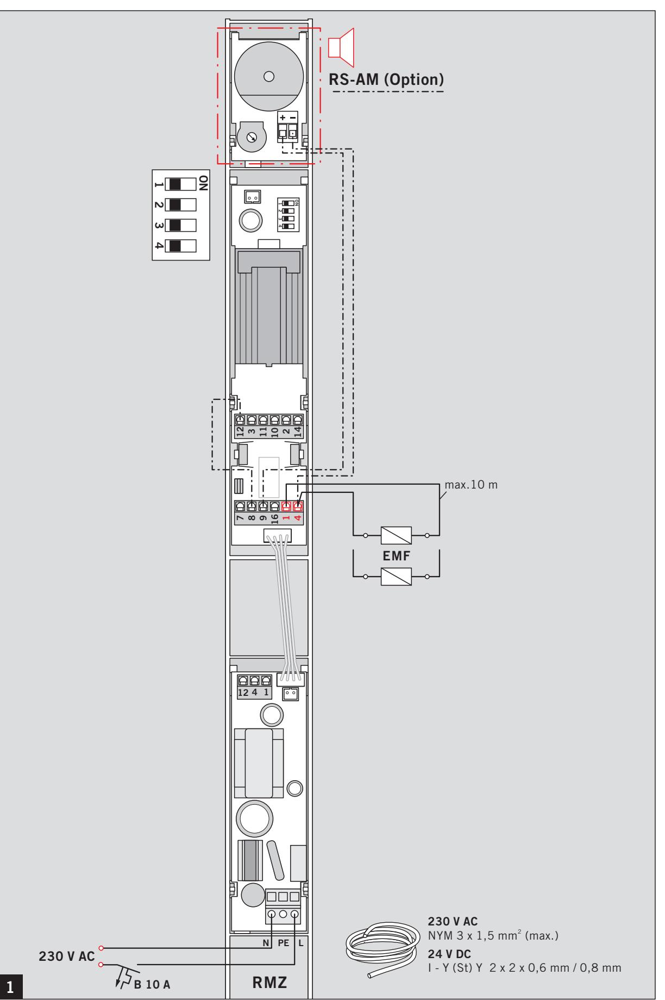

RMZ —

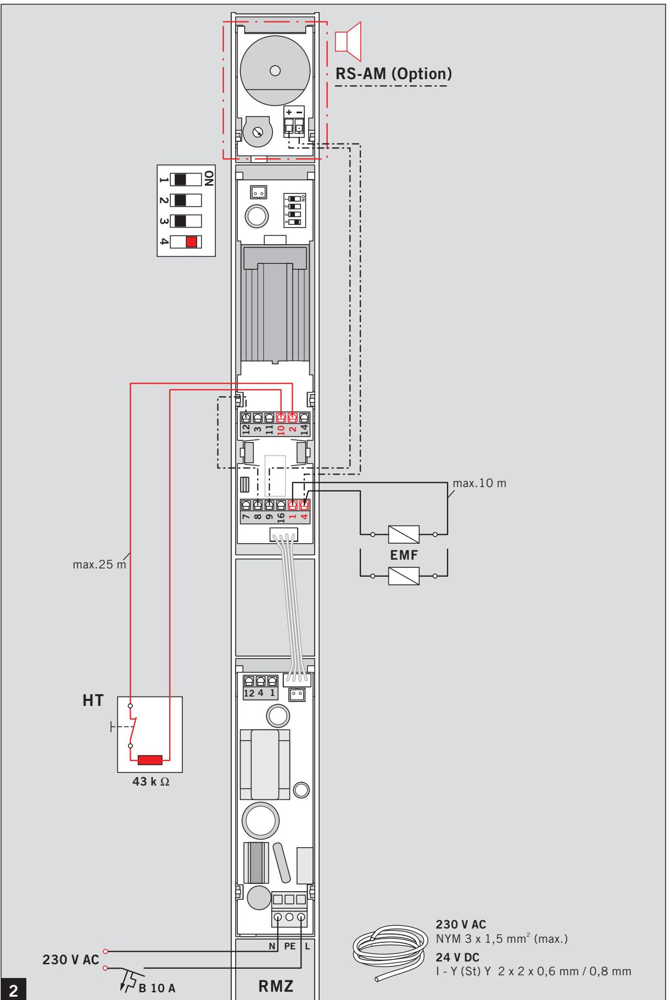

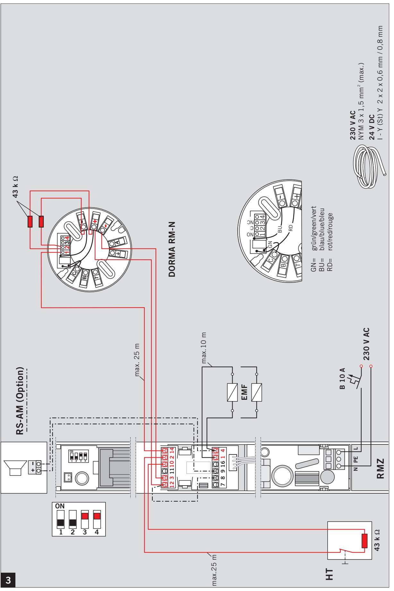

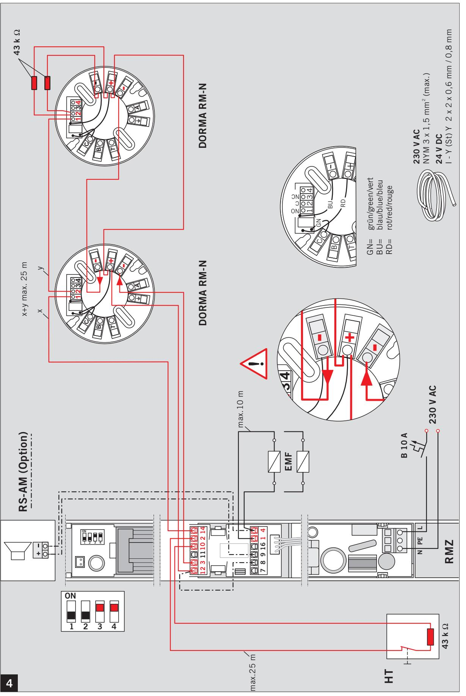

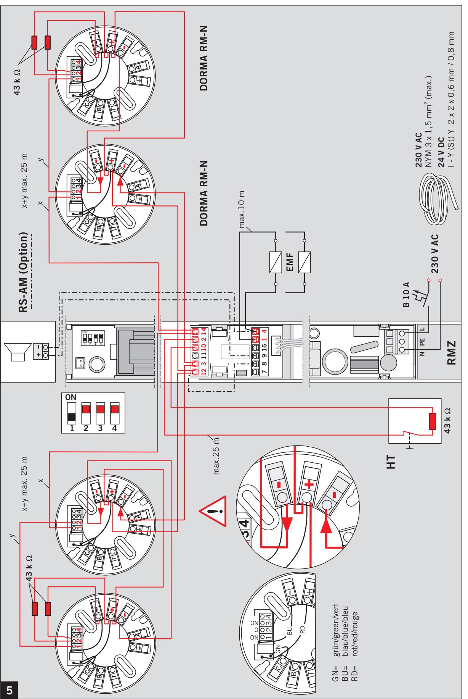

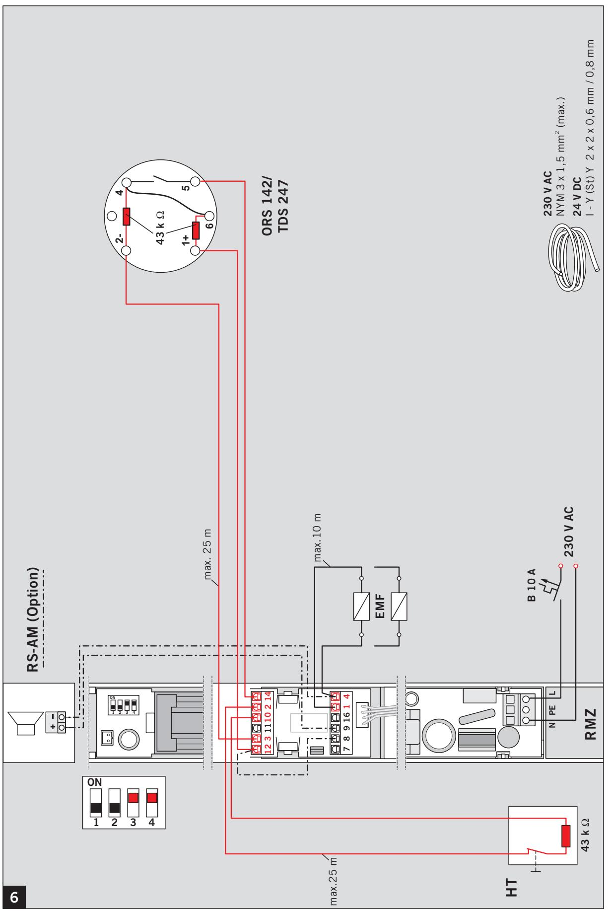

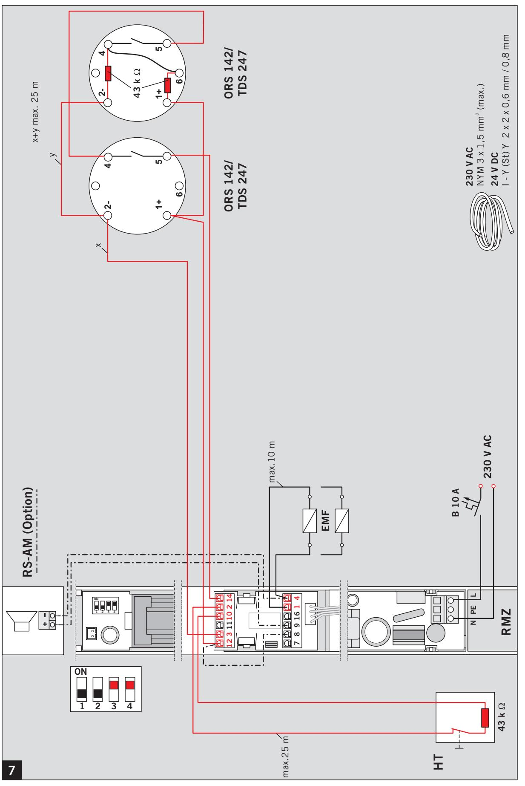

RMZ

—

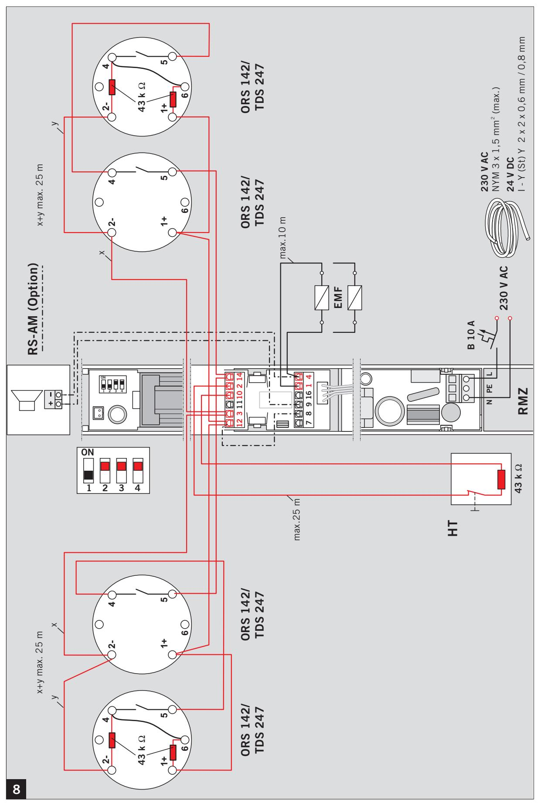

Änderungen vorbehalten Subject to change without notice