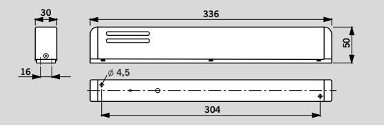
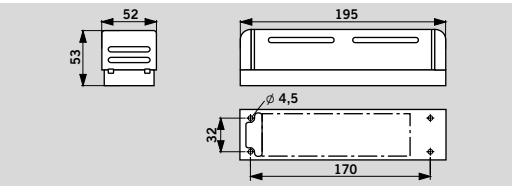
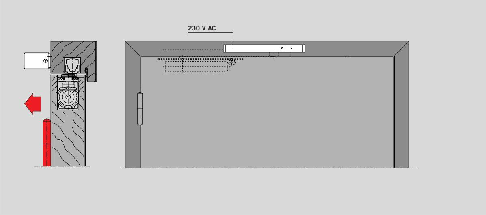
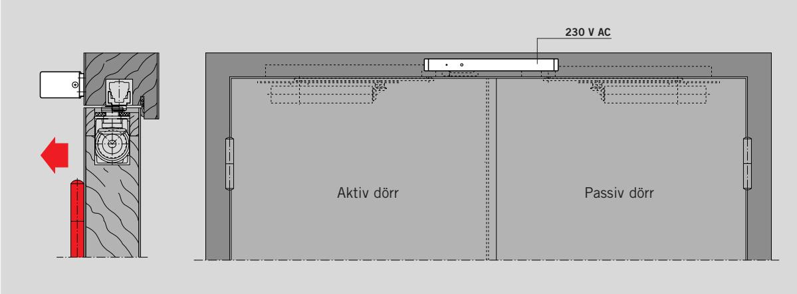
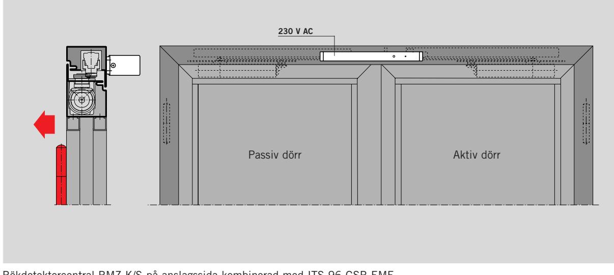

#### Måtten i de nya konstruktionerna är väl anpassade för att undvika problem vid monteringen och den eleganta designen harmonierar väl med olika miljöer.

# **F Lämplighetsbevis**

## **DORMA RMZ-K/S**

## **DORMA RM**

## **Beskrivning**

#### **RMZ-K/S**

Rökdetektorcentral med integrerad nätenhet och optisk rökdetektor för karmmontage. Avsedd för styrning av DORMA uppställningssystem. Fler rökdetektorer kan anslutas. Potentialfri växlingskontakt och anslutningsplintar för extern manuell utlösning. Nätspänning: 230 V AC, driftspänning: 24 V DC.

# **Färg**

Y Silver Vit, se RAL Y 9010 Y 9016 Y Rostfri Y Polerad mässing Y Specialfärg __(se RAL __)

# **Utförande**

Y Komfortutförande med möjlighet till anslutning av fler detektorer, extern manuell utlösning och potentialfri larmkontakt. **Fabrikat** DORMA RMZ-K

Y Standardutförande med möjlighet till anslutning av fler detektorer via 2-trådsteknik. **Fabrikat** DORMA RMZ-S

| Rökdetektorcentral DORMA RMZ-K/S och rökdetektor DORMA RM kompletterar på ett utmärkt sätt det bepröva de och praktiska systemet DORMA ITS 96 och ger ett förstärkt brandskydd. Båda produkterna är konstruerade enligt de senaste riktlinjerna från Deutschen Instituts für Bautechnik, vilket garanterar att alla system samverkar på effektivast möjliga sätt för uppställning av branddörrar under varierande förhållan den. | Måtten i de nya konstruktio nerna är väl anpassade för att undvika problem vid monteringen och den ele ganta designen harmonierar väl med olika miljöer. | Tekniska data och funktioner                                                            |                                                            | RMZ-K                              | RMZ-S                               | RM                                 |
|-------------------------------------------------------------------------------------------------------------------------------------------------------------------------------------------------------------------------------------------------------------------------------------------------------------------------------------------------------------------------------------------------------------------------------------------------------------------------------|-------------------------------------------------------------------------------------------------------------------------------------------------------------------------|-----------------------------------------------------------------------------------------|------------------------------------------------------------|------------------------------------|-------------------------------------|------------------------------------|
|                                                                                                                                                                                                                                                                                                                                                                                                                                                                               |                                                                                                                                                                         | Funktioner                                                                              | Rökdetektor Utlösningsanordning Energiförsörjning    | 2 2 2                        | 2 2 2                         | 2 2 –                        |
|                                                                                                                                                                                                                                                                                                                                                                                                                                                                               |                                                                                                                                                                         | Rök- registrering                                                                    | Ljusbrytningsprincip (optisk)                           | 2                                  | 2                                   | 2                                  |
|                                                                                                                                                                                                                                                                                                                                                                                                                                                                               |                                                                                                                                                                         | Montering                                                                               | På karm I tak                                           | 2 –                             | 2 –                              | 2 2                             |
|                                                                                                                                                                                                                                                                                                                                                                                                                                                                               | F Lämplighetsbevis DORMA RMZ-K/S och DORMA RM är godkända för användning till uppställnings system av Deutschen Instituts für Bautechnik, Berlin.     | Anslutning av flera detektorer                                                    | 2-trådsteknik Rökkontakt                                | 2 2                             | 2 –                              | 2 2                             |
|                                                                                                                                                                                                                                                                                                                                                                                                                                                                               |                                                                                                                                                                         | Total anslutningseffekt (max) för uppställningsanordning och extra detektorer i W |                                                            | 4,4                                | 4,4                                 | Beror på nätenhet               |
|                                                                                                                                                                                                                                                                                                                                                                                                                                                                               |                                                                                                                                                                         | Anslutningseffekt för interna detektorer i W                                         |                                                            | 0,5                                | 0,5                                 | 0,6                                |
| DORMA RMZ-K/S                                                                                                                                                                                                                                                                                                                                                                                                                                                                 |                                                                                                                                                                         | Indikering                                                                              | Larm – röd lysdiod Drift – grön lysdiod                 | 2 2                             | 2 2                              | 2 2                             |
| Rökdetektorcentral med stabiliserad nätenhet. Rökdetektorcentralen kan levereras i komfort- eller standardutförande.                                                                                                                                                                                                                                                                                                                                              | Rökdetektorcentralen bryter strömmen till anslutna upp ställningssystem (utlösning) vid larm eller strömavbrott.                                               | Nätspänning                                                                             |                                                            | ± 10 %                             | 230 V AC 230 V AC 24 V DC ± 10 % | +15%, –10%                         |
|                                                                                                                                                                                                                                                                                                                                                                                                                                                                               |                                                                                                                                                                         | Utgångsspänning                                                                         |                                                            |                                    | 24 V DC 24 V DC                     | 24 V DC                            |
|                                                                                                                                                                                                                                                                                                                                                                                                                                                                               |                                                                                                                                                                         | Driftspänning, detektor                                                                 |                                                            | 24 V DC                            | 24 V DC 24 V DC                     | +15%, –10%                         |
| 30 l 4,5 16                                                                                                                                                                                                                                                                                                                                                                                                                                                             | 336 50 304                                                                                                                                                        | Strömförbrukning (max) med extern nätenhet i A                                       |                                                            | –                                  | –                                   | 2                                  |
|                                                                                                                                                                                                                                                                                                                                                                                                                                                                               |                                                                                                                                                                         | Strömförbrukning (max) i mA                                                             |                                                            | 111                                | 91                                  | 25                                 |
|                                                                                                                                                                                                                                                                                                                                                                                                                                                                               |                                                                                                                                                                         | Potentialfri växlings- kontakt                                                    | Brytspänning (max) Brytström (max) Bryteffekt (max)  | 60 V DC/ 25 V AC 2 A 60 W | –                                   | 60 V DC/ 25 V AC 2 A 60 W |
| DORMA RM                                                                                                                                                                                                                                                                                                                                                                                                                                                                      |                                                                                                                                                                         | Återställning                                                                           | Automatisk Omkopplingsbar till manuell återställning | 2 –                             | 2 –                              | 2 2                             |
|                                                                                                                                                                                                                                                                                                                                                                                                                                                                               |                                                                                                                                                                         |                                                                                         | Öppning för funktionskontroll                              | 2                                  | 2                                   | 2                                  |
| Rökdetektor som vid larm eller strömavbrott bryter en potentialfri växlingskontakt. Finns även som tillsats                                                                                                                                                                                                                                                                                                                                                          | detektor för DORMA TS 73 EMR, TS 93 EMR och RMZ. Provad av VdS, Köln, enligt EN 54, del 7.                                                                     | Anslutningsplintar för extern manuell utlösning                                      |                                                            | 2                                  | –                                   | 2                                  |
|                                                                                                                                                                                                                                                                                                                                                                                                                                                                               |                                                                                                                                                                         | Kapslingsklass                                                                          |                                                            | IP 20                              | IP 20                               | IP 20                              |
|                                                                                                                                                                                                                                                                                                                                                                                                                                                                               |                                                                                                                                                                         | Omgivningstemperatur i °C                                                               |                                                            |                                    | –15, +60 –15, +60 –20, +50          |                                    |
| 52                                                                                                                                                                                                                                                                                                                                                                                                                                                                            | 195                                                                                                                                                                     | Vikt i kg                                                                               |                                                            | 0,6                                | 0,6                                 | 0,4                                |
| 53 l 4,5                                                                                                                                                                                                                                                                                                                                                                                                                                                                   |                                                                                                                                                                         | Mått i mm                                                                               | Längd Djup Höjd                                      | 336 50 30                    | 336 50 30                     | 195 53 52                    |

2 ja – nej

#### **För utförlig information, se prospekt RMZ/RM**

**RM** Universell, riktningsoberoende, optisk rökdetektor, 24 V DC, för karm- och takmontage. Kan användas som rökdetektor och övervakningssystem för uppställningssystem. Möjlighet till anslutning av fler rökdetektorer. Potentialfri växlingskontakt och anslutningsplintar för extern, manuell utlösning. Godkänd av DIBt, Berlin, som uppställningssystem och provad av VdS, Köln, enligt EN 54, del 7. Slutbesiktning måste utföras.

# **Färg**

Y Silver Vit, se RAL Y 9010 Y 9016 Y Rostfri Y Polerad mässing

Y Specialfärg __(se RAL __)

RM

Rökdetektorcentral RMZ-K/S på gångjärnssida kombinerad med ITS 96 EMF Exempel: Vänsterdörr, högerdörr spegelvänd

Rökdetektorcentral RMZ-K/S på gångjärnssida kombinerad med ITS 96 GSR-EMF Exempel: Vänsterdörr, högerdörr spegelvänd

Rökdetektorcentral RMZ-K/S på anslagssida kombinerad med ITS 96 GSR-EMF Exempel: Vänsterdörr, högerdörr spegelvänd