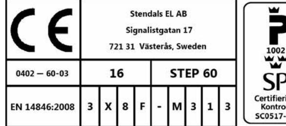
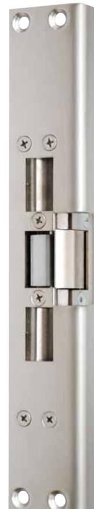
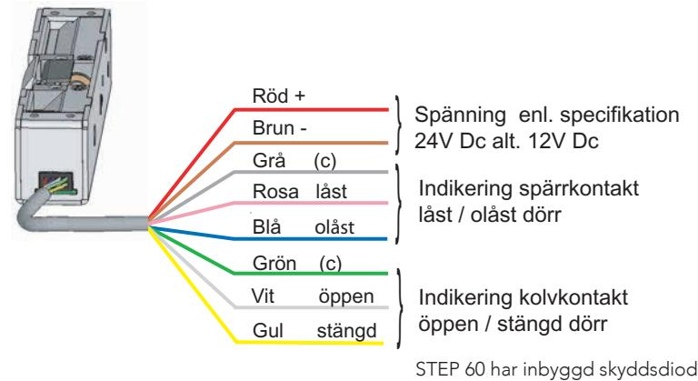

| 2016-10-18 utgåva 4     |
|-------------------------|
| Produkten är patenterad |

| Artikelnummer | Benämning                |  |  |
|---------------|--------------------------|--|--|
| ST600         | Rättvänd funktion 24V Dc |  |  |
| ST600-12      | Rättvänd funktion 12V Dc |  |  |
| ST601         | Omvänd funktion 24V Dc   |  |  |
| ST601-12      | Omvänd funktion 12V Dc   |  |  |

### Strömförbrukning

| Rättvänd funktion  |                    | Omvänd funktion    |                    |
|--------------------|--------------------|--------------------|--------------------|
| 24 VDC +15% / -10% | 12 VDC +15% / -10% | 24 VDC +15% / -10% | 12 VDC +15% / -10% |
| 250 mA max         | 500mA max          | 193 mA max         | 386mA max          |
| 121 mA olåst       | 242mA olåst        | 105 mA låst        | 210mA låst         |

Läs bifogad installationsanvisning noggrant innan installation. Montagestolpens måttskiss är inkluderad i stolpens förpackning. Vid installation av produkten måste varningar och allmäna instruktioner följas. All bifogad dokumentation måste överlämnas av installatör till användare.

Före installation, säkerställ att dörr, karm är i gott skick och att rätt dörrhängning i kombination med beslag överensstämmer. Kontrollera certifikat innan installation i branddörr för att säkerställa att rätt kombination används. Kontrollera att dörrens konstruktion tillåter användning av elslutbleck. Kan användas i dubbel svängdörr om dörrens konstruktion tillåter elslutbleck. Beroende på dörrtyp (trä, stål eller aluminium) kan olika montage behövas (montagestolpe eller skruv). Vid installation i pardörr med dörrstängare, kontrollera om dörrkordinator krävs.

Under installation måste annan beslagning t.ex. tätningslister hanteras varsamt så att funktion på varken elslutbleck eller övrig beslagning påverkas. Var observant att urtag överensstämmer med montagestolpens måttskiss.

Efter installation, säkerställ att alla skruvar är åtdragna, skruvhuvuden inte sticker upp och att dörrbladet löper fritt.

För användning tillsammans med typgodkända dörrar i högst brandteknisk klass E120/EI120. Kontrollera att dörrens godkännande tillåter användning av elslutbleck enligt denna installationsanvisning.

Elslutbleck med ett vridfall för enkel- och dubbelfallås. Vridfall till enkelfallås skall utföras med rättvänd funktion. Vridfall till dubbelfallås kan utföras med rättvänd eller omvänd funktion om en fallkolv är i fast urtag. PX17030-1, Step 60 i enkeldörr av trä

PX17030-5, Step 60 i enkeldörr av trä

Säkerhetsegenskaperna på denna produkt är avgörande för dess överensstämmelse med EN 14846. Inga ändringar av något slag, andra är de som beskrivs i dessa anvisningar är tillåtna.

Stendals El AB Signalistgatan 17 721 31 Västerås, Sweden +46 21-18 97 50 info@steplock.se www.steplock.se

## Installationsanvisning STEP 60 SilentTM

# Rättvänd funktion

Artikelnr. ST600, ST600-12

STEP 60 SilentTM elslutbleck är konstruerat för att fungera under lång tid och klara många öppningscykler. Elslutblecket är vändbart för höger respektive vänsterhängda dörrar.

Öppnarknapp från insidan bör användas för att erhålla en patenterad mjuk stängningsfunktion.

Anpassade låshus

Enkel- och dubbelfallås i Connect serien Enkel- och dubbelfallås i Modul serien Enkel- och dubbelfallås i Smalprofil serien

### Montage

- För att erhålla en god funktion skall en springa på 2-4mm finnas mellan karm och dörr.
- Elslutblecket skall matas med märkspänningen ± 10%.
- Vid stängning bör dörrlåsets fallkolv träffa kolvindikering och få vridfallet att rotera ner för att släppa in fallkolven i ellåset utan att fallkolven trycks in i låshuset. Detta för att erhålla den mjuka slammerfria låsningen (sker endast efter dörröppning då öppnarsignal erhålls från t.ex. öppnarknapp eller passagesystem).
- Då elslutblecket är låst skall vridfallet vara spärrat när dörren är stängd.
- Montera montagestolpen med 6st M4X8 TUFLOK (bifogas i stolpförpackning).
- Orginalstolpe måste användas, se respektive montageritning för att få rätt placering mot låshus.
- Undvik fil- och smärgelspån, då detta stör elslutbleckets funktion. Efter att urtag för slutblecket gjorts i karmen, skall urtaget rengöras.
- Var noga med att kabeln inte kläms när slutblecket monteras i karmen.
- Undvik målarfärg på elslutblecket.
- Anslut elslutblecket enligt medföljande kopplingsschema.
- Garantin bortfaller vid felaktigt montage.

### Kopplingsschema STEP 60 SilentTM

### Teknisk specifikation

- Mikrobrytare enpoligt växlande, Max. 30 VDC, 1 A
- Inbyggt transientskydd.
- Inbyggd indikering för avkänning att dörren är stängd öppen (kolvkontakt) och låst/olåst (spärrkontakt) för koppling till passersystem, larmanläggning etc.
- Brythållfasthet 15 kN (1500 kg)
- Garanterar öppning trots listtryck på 1kN (≈100Kg) i rättvänd och omvänd funktion Måttskiss STEP 60 Knacksäkrad
	-

### Underhållsanvisning

STEP 60 SilentTM levereras smörjd med låsfett som applicerats i vridfallet på den yta som kolven glider mot vid öppning (insida av vridfall i öppnande-riktning).

- Elslutbleckets funktion skall kontrolleras med regelbundna mellanrum i samband med provning av brandcellsgränser och utrymningsvägar eller liknande.
- Elslutbleckets fastsättning i karm bör kontrolleras 2 ggr/år.
- Smörjning av vridfallen skall ske med tunt skikt låsfett (DIN 51502) 2ggr/år. Olja får aldrig användas.