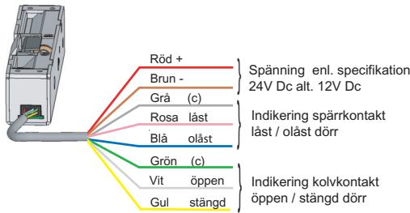
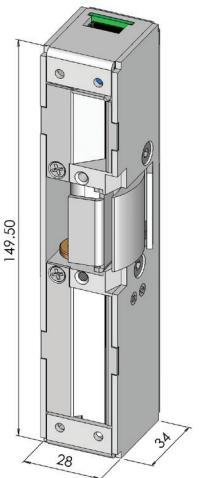
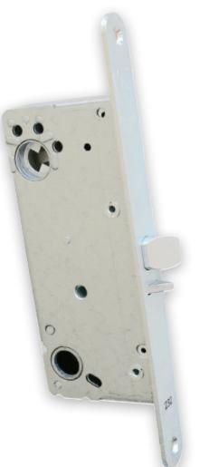

# Kraftigt elslutbleck med unik prestanda

STEP 60 Silent är en ny generation elslutbleck med överlägsen teknik anpassad för enkel och dubbelfall lås. Patenterad teknik ger dörren en mjuk öppning och stängning som sker nästintill ljudlöst. STEP 60 Silent är brandgodkänd i A60/E60/EI60

### Minskat buller ger brett användningsområde

Step 60 Silent har unika öppnings och stängnings egenskaper som ger ett mycket brett användningsområde. En mjuk och tyst gång tillsammans med den kraftiga konstruktionen medför att STEP 60 Silent passar utmärkt i dörrar som används högfrekvent eller där minskat buller är önskvärt. STEP 60 Silent förbättrar dörrmiljön i bl.a. flerbostadshus, kontor, skolor och sjukhus.

### Hög säkerhet

Med STEP 60 Silent uppnås en hög intrångssäkerhet genom hög brytstyrka och ett elektriskt manövrerat knackskydd som omöjliggör manipulation av låsfunktionen.

Anslutningskabel 5m ingår i förpackning Skyddsdiod finns inbyggd.

STEP 60 Silent levereras utan monteringstolpe. Dessa väljs separat och finns i många varianter.

Dörrlåset ska vara enligt skandinavisk standard med enkelfall eller dubbelfall

### Unik listtrycksteknik för både rättvänd och omvänd funktion

STEP 60 är utrustad med vår listtrycksteknik som har följande fördelar:

- Tätningslister och tryckskillnader Listtrycksfunktionen medger att dörren alltid kan låsas upp trots att dörrlåset spänner mot elslutblecket
- Dörrautomatik Listtrycksfunktionen i kombination med den snabba upplåsningen gör att dörren öppnas snabbt och utan risk för att fastna
- Utrymningsdörr Listtrycksfunktionen säkerställer att brandlarmet kan frilägga låsningen, trots tryck mot dörren av folkmassa, tätningslister, tryckskillnader eller sneda dörrar

## Tekniska data

Brandgodkänd i A60/E60/EI60 Typgodkännandebevis 0450/01

### Strömförbrukning

| Rättvänd funktion |                  | Omvänd funktion  |                  |
|-------------------|------------------|------------------|------------------|
| 24 VDC +15% -10%  | 12 VDC +15% -10% | 24 VDC +15% -10% | 12 VDC +15% -10% |
| 250mA max         | 500mA max        | 193mA max        | 386mA max        |
| 121mA olåst       | 242mA olåst      | 105mA låst       | 210mA låst       |

### Artikelnummer

| ST600    | Rättvänd funktion 24V Dc inkl. kolvkontakt |
|----------|--------------------------------------------|
| ST600-12 | Rättvänd funktion 12V Dc inkl. kolvkontakt |
| ST601    | Omvänd funktion 24V Dc inkl. kolvkontakt   |
| ST601-12 | Omvänd funktion 12V Dc inkl. kolvkontakt   |

- Mikrobrytare enpoligt växlande
- Max. 30V Dc, 1 A
- Inbyggd indikering för avkänning att dörren är stängd/öppen(kolv kontakt) och låst/olåst (spärrkontakt) för koppling till passersystem, larmanläggning etc.
- Brythållfasthet 15 kN (1500 kg)
- Garanterar öppning trots listtryck på 1kN (≈100Kg) i rättvänd och omvänd funktion
- Knacksäkrad
- För användning tillsammans med godkända dörrar i högst brandteknisk klass E 60/A 60/EI 60

### Passande låshus

Enkel- och dubbelfall-lås i Connect serien Enkel- och dubbelfall-lås i Modul serien Enkel- och dubbelfall-lås i Smalprofill serien

