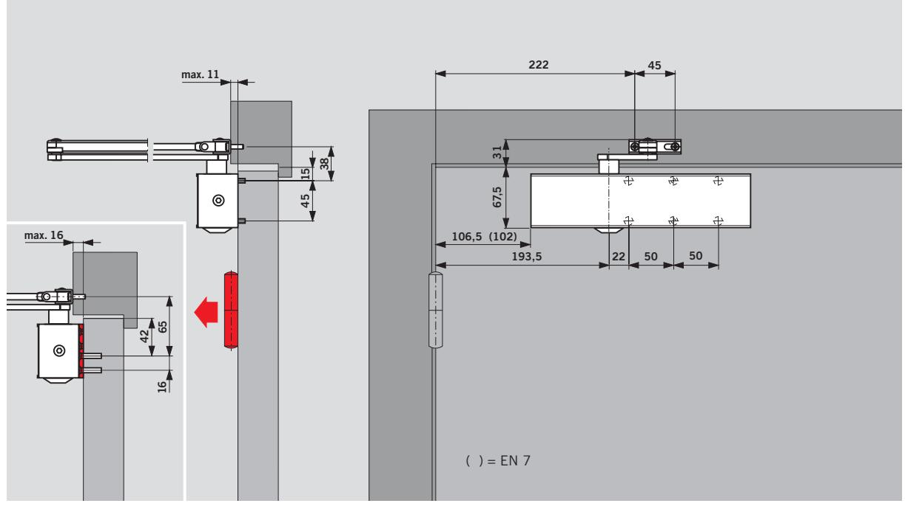
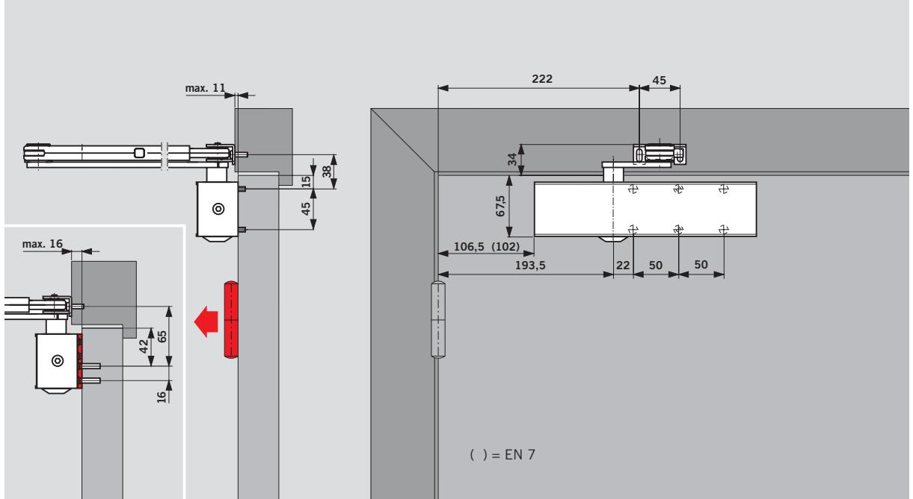
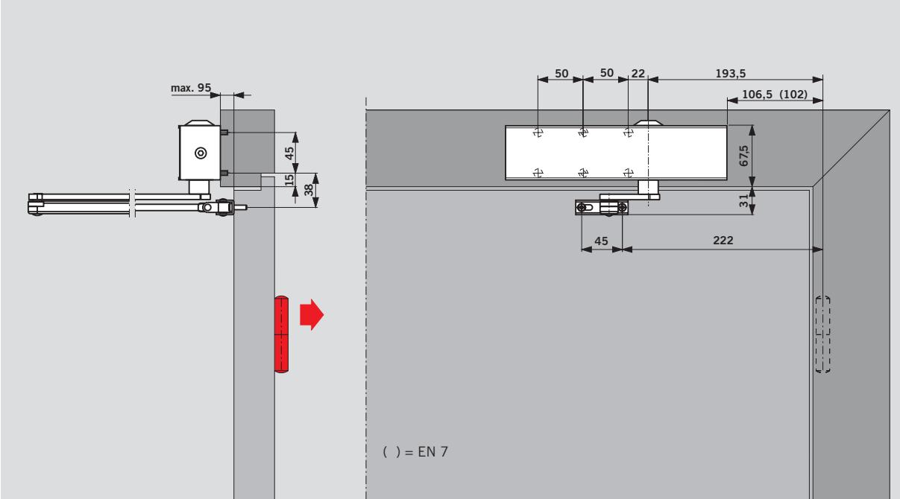

## **Montage på gångjärnssidan med uppställningsarm** Dörrbladsmontage (normalmontage)

## **Montage på gångjärnssidan** Dörrmontage (normalmontage)

## **Montage på anslagssidan** Karmmontage (upp- och nedvänt montage)

**Vid karmmontage** reagerar

öppningsbromsen beroende på karmdjup och gångjärn först mellan 85° och 90°, medan stängningsfördröjningen upphör tidigare.

## **Exempel:**

Vänsterhängda dörrar. Vändbar för högerhängda dörrar.