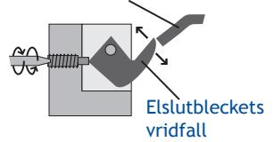

## Elslutbleck serie 300

Elslutbleck 300-serien.

Typgodkänt elslutbleck för brandklassade dörrar, EI30 & EI60. Brythållfastheten är 1 000 kg och elslutblecken har inbyggt transientskydd (skyddsdiod). Polfri anslutning. Används tillsammans med fallås. Passar ihop med monteringsstolpar serie S-. Observera att 300-serien inte är symmetrisk, som dörrigenhållande beslag måste rätt elslutbleck väljas. H- för högerhängd dörr och V- för vänsterhängd dörr. Dörren ses från gångjärnssidan då dörren öppnas emot dig. Gångjärn till höger, högerhängd dörr H-. Gångjärn till vänster, vänsterhängd dörr V-.

- Typgodkänt i EI30 & EI60
- Rättvänd funktion
- Finns med indikering, låskolvskontakt
- Inbyggt transientskydd (skyddsdiod)
- Polfri anslutning

| 29,5 |       | 20,5 |      |
|------|-------|------|------|
|      | 106,5 | 47   |      |
|      | 300V- |      | 320V |

| Modell  | Funktion                                      | Spänning | Strömförbrukning |  |
|---------|-----------------------------------------------|----------|------------------|--|
| 320H-12 | rättvänd / högerhängd                         | 12V DC   | 160 mA           |  |
| 320V-12 | rättvänd / vänsterhängd                       | 12V DC   | 160 mA           |  |
| 320H-24 | rättvänd / högerhängd                         | 24V DC   | 90 mA            |  |
| 320V-24 | rättvänd / vänsterhängd                       | 24V DC   | 90 mA            |  |
| 330H-12 | rättvänd / högerhängd m. låskolvskontakt   | 12V DC   | 160 mA           |  |
| 330V-12 | rättvänd / vänsterhängd m. låskolvskontakt | 12V DC   | 160 mA           |  |
| 330H-24 | rättvänd / högerhängd m. låskolvskontakt   | 24V DC   | 90 mA            |  |
| 330V-24 | rättvänd / vänsterhängd m. låskolvskontakt | 24V DC   | 90 mA            |  |

## Elslutbleck serie 300

| Tekniska data för elslutbleck, 300-serien:       |                                     |       |      |      |
|--------------------------------------------------|-------------------------------------|-------|------|------|
| Brandklass:                                      | Typgodkänt i EI30 och EI60          |       |      |      |
| Brythållfasthet på vridfall:                     | 1 000 kg                            |       |      |      |
| Anslutning:                                      | Polfri, inbyggt transientskydd      |       |      |      |
| Funktion:                                        | Rättvänd, låst i spänningslöst läge | 29,5  | 20,5 |      |
| Montagestolpar:                                  | ROBUST montagestolpar serie S       |       |      |      |
| Kopplingsschema:                                 |                                     |       |      |      |
| Inbyggt transientskydd, polfri anslutning.    | 320H 320V                        |       | 47   |      |
| Inbyggt transientskydd, polfri anslutning.    | 330H                                | 106,5 |      |      |
| Låskolvskontakt, polfri växlande kontakt, 2A. | 330V                                |       |      |      |
|                                                  |                                     |       |      |      |
|                                                  |                                     | 300H  |      | 330H |
| Monteringstips:                                  |                                     |       |      |      |
| Montagestolpens glidplös                         | Glappavstånd                        |       |      |      |

Justera vridfallet så det stoppar innan kanten på montagestolpens glidplös. Låskolven ska glida av vridfallet och ner på montagestolpens glidplös.

Glappavstånd Dörrspringa A B

Mellan vridfall (A) och låskolv (B) ska det vara 0,5-1,5 mm. Låskolven får inte spänna mot vridfallet. Dörrspringan skall vara 2-5 mm.

Vid behov, låsfett (sparsamt) på låskolv, vridfall och glidplös.

Borr- och filspån är skadligt. Elslutblecket är inte vattentätt.

