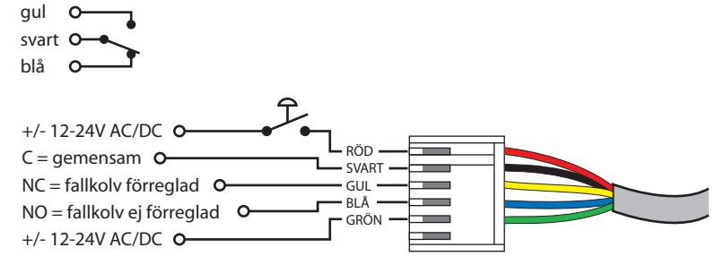
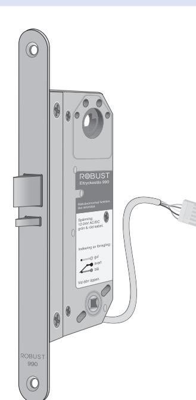
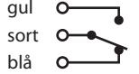
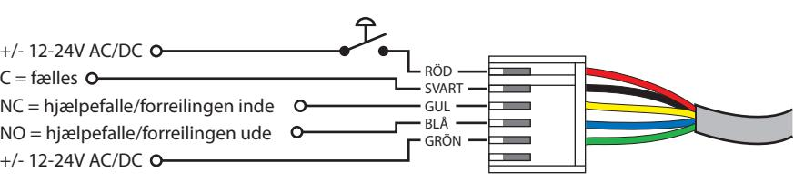

# Teknisk specifikation för eltryckeslås 990 & 991.

| Driftspänning:      |              | 12-24V AC/DC (+/- 10 %)                                       |  |  |
|---------------------|--------------|---------------------------------------------------------------|--|--|
| Driftström:         |              | ca. 100 mA (12V) - 50 mA (24V)                                |  |  |
| Mikrobrytare:       |              | max 1 A, 30V AC/DC                                            |  |  |
| Transientskydd:     |              | inbyggt                                                       |  |  |
| Omgivningstemp.:    |              | -20 ˚C - +60˚C                                                |  |  |
| Fallkolv:           |              | låser ut 14 mm, cylinderfall förreglas med förreglingskolv |  |  |
| Indikering:         |              | indikering av förreglingskolvens läge, ute elle inne       |  |  |
| Dörr vänster/höger: |              | valbart på låshuset, lossa stolpen och vrid fallen 180˚    |  |  |
| Funktion            | 990: 991: | rättvänd/normal, låst strömlöst omvänd, öppet strömlöst    |  |  |

# Kopplingsschema.

Vid dörr öppen, förreglingskolv ute:

### Tillbehör.

| Anslutningskabel, 6 meter:  | K906       |
|-----------------------------|------------|
| Anslutningskabel, 10 meter: | K910       |
| Osymmetrisk stolpe:         | 99(-)-osym |

S

# 990 & 991 990 & 991 Dk

### Teknisk specifikation för magnetlås/solenoidlås 990 & 991.

| Driftsspænning: 12-24V AC/DC (+/- 10 %) |              |                                                                        |  |  |  |
|--------------------------------------------|--------------|------------------------------------------------------------------------|--|--|--|
| Driftsstrøm:                               |              | ca. 100 mA (12V) - 50 mA (24V)                                         |  |  |  |
| Mikro-kontakt:                             |              | max 1 A, 30V AC/DC                                                     |  |  |  |
| Transient-beskyttelse:                     |              | indbygget                                                              |  |  |  |
| Arbejdes-temperatur:                       |              | -20 ˚C - +60˚C                                                         |  |  |  |
| Låsefalle:                                 |              | låsefalle er 14 mm, låsefalle blokeres med hjælpefalle/forreilingen |  |  |  |
| Indikering:                                |              | indikering af hjælpefalle/forreilingen, inde eller ude              |  |  |  |
| Venstre/Højre:                             |              | stolpen fjernes, låsefalle og hjælpefalle/forreilingen vendes 180˚  |  |  |  |
| Funktion                                   | 990: 991: | retvendt/normal, låst strømløst omvendt, åben strømløs              |  |  |  |
|                                            |              |                                                                        |  |  |  |

No

### Tilslutnings skema.

Ved åben dør, hjælpefalle/forreilingen ude:

### Tillbehør.

| Tilslutningskabel, 6 meter:  | K906       |
|------------------------------|------------|
| Tilslutningskabel, 10 meter: | K910       |
| Osymmetrisk stolpe:          | 99(-)-osym |