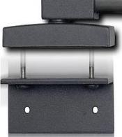
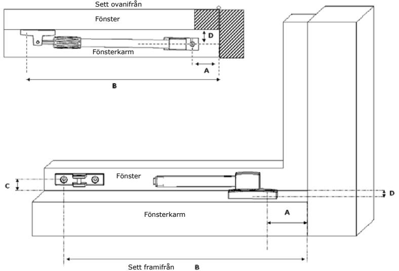
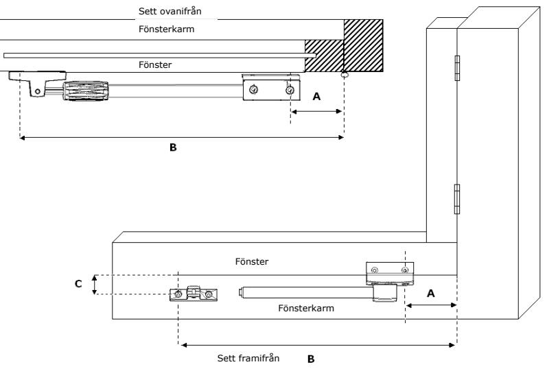

**Monteringanvisning friktionsbroms DX1—RUZ35 DX2—RUZ50**

### **Verktyg:**

Vid eventuella problem och frågor – kontakta Beslagskonsult AB 031-914030.

Träborr Ø 3 mm Skruvmejsel Prim

#### **Ett set består av:**

- x 1 x utdragbar fönsterhållare
- x 1 x L-hållare för inåtgående fönster
- x 2 x metallskruv för montage av L-hållare
- x 2 x skruv 4 x 25 mm
- x 2 x skruv 4 x 32 mm

#### **Användning:**

Den här utdragbara friktionsbromsen är lämpad för montage på såväl inåt- som utåtgående fönster och dörrar. Friktionsbromsen monteras upptill på dörrar och antingen upptill eller nedtill på fönster. När fönsterhållaren är monterad ska önskat bromsmotstånd för fönstret eller dörren ställas in. Låt inte fönstret stå öppet när det blåser kraftigt. Reservation mot olika dörrprofiler & gångjärnscentrum, som kan variera, dubbelkolla mått och funktion innan du borrar.

## **Montage utåtgående**

|            | Alle storlekar i mm |          |     |     |    |    |  |  |  |
|------------|---------------------|----------|-----|-----|----|----|--|--|--|
| Utåtgående | Min mått            | Max mått | A   | B   | C  | D  |  |  |  |
| DX1—RUZ 35 | 375                 | 533      | 90  | 450 | 25 | 25 |  |  |  |
| DX2—RUZ 50 | 515                 | 767      | 190 | 710 | 25 | 25 |  |  |  |

- 1. Placera ihopdragen/stängd friktionsbroms på plats, passa in **B** mått och **C** mått, i stängd dörr/fönster. Markera skruvhål för bågfäste/ dörrbladsfäste och borra träborr dim 3 mm, (max 15 mm djupt).
### **Se till att den utdragbara fönsterhållaren ställs parallellt med den stängda fönstret/dörren.**

- 2. Skruva fast friktionsbromsen i dörrblad/fönsterbåge, enligt **B** och **C** mått, med 25 mm skruv.
- 3. Placera karmfästet på maximalt **A** mått i karmen, passa in **D** måttet och markera samt borra skruvhål dim 3 mm, (max 25 mm djupt).
- 4. Skruva fast karmfästet på dörrkarm/fönsterkarm med 4 x 25 mm skruvar.

**Document : 00.012.824 (Versie 2, Actief)** 

1. Skruva fast L-vinkeln på friktionsbromsens bågfäste med de 2 medföljande

Utåtgående Min mått Max mått A B C D **DX1—RUZ 35** 375 533 90 450 25 25 **DX2—RUZ 50** 515 767 250 770 25 25

Fönster

Sett framifrån

Alle storlekar i mm

Fönsterkarm

4. Placera karmfästet på fönster/dörrkarmen på enligt mått **B** och enlig mått **C**,

7. Skruva fast L-hållaren på fönstret/dörrbladet med 4 x 25 mm träskruvar.  **Kontrollera regelbundet att metallskruvarna sitter fast ordentligt !** 

Vid eventuella problem och frågor – kontakta Beslagskonsult AB 031-914030.

2. Markera skruvhålen för L-vinkeln på fönstret på avstånd **A** mätt från fönsterkarmen. Se till att bromsen kan vridas fritt under/över bågen. 3. Borra hål med träborr Ø 3 mm (max. 15 mm djupt) och se till att fönsterhållaren

ställs parallellt med underkanten på det stängda fönstret!

markera fönsterkarmstyckets skruvhål på fönsterkarmen .

5. Borra hål med träborr Ø 3 mm (max. 25 mm djupt). 6. Skruva fast karmfästet på karmen med 4 x 32 mm träskruvar.

metallskruvarna.

**Montage Inåtgående fönster/dörr** 

Sett ovanifrån Fönsterkarm

Fönster

# **Montage Inåtgående fönster/dörr**

|            | Alle storlekar i mm |          |     |     |    |    |  |  |
|------------|---------------------|----------|-----|-----|----|----|--|--|
| Utåtgående | Min mått            | Max mått | A   | B   | C  | D  |  |  |
| DX1—RUZ 35 | 375                 | 533      | 90  | 450 | 25 | 25 |  |  |
| DX2—RUZ 50 | 515                 | 767      | 250 | 770 | 25 | 25 |  |  |

- 1. Skruva fast L-vinkeln på friktionsbromsens bågfäste med de 2 medföljande metallskruvarna.
- 2. Markera skruvhålen för L-vinkeln på fönstret på avstånd **A** mätt från fönsterkarmen. Se till att bromsen kan vridas fritt under/över bågen.
- 3. Borra hål med träborr Ø 3 mm (max. 15 mm djupt) och se till att fönsterhållaren ställs parallellt med underkanten på det stängda fönstret!
- 4. Placera karmfästet på fönster/dörrkarmen på enligt mått **B** och enlig mått **C**, markera fönsterkarmstyckets skruvhål på fönsterkarmen .
- 5. Borra hål med träborr Ø 3 mm (max. 25 mm djupt).

**Document : 00.012.824 (Versie 2, Actief)** 

1. Placera ihopdragen/stängd friktionsbroms på plats, passa in **B** mått och **C** mått, i stängd dörr/fönster. Markera skruvhål för bågfäste/ dörrbladsfäste och borra

Utåtgående Min mått Max mått A B C D **DX1—RUZ 35** 375 533 90 450 25 25 **DX2—RUZ 50** 515 767 190 710 25 25

Sett framifrån

Fönsterkarm

Alle storlekar i mm

2. Skruva fast friktionsbromsen i dörrblad/fönsterbåge, enligt **B** och **C** mått, med 25

3. Placera karmfästet på maximalt **A** mått i karmen, passa in **D** måttet och markera

4. Skruva fast karmfästet på dörrkarm/fönsterkarm med 4 x 25 mm skruvar.

**Se till att den utdragbara fönsterhållaren ställs parallellt med den stängda** 

träborr dim 3 mm, (max 15 mm djupt).

samt borra skruvhål dim 3 mm, (max 25 mm djupt).

**fönstret/dörren.** 

mm skruv.

**Montage utåtgående** 

Sett ovanifrån

Fönsterkarm

Fönster

Fönster

- 6. Skruva fast karmfästet på karmen med 4 x 32 mm träskruvar.
- 7. Skruva fast L-hållaren på fönstret/dörrbladet med 4 x 25 mm träskruvar.

# **Kontrollera regelbundet att metallskruvarna sitter fast ordentligt !**

Vid eventuella problem och frågor – kontakta Beslagskonsult AB 031-914030.

Vid eventuella problem och frågor – kontakta Beslagskonsult AB 031-914030.

**Monteringanvisning friktionsbroms DX1—RUZ35 DX2—RUZ50**

**Verktyg:**  Träborr Ø 3 mm Skruvmejsel Prim

**Ett set består av:** 

x 2 x skruv 4 x 25 mm x 2 x skruv 4 x 32 mm

x 1 x utdragbar fönsterhållare x 1 x L-hållare för inåtgående fönster x 2 x metallskruv för montage av L-hållare **Användning:** 

borrar.

Den här utdragbara friktionsbromsen är lämpad för montage på såväl inåt- som utåtgående fönster och dörrar. Friktionsbromsen monteras upptill på dörrar och antingen upptill eller nedtill på fönster. När fönsterhållaren är monterad ska önskat bromsmotstånd för fönstret eller dörren ställas in. Låt inte fönstret stå öppet när det blåser kraftigt. Reservation mot olika dörrprofiler & gångjärnscentrum, som kan variera, dubbelkolla mått och funktion innan du