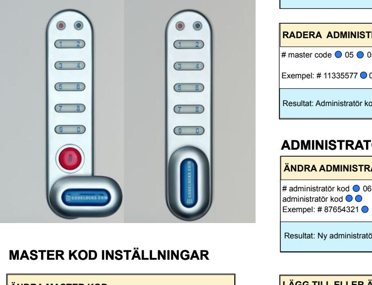
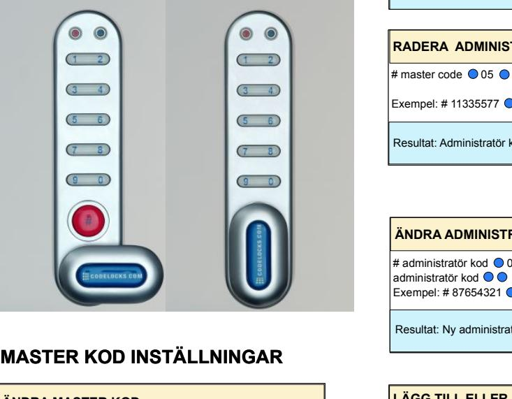
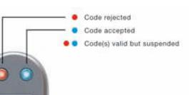

#### PROGRAMMERING PROGRAMMERING

För att programmera måste låset vara öppet med # knappen synlig. Varje programändring måste börja med att trycka på # knappen följt av antingen master kod,administratörskod eller användare kod. För att programmera måste låset vara öppet med # knappen synlig. Varje programändring måste börja med att trycka på # knappen följt av antingen master kod,administratörskod eller användare kod.

| ÄNDRA ÄNDRA MASTER MASTER KOD KOD                                                                                                 |  |
|--------------------------------------------------------------------------------------------------------------------------------------------------|--|
| # # master master kod kod 01 01 ny ny master master kod kod ny ny master master kod kod |  |
| Exempel: Exempel: # # 11225577 11335577 01 01 12345678 12345678 12345678 12345678                               |  |
| Resultat: Resultat: Master Master koden koden har har ändrats ändrats till till 12345678 12345678         |  |
|                                                                                                                                                  |  |
| LÄGG LÄGG TILL TILL ELLER ELLER ÄNDRA ÄNDRA ANVÄNDARE ANVÄNDARE KOD KOD                                         |  |
|                                                                                                                                                  |  |

# master kod 02 användare kod Exempel: # 11225577 02 9999 # master kod 02 användare kod Exempel: # 11335577 02 9999

Resultat: Ny användare kod 9999 registrerad RADERA ANVÄNDARE KOD Resultat: Ny användare kod 9999 registrerad RADERA ANVÄNDARE KOD

# master kod 03 Exempel: # 11335577 03 Resultat: Användare kod Raderad # master kod 03 Exempel: # 11335577 03 Resultat: Användare kod Raderad

| LÄGG LÄGG TILL TILL ELLER ELLER ÄNDRA ÄNDRA ADMINISTRATÖR ADMINISTRATÖR KOD KOD                                     |  |
|------------------------------------------------------------------------------------------------------------------------------------------------------|--|
| # # master master kod kod 04 04 administratör administratör kod kod administratör administratör kod kod |  |
| Exempel: Exempel: # # 11335577 11335577 04 04 87654321 87654321 87654321 87654321                                   |  |
| Resultat: Resultat: Administratör Administratör kod kod 87654321 87654321 nu nu registrerad registrerad             |  |

| RADERA RADERA ADMINISTRATÖR ADMINISTRATÖR KOD KOD                             |  |  |
|----------------------------------------------------------------------------------------------|--|--|
| # # master master code code 05 05 05 05                           |  |  |
| Exempel: Exempel: # # 11335577 11335577 05 05 05 05               |  |  |
| Resultat: Resultat: Administratör Administratör kod kod raderad raderad |  |  |
|                                                                                              |  |  |
| ADMINISTRATÖRS ADMINISTRATÖRS INSTÄLLNINGAR INSTÄLLNINGAR                           |  |  |
| ÄNDRA ÄNDRA ADMINISTRATÖR ADMINISTRATÖR KOD KOD                               |  |  |
|                                                                                              |  |  |

# administratör kod 06 ny administratör kod ny administratör kod Exempel: # 87654321 06 10101010 10101010 Resultat: Ny administratör kod 10101010 nu registrerad # administratör kod 06 ny administratör kod ny administratör kod Exempel: # 87654321 06 10101010 10101010 Resultat: Ny administratör kod 10101010 nu registrerad

| LÄGG LÄGG TILL TILL ELLER ELLER ÄNDRA ÄNDRA ANVÄNDARE ANVÄNDARE KOD KOD                 |  |
|--------------------------------------------------------------------------------------------------------------------------|--|
| # # administratör administratör kod kod 07 07 ny ny användare användare kod kod   |  |
| Exempel: Exempel: # # 87654321 87654321 07 07 6666 6666                                       |  |
| Resultat: Resultat: Användare Användare kod kod 6666 6666 nu nu registrerad registrerad |  |
|                                                                                                                          |  |

# RADERA ANVÄNDARE KOD # administratör kod 08 Exempel: # 87654321 08 Resultat: Användare kod raderad RADERA ANVÄNDARE KOD # administratör kod 08 Exempel: # 87654321 08 Resultat: Användare kod raderad

# ANVÄNDARE INSTÄLLNINGAR ÄNDRA ANVÄNDARE KOD # användare kod ny användare kod ANVÄNDARE INSTÄLLNINGAR ÄNDRA ANVÄNDARE KOD # användare kod ny användare kod

Exempel: # 2244 6688 6688 Resultat: Användare kod är nu 6688 Exempel: # 2244 6688 6688 Resultat: Användare kod är nu 6688

#### PROGRAMMERING PROGRAMMERING

För att programmera måste låset vara öppet med # knappen synlig. Varje programändring måste börja med att trycka på # knappen följt av antingen master kod,administratörskod eller användare kod. För att programmera måste låset vara öppet med # knappen synlig. Varje programändring måste börja med att trycka på # knappen följt av antingen master kod,administratörskod eller användare kod.

| ÄNDRA ÄNDRA MASTER MASTER KOD KOD                                                                                                 |  |
|--------------------------------------------------------------------------------------------------------------------------------------------------|--|
| # # master master kod kod 01 01 ny ny master master kod kod ny ny master master kod kod |  |
| Exempel: Exempel: # # 11225577 11335577 01 01 12345678 12345678 12345678 12345678                               |  |
| Resultat: Resultat: Master Master koden koden har har ändrats ändrats till till 12345678 12345678         |  |
|                                                                                                                                                  |  |
| LÄGG LÄGG TILL TILL ELLER ELLER ÄNDRA ÄNDRA ANVÄNDARE ANVÄNDARE KOD KOD                                         |  |
|                                                                                                                                                  |  |

# # master kod 02 användare kod Exempel: # 11225577 02 9999 # master kod 02 användare kod Exempel: # 11335577 02 9999

Resultat: Ny användare kod 9999 registrerad Resultat: Ny användare kod 9999 registrerad

RADERA ANVÄNDARE KOD RADERA ANVÄNDARE KOD

- # master kod 03 Exempel: # 11335577 03 Resultat: Användare kod Raderad # master kod 03 Exempel: # 11335577 03 Resultat: Användare kod Raderad
## LÄGG TILL ELLER ÄNDRA ADMINISTRATÖR KOD # master kod 04 administratör kod administratör kod Exempel: # 11335577 04 87654321 87654321 Resultat: Administratör kod 87654321 nu registrerad LÄGG TILL ELLER ÄNDRA ADMINISTRATÖR KOD # master kod 04 administratör kod administratör kod Exempel: # 11335577 04 87654321 87654321 Resultat: Administratör kod 87654321 nu registrerad

| RADERA RADERA ADMINISTRATÖR ADMINISTRATÖR KOD KOD                             |
|----------------------------------------------------------------------------------------------|
| # # master master code code 05 05 05 05                           |
| Exempel: Exempel: # # 11335577 11335577 05 05 05 05               |
| Resultat: Resultat: Administratör Administratör kod kod raderad raderad |
|                                                                                              |
|                                                                                              |
| ÄNDRA ÄNDRA ADMINISTRATÖR ADMINISTRATÖR KOD KOD                               |
|                                                                                              |

# administratör kod 06 ny administratör kod ny administratör kod Exempel: # 87654321 06 10101010 10101010 Resultat: Ny administratör kod 10101010 nu registrerad # administratör kod 06 ny administratör kod ny administratör kod Exempel: # 87654321 06 10101010 10101010 Resultat: Ny administratör kod 10101010 nu registrerad

| LÄGG LÄGG TILL TILL ELLER ELLER ÄNDRA ÄNDRA ANVÄNDARE ANVÄNDARE KOD KOD # # administratör administratör kod kod 07 07 ny ny användare användare kod kod Exempel: Exempel: # # 87654321 87654321 07 07 6666 6666 Resultat: Resultat: Användare Användare kod kod 6666 6666 nu nu registrerad registrerad |  |
|------------------------------------------------------------------------------------------------------------------------------------------------------------------------------------------------------------------------------------------------------------------------------------------------------------------------------------------------------------------------------------------------------------------------------------------------------|--|
|                                                                                                                                                                                                                                                                                                                                                                                                                                                      |  |
|                                                                                                                                                                                                                                                                                                                                                                                                                                                      |  |
|                                                                                                                                                                                                                                                                                                                                                                                                                                                      |  |
|                                                                                                                                                                                                                                                                                                                                                                                                                                                      |  |
|                                                                                                                                                                                                                                                                                                                                                                                                                                                      |  |
|                                                                                                                                                                                                                                                                                                                                                                                                                                                      |  |

| RADERA RADERA ANVÄNDARE ANVÄNDARE KOD KOD                             |
|--------------------------------------------------------------------------------------|
| # # administratör administratör kod kod 08 08                   |
| Exempel: Exempel: # # 87654321 87654321 08 08                   |
| Resultat: Resultat: Användare Användare kod kod raderad raderad |
| ANVÄNDARE ANVÄNDARE INSTÄLLNINGAR INSTÄLLNINGAR                             |
| ÄNDRA ÄNDRA ANVÄNDARE ANVÄNDARE KOD KOD                               |

# ÄNDRA ANVÄNDARE KOD # användare kod ny användare kod ÄNDRA ANVÄNDARE KOD # användare kod ny användare kod

Exempel: # 2244 6688 6688 Resultat: Användare kod är nu 6688 Exempel: # 2244 6688 6688 Resultat: Användare kod är nu 6688

## **HANDHAVANDE INSTRUKTIONER**

**O:B:S !** Skåplåset har 10 knappar samt en # knapp. # knappen är gömd bakom vredet i låst läge.

Skåplåset har följande programmerings nivåer.

#### **Master kod kan.**

Öppna låset / ändra master kod - programmera / ändra / radera administratörs kod och användare kod. Master koden används för att ställa om användar mode, mellan

- " Multiple user" kod . I detta läge används en gemensam kod för att öppna låset . Detta läge är inställt från fabrik.
- " One time user" kod. I detta läge används ny kod för varje låscykel. Typisk användning i omklädningsrum där varje skåp används av olika personer under en dag.

#### **Administratör kod kan.**

Öppna låset / ändra administratörs kod - programmera / ändra / radera användare kod.

**Användare kod kan.** Öppna låset / ändra användare kod.

## **O.B.S Samma kod kan inte använas vid programmering av underliggande nivåer.**

### **Förlorad kod.**

**O.B.S** : Vid denna operation skall dörren vara öppen.

- Skruva bort denövre fästskruven och vrid låset så att det kommer utanför kanten på dörren.
- Ta bort ett av batterierna.
- Håll knapp 1 nedtryckt samtidigt sätt tillbaka batteriet, den blå LED lampan blinkar 2 ggr, släpp knappen. Inom 3 sek tryck 3 ggr på knapp 1. Den blå LED lampan blinkar 2 ggr och låset har nu återgått till fabriksinställd master kod 11335577, alla andra inställningar har raderats.

### **Fel kod.**

- Efter 3 felaktiga koder kommer låset att inaktiveras i 10 sek.
#### **Batteri kappasitet.**

2 st AAA batteri klarar av >15000 öppningar om 4 sek / st.

#### **Låg batteri nivå.**

När batteri nivå börjar bli låg kommer den röda LED lampan blinka 3 ggr innan den blå LED lampan ger klarsignal. Batteri bör då bytas så snart som möjligt. Låset klarar ca 100 öppningar efter denna varning.

#### **Batteri bortfall.**

Skulle batteriet ta slut innan de hunnits bytas ut går det att öppna låset genom att använda ett 9 volts batteri. Gör då enligt följande.

- Placera 9 volts batteriet poler mot kontakterna på låset som omger LED lamporna. Batteriets + pol mot låsets röda LED kontakt och - pol mot den blå LED kontakten.
- Slå master kod.
- Motorn kommer nu att frigöra låsningen och låset kan öppnas.
- Byt batteri genom att skruva bort den övre fästskruven. Vrid ut låset över dörrkanten, byt batteri och återmontera låset.

### **Programmering - Grunderna.**

- Vid leverans är låset försett med två fabriksinställda koderMaster kod,11335577. användare kod 2244
- **När låset installerats byt omgående till en ny master kod.**
- Master och administratörs kod är 8 siffror. Användar kod skall bestå av 4 siffror.
- Notera de nya koderna och förvara dem på ett säkert ställe.
- Låsets öppettid är 4 sek.

#### **Funktioner.**

Före programmering bestäm den mest lämpliga funktionen för låset.

- Fast kod " Multiple user" se master kod kan
- Engångs kod " One time user"

För att ställa in engångs kod användning. Tryck # master kod 24

Låset kommer nu att förbli öppet tills det att nästa användare kod har slagits in enligt följande.

1. Knappa in en 4-siffrig kod stäng låset och det förblirlåst.

2. Knappa in samma 4- siffriga kod och låset öppnar ,förblir öppet , koden raderas.

Exempel: 1. Tryck 1992 stäng och låset är nu låst. 2. Tryck 1992 låset öppnar och förblir öppet, kod 1992 raderas.

Ställa tillbaka låset till " Fast kod " Tryck # master kod 26 Exempel. # 11335577 26

## **HANDHAVANDE INSTRUKTIONER**

**O:B:S !** Skåplåset har 10 knappar samt en # knapp. # knappen är gömd bakom vredet i låst läge.

Skåplåset har följande programmerings nivåer.

### **Master kod kan.**

Öppna låset / ändra master kod - programmera / ändra / radera administratörs kod och användare kod. Master koden används för att ställa om användar mode, mellan

- " Multiple user" kod . I detta läge används en gemensam kod för att öppna låset . Detta läge är inställt från fabrik.
- " One time user" kod. I detta läge används ny kod för varje låscykel. Typisk användning i omklädningsrum där varje skåp används av olika personer under en dag.

#### **Administratör kod kan.**

Öppna låset / ändra administratörs kod - programmera / ändra / radera användare kod.

#### **Användare kod kan.**

Öppna låset / ändra användare kod.

#### **O.B.S Samma kod kan inte använas vid programmering av underliggande nivåer.**

#### **Förlorad kod.**

**O.B.S** : Vid denna operation skall dörren vara öppen.

- Skruva bort denövre fästskruven och vrid låset så att det kommer utanför kanten på dörren.
- Ta bort ett av batterierna.
- Håll knapp 1 nedtryckt samtidigt sätt tillbaka batteriet, den blå LED lampan blinkar 2 ggr, släpp knappen. Inom 3 sek tryck 3 ggr på knapp 1. Den blå LED lampan blinkar 2 ggr och låset har nu återgått till fabriksinställd master kod 11335577, alla andra inställningar har raderats.

#### **Fel kod.**

- Efter 3 felaktiga koder kommer låset att inaktiveras i 10 sek.
#### **Batteri kappasitet.**

2 st AAA batteri klarar av >15000 öppningar om 4 sek / st.

#### **Låg batteri nivå.**

När batteri nivå börjar bli låg kommer den röda LED lampan blinka 3 ggr innan den blå LED lampan ger klarsignal. Batteri bör då bytas så snart som möjligt. Låset klarar ca 100 öppningar efter denna varning.

#### **Batteri bortfall.**

Skulle batteriet ta slut innan de hunnits bytas ut går det att öppna låset genom att använda ett 9 volts batteri. Gör då enligt följande.

- Placera 9 volts batteriet poler mot kontakterna på låset som omger LED lamporna.
- Batteriets + pol mot låsets röda LED kontakt och pol mot den blå LED kontakten.
- Slå master kod.
- Motorn kommer nu att frigöra låsningen och låset kan öppnas.
- Byt batteri genom att skruva bort den övre fästskruven. Vrid ut låset över dörrkanten, byt batteri och återmontera låset.

#### **Programmering - Grunderna.**

- Vid leverans är låset försett med två fabriksinställda koder master kod 11335577 användare kod 2244.
- **När låset installerats byt omgående till en ny master kod.**
- Master och administratörs kod är 8 siffror. Användare kod skall bestå av 4 siffrorr.
- Notera de nya koderna och förvara dem på ett säkert ställe.
- Låsets öppettid är 4 sek.

#### **Funktioner.**

Före programmering bestäm den mest lämpliga funktionen för låset.

- Fast kod " Multiple user" se master kod kan
- Engångs kod " One time user"

För att ställa in engångs kod användning. Tryck # master kod 24

Låset kommer nu att förbli öppet tills det att nästa användare kod har slagits in enligt följande.

- 1. Knappa in en 4-siffrig kod stäng låset och det förblirlåst.
- 2. Knappa in samma 4- siffriga kod och låset öppnar ,förblir öppet , koden raderas.
- Exempel: 1. Tryck# 1992 stäng och låset är nu låst.

2. Tryck 1992 låset öppnar och förblir öppet, kod 1992 raderas.

Ställa tillbaka låset till " Fast kod " Tryck # master kod 26 Exempel. # 11335577 26

Box 2096 650 02 Karlstad

Tel. 054-19 02 45 Fax. 054-19 02 75 www.safetron.com

Fax. 054-19 02 75 www.safetron.com

Box 2096 650 02 Karlstad Tel. 054-19 02 45