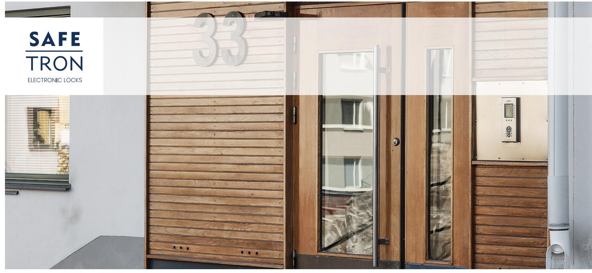
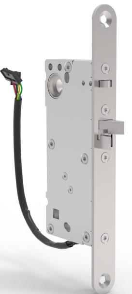
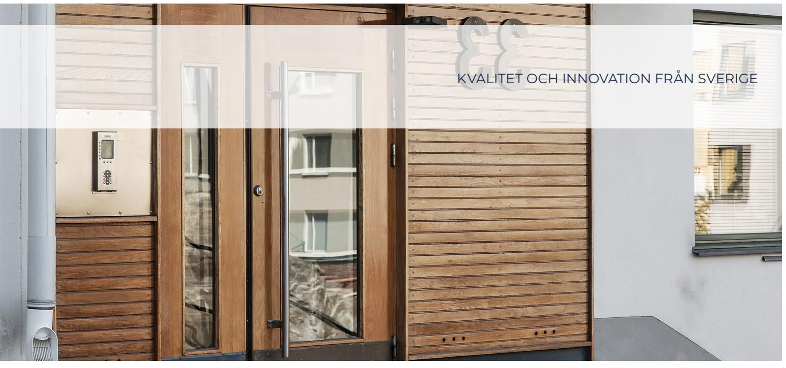
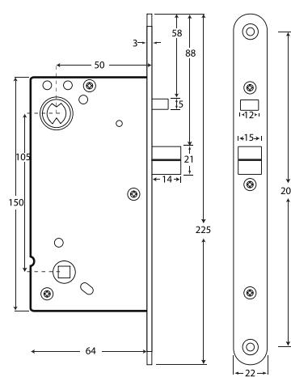
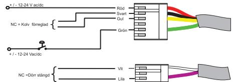

## E LT R Y C K E S L Å S SL 530

# Ellås för dörrautomatiker

SAFETRON SL 530 är ett elektromekaniskt styrt dubbelfunktionsfallås i modulutförande. Typiska användningsområden är daglåsning och intern låsning inom handel, kontor och industri eller entréer i flerbostadshus. Låset är anpassad för funktion med slagdörrsautomatik.

SL 530 har rättvänd funktion vilket betyder låst i strömlöst läge.

#### Inbyggd dörravkänning

SL 530 levereras standard med dörrstatusgivare som nyttjas genom montering av magnet i karm eller slutbleck vilket förenklar inkoppling genom nedbrytning.

#### Nödutrymning

SL 530 är klassad och godkänd för nödutrymningsvägar enligt SS-EN 179:2008 ihop med Safetron Nödutrymningsbehör 791/792

### EGENSKAPER

- Dorndjup 50 mm
- Rättvänd funktion
- Omställbar höger eller vänster
- Förreglingsindikering
- Dörrstatusindikering vid användande av magnet i slutbleck
- Fallutsprång 14 mm
- Kolvplacering enligt klassisk standard

#### TEKNISKA DATA

- Multispänning 12 VDC / 24 VDC -5%/+15%
- Strömförbrukning: 12 VDC: 130 mA, 24 VDC: 65 mA
- Arbetstemperatur -20°C till +40°C

| BENÄMNING              | FUNKTION          | ART NR      | E-NUMMER |
|------------------------|-------------------|-------------|----------|
| SL 530                 | Rättvänd funktion | 202 144 365 | 5866862  |
| SL 530 satsförpackning | Rättvänd funktion | 202 144 487 | 5866870  |

Satsförpackning: låshus, anslutningskabel C02 (10m), slutbleck 105-1