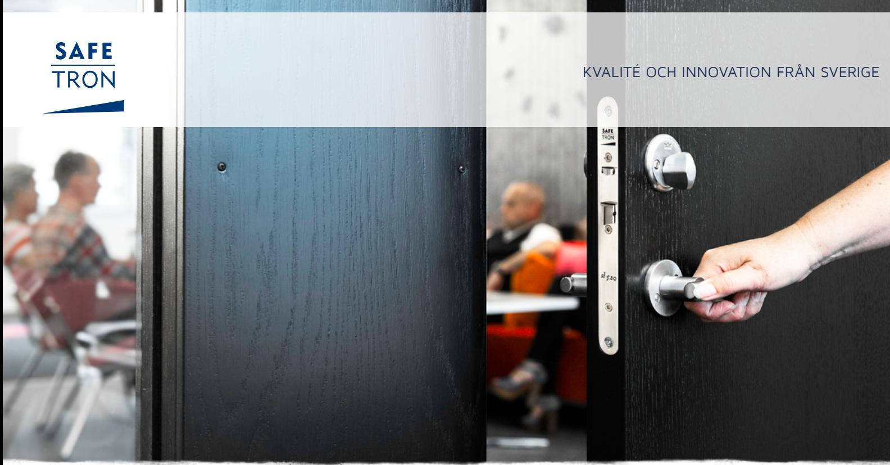
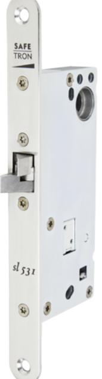
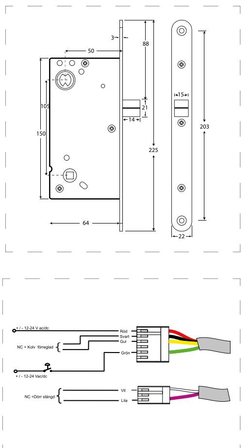

### E LT R Y C K E S L Å S SL 531

# Ellås för dörrautomatiker

Safetron SL 531 är ett elektromekaniskt styrt dubbelfunktionsfallås i modulutförande. Typiska användningsområden är daglåsning och intern låsning inom handel, kontor och industri eller entréer i flerbostadshus.

Låset är anpassad för funktion med slagdörrsautomatik. SL 531 har omvänd funktion vilket betyder olåst i strömlöst läge. SL 531 får inte användas i brandcellsgränser.

#### Inbyggd dörravkänning

SL 531 levereras standard med dörrstatusgivare som nyttjas genom montering av magnet i karm eller slutbleck vilket förenklar inkoppling genom nedbrytning.

#### Nödutrymning

SL 530 är klassad och godkänd för nödutrymningsvägar enligt SS-EN 179:2008 ihop med Safetron Nödutrymningsbehör 791/792

## E LT R Y C K E S L Å S SL 531

#### EGENSKAPER

- Dorndjup 50 mm
- Omvänd funktion
- Omställbar höger eller vänster
- Förreglingsindikering
- Dörrstatusindikering vid användande av magnet i slutbleck
- Fallutsprång 14 mm
- Kolvplacering enligt klassisk standard

#### TEKNISKA DATA

- Multispänning 12 VDC / 24 VDC -5%/+15%
- Strömförbrukning: 12 VDC: 130 mA, 24 VDC: 65 mA
- Arbetstemperatur -20°C till +40°C

#### BENÄMNING ART NR

| SL 531 Låshus, omvänd funktion | 202 144 366 |
|--------------------------------|-------------|
| SL 531 Sats, omvänd funktion   | 202 144 488 |

# Rätt till ändringar av katalogens innehåll och sortiment förbehålls. Vi reserverar oss för eventuella tryckfel.SAFETRON™ är ett registrerat varumärke.

#### **SAFETRON AB**

Säterivägen 18 P.O. Box 2096 65002 Karlstad Sweden

Tel: +46 54 19 02 45 Email: info@safetron.com

Du hittar alltid det senaste på safetron.com