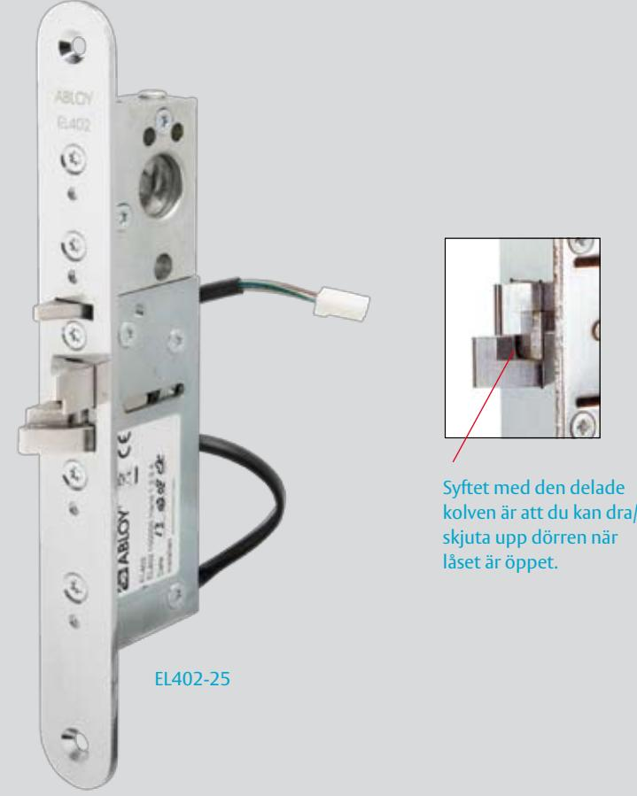

# ABLOY EL402 Elektromekanisk låsning

### **Användningsområde**

ABLOY EL402 är ett elektriskt styrt lås med dubbelfunktionskolv och automatisk förregling då dörren stängs. ABLOY EL402 kan styras med de flesta på marknaden förekommande styrfunktioner, t. ex. passersystem, kodlås, tryckknapp och kopplingsur.

Låset passar bra som daglåsning och intern låsning inom handel, kontor och industri eller i entréer och allmänna utrymmen i flerfamiljshus.

ABLOY EL402 är anpassat för montage tillsammans med dörrautomatik.

ABLOY EL402 får INTE användas som brandigenhållande funktion i brandcellsgräns.

ABLOY EL402 får inte utsättas för listtryck.

## **Funktioner**

ABLOY EL402 har justerbart dorndjup 25, 28, 30, 33 och 35 mm. Förreglingen upphävs med elektrisk styrning eller med cylinder/vred. När förreglingen är upphävd kan dörren dras/skjutas upp. Dubbelfunktionsfallen dras ej in utan viker undan.

#### **Egenskaper**

- Förreglad dubbelfunktionsfall
- 12/24 VDC, stab
- Enkelt omställbart höger/vänster
- Omställbar mellan rättvänd funktion och omvänd funktion
- Justerbartdorndjup 25, 28, 30 eller 35 mm
- Alla kablar försedda med kontakter för enkel installation med anslutningskabel EA220
- Kan monteras horisontellt

# ABLOY EL402 Elektromekanisk låsning

ASSA ABLOY, the global leader in door opening solutions, dedicated to satisfying end-user needs for security, safety and convenience.

ASSA AB P.O. Box 371 SE-631 05 Eskilstuna Sweden

phone +46 (0)16 17 70 00 fax +46 (0)16 17 72 10

Customer support: phone +46 (0)771 640 640 fax +46 (0)16 17 73 72 e-mail: helpdesk@assa.se

# **Tekniska data**

- 
- 
- Temperaturområde -20°C till +60°C
- Fallregelutsprång 14 mm
- Dorndjup (justerbart) 25, 28, 30, 33 och 35 mm
- Stolpe 25 mm
- 
- Anslutningskabel EA220
- 
- Spänning 12 24 VDC (-10%/+15%) • Strömförbrukning max 550 mA (12 VDC) vila 240 mA (12 VDC) max 270 mA (24 VDC) vila 110 mA (24 VDC)
	-
	-
- Slutbleck 4613/4614/EA307/EA308
	-
- Melllankabel EA203 (EL650 EL402)
- Dörrspringa 3 5 mm

### **Tillbehör**

- Skandinaviska ovala cylindrar
- Slutbleck ABLOY 4613, 4614, EA308 eller 443608 för svängdörrar
- Anslutningskabel EA220* (10 m)
- Kabelöverföring EA280/EA281*
- * ingår i satsförpackning