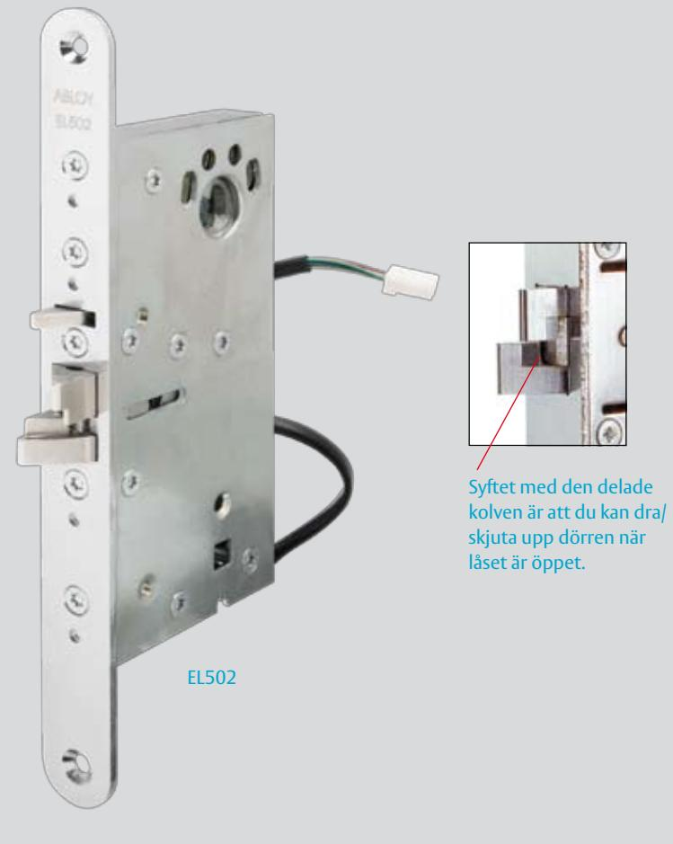
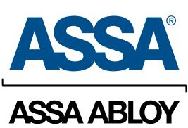
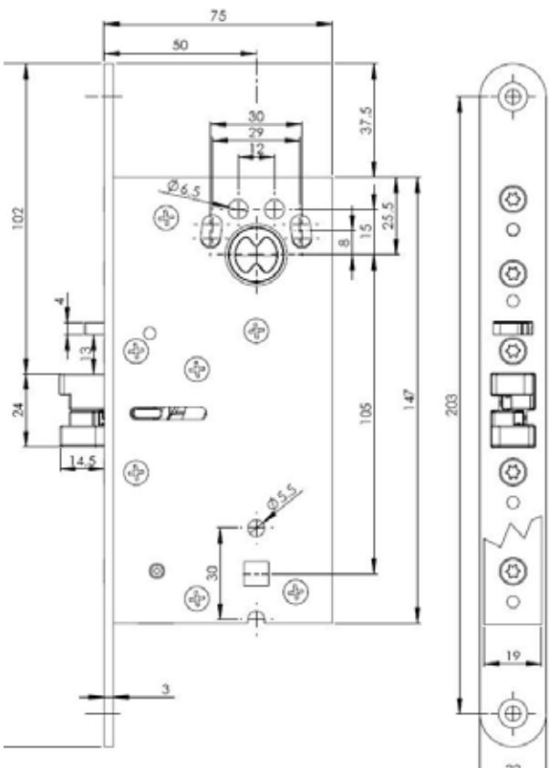

# ABLOY EL502 Elektromekanisk låsning

### **Användningsområde**

ABLOY solenoidlås EL502 är anpassade för högfrekventa dörrar med modulurtag. Låset passar bra som daglåsning och intern låsning inom handel, kontor och industri eller i entréer och allmänna utrymmen i flerfamiljshus.

ABLOY EL502 är anpassat för montage tillsammans med dörrautomatik.

ABLOY EL502 får INTE användas som brandigenhållande funktion i brandcellsgräns.

ABLOY EL502 får INTE utsättas för listtryck.

### **Funktioner**

ABLOY EL502 kan ställas om mellan rättvänd och omvänd funktion.

Förreglingen upphävs med elektrisk styrning eller med cylinder/vred. När förreglingen är upphävd kan dörren dras/skjutas upp. Dubbelfunktionsfallen dras ej in utan viker istället undan.

#### **Egenskaper**

- Förreglad dubbelfunktionsfall
- 12/24 VDC, stab
- Enkelt omställbart höger/vänster
- Omställbar mellan rättvänd funktion och omvänd funktion

# ABLOY EL502 Elektromekanisk låsning

ASSA ABLOY, the global leader in door opening solutions, dedicated to satisfying end-user needs for security, safety and convenience.

ASSA AB P.O. Box 371 SE-631 05 Eskilstuna Sweden

phone +46 (0)16 17 70 00 fax +46 (0)16 17 72 10

Customer support: phone +46 (0)771 640 640 fax +46 (0)16 17 73 72 e-mail: helpdesk@assa.se

**Tekniska data**

- Spänning 12 24 VDC (-10% +15%)
- 
- Temperaturområde -20°C till +60°C
- Fallregelutsprång 14 mm
- Dorndjup 50 mm
- Stolpe 22 mm
- 
- Anslutningskabel EA220
- Dörrspringa 3 5 mm

- 
• Strömförbrukning max 550 mA (12 VDC) vila 240 mA (12 VDC) max 270 mA (24 VDC) vila 110 mA (24 VDC) • Slutbleck LP711, LP721/LP731

## **Tillbehör**

- Skandinaviska ovala eller runda cylindrar
- Slutbleck ABLOY LP711*, LP714, LP721, LP721, LP731, EA307, EA308, 4613 och 4614
- Anslutningskabel EA220* (10m)
- Kabelöverföring EA280/EA281*

* ingår i satsförpackning