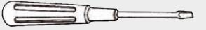
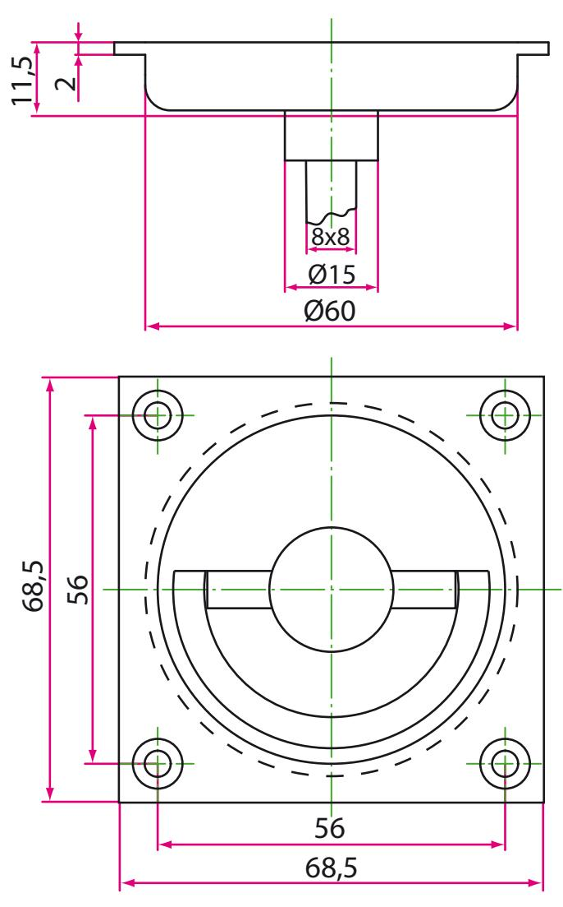
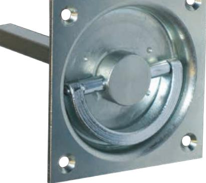
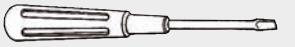
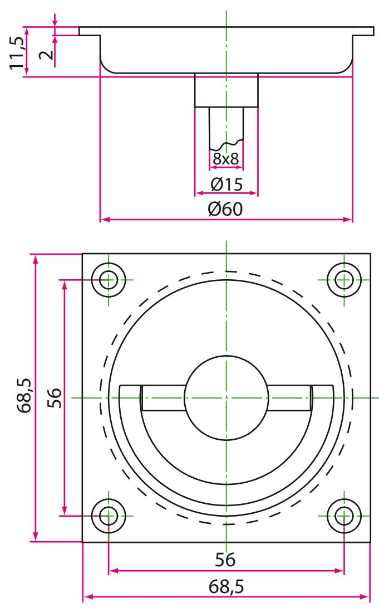
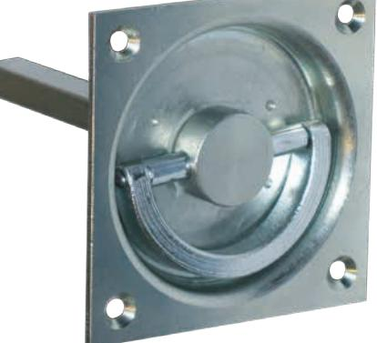

*Monteringsanvisning 85 PM :*

- **1. Markera placeringen av handtaget i dörren enligt hålbild.**
- **2. Gör urtag och borra för montage (4x).**
- **3. Montera ringhandtaget** *(tillsammans med önskat lås)***. Dra skruvar.**
- **4. Kontrollera handtagets funktion.**

*Förpackningen innehåller:* Infällt ringhandtag 85 PM Skruv för montage (4 st.)

Art.Nr: 471014785

OLDA Innovation AB, Vagnmakaregatan 14, 415 07 Göteborg tel: 031-26 68 92 fax: 031-26 68 67 e-post: info@olda.com web: www.olda.com

*Mounting instructions 85 PM :*

- **1. Mark the position of the handle in the door according to hole-pattern.**
- **2. Make the cut-out and drill for fitting (4x).**
- **3. Mount the handle (***together with selected lock)***. Tighten the screws.**
- **4. Check the function of the handle.**

*Package contains:* Flush ring handle 85 PM Screws for mounting (4 pcs.)

Art.No: 471014785

OLDA Innovation AB, Vagnmakaregatan 14, SE-415 07 Göteborg, Sweden tel: +46 (0)31-26 68 92 fax: +46 (0)31-26 68 67 e-mail: info@olda.com web: www.olda.com