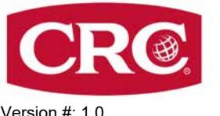
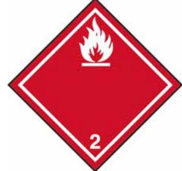

Version #: 1,0 Utgivningsdatum: 20-December-2022 Revisionsdatum: 20-December-2022

# **AVSNITT 1: Namnet på ämnet/blandningen och bolaget/företaget**

| 1.1. Produktbeteckning Blandningens handelsnamn eller beteckning                              | LOCK DE-ICER                                                           |                                                                                                                                 |  |  |
|-----------------------------------------------------------------------------------------------------|------------------------------------------------------------------------|---------------------------------------------------------------------------------------------------------------------------------|--|--|
| Registreringsnummer                                                                                 | -                                                                      |                                                                                                                                 |  |  |
| Synonymer                                                                                           | Inga.                                                                  |                                                                                                                                 |  |  |
| Produktkod                                                                                          | BDS002460AE                                                            |                                                                                                                                 |  |  |
|                                                                                                     |                                                                        | 1.2. Relevanta identifierade användningar av ämnet eller blandningen och användningar som det avråds från                       |  |  |
| Identifierade användningar                                                                          | Smörjmedel                                                             |                                                                                                                                 |  |  |
| Användningar som det avråds från                                                                 | Inte kända.                                                            |                                                                                                                                 |  |  |
|                                                                                                     | 1.3. Närmare upplysningar om den som tillhandahåller säkerhetsdatablad |                                                                                                                                 |  |  |
| Företagsnamn                                                                                        | CRC Industries Europe bv                                               |                                                                                                                                 |  |  |
| Adress                                                                                              | Touwslagerstraat 1                                                     |                                                                                                                                 |  |  |
|                                                                                                     | 9240 Zele                                                              |                                                                                                                                 |  |  |
|                                                                                                     | Belgien                                                                |                                                                                                                                 |  |  |
| Telefonnummer                                                                                       | +32(0)52/45.60.11                                                      |                                                                                                                                 |  |  |
| Fax                                                                                                 | +32(0)52/45.00.34                                                      |                                                                                                                                 |  |  |
| e-mail                                                                                              | hse@crcind.com                                                         |                                                                                                                                 |  |  |
| Websida                                                                                             | www.crcind.com                                                         |                                                                                                                                 |  |  |
| 1.4. Telefonnummer för nödsituationer                                                            | Tel.: +32(0)52/45.60.11 (kontorstid: 9-17h CET)                        |                                                                                                                                 |  |  |
| Nationella Giftinformationscentralen                                                             | 112- och fråga efter Giftinformation (Tillgänglig 24 timmar per dag.)  |                                                                                                                                 |  |  |
| AVSNITT 2: Farliga egenskaper                                                                       |                                                                        |                                                                                                                                 |  |  |
| 2.1. Klassificering av ämnet eller blandningen för dessa faror och klassificeringen är följande. |                                                                        | Blandningens fysikaliska faror och dess faror för människors hälsa och för miljön har bedömts och/eller blandningen har testats |  |  |
|                                                                                                     | Klassificering enligt förordningen (EG) nr 1272/2008 med ändringar     |                                                                                                                                 |  |  |
| Fysikaliska faror                                                                                   |                                                                        |                                                                                                                                 |  |  |
|                                                                                                     |                                                                        |                                                                                                                                 |  |  |

| Aerosoler                                                           |      | Kategori 1                                    | H222 - Extremt brandfarlig aerosol. H229 - Tryckbehållare: Kan sprängas vid uppvärmning. |
|---------------------------------------------------------------------|------|-----------------------------------------------|------------------------------------------------------------------------------------------------|
| Hälsofaror                                                          |      |                                               |                                                                                                |
| Allvarlig ögonskada/ögonirritation                                  |      | Kategori 2                                    | H319 - Orsakar allvarlig ögonirritation.                                                    |
| 2.2. Märkningsuppgifter                                             |      |                                               |                                                                                                |
| Etiketten i enlighet med förordning (EG) nr 1272/2008 med ändringar |      |                                               |                                                                                                |
| Faropiktogram                                                       |      |                                               |                                                                                                |
| Signalord                                                           | Fara |                                               |                                                                                                |
| Faroangivelser                                                      |      |                                               |                                                                                                |
| H222                                                                |      | Extremt brandfarlig aerosol.                  |                                                                                                |
| H229                                                                |      | Tryckbehållare: Kan sprängas vid uppvärmning. |                                                                                                |

Materialnamn: LOCK DE-ICER - Manufacturers SDS SWEDEN

H319 Orsakar allvarlig ögonirritation.

| Skyddsangivelser                       |                                                                                                                                                                                                                                                                                                                                                         |
|----------------------------------------|---------------------------------------------------------------------------------------------------------------------------------------------------------------------------------------------------------------------------------------------------------------------------------------------------------------------------------------------------------|
| Förebyggande                           |                                                                                                                                                                                                                                                                                                                                                         |
| P102                                   | Förvaras oåtkomligt för barn.                                                                                                                                                                                                                                                                                                                           |
| P210                                   | Får inte utsättas för värme, heta ytor, gnistor, öppen låga eller andra antändningskällor. Rökning förbjuden.                                                                                                                                                                                                                                        |
| P211                                   | Spreja inte över öppen låga eller andra antändningskällor.                                                                                                                                                                                                                                                                                              |
| P251                                   | Får inte punkteras eller brännas, gäller även tömd behållare.                                                                                                                                                                                                                                                                                           |
| Åtgärder                               | Ej tilldelat.                                                                                                                                                                                                                                                                                                                                           |
| Lagring                                |                                                                                                                                                                                                                                                                                                                                                         |
| P410 + P412                            | Skyddas från solljus. Får inte utsättas för temperaturer över 50 °C/122 °F.                                                                                                                                                                                                                                                                             |
| Avfall                                 |                                                                                                                                                                                                                                                                                                                                                         |
| P501                                   | Innehållet/behållaren lämnas till hantering i enlighet med lokala/regionala/nationella/internationella föreskrifter.                                                                                                                                                                                                                                 |
| Kompletterande märkningsinformation | Färre märkningsuppgifter lämnas i enlighet med avsnitt 1.5.2 i bilaga I.(Art 29 Förordning CLP) Aerosoldispenser med en maximal kapacitet på mindre än 50 ml omfattas inte av bestämmelserna i aerosolbehållardirektivet (75/324/EEG, artikel 1)                                                                                                  |
| 2.3. Andra faror                       | Denna blandning innehåller inte ämnen som bedöms vara vPvB-/PBT-ämnen enligt förordning (EG) nr 1907/2006, bilaga XIII. Blandningen innehåller inga ämnen som finns med i förteckningen som upprättats i enlighet med REACH Artikel 59(1) därför att de skulle ha hormonstörande egenskaper vid en koncentration på 0,1 viktprocent eller mer. |
|                                        |                                                                                                                                                                                                                                                                                                                                                         |

# **AVSNITT 3: Sammansättning/information om beståndsdelar**

## **3.2. Blandningar**

## **Allmän Information**

| Kemiskt namn                                               | %               | CAS-nummer / EG-nummer            | REACH-registreringsnu mmer | Index nr     | Anmärkningar |
|------------------------------------------------------------|-----------------|--------------------------------------|-------------------------------|--------------|--------------|
| etanol; etylalkohol                                        | 25 - 50         | 64-17-5 200-578-6                 | 01-2119457610-43              | 603-002-00-5 |              |
|                                                            | Klassificering: | Flam. Liq. 2;H225, Eye Irrit. 2;H319 |                               |              |              |
| Särskild Koncentrationsgräns: Eye Irrit. 2;H319: C >= 50 % |                 |                                      |                               |              |              |
| propan-2-ol; isopropylalkohol;                             | <20             | 67-63-0                              | 01-2119457558-25              | 603-117-00-0 |              |

| isopropanol     | 200-661-7 |                                                      |  |
|-----------------|-----------|------------------------------------------------------|--|
| Klassificering: |           | Flam. Liq. 2;H225, Eye Irrit. 2;H319, STOT SE 3;H336 |  |

## **Lista över förkortningar och symboler som kan användas ovan**

ATE: Acute toxicity estimate (uppskattning av akut toxicitet).

M: M-faktor

vPvB: mycket långlivad och mycket bioackumulerande ämne.

PBT: långlivad, bioackumulerande och toxisk ämne.

För detta ämne har fastställts Unionens gränsvärde(n) för exponering på arbetsplatsen.

Alla halter är angivna i viktprocent förutom i det fallet att beståndsdelen är en gas. Gaskoncentrationer är angivna i volymprocent.

**Kommentarer om** Alla H-angivelsernas fullständiga text finns i avsnitt 16.

# **sammansättning**

# **AVSNITT 4: Åtgärder vid första hjälpen**

| Allmän Information                                                                                     | Se till att medicinsk personal är medveten om de material (er) som berörs och att de vidtar nödvändiga skyddsåtgärder.                                                           |  |  |  |  |
|--------------------------------------------------------------------------------------------------------|-------------------------------------------------------------------------------------------------------------------------------------------------------------------------------------|--|--|--|--|
|                                                                                                        | 4.1. Beskrivning av åtgärder vid första hjälpen                                                                                                                                     |  |  |  |  |
| Inandning                                                                                              | Flytta ut I frisk luft. Tillkalla läkare om symptom uppstår eller kvarstår                                                                                                          |  |  |  |  |
| Hudkontakt                                                                                             | Tvätta bort med tvål och vatten. Kontakta läkare om irritation utvecklas och består.                                                                                                |  |  |  |  |
| Ögonkontakt                                                                                            | Spola ögonen omedelbart med mycket vatten i minst 5 minuter. Tag ut eventuella kontaktlinser om det går lätt. Fortsätt att skölja. Vid bestående ögonirritation: Sök läkarhjälp. |  |  |  |  |
| Förtäring                                                                                              | Vid osannolik händelse av förtäring kontakta en läkare eller förgiftningsavdelning. Skölj munnen.                                                                                   |  |  |  |  |
| 4.2. De viktigaste symptomen och effekterna, både akuta och fördröjda                            | Huvudvärk. Allvarlig ögonirritation. Symptomer kan inkluderar sveda, bristning, rodnad, svullnad och suddig syn Hosta.                                                           |  |  |  |  |
| 4.3. Angivande av omedelbar medicinsk behandling och särskild behandling som eventuellt krävs | Ordna allmänna stödåtgärder och behandla på ett symtomatisk sätt. Håll patienten under observation. Symptomen kan vara fördröjda.                                                |  |  |  |  |

# **AVSNITT 5: Brandbekämpningsåtgärder**

**Allmänna brandfaror** Extremt brandfarlig aerosol.

**5.1. Släckmedel**

**Lämpliga släckmedel** Alkoholbeständigt skum. Pulver. Koldioxid (CO2).

**Olämpliga släckmedel** Vid brandsläckning får vattenstråle inte användas - branden sprids därigenom.

Innehåll under tryck. Trycksatt behållare kan explodera när de utsätts för värme eller flammor. Vid brand kan hälsoskadliga gaser bildas. **5.2. Särskilda faror som ämnet eller blandningen kan medföra**

## **5.3. Råd till brandbekämpningspersonal**

| Särskild skyddsutrustning för brandbekämpningsperson al | Brandmän måste använda gängse skyddsutrustning inklusive brandhindrande rock, hjälm med ansiktsskydd, handskar, gummistövlar och, i slutna utrymmen, sluten andningsapparat.                                                                                                 |
|------------------------------------------------------------------|---------------------------------------------------------------------------------------------------------------------------------------------------------------------------------------------------------------------------------------------------------------------------------|
| Speciella förfaranden vid brandbekämpning                     | Flytta behållare från brandområdet om detta kan ske utan risk. Behållare skall kylas med vatten för att förhindra att ångtryck bildas. Använd obemannad slang eller fjärrspridare vid stor brand i lagerområde. Om detta är omöjligt, retirera och låt branden brinna ut. |
| Särskilda åtgärder                                               | Tillämpa gängse rutiner för brandbekämpning och betänk riskerna med övriga inblandade material. I händelse av brand och/eller explosion andas inte in rök.                                                                                                                   |

# **AVSNITT 6: Åtgärder vid oavsiktliga utsläpp**

|                                                            | 6.1. Personliga skyddsåtgärder, skyddsutrustning och åtgärder vid nödsituationer                                                                                                                                                                                                                                                                                                                                                                                         |  |  |
|------------------------------------------------------------|--------------------------------------------------------------------------------------------------------------------------------------------------------------------------------------------------------------------------------------------------------------------------------------------------------------------------------------------------------------------------------------------------------------------------------------------------------------------------|--|--|
| För annan personal än räddningspersonal                 | Rör inte skadade kärl eller materialspill utan lämpliga skyddskläder.                                                                                                                                                                                                                                                                                                                                                                                                    |  |  |
| För räddningspersonal                                      | Håll obehörig personal på avstånd Ventilera slutna utrymmen före tillträde. Lokala myndigheter skall underrättas om betydande spill ej kan begränsas. Använd personligt skydd som rekommenderas i säkerhetsdatabladets avsnitt 8.                                                                                                                                                                                                                                  |  |  |
| 6.2. Miljöskyddsåtgärder                                   | Undvik utsläpp i avlopp, vattendrag eller på marken och i vattenmiljö.                                                                                                                                                                                                                                                                                                                                                                                                   |  |  |
| 6.3. Metoder och material för inneslutning och sanering | Stoppa läckan om detta kan ske utan risk. Flytta cylindern till ett säkert och öppet område om läckan inte går att reparera. Avlägsna alla antändningskällor (ingen rökning, inga bloss, gnistor eller lågor i omedelbar närhet). Låt inte brännbart material (trä, papper, olja etc.) komma i kontakt med spill av materialet. Absorbera i vermikulit, torr sand eller jord och placera i kärl. När materialet samlats upp skall området spolas med vatten. |  |  |
|                                                            | Små spill: Torka upp med absorberande material (t.ex. trasa, skinn). Rengör ytan grundligt för att avlägsna kontaminering från utsläppsrester.                                                                                                                                                                                                                                                                                                                        |  |  |
| 6.4. Hänvisning till andra avsnitt                      | Information om personligt skydd finns i säkerhetsdatabladets avsnitt 8. Information om sophantering finns i säkerhetsdatabladets avsnitt 13.                                                                                                                                                                                                                                                                                                                          |  |  |
|                                                            |                                                                                                                                                                                                                                                                                                                                                                                                                                                                          |  |  |

# **AVSNITT 7: Hantering och lagring**

| 7.1 Skyddsåtgärder för säker hantering                                   | Tryckbehållare: Får inte punkteras eller brännas, gäller även tömd behållare. Använd inte om sprayknappen saknas eller är defekt. Spruta inte mot en öppen låga eller annat glödande material. Rök inte under användning eller förrän det besprutade ytan är helt torrt. Ingen skärning, svetsning, lödning, borrning eller slipning och behållare får inte utsättas för värme, lågor, gnistor eller andra antändningskällor. All utrustning som används vid hantering av produkten måste vara jordad. Återanvänd inte tömd behållare. Undvik kontakt med ögonen. Undvik långvarig exponering. Sörj för god ventilation. Använd lämplig personlig skyddsutrustning. Följ god kemikaliehygien. |
|-----------------------------------------------------------------------------|-----------------------------------------------------------------------------------------------------------------------------------------------------------------------------------------------------------------------------------------------------------------------------------------------------------------------------------------------------------------------------------------------------------------------------------------------------------------------------------------------------------------------------------------------------------------------------------------------------------------------------------------------------------------------------------------------------------------|
| 7.2. Förhållanden för säker lagring, inklusive eventuell oförenlighet | Tryckbehållare får ej utsättas för temperaturer över 50 °C. Gäller även tömd behållare. Får inte punkteras, brännas eller krossas. Hanteras eller förvaras inte i närheten en öppen låga, värme eller andra antändningskällor. Detta material kan ackumulera statiska laddningar som kan ge upphov till gnistor och bli en antändningskälla. Förvaras inte i närheten av oförenliga material (se säkerhetsdatabladets avsnitt 10). Förvaringsklass (TRGS 510): 2B (Aerosolbehållare och tändare)                                                                                                                                                                                                 |
| 7.3. Specifik slutanvändning                                                | Följ industrisektorns anvisningar om bästa tillvägagångssätt.                                                                                                                                                                                                                                                                                                                                                                                                                                                                                                                                                                                                                                                   |

# **AVSNITT 8: Begränsning av exponeringen/personligt skydd**

## **8.1. Kontrollparametrar**

## **Gränsvärden för exponering på arbetsplatsen**

| Sverige. Hygieniska gränsvärden. Arbetsmiljömyndigheten (AV), hygieniska gränsvärden (AFS 2015:7) |  |  |  |
|---------------------------------------------------------------------------------------------------|--|--|--|
|---------------------------------------------------------------------------------------------------|--|--|--|

| Komponenter                                                    | Typ | Värde      |  |
|----------------------------------------------------------------|-----|------------|--|
| etanol; etylalkohol (CAS 64-17-5)                           | KTV | 1900 mg/m3 |  |
|                                                                |     | 1000 ppm   |  |
|                                                                | NGV | 1000 mg/m3 |  |
|                                                                |     | 500 ppm    |  |
| propan-2-ol; isopropylalkohol; isopropanol (CAS 67-63-0) | KTV | 600 mg/m3  |  |
|                                                                |     | 250 ppm    |  |

| Komponenter                                                                                    |                                                                 | Typ                                                                                                                                                                                                                                                                                                                                                                                                                                           | Värde            |                                                                                                       |  |  |
|------------------------------------------------------------------------------------------------|-----------------------------------------------------------------|-----------------------------------------------------------------------------------------------------------------------------------------------------------------------------------------------------------------------------------------------------------------------------------------------------------------------------------------------------------------------------------------------------------------------------------------------|------------------|-------------------------------------------------------------------------------------------------------|--|--|
|                                                                                                |                                                                 | NGV                                                                                                                                                                                                                                                                                                                                                                                                                                           | 350 mg/m3        |                                                                                                       |  |  |
|                                                                                                |                                                                 |                                                                                                                                                                                                                                                                                                                                                                                                                                               | 150 ppm          |                                                                                                       |  |  |
| Biologiska gränsvärden                                                                         |                                                                 | Inga biologiska exponeringsgränser upptäckts för beståndsdelarna.                                                                                                                                                                                                                                                                                                                                                                             |                  |                                                                                                       |  |  |
| Rekommenderade övervakningsförfaranden                                                      |                                                                 | Följ normala uppföljningsprocedurer.                                                                                                                                                                                                                                                                                                                                                                                                          |                  |                                                                                                       |  |  |
| Härledda nolleffektnivåer (DNEL)                                                               |                                                                 |                                                                                                                                                                                                                                                                                                                                                                                                                                               |                  |                                                                                                       |  |  |
| Arbetare                                                                                       |                                                                 |                                                                                                                                                                                                                                                                                                                                                                                                                                               |                  |                                                                                                       |  |  |
| Komponenter                                                                                    |                                                                 | Värde                                                                                                                                                                                                                                                                                                                                                                                                                                         | Bedömningsfaktor | Anmärkningar                                                                                          |  |  |
| etanol; etylalkohol (CAS 64-17-5)                                                              |                                                                 |                                                                                                                                                                                                                                                                                                                                                                                                                                               |                  |                                                                                                       |  |  |
| Kortvarig, lokal, inhalativ Långvarig, Systemisk, Dermal Långvarig, Systemisk, Inhalativ |                                                                 | 1900 mg/m3 343 mg/kg kroppsvikt/dag 950 mg/m3                                                                                                                                                                                                                                                                                                                                                                                           | 24               | irritation i luftvägarna Toxicitet vid upprepad dosering                                           |  |  |
| propan-2-ol; isopropylalkohol; isopropanol (CAS 67-63-0)                                       |                                                                 |                                                                                                                                                                                                                                                                                                                                                                                                                                               |                  |                                                                                                       |  |  |
|                                                                                                | Långvarig, Systemisk, Dermal Långvarig, Systemisk, Inhalativ |                                                                                                                                                                                                                                                                                                                                                                                                                                               | 1 1           |                                                                                                       |  |  |
| Befolkningen som helhet                                                                        |                                                                 |                                                                                                                                                                                                                                                                                                                                                                                                                                               |                  |                                                                                                       |  |  |
| Komponenter                                                                                    |                                                                 | Värde                                                                                                                                                                                                                                                                                                                                                                                                                                         | Bedömningsfaktor | Anmärkningar                                                                                          |  |  |
| etanol; etylalkohol (CAS 64-17-5)                                                              |                                                                 |                                                                                                                                                                                                                                                                                                                                                                                                                                               |                  |                                                                                                       |  |  |
| Kortvarig, lokal, inhalativ Långvarig, Systemisk, Dermal Långvarig, Systemisk, Oral      |                                                                 | 950 mg/m3 206 mg/kg kroppsvikt/dag 87 mg/kg kroppsvikt/dag                                                                                                                                                                                                                                                                                                                                                                              | 40 20         | irritation i luftvägarna Toxicitet vid upprepad dosering Toxicitet vid upprepad dosering        |  |  |
| propan-2-ol; isopropylalkohol; isopropanol (CAS 67-63-0)                                       |                                                                 |                                                                                                                                                                                                                                                                                                                                                                                                                                               |                  |                                                                                                       |  |  |
| Långvarig, Systemisk, Dermal Långvarig, Systemisk, Inhalativ Långvarig, Systemisk, Oral  |                                                                 | 319 mg/kg kroppsvikt/dag 89 mg/m3 26 mg/kg kroppsvikt/dag                                                                                                                                                                                                                                                                                                                                                                               | 2 2 2      | Toxicitet vid upprepad dosering Toxicitet vid upprepad dosering Toxicitet vid upprepad dosering |  |  |
| Uppskattade nolleffektkoncentrationer (PNEC-värden)                                            |                                                                 |                                                                                                                                                                                                                                                                                                                                                                                                                                               |                  |                                                                                                       |  |  |
| Komponenter                                                                                    |                                                                 | Värde                                                                                                                                                                                                                                                                                                                                                                                                                                         | Bedömningsfaktor | Anmärkningar                                                                                          |  |  |
| etanol; etylalkohol (CAS 64-17-5)                                                              |                                                                 |                                                                                                                                                                                                                                                                                                                                                                                                                                               |                  |                                                                                                       |  |  |
| Jord Sediment (havsvatten) Sötvatten                                                     |                                                                 | 0,63 mg/kg 2,9 mg/kg 0,96 mg/l                                                                                                                                                                                                                                                                                                                                                                                                          | 1000 10       |                                                                                                       |  |  |
| propan-2-ol; isopropylalkohol; isopropanol (CAS 67-63-0)                                       |                                                                 |                                                                                                                                                                                                                                                                                                                                                                                                                                               |                  |                                                                                                       |  |  |
| Jord Sediment (sötvatten) Sekundärförgiftning Sötvatten                               |                                                                 | 28 mg/kg 552 mg/kg 160 mg/kg 140,9 mg/l                                                                                                                                                                                                                                                                                                                                                                                              | 30 1          | Oral                                                                                                  |  |  |
| 8.2. Begränsning av exponeringen                                                               |                                                                 |                                                                                                                                                                                                                                                                                                                                                                                                                                               |                  |                                                                                                       |  |  |
| Lämpliga tekniska kontrollåtgärder                                                          |                                                                 | Se till att det finns en bra allmän ventilation. Ventilationen skall anpassas efter förhållandena. Om tillämpligt, använd inkapsling av processer, punktutsugning eller andra tekniska försiktighetsåtgärder för att hålla nivåerna i luften under de rekommenderade exponeringsgränserna. Om exponeringsgränserna inte har fastställts, håll luftburna nivåer på en acceptabel nivå. Det skall finns tillgång till ögonspolning. |                  |                                                                                                       |  |  |
| Individuella skyddsåtgärder, t.ex. personlig skyddsutrustning                                  |                                                                 |                                                                                                                                                                                                                                                                                                                                                                                                                                               |                  |                                                                                                       |  |  |
| Allmän Information                                                                             |                                                                 | Använd föreskriven personlig skyddsutrustning. Välj personlig skyddsutrustning i enlighet med gällande CEN-standarder och i samarbete med leverantören av personlig skyddsutrustning.                                                                                                                                                                                                                                                      |                  |                                                                                                       |  |  |
| Ögonskydd/ansiktsskydd                                                                         |                                                                 | Använd ögonskydd som är i överensstämmelse med EN 166. Använd skyddsglasögon med sidoskydd.                                                                                                                                                                                                                                                                                                                                                |                  |                                                                                                       |  |  |
| Hudskydd                                                                                       |                                                                 |                                                                                                                                                                                                                                                                                                                                                                                                                                               |                  |                                                                                                       |  |  |
| - Handskydd                                                                                    |                                                                 | Vid hantering av produkten Använd handskar som skyddar mot kemikalier (standard EN 374). Handskens genombrottstid ska vara längre än produktens totala användningstid. Om arbetet varar längre än genombrottstiden ska handskarna bytas efter halva tiden.                                                                                                                                                                              |                  |                                                                                                       |  |  |
|                                                                                                |                                                                 | Lämpligast är nitrilhandskar.                                                                                                                                                                                                                                                                                                                                                                                                                 |                  |                                                                                                       |  |  |
| - Annat skydd Andingsskydd                                                                  |                                                                 | Inte tillgänglig. Använd lämpligt andningsskydd vid otillräcklig ventilation. Andningsapparat med filter mot organiska ångor. (Filter typ AXP2)                                                                                                                                                                                                                                                                                         |                  |                                                                                                       |  |  |
| Termisk fara                                                                                   |                                                                 | Använd lämpliga skyddskläder som skyddar mot hetta.                                                                                                                                                                                                                                                                                                                                                                                           |                  |                                                                                                       |  |  |

| Hygieniska åtgärder                 | Rök inte under hanteringen. Iakttag alltid god personlig hygien. Exempelvis bör man tvätta sig efter hantering av materialet och innan man äter, dricker och/eller röker. Tvätta rutinmässigt arbetskläderna för att avlägsna föroreningar.                                            |
|-------------------------------------|----------------------------------------------------------------------------------------------------------------------------------------------------------------------------------------------------------------------------------------------------------------------------------------------|
| Begränsning av miljöexponeringen | Utsläpp från ventilation eller arbetsutrustning ska kontrolleras för att säkerställa att de uppfyller kraven i miljöskyddslagstiftningen. Rökskrubbrar, filter eller tekniska modifikationer av processutrustningen kan vara nödvändiga för att minska utsläpp till acceptabla nivåer. |

# **AVSNITT 9: Fysikaliska och kemiska egenskaper**

|                                                           | 9.1. Information om grundläggande fysikaliska och kemiska egenskaper                                      |  |  |
|-----------------------------------------------------------|-----------------------------------------------------------------------------------------------------------|--|--|
| Aggregationstillstånd                                     | Flytande.                                                                                                 |  |  |
| Form                                                      | Aerosol.                                                                                                  |  |  |
| Färg                                                      | Färglös.                                                                                                  |  |  |
| Lukt                                                      | Karakteristisk lukt.                                                                                      |  |  |
| Smältpunkt/fryspunkt                                      | -114,1 °C (-173,4 °F) uppskattad                                                                          |  |  |
| Kokpunkt eller initial kokpunkt och kokpunktsintervall | < 0 °C (< 32 °F)                                                                                          |  |  |
| Brandfarlighet                                            | Inte tillgänglig.                                                                                         |  |  |
| Övre/undre brännbarhetsgräns eller explosionsgräns.       |                                                                                                           |  |  |
| Explosionsgräns – undre (%)                            | 1,7 %                                                                                                     |  |  |
| Explosionsgräns – högre (%)                            | 53 %                                                                                                      |  |  |
| Flampunkt                                                 | -40,0 °C (-40,0 °F) Sluten bägare                                                                         |  |  |
| Självantändningstemperatur                                | 370 °C (698 °F)                                                                                           |  |  |
| Sönderfallstemperatur                                     | Inte tillgänglig.                                                                                         |  |  |
| pH-värde                                                  | Inte tillämplig.                                                                                          |  |  |
| Kinematisk viskositet                                     | Inte tillgänglig.                                                                                         |  |  |
| Löslighet i vatten                                        |                                                                                                           |  |  |
| Löslighet (vatten)                                        | Soluble en agua                                                                                           |  |  |
| Fördelningskoefficient (n-oktanol/vatten) (log-värde)  | Inte tillämplig.                                                                                          |  |  |
| Ångtryck                                                  | 0,2 kPa vid 20 °C                                                                                         |  |  |
| Densitet och/eller relativ densitet                       |                                                                                                           |  |  |
| Relativ densitet                                          | 0,83 g/cm3 vid 20 °C                                                                                      |  |  |
| Ångdensitet                                               | > 1                                                                                                       |  |  |
| Partikelegenskaper                                        | Inte tillgänglig.                                                                                         |  |  |
| 9.2. Annan information                                    |                                                                                                           |  |  |
| 9.2.1. Information om faroklasser för fysisk fara      | Ingen relevant ytterligare information tillgänglig                                                        |  |  |
| 9.2.2. Andra säkerhetskarakteristika                      |                                                                                                           |  |  |
| Avdunstningshastighet                                     | Inte tillgänglig.                                                                                         |  |  |
| Värmevärde                                                | 43,8 kJ/g                                                                                                 |  |  |
| VOC (Flyktiga organiska föreningar)                    | 830 g/l                                                                                                   |  |  |
| AVSNITT 10: Stabilitet och reaktivitet                    |                                                                                                           |  |  |
| 10.1. Reaktivitet                                         | Produkten är stabil och icke-reaktiv under normala användnings-, förvarings- och transportförhållanden |  |  |
| 10.2. Kemisk stabilitet                                   | Materialet är stabilt under normala betingelser.                                                          |  |  |
| 10.3. Risken för farliga reaktioner                    | Inga farliga reaktioner kända under normala användningsförhållanden.                                      |  |  |
| 10.4. Förhållanden som ska undvikas                    | Undvik höga temperaturer.                                                                                 |  |  |
| 10.5. Oförenliga material                                 | Syror. Starka oxidationsmedel. Klor. Isocyanater.                                                         |  |  |

**10.6. Farliga** Koloxider.

**sönderdelningsprodukter**

# **AVSNITT 11: Toxikologisk information**

| Allmän Information                               | Exponering för ämnet eller blandningen under arbetet kan ha skadliga effekter.                                            |  |  |
|--------------------------------------------------|---------------------------------------------------------------------------------------------------------------------------|--|--|
| Information om sannolika exponeringsvägar        |                                                                                                                           |  |  |
| Inandning                                        | Långvarig inandning kan vara skadligt.                                                                                    |  |  |
| Hudkontakt                                       | Tillgängliga data tyder på att klassificeringskriterierna inte uppfylls.                                                  |  |  |
| Ögonkontakt                                      | Orsakar allvarlig ögonirritation.                                                                                         |  |  |
| Förtäring                                        | Kan ge illamående vid förtäring. Förtäring är sannolikt inte en primär väg för yrkeshygienisk exponering.              |  |  |
| Symptom                                          | Huvudvärk. Allvarlig ögonirritation. Symptomer kan inkluderar sveda, bristning, rodnad, svullnad och suddig syn Hosta. |  |  |
| 11.1. Information om de toxikologiska effekterna |                                                                                                                           |  |  |
| Akut toxicitet                                   | Tillgängliga data tyder på att klassificeringskriterierna inte uppfylls.                                                  |  |  |
| Komponenter                                      | Art Testresultat                                                                                                       |  |  |
| etanol; etylalkohol (CAS 64-17-5)                |                                                                                                                           |  |  |
| Akut                                             |                                                                                                                           |  |  |

| Dermal                                                   |       |                         |
|----------------------------------------------------------|-------|-------------------------|
| LD50                                                     | Kanin | > 15800 mg/kg           |
| Inandning                                                |       |                         |
| LC50                                                     | Råtta | 116,8 - 133,8 mg/l, 4 h |
| Oral                                                     |       |                         |
| LD50                                                     | Råtta | 10470 mg/kg             |
| propan-2-ol; isopropylalkohol; isopropanol (CAS 67-63-0) |       |                         |
| Akut                                                     |       |                         |
| Inandning                                                |       |                         |
| LC50                                                     | Råtta | > 25000 mg/m3, 6 h      |

| Frätande/irriterande på huden                    | Tillgängliga data tyder på att klassificeringskriterierna inte uppfylls.                                                                                                    |  |                                                                                                                                                                                              |
|--------------------------------------------------|-----------------------------------------------------------------------------------------------------------------------------------------------------------------------------|--|----------------------------------------------------------------------------------------------------------------------------------------------------------------------------------------------|
| Allvarlig ögonskada/ögonirritation            | Orsakar allvarlig ögonirritation.                                                                                                                                           |  |                                                                                                                                                                                              |
| Luftvägssensibilisering                          | Tillgängliga data tyder på att klassificeringskriterierna inte uppfylls.                                                                                                    |  |                                                                                                                                                                                              |
| Hudsensibilisering                               | Tillgängliga data tyder på att klassificeringskriterierna inte uppfylls.                                                                                                    |  |                                                                                                                                                                                              |
| Mutagenitet i könsceller                         | Tillgängliga data tyder på att klassificeringskriterierna inte uppfylls.                                                                                                    |  |                                                                                                                                                                                              |
| Cancerogenitet                                   | Tillgängliga data tyder på att klassificeringskriterierna inte uppfylls.                                                                                                    |  |                                                                                                                                                                                              |
| Reproduktionstoxicitet                           | Tillgängliga data tyder på att klassificeringskriterierna inte uppfylls.                                                                                                    |  |                                                                                                                                                                                              |
| Specifik organtoxicitet – enstaka exponering  | Tillgängliga data tyder på att klassificeringskriterierna inte uppfylls.                                                                                                    |  |                                                                                                                                                                                              |
| Specifik organtoxicitet – upprepad exponering | Tillgängliga data tyder på att klassificeringskriterierna inte uppfylls.                                                                                                    |  |                                                                                                                                                                                              |
| Fara vid aspiration                              | Mindre sannolik pga. produktens form.                                                                                                                                       |  |                                                                                                                                                                                              |
| Information om ämnen respektive blandningar   | Inte tillgänglig.                                                                                                                                                           |  |                                                                                                                                                                                              |
| 11.2. Information om andra faror                 |                                                                                                                                                                             |  |                                                                                                                                                                                              |
| Hormonstörande egenskaper                     | 2018/605, vid en koncentration på 0,1 vikt-% eller mer.                                                                                                                     |  | Denna blandning innehåller inga ämnen som har hormonstörande egenskaper för människans hälsa enligt de kriterier som ställts i förordningar (EG) nr 1907/2006, (EU) nr 2017/2100 och (EU) |
| Annan information                                | Inte tillgänglig.                                                                                                                                                           |  |                                                                                                                                                                                              |
| AVSNITT 12: Ekologisk information                |                                                                                                                                                                             |  |                                                                                                                                                                                              |
| 12.1. Toxicitet                                  | Produkten har inte klassificerats som miljöfarlig. Detta utesluter emellertid inte den möjligheten att stora eller upprepade utsläpp kan ha skadliga effekter på miljön. |  |                                                                                                                                                                                              |
|                                                  |                                                                                                                                                                             |  |                                                                                                                                                                                              |

| Komponenter                       |      | Art                                                                      | Testresultat          |  |
|-----------------------------------|------|--------------------------------------------------------------------------|-----------------------|--|
| etanol; etylalkohol (CAS 64-17-5) |      |                                                                          |                       |  |
| Akut                              |      |                                                                          |                       |  |
|                                   | EC50 | Selenastrum capricornutum (nytt namn Pseudokirchneriella subcapitata) | > 100 mg/l, 48 timmar |  |

| Komponenter                                                       |                   | Art                                                                                                                                                                                                                                                                                            | Testresultat                  |  |
|-------------------------------------------------------------------|-------------------|------------------------------------------------------------------------------------------------------------------------------------------------------------------------------------------------------------------------------------------------------------------------------------------------|-------------------------------|--|
| Akvatisk                                                          |                   |                                                                                                                                                                                                                                                                                                |                               |  |
| Akut                                                              |                   |                                                                                                                                                                                                                                                                                                |                               |  |
| Fisk                                                              | LC50              | Japansk risfisk (Oryzias latipes)                                                                                                                                                                                                                                                              | 12000 - 16000 mg/l, 96 timmar |  |
|                                                                   |                   | Leuciscus idus                                                                                                                                                                                                                                                                                 | > 100 mg/l, 48 timmar         |  |
|                                                                   |                   | Pimephales promelas                                                                                                                                                                                                                                                                            | 14200 mg/l, 96 timmar         |  |
|                                                                   |                   | Regnbågslax                                                                                                                                                                                                                                                                                    | 13000 mg/l, 96 timmar         |  |
| Kräftdjur                                                         | EC50              | Daphnia magna                                                                                                                                                                                                                                                                                  | 12340 mg/l, 48 timmar         |  |
| Kronisk                                                           |                   |                                                                                                                                                                                                                                                                                                |                               |  |
| Kräftdjur                                                         | NOEC              | Daphnia magna                                                                                                                                                                                                                                                                                  | 9,6 mg/l, 9 dagar             |  |
| propan-2-ol; isopropylalkohol; isopropanol (CAS 67-63-0)          |                   |                                                                                                                                                                                                                                                                                                |                               |  |
| Akvatisk                                                          |                   |                                                                                                                                                                                                                                                                                                |                               |  |
| Akut                                                              |                   |                                                                                                                                                                                                                                                                                                |                               |  |
| Fisk                                                              | LC50              | Lepomis macrochirus                                                                                                                                                                                                                                                                            | > 1400 mg/l, 96 timmar        |  |
| Kräftdjur                                                         | LC50              | Brine shrimp (Artemia salina)                                                                                                                                                                                                                                                                  | > 10000 mg/l, 24 timmar       |  |
| 12.2. Persistens och nedbrytbarhet                             |                   | Ingen information finns tillgänglig om nedbrytbarheten hos någon beståndsdel av detta ämne.                                                                                                                                                                                                    |                               |  |
| 12.3. Bioackumuleringsförmåga                                  |                   |                                                                                                                                                                                                                                                                                                |                               |  |
| Fördelningskoefficient n-oktanol/vatten (log Kow)              |                   |                                                                                                                                                                                                                                                                                                |                               |  |
| etanol; etylalkohol propan-2-ol; isopropylalkohol; isopropanol |                   | -0,31 0,05                                                                                                                                                                                                                                                                                  |                               |  |
| Biokoncentrationsfaktor (BCF)                                     | Inte tillgänglig. |                                                                                                                                                                                                                                                                                                |                               |  |
| 12.4 Rörlighet i jord                                             |                   | Ingen information tillgänglig.                                                                                                                                                                                                                                                                 |                               |  |
| 12.5. Resultat av PBT- och vPvB-bedömningen                    |                   | Denna blandning innehåller inte ämnen som bedöms vara vPvB-/PBT-ämnen enligt förordning (EG) nr 1907/2006, bilaga XIII.                                                                                                                                                                     |                               |  |
| 12.6. Hormonstörande egenskaper                                |                   | Denna blandning innehåller inga ämnen som har hormonstörande egenskaper förr miljön enligt de kriterier som ställts i förordningar (EG) nr 1907/2006, (EU) nr 2017/2100 och (EU) 2018/605, vid en koncentration på 0,1 vikt-% eller mer.                                                 |                               |  |
| 12.7. Andra skadliga effekter                                     |                   | Produkten innehåller lättflyktiga organiska föreningar som kan medverka till fotokemisk ozonbildning.                                                                                                                                                                                       |                               |  |
| AVSNITT 13: Avfallshantering                                      |                   |                                                                                                                                                                                                                                                                                                |                               |  |
| 13.1. Avfallsbehandlingsmetoder                                   |                   |                                                                                                                                                                                                                                                                                                |                               |  |
| Restavfall                                                        |                   | Avfallshantera enligt lokala föreskrifter. Tomma behållare eller innerhöljer kan innehålla produktrester. Produkt och förpackning skall oskadliggöras på säkert sätt (se: Anvisningar för avfallshantering).                                                                             |                               |  |
| Förorenade förpackningar                                          |                   | Eftersom tömda behållare kan innehålla produktrester, bör man följa varningarna på etiketten också efter att en behållare har blivit tömd. Tomma behållare skall lämnas till godkänd avfallshanteringsanläggning för återanvändning eller kvittblivning. Återanvänd inte tömd behållare. |                               |  |
| EU:s avfallshanteringskod                                         |                   | Avfallskoden skall tilldelas efter diskussion med användaren, producenten och avfallsmottagarföretaget.                                                                                                                                                                                     |                               |  |
| Avfallshanteringsmetoder / information                         |                   | Samla upp och återvinn eller deponera i slutna behållare på godkänd plats. Innehåll under tryck. Får inte punkteras, brännas eller krossas. Innehållet/behållaren lämnas till hantering i enlighet med lokala/regionala/nationella/internationella föreskrifter.                         |                               |  |
| Särskilda säkerhetsåtgärder                                       |                   | Bortskaffas i enlighet med gällande föreskrifter.                                                                                                                                                                                                                                              |                               |  |

# **AVSNITT 14: Transportinformation**

| ADR                           |                         |
|-------------------------------|-------------------------|
| 14.1. UN-nummer               | UN1950                  |
| 14.2. Officiell               | AEROSOLER, brandfarliga |
| transportbenämning            |                         |
| 14.3. Faroklass för transport |                         |
| Klass                         | 2.1                     |
| Sekundärfara                  | Ej tilldelat.           |
| Label(s)                      | 2.1                     |
| Faronr. (ADR)                 | Ej tilldelat.           |
| Tunnelrestriktionskod         | D                       |
| ADR / RID -                   | 5F                      |
| Klassificeringskod:           |                         |

| 14.4. Förpackningsgrupp             | Ej tilldelat.                                                                 |
|-------------------------------------|-------------------------------------------------------------------------------|
| 14.5. Miljöfaror                    | Nej.                                                                          |
| 14.6. Särskilda skyddsåtgärder   | Läs säkerhetsinstruktioner, säkerhetsdatablad och nödåtgärder före hantering. |
| IATA                                |                                                                               |
| 14.1. UN-nummer                     | UN1950                                                                        |
| 14.2. Officiell                     | AEROSOLER, brandfarliga                                                       |
| transportbenämning                  |                                                                               |
| 14.3. Faroklass för transport       |                                                                               |
| Klass                               | 2.1                                                                           |
| Sekundärfara                        | Ej tilldelat.                                                                 |
| 14.4. Förpackningsgrupp             | Ej tilldelat.                                                                 |
| 14.5. Miljöfaror                    | Nej.                                                                          |
| ERG-kod                             | 10L                                                                           |
| 14.6. Särskilda                     | Läs säkerhetsinstruktioner, säkerhetsdatablad och nödåtgärder före hantering. |
| skyddsåtgärder Annan information |                                                                               |
|                                     |                                                                               |
| Passagerar- och fraktflygplan    | Tillåtet med begränsningar.                                                   |
| Endast lastflyg                     | Tillåtet med begränsningar.                                                   |
| IMDG                                |                                                                               |
| 14.1. UN-nummer                     | UN1950                                                                        |
| 14.2. Officiell                     | AEROSOLER, brandfarliga                                                       |
| transportbenämning                  |                                                                               |
| 14.3. Faroklass för transport       |                                                                               |
| Klass                               | 2.1                                                                           |
| Sekundärfara                        | Ej tilldelat.                                                                 |
| 14.4. Förpackningsgrupp             | Ej tilldelat.                                                                 |
| 14.5. Miljöfaror                    |                                                                               |
| Vattenförorenande                   | Nej.                                                                          |
| EmS                                 | F-D, S-U                                                                      |
| 14.6. Särskilda skyddsåtgärder   | Läs säkerhetsinstruktioner, säkerhetsdatablad och nödåtgärder före hantering. |
| 14.7. Bulktransport till sjöss      | Ej etablerat.                                                                 |
| enligt IMO:s instrument             |                                                                               |
| ADR; IATA; IMDG                     |                                                                               |

# **AVSNITT 15: Gällande föreskrifter**

**15.1. Föreskrifter/lagstiftning om ämnet eller blandningen när det gäller säkerhet, hälsa och miljö**

## **EU-förordningar**

- **Förordning (EG) nr 1005/2009 om ämnen som bryter ned ozonskiktet, bilagor I och II med ändringar** Ej listad.
- **Förordning (EU) 2019/1021 om långlivade organiska föroreningar (omarbetning), med ändringar** Ej listad.
- **Förordning (EU) nr 649/2012 om export och import av farliga kemikalier, Bilaga I, del 1 med ändringar** Ej listad.
- **Förordning (EU) nr 649/2012 om export och import av farliga kemikalier, Bilaga I, del 2 med ändringar** Ej listad.
- **Förordning (EU) nr 649/2012 om export och import av farliga kemikalier, Bilaga I, del 3 med ändringar** Ej listad.
- **Förordning (EU) nr 649/2012 om export och import av farliga kemikalier, Bilaga V med ändringar** Ej listad.

**Förordning (EG) nr 166/2006 Bilaga II Register över utsläpp och överföringar av föroreningar med ändringar** Ej listad.

**Förordning (EG) nr 1907/2006, REACH Artikel 59(10) Förteckning över kandidater i den form som den för tillfället är publicerad av ECHA**

Ej listad.

#### **Godkännanden**

**Förordning (EG) nr 1907/2006 REACH Bilaga XIV Ämne för vilket det krävs tillstånd och ändringarna i den**

Ej listad.

#### **Begränsningar av användning**

**Förordning (EG) nr 1907/2006, REACH Bilaga XVII Begränsning av utsläppande på marknaden och användning av vissa farliga ämnen i ändrad form**

etanol; etylalkohol (CAS 64-17-5)

propan-2-ol; isopropylalkohol; isopropanol (CAS 67-63-0)

#### **Direktiv 2004/37/EG: om skydd för arbetstagare mot risker vid exponering för carcinogener eller mutagena ämnen i arbetet, med ändringar**

Ej listad.

#### **Andra EU-förordningar**

**Direktiv 2012/18/EU om åtgärder för att förebygga och begränsa faran för allvarliga olyckshändelser där farliga ämnen ingår med ändringar**

## etanol; etylalkohol (CAS 64-17-5)

propan-2-ol; isopropylalkohol; isopropanol (CAS 67-63-0)

| Övriga bestämmelser     | Denna produkt är klassificerad och märkt enligt förordningen (EG) 1272/2008 (CLP-förordningen) med ändringar. Detta säkerhetsdatablad är i enlighet med bestämmelse nr 1907/2006 (EG) med ändringar. |
|-------------------------|------------------------------------------------------------------------------------------------------------------------------------------------------------------------------------------------------------|
| Nationella föreskrifter | Följ nationell lagstiftning för arbete med kemiska agenser i enlighet med direktiv 98/24/EG, med ändringar.                                                                                             |
| 15.2.                   | Ingen bedömning om den kemiska säkerheten har utförts.                                                                                                                                                     |
|                         |                                                                                                                                                                                                            |

**Kemikaliesäkerhetsbedömning**

# **AVSNITT 16: Annan information**

#### **Lista över förkortningar**

|                           | ADN: Det europeiska avtalet om internationell transport av farligt gods på inre vattenvägar.    |
|---------------------------|-------------------------------------------------------------------------------------------------|
|                           | ADR: Det europeiska avtalet om internationell transport av farligt gods på väg.                 |
|                           | ADR: Det europeiska avtalet om internationell transport av farligt gods på väg.                 |
|                           | ATE: Akut uppskattad toxicitet enligt förordning (EG) nr 1272/2008 (CLP).                       |
|                           | CAS: Chemical Abstract Service (kemiska abstracts).                                             |
|                           | Tak: Korttidsexponering, övre gränsvärde.                                                       |
|                           | CEN: Europeiska standardiseringskommittén.                                                      |
|                           | CLP: Klassificering, märkning och förpackning. Förordning (EG) ne 1272/2008 om klassificering,  |
|                           | märkning och förpackning av ämnen och blandningar.                                              |
|                           | GWP: Global uppvärmningspotential.                                                              |
|                           | IATA: International Air Transport Association (Internationell organisation för lufttransport).  |
|                           | IBC-kod: Den internationella koden för konstruktion och utrustning av fartyg som transporterar  |
|                           | farliga kemikalier i bulk.                                                                      |
|                           | IMDG: Internationella bestämmelser för transport av farligt gods.                               |
|                           | MAK: Maximale Arbeitsplatzkonzentration - DFG (Threshold limit values Germany (Gränsvärden,     |
|                           | Tyskland)).                                                                                     |
|                           | MARPOL: Internationella konventionen till förhindrande av förorening från fartyg.               |
|                           | PBT: Persistent, bioackumulerande och toxisk.                                                   |
|                           | REACH: Registrering, utvärdering och godkännande av kemikalier (Förordning (EG) nr 1907/2006    |
|                           | om registrering, utvärdering, godkännande och begränsning av kemikalier).                       |
|                           | RID: Règlement International concernant le transport de marchandises dangereuses par chemin     |
|                           | de fer (Regulations concerning the international carriage of dangerous goods by rail            |
|                           | (Internationellt regelverk för transport av farligt gods med järnväg)).                         |
|                           | RID: Internationella bestämmelser om internationell transport av farligt gods med järnväg.      |
|                           | STEL: Kortvarig exponeringsgräns.                                                               |
|                           | TLV: Threshold Limit Value (Gränsvärde).                                                        |
|                           | TWA: Time Weighted Average (medelvärde viktat för tid).                                         |
|                           |                                                                                                 |
|                           | VOC: Volatile organic compounds (Organiska ämnen som lätt kan förångas).                        |
|                           | vPvB: mycket persistent och mycket bioackumulerande.                                            |
|                           | STEL: Short-term Exposure Limit (Korttidsvärde för exponeringar).                               |
| Hänvisningar              | Inte tillgänglig.                                                                               |
| Information om            | Klassificeringen för hälso- och miljöfaror har härletts med en kombination av beräkningsmetoder |
| bedömningsmetod som leder | och testdata, om sådana finns.                                                                  |
| till klassificering av    |                                                                                                 |
| blandningen               |                                                                                                 |

**Den fullständiga ordalydelsen av alla H-angivelser som inte har angetts fullständigt i avsnitten 2-15**

H225 Mycket brandfarlig vätska och ånga. H319 Orsakar allvarlig ögonirritation. H336 Kan göra att man blir dåsig eller omtöcknad.

**Revisionsinformation** Inga. **Friskrivningsklausul**

**Utbildningsinformation** Iakttag utbildningsanvisningarna vid hantering av detta material.

CRC Industries Europe bvba kan inte förutse alla förhållanden under vilka denna information och dess produkt, eller andra tillverkares produkter i kombination med dess produkt, kan användas. Användaren ansvarar för att se till att säkra förhållanden råder för hantering, förvaring och deponering av produkten, samt är ansvarsskyldig för förlust, personskada, materiell skada eller kostnader till följd av felaktig användning. Informationsbladen har skrivits i enlighet med den bästa kunskap och erfarenhet som i dagsläget finns tillgänglig. Ingen del av dessa dokument får kopieras, oavsett metod, utan skriftligt tillstånd från CRC. Undantag från detta gäller för varje åtgärd, med ärligt uppsåt, för att studera, forska i samt bedöma risker som berör hälsa, säkerhet och miljö.