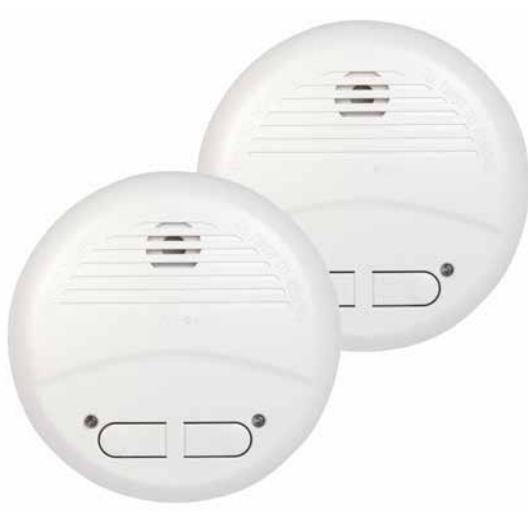

# NEXA-101LC

## E 63 035 22 ART.NR: 13319

#### **Trådlös optisk brandvarnare i 2-pack**

#### **Allmänt**

- * Fotoelektrisk givare för pyrande glöd bränder
- * Totalt 12 stycken brandvarnare kan sammankopplas i ettsystem
- * Frekvens: 433,92 MHz
- * Avancerat självlärande kodsystem för att förhindra störningar från andra system.
- * Räckvidd: ca 40-60 m i öppen miljö
- * Länkar i en radie, inte efter varandra
- * Testknapp för drift och larm
- * Varning vid låg batterinivå. Varnar i 30 dagar.
- * Kraftig larmsignal på 85 dB
- * Färg: Benvit
- * Bruksanvisning på Svenska Norska Finska Engelska
- * Levereras med plugg och skruv i blisterförpackning
- * Är kompatibel med KD-101LA och LM-101LC
- * Nu även med 9v batterikontakt.

| Benämning                      | NEXA—101LC                                                                   |
|--------------------------------|------------------------------------------------------------------------------|
| Artikelnummer                  | 13319                                                                        |
| E-nummer                       | 63 035 22                                                                    |
| Mått                           | 12,5 cm ( Diameter) x 5 cm hög                                               |
| Strömförsörjning               | 1 st 9V batteri - brandvarnaren 3 st AA batterier - trådlös kommunikation |
| Drifttemperatur                | 0° C till 40° C                                                              |
| Certifigerad enligt BRE GLOBAL | EN 14604:2005                                                                |

Prestandadeklaration: **NEXA13319-CPR-001** finns på vår hemsida

### WWW.NEXA.SE