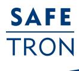
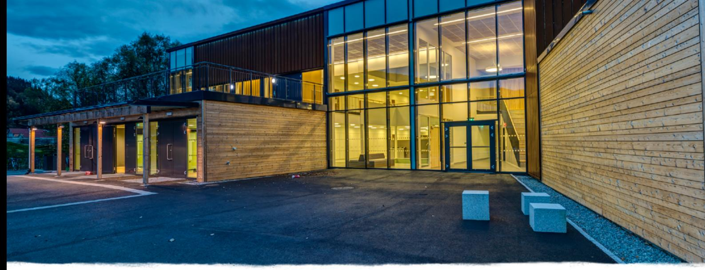
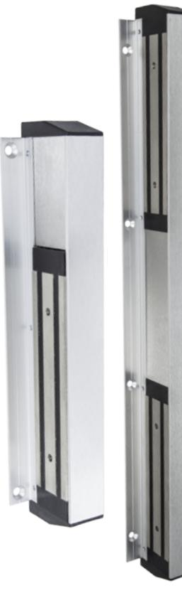
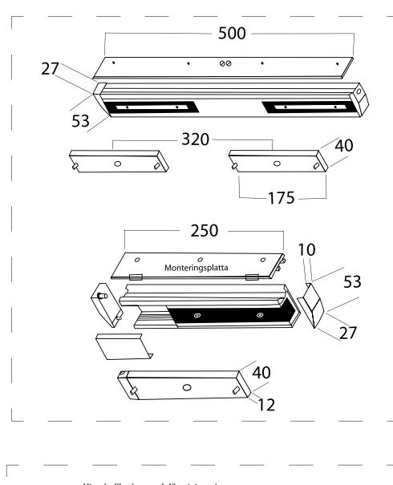
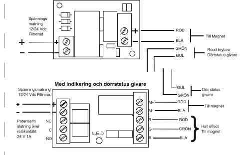
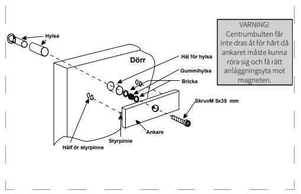

### KVALITÉ OCH INNOVATION FRÅN SVERIGE

## D Ö R R M A G N E T MS 15

# Driftsäker dörrmagnet för slagdörrar och pardörrar

MS 15 lämpar sig då höga krav ställs på design och funktion. Hållkraft upp till 300 kg respektive 2x300 kg för dubbelmagnet.

MS 15 är främst avsedda för att låsa dörrar i utrymningsvägar. Lämpliga platser kan vara utrymningsdörrar i industrier, sporthallar och liknande. I huvudsak där annan elektrisk låsning inte är möjlig.

### Dubbelmagnet

MS 15 finns i dubbelmagnetutförande, lämplig vid t.ex. pardörrar i en sporthall eller liknande.

#### Övervakning

MS 15 kan erhållas med indikering för såväl låsstatus som dörrstatus. Fungerar ihop med alla typer av passersystem på marknaden.

### Multispänning

MS 15 har automatisk omställning mellan 12 och 24 VDC.

### D Ö R R M A G N E T MS 15

### EGENSKAPER

- Multispänning 12-24 VDC
- Utanpåliggande montage
- Magneten flyttbar från vänster till höger sida
- Dolda fästen
- Finns som dubbelmagnet
- Flertal RAL-färger finns som tillval
- Tre indikeringsnivåer: Ingen indikering: SSU Med indikering: SSM Med indikering och dörrstatusgivare: SSM-DS

### TEKNISKA DATA

- 12 VDC/24 VDC
- Strömförbrukning: 12 VDC: 250 mA 24 VDC: 500 mA
- Relä 1A vid 24 VDC
- Hållkraft upp till 300 kg / 2 x 300 kg

### BENÄMNING ART NR

| 202 144 379 |
|-------------|
| 202 144 380 |
| 202 144 381 |
| 202 144 382 |
| 202 144 383 |
| 202 144 384 |
|             |

| TILLBEHÖR                                           | ART NR      |
|-----------------------------------------------------|-------------|
| Z-konsol för ankare                                 | 202 144 394 |
| Z-konsol för ankare, inkl. täckkåpa                 | 202 144 398 |
| Täckkåpa för Z-konsol                               | 202 144 396 |
| Fäste för ankare                                    | 202 144 410 |
| Försänkt fäste för ankare                           | 202 144 424 |
| Justerbar L-konsol för magnet                       | 202 144 400 |
| Justerbar L-konsol för magnet, inkl. täckkåpa       | 202 144 406 |
| Täckkåpa till L-konsol                              | 202 144 404 |
| L-konsol för magnet                                 | 202 144 419 |
| L-konsol för magnet, bakre                          | 202 144 429 |
| Justerbar L-konsol för dubbelmagnet                 | 202 144 401 |
| Justerbar L-konsol för dubbelmagnet, inkl. täckkåpa | 202 144 407 |
| Täckkåpa till L-konsol för dubbelmagnet             | 202 144 405 |
| Z+L konsol för magnet                               | 202 144 421 |

#### **SAFETRON AB**

Säterivägen 18 P.O. Box 2096 65002 Karlstad Sweden

Tel: +46 54 19 02 45 Email: info@safetron.com

Du hittar alltid det senaste på safetron.com