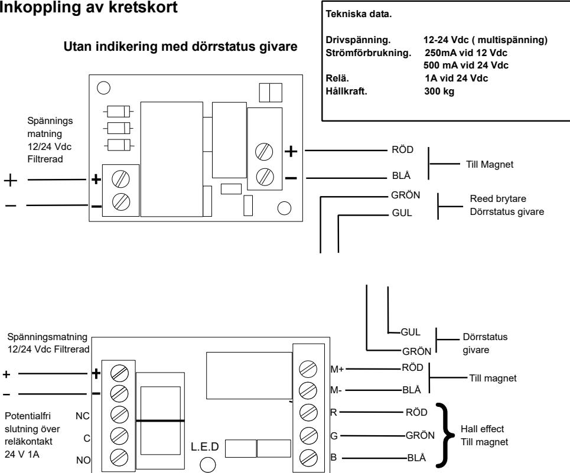
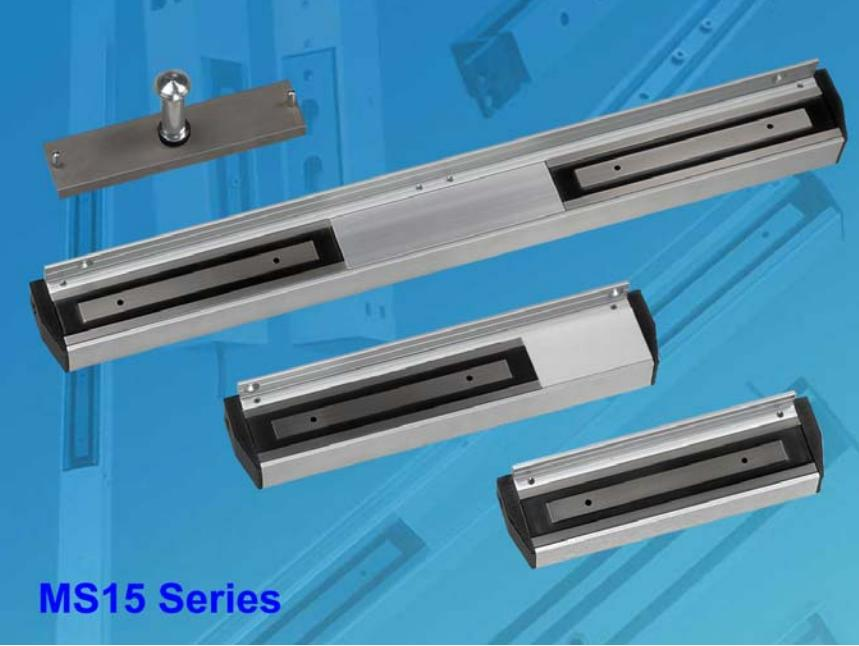
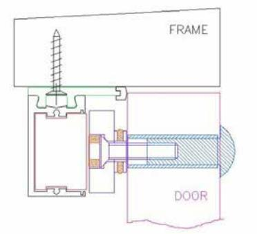
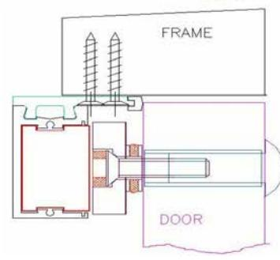
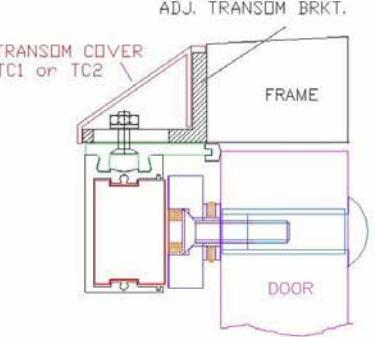
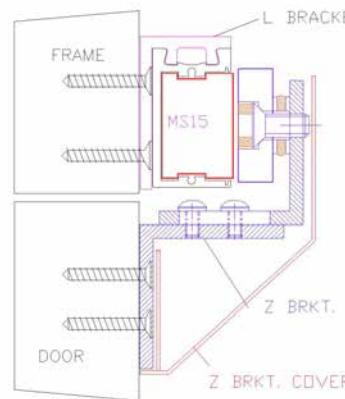
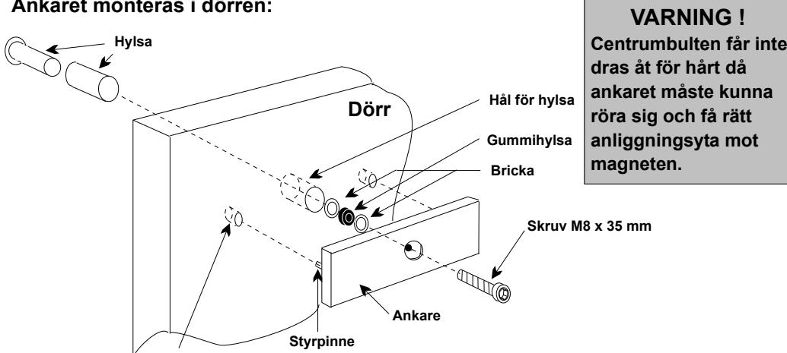
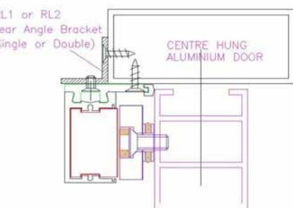

**Med indikering och dörrstatus givare**

|                                                                         | Fe ls ö kn ing                                                                                                                     |                                                                                                                                                                                                                                                                                                                                            |
|-------------------------------------------------------------------------|------------------------------------------------------------------------------------------------------------------------------------------------|--------------------------------------------------------------------------------------------------------------------------------------------------------------------------------------------------------------------------------------------------------------------------------------------------------------------------------------------|
| Pro ble m                                                         | Tro lig ak ors                                                                                                                        | Åtg ärd                                                                                                                                                                                                                                                                                                                                 |
| Dör låse inte ren r                                         | Strö når inte fram mm en                                                                                                        | Kon trol lera att spä nnin äxla öve rgå gsv ren s nga r                                                                                                                                                                                                                                             |
|                                                                         | till nets pole mag n                                                                                                               | är rikti gt nte rad mo e                                                                                                                                                                                                                                                                                                 |
|                                                                         | Strö mfö rsö rjnin fun gen ger ar inte kor rekt                                                                  | Kon trol lera lutn inga ans rna                                                                                                                                                                                                                                                                                          |
|                                                                         | Strö når inte fram till mm en mfö strö rsö rjnin gen                                                          | Kon trol lera säk ring och lutn inga ar ans r                                                                                                                                                                                                                                                                |
| Mag nete har låg håll kraf t n                     | För dål ig fysi sk kon takt llan me kon takt yto hos net och ank rna mag are             | Gör t och ta bor t ojä hete ren mn r                                                                                                                                                                                                                                                                         |
|                                                                         | Fela ktig kraf tför sörj ning                                                                                                   | Kon trol lera ingå end spä nnin e g ,                                                                                                                                                                                                                                                                           |
|                                                                         |                                                                                                                                                | fel / läng ( spä gsfa ) Kab eln har dia met och elle d nnin ll er r                                                                                                                                                                                                                  |
| Mag bru nete n mm ar                                     | Väx elst röm finn när and s var e                                                                                      | Kon trol lera strö mfö rsö rjnin olä lig strö mfö rsö rjnin g mp g ,                                                                                                                                                                                                                       |
| Tar lång tid att öpp na                                  | Strö mb ryta fela ktig t nte rad ren mo                                                                             | Bry tnin strö till nete ska ske llan g av mm en mag n me sfo tran tor och t. rma ma gne                                                                                                                                                                                  |
| Ree d bryt fun ej på rätt sätt are ger ar | Fela ktig fysi sk kon takt llan net me mag och ank are Fela ktig strö mfö rsö rjnin g | Änd nte ring gör och ta bor t ojä hete ra mo ren mn r. , Kon trol lera ingå end spä nnin och spä nnin välj e g gs are Kab el har fel diam ete och / elle läng d. Ano rdn ing förs törd r r |
|                                                                         | Ree d bryt öve rbe last ad are                                                                                            | Se nsk ege ape r                                                                                                                                                                                                                                                                                                               |

Indikeringsdiod fungerar inte på rätt sätt Felaktig kontakt mellan magnet och ankare Se åtgärder för reed brytare

# **Inkopplingsanvisning Safetron Magneter Modell MS 15 SSU/SSM-DS**

Safetron AB Kolvgatan 7 653 41 Karlstad Tel. 054-190245 Fax. 054-190275 E mail. info@safetron.com www.safetron.com

## **Monterings anvisningar**

## **För utåtgående dörrar**

 **Vid tveksamheter se den engelska original manualen**

**O.B.S**

#### **Studera fig 1 till 4 för närmaste exemplet för installationen.**

- Steg 1 Ta bort båda ändskydden
- Steg 2 Ta bort monteringsplattan genom att lossa ställskruvarna och montera distanserna av plast i vardera ändar av monteringsplattan.
- Steg 3 Stäng dörren och när plastdistanserna berör dörren dra monteringsplattan till dörrens överliggare och fäst stadigt så att ca 25 mm spel lämnas mot dörrkarmen ( sidan )
- Steg 4 Om fastsättningen behöver förstärkas kan extra fästhål borras i centrumlinjen på monteringsplattan eller använda konsoler se fig 1-4.
- Steg 5 Montera magneten och skruva fast låsskruvarna ta bort plast distanserna.
- Steg 6 För att anpassa kabelanslutning och magnet i dörren kan magneten placeras i höger alternativt vänsterläge genom att lossa ställskruvarna i centrum på magnetens framsida och dra ut magneten från magnethuset och vända på den. Lås sedan fast magneten i sitt nya läge.
- Steg 7 Kabel anslutning kan ske antingen genom ändskydden eller genom att borra hål genom centrumlinjen på magnethus och monteringsplatta.
- Steg 8 Anslut kabeln till kretskortet och sätt tillbaka lock och ändskydd.
- Steg 9 Magneten kan strömsättas och med ankarplattan centrerad mot magneten, anti rotationspinnarna på baksidan av ankaret kan användas till att märka ut centrumlinjen för håltagning av ankar bult.

- Steg 10 Ankaret får inte fästas stumt då det måste vara rörligt via gummibrickan.
## **För inåtgående dörrar**

Använd Z & L konsol se fig 5 I stället för L konsol kan magneten fästas igenom magnetens hus ( borra egna hål ) se fig

#### **Typisk installation för utåtgående dörrar visas i fig 1 till 4** Allafigurerärapplicerbaratillsingeloch dubbelmagneter**MS15SSU/M**och**MS15DSU/M**

- **Fig 1**. Utåtgående dörr med bred dörrkarm
Montera montage plattan i position med hjälp av de 2 plastdistanserna eller 18mm från dörrbladet vid stängd dörr.

 5

- **Fig 2.** Utåtgående dörr med smal dörr karm Extra skruvhål kan göras i den främre delen på montage plattan. Borra 5 mm hål och försänk med 10 mm borr det finns 2 centrumlinjer på montageplattan som förenklar borrning.

Aluminium

monteras som ger extra infästning

Där inte tillräkligt med fästyta finns

centrumhängda

 dörrar.

#### **Fig 3.** Utåtgående dörr utan karm.

 Fastsättning kan anpassas med hjälp av konsol **MS10/15/20T1** eller **MS10/15/20T2** ( justerbar utanpåliggande konsol ) för att kunna montera magneten där ingen karm finns att fästa i. För att ge en snyggare finish och dölja skruvar kan en skyddskåpa monteras **TC1** (enkel ) **TC2** ( dubbel ) i aluminium utförande.

**Fig 4.** kan en bakre L konsol **MS15RL1**eller**MS15RL2**

#### **Ankaret monteras i dörren:**

**Hål för styrpinne**

### **Typisk installation för inåtgående dörr Fig 5.**

Inåtgående dörr behöver normalt en Z+L konsol.

**MS15L1 eller MSL2** konsol behövs för att montera magneten i dörrkarmen.

**MS10/15/20 Z** konsol behövs för att montera ankare i dörrblad. Z konsol skydd **MS10/15/20 ZC** finns som tillbehör för att få en snyggare finish och dölja skruvar.

Det går även att montera magneten utan L konsol genom att borra hål i magnetens låshus med 5 mm borr och försänka med 10 mm borr. Magneten monteras då efter att låshuset har monterats.