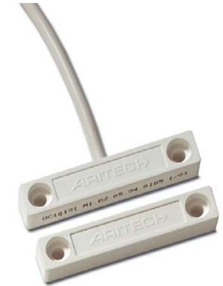
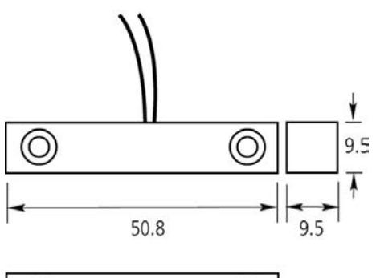
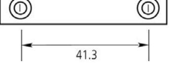

DC101

Utanpåliggande magnetkontakt - För skruvmontering, med 2,5 m kabel

Utanpåliggande magnetkontakt - För skruvmontering, med 2,5 m kabel Utanpåliggande magnetkontakt - För skruvmontering, med 2,5 m kabel

## Tekniska data

| 0-28 mm             |
|---------------------|
|                     |
| 2,5 m lång 4-ledare |
| 6 m lång 4-ledare   |
| Normalt sluten      |
| 50,8 x 9,5 x 9,5 mm |
| Beige               |
|                     |

## Order data

DC101 DC101S60

Utanpåliggande magnetkontakt - För skruvmontering, med 2,5 m kabel Utanpåliggande magnetkontakt - För skruvmontering, med 6 m ledare

EUtanpåliggande montage

- EÖverlägsen kvalitet
- EEnkla att installera
- E2,5 meters ledarlängd som standard
- EFörsedda med sabotageslinga

