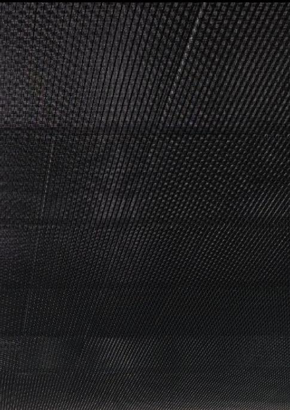
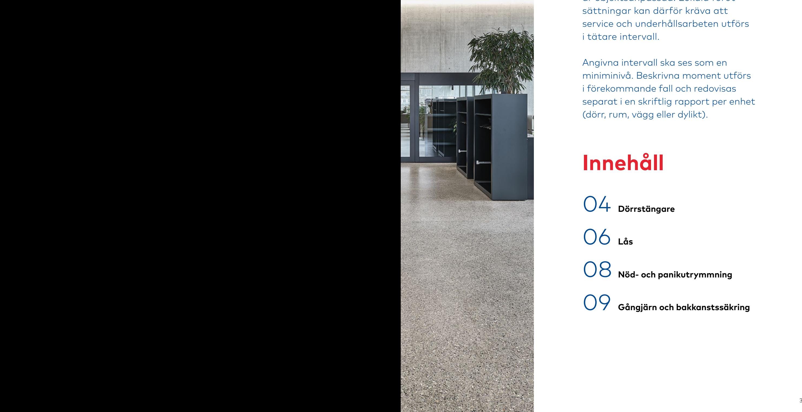
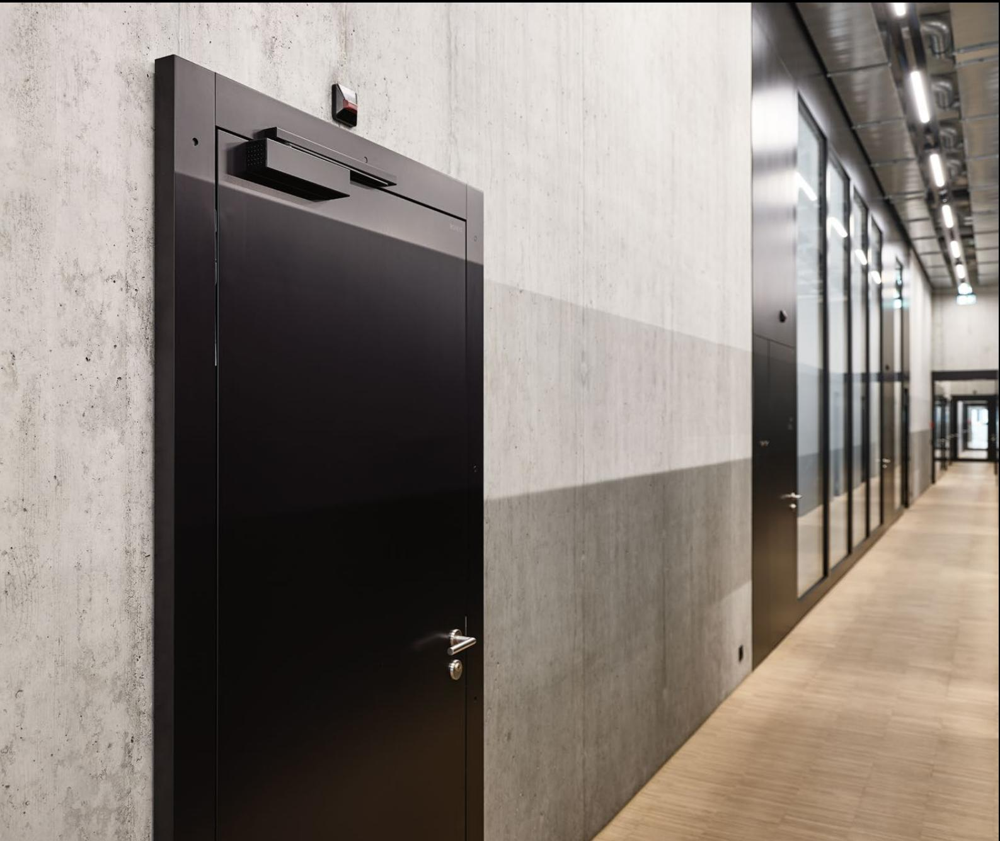
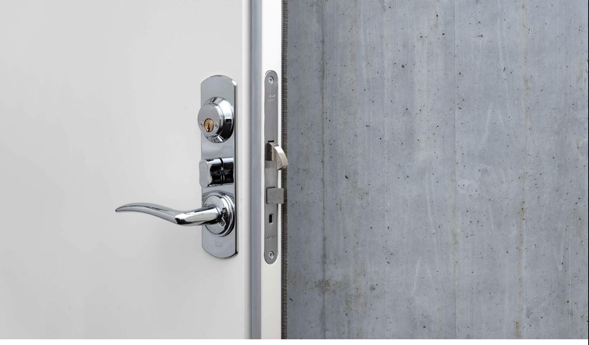

Rekommendationer för egenkontroll och underhållsservice

1

## Dokumenterad egenkontroll samt underhållsservicearbete innefattar kontroll och justering enligt instruktionerna i denna broschyr. Beskrivningen är en generell handledning som ej är objektsanpassad. Lokala förutsättningar kan därför kräva att

i tätare intervall. Angivna intervall ska ses som en miniminivå. Beskrivna moment utförs i förekommande fall och redovisas

service och underhållsarbeten utförs

separat i en skriftlig rapport per enhet (dörr, rum, vägg eller dylikt).

## **Innehåll**

- 04 **Dörrstängare** 06 **Lås** 08 **Nöd- och panikutrymmning**
09 **Gångjärn och bakkanstssäkring**

## **Dörrstängare**

| Utrustning och Montage Kontrollera att installation av utrustningen utförts enligt monteringsanvisning, att den sitter fast, inte har några skador eller läcker olja och att inga yttre omständigheter stör funktionen. • Dra åt ev. lösa skruvar • Notera ev. avvikelser från monteringsanvisningen • Notera om några skruvar är defekta eller saknas • Notera om ev. infästningar är defekta | Intervall 1–2 ggr/år |
|------------------------------------------------------------------------------------------------------------------------------------------------------------------------------------------------------------------------------------------------------------------------------------------------------------------------------------------------------------------------------------------------------------------------|-------------------------|
| • Notera ev. skador på utrustningen Kontrollera att installation av ev. kablar, tillhörande kopp lingsdosor och dess anslutningar utförts enligt montrings anvisning. • Dra åt ev. lösa anslutningar • Notera ev. avvikelser från monteringsanvisningen • Notera ev. skador på kablage eller kopplinsdosor                                                                                           | 1–2 ggr/år              |
| Stängningsfunktion Kontrollera stängningshastighet och tillslag. • Justera ev. avvikelser • Notera ev. över- eller undertryck i lokalen                                                                                                                                                                                                                                                                       | 1–2 ggr/år              |
| Kontrollera att ev. tidsfördröjd stängning fungerar och är rätt injusterad. • Justera ev. avvikelser • Notera hur lång tidsfördröjningen är i sekunder                                                                                                                                                                                                                                                        | 1–2 ggr/år              |
| Kontrollera att ev. dörrkoordinator, och ev. tillhörande medbringare säkerställer att dörrbladen stänger i rätt ordning. • Justera ev. avvikelser                                                                                                                                                                                                                                                             | 1–2 ggr/år              |

## **Uppställning**

Kontrollera att eventuell mekanisk uppställning fungerar och kan hävas manuellt.

- Justera ev. avvikelser
Kontrollera att ev. elektrisk uppställning fungerar och att stängning sker vid strömbortfall.

- Justera ev. avvikelser
- Testa ev. intern rökdetektor genom ev. testknapp eller detektering av rök
- Vid problem, kontrollera att rätt matningsspänning erhålls och att ev. extern styrutrustning ger rätt signaler/impulser

## **Övriga funktioner**

Kontrollera att eventuell öppningsbroms är rätt inställd och att dörren ej slår i bakomvarande vägg eller dylikt.

- Justera ev. avvikelser
**1–2 ggr/år**

**Intervall 1–2 ggr/år**

**1–2 ggr/år**

## **Lås och låshus**

### **Utrustning och Montage**

#### **Intervall 1–2 ggr/år**

**1–2 ggr/år**

Kontrollera att utrustningen monterats enligt monteringsanvisning, att den sitter fast, inte har några skador och att inga yttre omständigheter stör funktionen.

- Dra åt ev. lösa skruvar
- Smörj glidytor med låsfett
- Notera ev. avvikelser från monteringsanvisningen
- Notera om några skruvar är defekta eller saknas
- Notera om ev. infästningar är defekta
- Notera ev. skador på utrustningen

### **Hänglås och cylindrar**

| • Smörj låscylinder/hänglås med kaba Cleaner enligt |  |
|-----------------------------------------------------|--|
| anvisningar på förpackningen.                       |  |

- OBS! Se separata underhålls- och serviceanvisningar för mekaniska och mekatroniska Kaba-, Gege-, Alfa och Dormacylindrar!
Kontrollera att installation av ev. kablar, tillhörande kopplingsdosor och dess anslutningar utförts enligt monteringsanvisning och att utrustningen erhåller erforderlig strömförsörjning. **1–2 ggr/år**

- Dra åt ev. lösa anslutningar
- Notera ev. avvikelser från monteringsanvisningen
- Notera ev. skador på kablage eller kopplingsdosor

### **Låsnings- och upplåsningsfunktion**

Kontrollera att låsning och upplåsning fungerar felfritt. **1–2 ggr/år**

- Med nyckel och/eller vred
- Självlåsande mekaniskt, fallås (endast låsning)
- Elektriskt, ellås och motorlås
- Kontrollera att ev. extern styrutrustning ger rätt signaler
- Kontrollera nyckelfunktion
- Justera ev. avvikelser

#### 6

## **Tryckefunktion/Dörrhandtag**

Kontrollera att dörren stänger utan hinder och att dörrigenhållande funktionen fungerar.

- Kontrollera att trycket drar in tryckesfall och därefter återgår till horisontellt läge
	- Justera ev. avvikelser
- För att trycken och beslag skall bibehålla en dekorativ ytbehandling rekommenderas att produkterna torkas av med en mjuk fuktig trasa 2 ggr/år. För trycken och beslag som sitter i utomhusmiljö rekommenderas att beslagen poleras med lätt slipande polermedel 2 ggr/år. Rengör med tätare intervall vid behov.
- Kontrollera beslagens infästning och tillpassa skruvar vid behov.
- Vid installation av trycken och beslag på nya trädörrar inomhus bör skruvar efterjusteras efter cirka 1 månad då dörrarnas tjocklek ofta ändrats när fuktighetshalten i dörrarna minskat.

## **Slutbleck**

Kontrollera att eventuellt mekaniskt slutbleck är rätt injusterat. I förekommande fall justera även tryckesfallens ingrepp i slutblecket med hänsyn till dörrens tätningslist.

• Justera eventuellt avvikelser

| Kontrollera att eventuellt elslutbleck är rätt injusterat och | 1–2 ggr/år |
|---------------------------------------------------------------|------------|
| öppnar och låser                                              |            |
|                                                               |            |

• Justera ev. avvikelser

### **Intervall 1–2 ggr/år**

**1–2 ggr/år**

## **Nöd- och panikutrymning**

### **Utrustning och Montage**

Kontrollera att utrustningen monterats enligt monteringsanvisning, att den sitter fast, inte har några skador och att inga yttre omständigheter stör funktionen.

- Dra åt ev. lösa skruvar
- Smörj ev. glidytor med låsfett
- Smörj ev. låscylinder med dormakaba Cleaner
- Notera ev. avvikelser från monteringsanvisningen
- Notera om några skruvar är defekta eller saknas
- Notera om ev. infästningar är defekta
- Notera ev. skador på utrustningen

Kontrollera att installation av eventuella kablar, tillhörande kopplingsdosor och dess anslutningar utförts enligt monteringsanvisning och att utrustningen erhåller erforderlig strömförsörjning.

- Dra åt ev. lösa anslutningar
- Notera ev. avvikelser från monteringsanvisningen
- Notera ev. skador på kablage eller kopplinsdosor

### **Nöd-/Paniköppningsfunktion**

Kontrollera att nöd- eller paniköppningsfunktionen fungerar.

- Med nödhandtag alt. med tryckstång på panikregel • Att ev. plombering ej äventyrar öppningsfunktionen
- Att ev. återinrymningsfunktion fungerar
- Att ev. mikrobrytare fungerar och ger rätt signal
- Kontrollera ev. nyckelfunktion (låsning/upplåsning)
- Utrustning avsedd för plastkåpa/plombtråd skall WWförses med sådan efter test
	- Justera ev. avvikelser

### **Dörrigenhållandefunktion**

Kontrollera att dörren stänger utan hinder och att dörrigenhållandefunktionen fungerar.

- Justera ev. avvikelser
**2–4 ggr/år**

**2–4 ggr/år**

**Intervall 2–4 ggr/år**

**2–4 ggr/år**

# **Gångjärn, kantregel och bakkantssäkring**

| Utrustning och Montage Kontrollera att utrustningen monterats enligt monte ringsanvisning, att den sitter fast, inte har några skador och att inga yttre omständigheter stör funktionen. • Dra åt ev. lösa skruvar • Smörj ev. glidytor med låsfett • Notera ev. avvikelser från monteringsanvisningen • Notera om några skruvar är defekta eller saknas • Notera om ev. infästningar är defekta • Notera ev. skador på utrustningen | Intervall 1–2 ggr/år |
|-----------------------------------------------------------------------------------------------------------------------------------------------------------------------------------------------------------------------------------------------------------------------------------------------------------------------------------------------------------------------------------------------------------------------------------------------------------------|-------------------------|
| Gångjärn Kontrollera om det behövs höjd- eller sidojustering och att glidytor är smorda. • Justera ev. avvikelser                                                                                                                                                                                                                                                                                                                                      | 1–2 ggr/år              |
| Kantregel, manuell Kontrollera om det behövs höjd- eller sidojustering och att utrustningen inte spänner och att glidytor är smorda. • Kontrollera att manöver av regel fungerar felfritt • Kontrollera ev. slutbleck • Justera ev. avvikelser                                                                                                                                                                                                   | 1–2 ggr/år              |
| Kantregel, automatisk Kontrollera om det behövs höjd- eller sidojustering och att utrustningen inte spänner och att glidytor är smorda. Kontrollera att regel öppnar automatiskt när aktivt dörrblad öppnas och reglar automatiskt när aktiv dörrblad stängs. Kontrollera ev. glidbleck och/eller slutbleck. • Justera ev. avvikelser                                                                                                         | 1–2 ggr/år              |
| Bakkantssäkring Kontrollera om det behövs höjd- eller sidojustering och att utrustningen inte spänner vid stängning. • Justera ev. avvikelser                                                                                                                                                                                                                                                                                                          | 1–2 ggr/år              |

## **Exempel:** Rapport för egenkontroll  och underhållsservice

| Objektnamn:                                                                                           |     |                    | Objektnummer:                             |
|-------------------------------------------------------------------------------------------------------|-----|--------------------|-------------------------------------------|
| Adress:                                                                                               |     |                    | Enhet (dörr):                             |
| Utförd av företag:                                                                                    |     |                    | Tekniker:                                 |
| Egenkontroll                                                                                          |     | Underhållssservice | Utförd år/datum:                          |
| Kod Prio OK Utan anmärkning 1 A Anmärkning 2 U Bör undersökas djupare 3 |     |                    | Måste åtgärdas Bör åtgärdas Bevakas |
| Produktområde                                                                                         | Kod | Prio               | Notering                                  |
|                                                                                                       |     |                    |                                           |
|                                                                                                       |     |                    |                                           |
|                                                                                                       |     |                    |                                           |
|                                                                                                       |     |                    |                                           |
|                                                                                                       |     |                    |                                           |
|                                                                                                       |     |                    |                                           |
|                                                                                                       |     |                    |                                           |
|                                                                                                       |     |                    |                                           |
|                                                                                                       |     |                    |                                           |
|                                                                                                       |     |                    |                                           |
|                                                                                                       |     |                    |                                           |
|                                                                                                       |     |                    |                                           |
|                                                                                                       |     |                    |                                           |
|                                                                                                       |     |                    |                                           |
|                                                                                                       |     |                    |                                           |
|                                                                                                       |     |                    |                                           |
|                                                                                                       |     |                    |                                           |
|                                                                                                       |     |                    |                                           |
|                                                                                                       |     |                    |                                           |
| Utförd datum                                                                                          |     |                    | Underskrift                               |
|                                                                                                       |     |                    |                                           |

#### dormakaba Sverige AB

T: 031 -355 20 00 info.se@dormakaba.com www.dormakaba.se