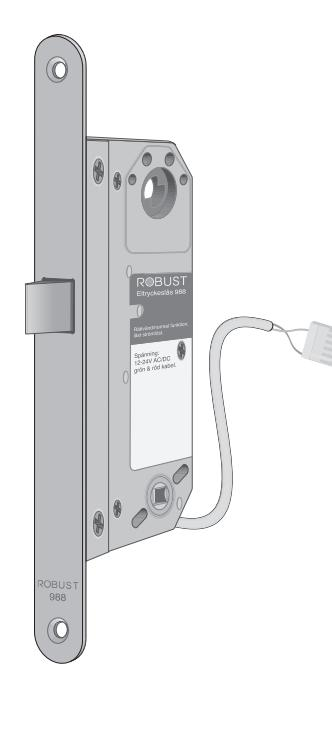
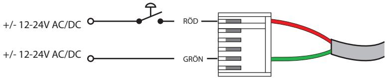
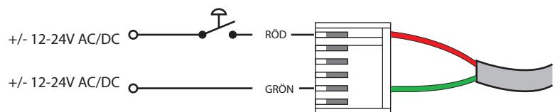

## Teknisk specifikation för eltryckeslås 988 & 989. Driftspänning: 12-24V AC/DC (+/- 10 %) Driftström: ca. 100 mA (12V) - 50 mA (24V) Anslutning: polaritetsskyddat Transientskydd: inbyggt Omgivningstemp.: -20 ˚C - +60˚C Fallkolv: låser ut 14 mm, cylinderfall Dörr vänster/höger: valbart på låshuset, lossa stolpen och vrid fallen 180˚ Funktion 988: rättvänd/normal, låst strömlöst 989: omvänd, öppet strömlöst

S

## Kopplingsschema.

## Tillbehör.

| Anslutningskabel, 6 meter:  | K906       |
|-----------------------------|------------|
| Anslutningskabel, 10 meter: | K910       |
| Osymmetrisk stolpe:         | 98(-)-osym |

# 988 & 989 988 & 989 Dk

No

## Teknisk specifikation för magnetlås/solenoidlås 988 & 989.

| Driftsspænning: 12-24V AC/DC (+/- 10 %) |              |                                                                       |  |
|--------------------------------------------|--------------|-----------------------------------------------------------------------|--|
| Driftsstrøm:                               |              | ca. 100 mA (12V) - 50 mA (24V)                                        |  |
| Transient-beskyttelse:                     |              | indbygget                                                             |  |
| Tillslutning:                              |              | polaritetbeskyttet                                                    |  |
| Arbejdes-temperatur:                       |              | -20 ˚C - +60˚C                                                        |  |
| Låsefalle:                                 |              | låse falle er 14 mm, låsefalle                                        |  |
| Venstre/Højre:                             |              | stolpen fjernes, låsefalle og hjælpefalle/forreilingen vendes 180˚ |  |
| Funktion                                   | 988: 989: | retvendt/normal, låst strømløst omvendt, åben strømløs             |  |
|                                            |              |                                                                       |  |

## Tilslutnings skema.

# Tillbehør. Tilslutningskabel, 6 meter: K906 Tilslutningskabel, 10 meter: K910

Osymmetrisk stolpe: 98(-)-osym