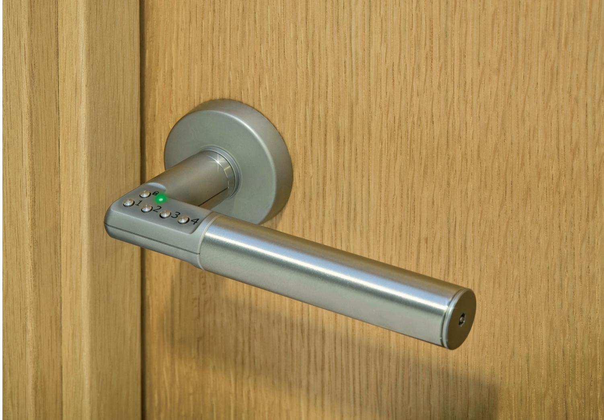
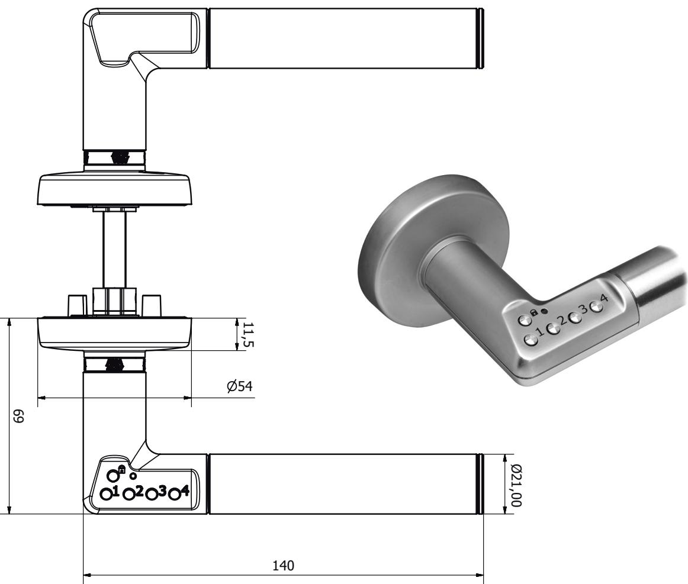

## ASSA Code Handle 8810

Elektromekaniskt kodhandtag för dörr

## **Användningsområde**

För bekväm låsning/upplåsning av innerdörr. Patenterad produkt.

## **Egenskaper**

- • Passar på låshus i Skandinavisk standard, typ Modul och Evo.
- • Finns även för låshus i DIN-standard, 8812.
- • Masterkod och upp till nio olika användarkoder.
- • Autolås-funktion kan väljas.
- • Två st CR2, 3V lithium batterier i yttre handtag.
- • Varning vid låg batterispänning.
- • Visuell och akustisk återkoppling.
- • Ingen kabeldragning, enkelt montage.
- • Finns i höger- och vänsterutförande.
- • Material: borstat rostfritt stål och mattförkromad zink.
- • Endast avsett för montage inomhus.

## **Funktion**

- • Låsmekanismen manövreras med fem knappar. Fyra knappar för att mata in en fyra- till sexsiffrig kod för upplåsning samt en knapp för låsning.
- • Grön lysdiod blinkar och ett ljud hörs vid knapptryckning för upplåsning.
- • Röd lysdiod blinkar och ett ljud hörs vid knapptryckning för låsning.
- • Masterkod och användarkod programmeras vid installation. Kan ändras obegränsat antal gånger.
- • Unik reset-funktion (pat pend).
- • Blockerings-funktion vid upprepad felslagen kod.
- • "Free swing" från utsidan i låst läge, alltid öppningsbart med handtaget från insidan.
- • Koden är kvar vid spänningsbortfall/batteribyte.
- • De två batterierna räcker till cirka 100.000 operationer.
- • Röd lysdiod indikerar när det är cirka 500 operationer kvar.

ASSA ABLOY, the global leader in door opening solutions.

# ASSA Code Handle 8810

## Elektromekaniskt kodhandtag för dörr

in door opening solutions, dedicated to saftying end-user needs for security, safty and convenience.

ASSA OEM AB P.O. Box 371 SE-631 05 Eskilstuna Sweden

phone +46 (0)16 17 70 00

ASSA OEM AB Bruksgatan 17 SE-414 51 Göteborg Sweden

## **Så här använder du ASSA Code Handle**

ASSA Code Handle är batteridrivet och levereras normalt med två batterier, typ CR2, monterade i handtaget.

Vid leverans är handtaget nollställt och måste programmeras före användning. Du kan också välja om handtaget skall autolåsa. Instruktioner för detta finns i förpackningen.

## **Låsa upp och låsa**

- 1. Lås upp handtaget genom att slå rätt kod med sifferknapparna 1-4.
- 2. Lås handtaget genom att trycka på knappen med hänglåssymbolen.

Gällande koder kan ändras. Instruktion för detta finns i förpackningen. ASSA ABLOY, the global leader