| EN |
|----|
|    |
| FR |

| VI D C        | V3S V3SR V3SRB      | V4S V4SR V4SRB      | V5S V5SR V5SRB      |
|---------------------|---------------------------|---------------------------|---------------------------|
| GIT DI           | P300A P300ALR V3SRB | P400A P400ALR V4SRB | P500A P500ALR V5SRB |
| K VI U D C | S300 S300M V3SRB    | S400 S400M V4SRB    | S500 S500M V5SRB    |

**Surface Mount Illuminated Electromagnets** *Ventouses électromagnétiques lumineuse appliques*

**Range:** Diax® / **Gamme:** Diax®

> INSTALLATION MANUAL MANUEL D'INSTALLATION

#### **1] PRODUCT PRESENTATION**

#### *NFS 61-937.*

- *Surface mounting.*
- *High corrosion resistance.*
- *Safety rope.*
- *Delivered with armature.*
- *No mechanical wear.*
- *Ease of installation.*
- *Recommended for interior use.*
- *Positive safety (frees access immediately in the event of a power cut).*
- *Holding force:* 300/400/500kg.
- *Visual and audible signalling (depending on the version, see table).*
- *No residual magnetism.*
- *Built-in electronic protection to eliminate back EMF.*
- Electromagnetic lock dimensions (l x w x d):
- 300kg range = 248 x 45 x 26mm,
- 400kg range = 255 x 50 x 27mm,
- 500kg range = 266 x 66 x 40mm.
- Armature dimensions (l x w x d):
- 300kg range = 185 x 38 x 11mm,
- 400kg range = 185 x 45 x 12mm,
- 500kg range = 185 x 60 x 12mm.
- Silent operation.
- Option: Electromagnetic lock accessories.
- Power supply: 12/24V dc.
- Power absorption:
- 12 V DC = 550mA,
- 24 V DC = 275mA.
- Relay/Signal:

| CDVI | CDVI UK |
|------|---------|
| V3SR | S300M   |
| V4SR | S400M   |
| V5SR | S500M   |

- Relay/Signal + buzzer:
- V3SRB
- V4SRB
- V5SRB

#### **COLOUR CODES:**

**BLUE** ACTIVE VOLTAGE

**RED** LOCKED **GREEN** OPEN

| IP42 |  |
|------|--|
|      |  |

*WEEE & RoHS*

*EC certifi cation*

**BLUE** LOCKED **GREEN** OPEN + BUZZER

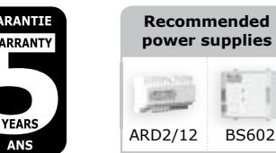

*The new range of electromagnetic locks with signalling on the 300, 400 and 500 kg versions, suitable for the new regulations covering assistance to persons with reduced mobility.*

|        | Reference                                                  |         | Holding | Signalling   |         |  |  |
|--------|------------------------------------------------------------|---------|---------|--------------|---------|--|--|
|        | CDVI                                                       | CDVI UK | force   | Illuminated  | Audible |  |  |
|        | V3S S300 V4S S400 V5S S500 V3SR S300M |         | 300kg   | Blue         | -       |  |  |
|        |                                                            |         | 400kg   | Blue         | -       |  |  |
|        |                                                            |         | 500kg   | Blue         | -       |  |  |
|        |                                                            |         | 300kg   | Red - Green  | -       |  |  |
|        | V4SR                                                       | S400M   | 400kg   | Red - Green  | -       |  |  |
|        | V5SR                                                       | S500M   | 500kg   | Red - Green  | -       |  |  |
|        | V3SRB                                                      |         | 300kg   | Blue - Green | Yes     |  |  |
| BUZZER | V4SRB                                                      |         | 400kg   | Blue - Green | Yes     |  |  |
|        | V5SRB                                                      |         | 500kg   | Blue - Green | Yes     |  |  |

## **2] REMINDERS AND RECOMMENDATIONS**

#### **Electromagnetic locks are designed to require very little maintenance. Nevertheless, the following procedures will ensure optimum performance:**

- The electromagnetic lock and its armature have a special coating to protect them from corrosion. The contact faces of the lock must always be kept clean to ensure optimal locking.
- If the contact faces are damaged it can reduce the effi ciency of the combination and allow traces of corrosion to appear.
- An electromagnetic lock works with direct current.

## **3] FITTING KIT**

| Pins | Steel washers | Rubber washers | M4x25 wood screw | Key                           | 1 M8x35 screw + 1 M8x20 screw | M3x8 self-tapping screw | Guide piece | Cap nut | Surface mounting electro magnetic lock | Mounting plate | Armature | Safety rope |
|------|------------------|-------------------|------------------------|-------------------------------|-------------------------------------------|-------------------------------|----------------|---------|----------------------------------------------------|-------------------|----------|----------------|
| 2    | 2                | 2                 | 7                      | 1 x 3mm + 1 x 5mm | 2                                         | 1                             | 1              | 1       | 1                                                  | 1                 | 1        | 2              |

#### **Contents of the electromagnetic lock kit:**

#### **Optional accessories:**

| Reference CDVI    | L3L4 (300-400KG) L5 (500KG) | Z3/Z4/Z5                     | UBK/U                           | UBK/P                            | AMA3 (300-400 KG) AMA5 (500KG) |
|----------------------|--------------------------------|------------------------------|---------------------------------|----------------------------------|-----------------------------------|
| Reference CDVI UK | L3L4 (300-400KG) L5 (500KG) | Z3/Z4/Z5                     | UBK/U                           | UBK/P                            | AMA3 (300-400 KG) AMA5 (500KG) |
| Description          | L shaped bracket for lock   | Z shaped bracket for lock | Armature base for glass door | Universal base for glass door | Armature base                     |

## **4] ELECTRICAL CONNECTIONS**

|        | Term ina l block | Correspondence  |  |
|--------|---------------------|-----------------|--|
|        | +                   | 12 or 24V dc    |  |
|        | -                   | -0 V            |  |
| Signal | N.C                 | Normally closed |  |
|        | COM                 | COM             |  |
|        | N.O                 | Normally open   |  |

The NO/NC signal only switches when the door is closed with the power to it on.

#### **Important note:**

Check the jumper position before connecting the lock to the 24 V DC input current. A wrong position could damage the lock. This type of damage is not covered by the warranty. 12V dc 24V dc

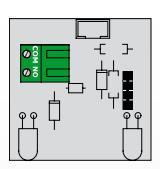

**300, 400 and 500Kg lock + blue lighting** *Ref. CDVI: V3S - V4S - V5S Ref. CDVI UK:* 

*S300 - S400 - S500*

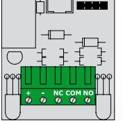

**300, 400 and 500Kg lock, version with relay.** *Ref. CDVI:* 

*V3SR - V4SR - V5SR Ref. CDVI UK: S300M - S400M - S500M*

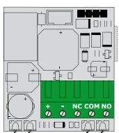

**300, 400 and 500Kg lock + Buzzer** *Ref. CDVI and CDVI UK: V3SRB - V4SRB - V5SRB* 

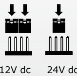

## **Current input** 220/230V ac **Power supply** 12/24V dc Inside "Exit" request push button **Outside "access conrol" unit** *Examples:* 1. Proximity reader 2. Digicode® 3. MIFARE® reader Electromagnet

## **5] INSTALLATION INSTRUCTIONS:**

- Identify the type of door (inward or outward opening) and choose an optional accessory if necessary.
- Drill a hole in the door jamb to route the cable to the lock.
- Fix the mounting plate fi rmly to the door frame.
- Position the armature and accessory, if any, on the door and check that it is fi tted but not jammed. The electromagnetic lock may be fi tted vertically or horizontally on the door frame.
- Align the armature opposite the lock.
- Check that the lock is set to the right voltage and apply the current. When the door is closed the armature should attach strongly to the lock.

4

#### **6] INSTALLATION ON THE DOOR**

#### **Installation on an outward opening door (Push door)**

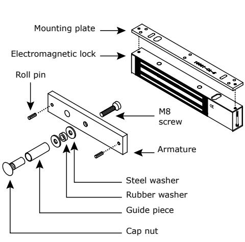

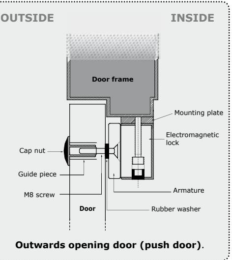

#### **Installation on an inward opening door (Pull door)**

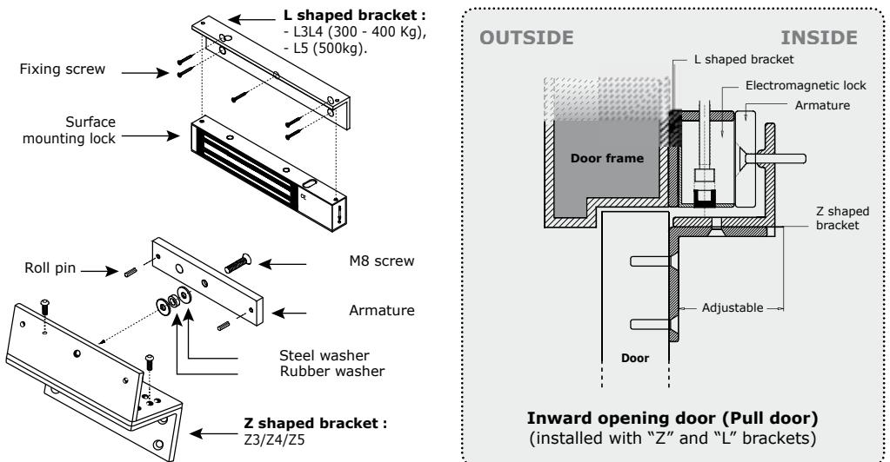

**5] PROGRAMMATION**

## **Electromagnetic locks surface mount series**

## **7] INSTALLATION WITH ACCESSORIES**

#### **Installation with an armature base**

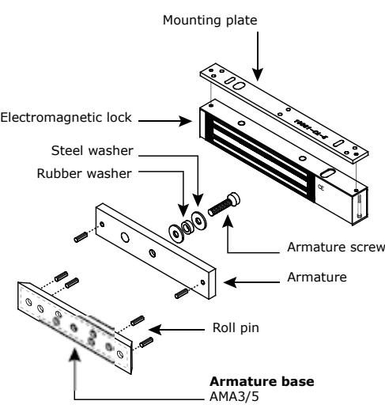

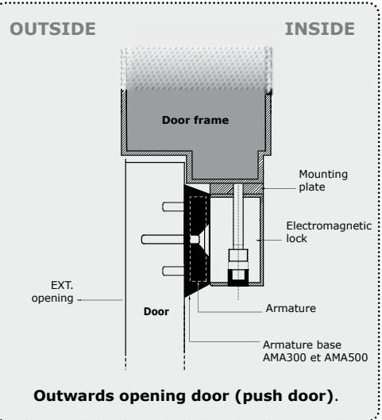

#### **Installation with base for glass door**

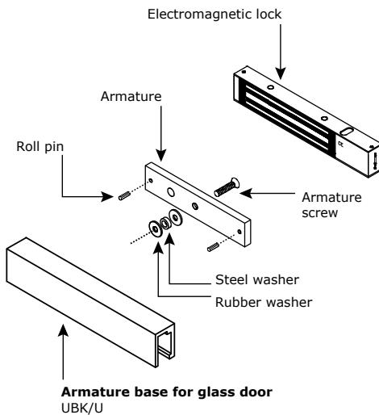

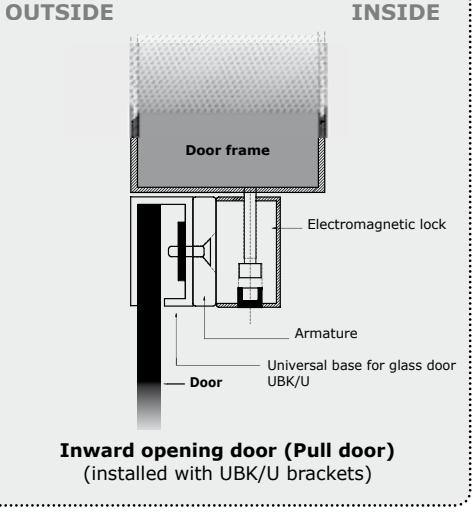

cdvi.com

6

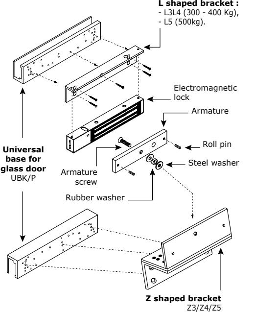

#### **Installation with base for glass door**

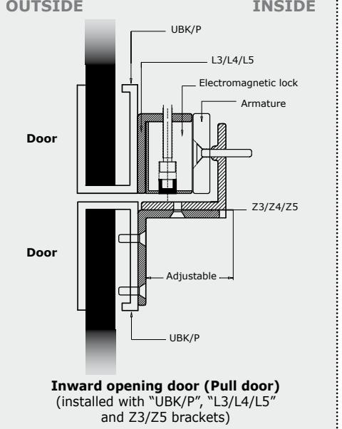

## **8] FAULT FINDING**

| PROBLEM POSSIBLE CAUSE  |                                                                | SOLUTION                                                                                                                                                                                                                                           |  |  |
|----------------------------|----------------------------------------------------------------|----------------------------------------------------------------------------------------------------------------------------------------------------------------------------------------------------------------------------------------------------|--|--|
| Door locking impossible | The lock is not receiving DC current.                          | - Check that the wires are connected to the right terminals. - Check that the power supply is compatible. - Check that the lock is connected to the circuit correctly.                                                                       |  |  |
| Holding force reduced   | The lock and the armature are not lined up with each other. | - Check that the lock is connected to the circuit correctly. - Check that the electromagnet and the armature are properly aligned. - Check that the contact faces are free from dirt and rust. - Check that the armature is soft mounted. |  |  |
|                            | Low voltage or armature jammed.                                | - Check that the lock is receiving the correct power supply satisfactorily. - check the tightening of the armature and the condition of the rubber.                                                                                          |  |  |
| Faulty reed switch      | Voltage too low. Misalignment.                                 | - Check the power supply. - Cable cross section to be determined according to the power supply and the locking. - e.g.: 2 x 1.5mm2 ≥ 10m.                                                                                                 |  |  |

7

#### **1] PRESENTATION DU PRODUIT**

#### *NFS 61-937.*

- *Applique.*
- *Haute résistance à la corrosion.*
- *Filin de sécurité.*
- *Livrée avec contre-plaque.*
- *Pas d'usure mécanique.*
- *Facilité d'installation.*
- *Préconisée en intérieur.*
- *Sécurité positive (libère instantanément l'accès en cas de coupure de courant).*
- *Force de rétention :* 300/400/500 kg.
- *Signalisation lumineuse et sonore (selon version, voir tableau).*
- *Pas de magnétisme résiduel.*
- *Protection électronique intégrée contre l'effet de self.*
- Dimensions des ventouses (L x l x P) :
- GAMME 300 kg = 248 x 45 x 26 mm,
- GAMME 400 kg = 255 x 50 x 27 mm,
- GAMME 500 kg = 266 x 66 x 40 mm.
- Dimensions des contre-plaques (L x l x P) :
- GAMME 300 kg = 185 x 38 x 11 mm,
- GAMME 400 kg = 185 x 45 x 12 mm,
- GAMME 500 kg = 185 x 60 x 12 mm.
- Fonctionnement silencieux.
- Option : Accessoires de ventouses.
- Alimentation : 12/24 V DC.
- Consommation :
- 12 V DC = 550 mA,
- 24 V DC = 275 mA.
- Relais/signal :

| CDVI | DIGIT   |
|------|---------|
| V3SR | P300ALR |
| V4SR | P400ALR |
| V5SR | P500ALR |

- Relais/signal + buzzer :
- V3SRB
- V4SRB
- V5SRB

## **CODES COULEURS :**

| BLEU         | TENSION ACTIVE                | IP42              |
|--------------|-------------------------------|-------------------|
| VERT         | ROUGE VERROUILLÉ OUVERT    | DEEE & RoHS       |
| BLEU VERT | VERROUILLÉ OUVERT + BUZZER | Certifi cation CE |

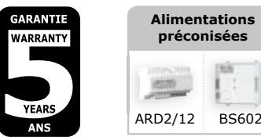

*La nouvelle gamme de ventouses avec signalisation en versions 300, 400 et 500 kg, adaptée à la nouvelle règlementation sur l'aide aux personnes à mobilité réduite.*

|        | Référence CDVI DIGIT |         | Force de rétention | Signalisation |        |
|--------|----------------------------|---------|-----------------------|---------------|--------|
|        |                            |         |                       | Lumineuse     | Sonore |
|        | V3S                        | P300A   | 300 kg                | Bleu          | -      |
|        | V4S                        | P400A   | 400 kg                | Bleu          | -      |
|        | V5S                        | P500A   | 500 kg                | Bleu          | -      |
|        | V3SR                       | P300ALR | 300 kg                | Rouge - Vert  | -      |
|        | V4SR                       | P400ALR | 400 kg                | Rouge - Vert  | -      |
|        | V5SR                       | P500ALR | 500 kg                | Rouge - Vert  | -      |
| BUZZER | V3SRB                      |         | 300 kg                | Bleu - Vert   | Oui    |
|        | V4SRB                      |         | 400 kg                | Bleu - Vert   | Oui    |
|        | V5SRB                      |         | 500 kg                | Bleu - Vert   | Oui    |

## **2] RAPPELS ET RECOMMANDATIONS**

#### **Les ventouses électromagnétiques, par leur conception, nécessitent peu d'entretien. Cependant, les procédures suivantes assureront une performance maximale :**

- La ventouse et sa contre-plaque disposent d'un revêtement spécial qui les protège contre la corrosion. Les surfaces de contact de la ventouse et de la contre-plaque doivent toujours être propres afi n d'assurer un verrouillage optimal.
- L'endommagement des surfaces de contact peut réduire l'effi cacité de l'ensemble et laisser apparaître des traces de corrosion.
- Une ventouse fonctionne avec un courant continu.

## **3] KIT DE MONTAGE**

#### **Fournis dans le kit Ventouse:**

| Goupilles Rondelles acier | Rondelles caouchouc | Vis bois M4x25 | clef        | 1 vis M8x35 + 1 vis M8x20 | Vis auto foreuse M3x8 | Embout de guidage | Écrou borgne | Ventouse saillie | Plaque de montage | Contre plaque | Filin de sécurité |
|------------------------------|------------------------|-------------------|-------------|---------------------------------------|-----------------------------|-------------------------|-----------------|---------------------|-------------------------|------------------|----------------------|
|                              |                        |                   | 1 x 3 mm |                                       |                             |                         |                 |                     |                         |                  |                      |

#### **Accessoires en option:**

| Référence CDVI  | L3L4 (300-400KG) L5 (500KG)           | Z3/Z4/Z5                   | UBK/U                                              | UBK/P                                       | AMA3 (300-400 KG) AMA5 (500KG)     |
|--------------------|------------------------------------------|----------------------------|----------------------------------------------------|---------------------------------------------|---------------------------------------|
| Référence DIGIT | AML300 (300- 400KG) AML500 (500KG) | Z3/Z4/Z5                   | UBK/U                                              | UBK/P                                       | AMA300 (300-400 KG) AMA500 (500KG) |
| Description        | Support L pour ventouse               | Support L pour ventouse | Support de contre plaque pour porte en verre | Support universel pour porte en verre | Support de contre-plaque           |

## **4] RACCORDEMENT**

|        | bornier | Correspondance     |
|--------|---------|--------------------|
|        | +       | 12 ou 24 V dc      |
|        | -       | -0 V               |
|        | N.C     | Normalement fermé  |
| Signal | COM     | COM                |
|        | N.O     | Normalement ouvert |

Le signal NO/NC ne commute que lorsque la porte fermée et sous tension.

#### **Note importante :**

 Vérifi er la position du cavalier avant de brancher la ventouse au courant d'entrée de 24 V CC. Une position incorrecte peut endommager la ventouse. Ce type de dommage n'est

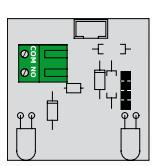

**Ventouse 300, 400 et 500 Kg standard** *Réf. CDVI: V3S - V4S - V5S Réf. Digit: P300A - P400A - P500A*

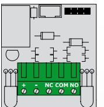

**Ventouse 300, 400 et 500 Kg, avec relais.** *Réf. CDVI: V3SR - V4SR - V5SR Réf. Digit: P300ALR - P400ALR - P500ALR*

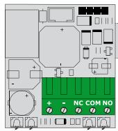

**Ventouse 300, 400 et 500 Kg, avec relais + Buzzer** *Réf. CDVI et DIGIT: V3SRB - V4SRB - V5SRB* 

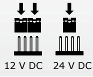

# pas couvert par la garantie. 12 V DC 24 V DC

## **5] INSTRUCTION D'INSTALLATION :**

- Identifi er le type de porte (tirante ou poussante) et choisir un accessoire en option si nécessaire.
- Percer un trou dans le montant de la porte pour le passage du câble jusqu'à la ventouse.
- Fixer solidement la plaque de montage sur le dormant.
- Positionner sur l'ouvrant la contre plaque et l' éventuel accessoire et s'assurer qu'elle est montée sans être bridée. La ventouse peut être montée verticalement ou horizontalement sur le dormant.
- Aligner la contre-plaque en vis à vis de la ventouse.
- S'assurer que la ventouse est réglée sur la tension correcte et appliquer le courant. A la fermeture de la porte, la contre-plaque doit adhérer solidement à la ventouse.

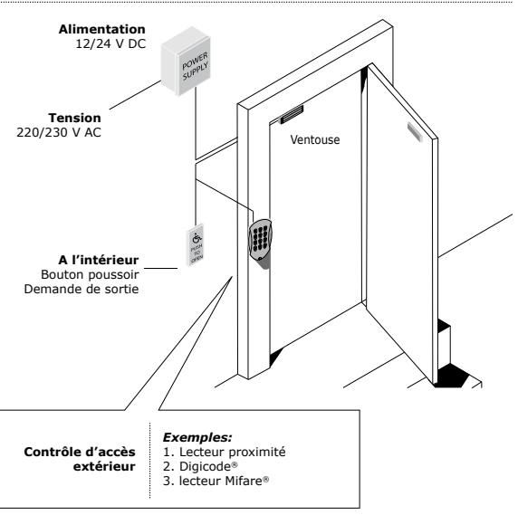

## **6] MONTAGE SUR PORTE**

#### **Montage sur porte à ouverture extérieure (Poussante)**

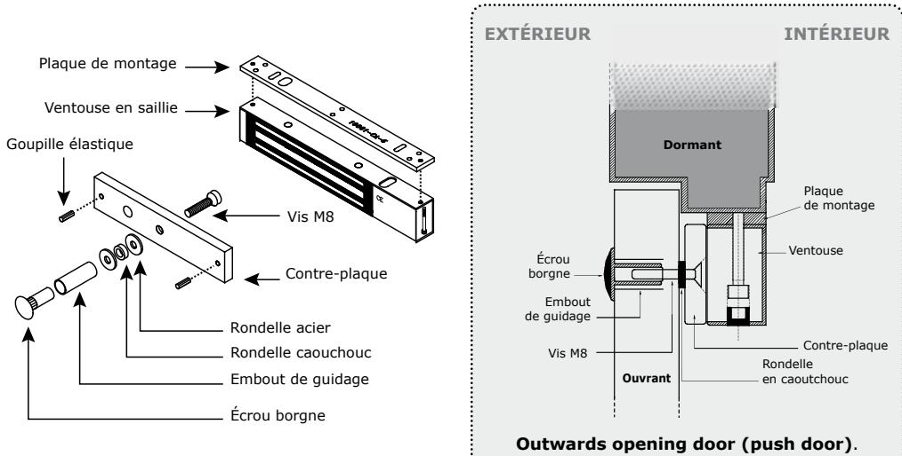

#### **Montage sur porte à ouverture intérieure (Tirante)**

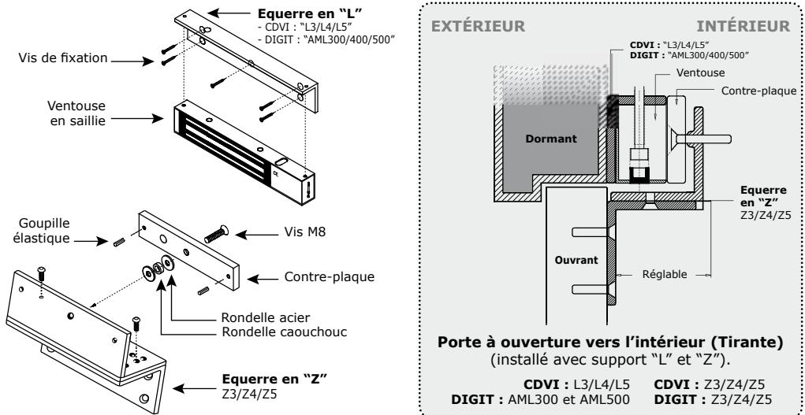

## **7] MONTAGE AVEC ACCESSOIRES**

#### **Installation avec support de contre-plaque**

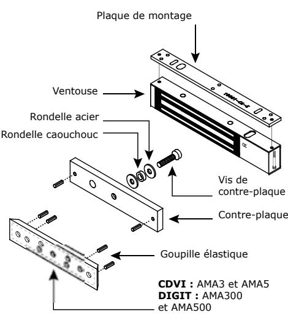

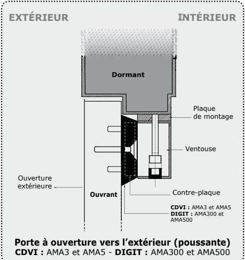

#### **Installation avec support pour porte en verre**

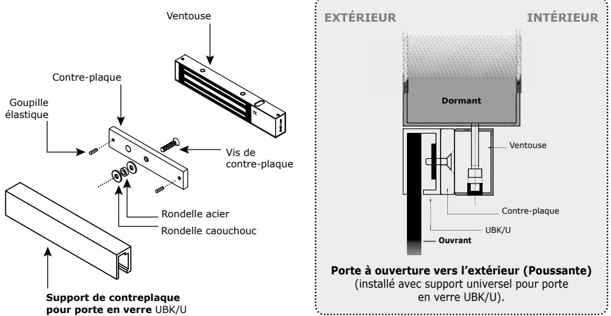

#### **Installation with base for glass door**

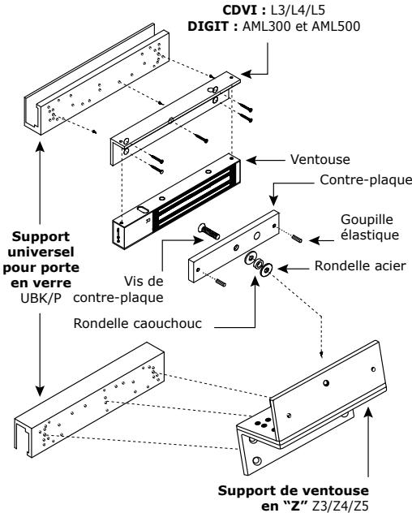

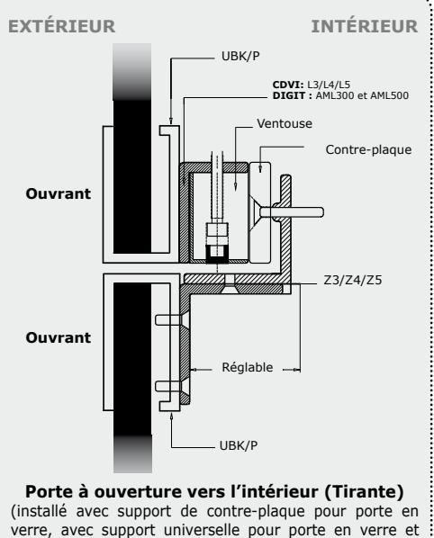

support de ventouse en "Z"

## **8] DÉPANNAGE**

| PROBLÈME                            | CAUSE POSSIBLE                                               | SOLUTION                                                                                                                                                                                                                                                                                       |  |  |  |
|-------------------------------------|--------------------------------------------------------------|------------------------------------------------------------------------------------------------------------------------------------------------------------------------------------------------------------------------------------------------------------------------------------------------|--|--|--|
| Verrouillage de porte impossible | La ventouse ne reçoit pas de courant CC.                     | - Vérifi er que les fi ls sont raccordés aux bonnes bornes. - Vérifi er que l'alimentation est compatible. - Vérifi er que la ventouse est reliée correctement au circuit.                                                                                                               |  |  |  |
| Force de maintien réduite     | La ventouse et la contre-plaque ne sont pas en vis à vis. | - Vérifi er que la ventouse est reliée correctement au circuit. - S'assurer que l'électroaimant et la contre-plaque sont bien en vis à vis. - Vérifi er que les surfaces de contact sont exemptes de salissures et de rouille. - Vérifi er que la contre-plaque est montée souple. |  |  |  |
|                                     | Tension basse, contre-plaque bridée.                      | S'assurer que la ventouse est bien alimentée par la tension requise, vérifi er le serrage de la contre-plaque et l'état du caoutchouc.                                                                                                                                                   |  |  |  |
| Commutateur Reed HS              | Tension trop basse. Mauvais alignement.                   | - Verifi er l'alimentation. - Section de cable à déterminer selon la distance entre l'alimentation et le verrouillage. - ex: 2 x 1,5mm2 ≥ 10m                                                                                                                                         |  |  |  |

 **MANUEL D'INSTALLATION**

| 8] NOTES |  |
|----------|--|
|          |  |
|          |  |
|          |  |
|          |  |
|          |  |
|          |  |
|          |  |
|          |  |
|          |  |
|          |  |
|          |  |
|          |  |
|          |  |
|          |  |
|          |  |
|          |  |
|          |  |
|          |  |
|          |  |
|          |  |
|          |  |
|          |  |
|          |  |
|          |  |
|          |  |
|          |  |
|          |  |
|          |  |
|          |  |
|          |  |
|          |  |
|          |  |
|          |  |
|          |  |
|          |  |
|          |  |
|          |  |
|          |  |
|          |  |
|          |  |
|          |  |

|  |  | MANUEL D'INSTALLATION |
|--|--|-----------------------|
|--|--|-----------------------|

#### **Reference :** G0301FR0311V01 **Extranet :** EXE-CDVI_IM BRIGHT ELECTROMAGNET CMYK A5 EN-FR 01

## **Manufacturing Access Control since 1985**

**CDVI (Headquarters/Siège social)** FRANCE Phone: +33 (0)1 48 91 01 02 Fax: +33 (0)1 48 91 21 21

**CDVI** AMERICAS Phone: +1 (450) 682 7945 Fax: +1 (450) 682 9590

**CDVI** BENELUX Phone: +32 (0) 56 62 02 50 Fax: +32 (0) 56 62 02 55

**CDVI** TAIWAN Phone: (0)42471 2188 Fax: (0)42471 2131

**CDVI** SWITZERLAND Phone: +41 (0)21 882 18 41 Fax: +41 (0)21 882 18 42

**CDVI** CHINA Phone: +86 (0)10 87664065 Fax: +86 (0)10 87664165

**CDVI** IBÉRICA Phone: +34 935 390 966 Fax: +34 935 390 970

**CDVI**

ITALIA Phone: +39 0331 97 38 08 Fax: +39 0331 97 39 70

**CDVI** MAROC Phone: +212 5 22 48 09 40 Fax: +212 5 22 48 34 69

**CDVI** SWEDEN Phone: +46 (0)31 760 19 30 Fax: +46 (0)31 748 09 30

**CDVI** UK Phone: +44 (0)1628 531300 Fax: +44 (0)1628 531003

**DIGIT** FRANCE Phone: +33 (0)1 41 71 06 85 Fax: +33 (0)1 41 71 06 86

**LA GÂCHE ÉLECTRIQUE** FRANCE Phone: +33 (0)3 88 77 32 82 Fax: +33 (0)3 88 77 85 02

**cdvigroup.com**