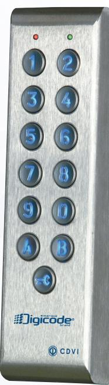

# **PROFIL100EINT**

*Keypad PROFIL100EINT*

1

### **1] GENERAL INFORMATION**

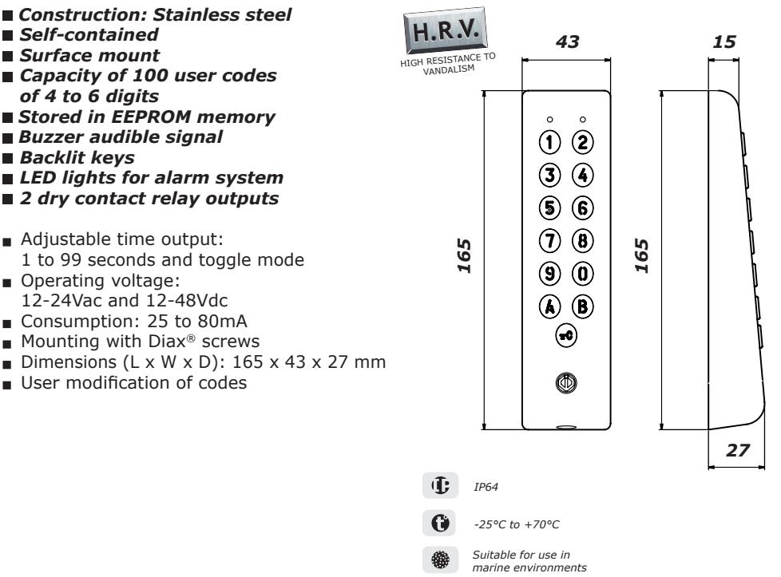

### **2] NOTES & RECOMMENDATIONS**

### **Recommended power supplies.**

- ADC335 (230V input), BS60 (230V input).
- Separate power supply for the control elements.

### **Wiring reminder**

Make sure to insulate any unused wires.

### **Mounting recommendations**

Mount the keypad on a flat surface to avoid any vandalism and to insure the best mounting.

### **Security advice**

For security advice reasons, change the factory default master code. When selecting a master code and user code avoid simple codes (example : **3 4 5 6 7**).

#### **Back EMF protection**

To secure the system from back electromagnetic fields do not forget to mount the varistor in parallel on the lock.

### **3] MOUNTING KIT**

|               | Varistor | T20 Diax® Spanner | Diax® screws (M5x8) |
|---------------|----------|-------------------|---------------------|
| PROFIL100EINT | 1        | 1                 | 1                   |

### **4] MOUNTING INSTRUCTIONS**

Once you have made sure that the mounting kit is complete and that you prepared the cables of the Digicode® PROFIL100EINT encoded keypad, you can proceed and mount the product. Make sure that you have all the appropriate tools (drill, screw drivers and a meter tape...) and follow the mounting instructions for the PROFIL100EINT.

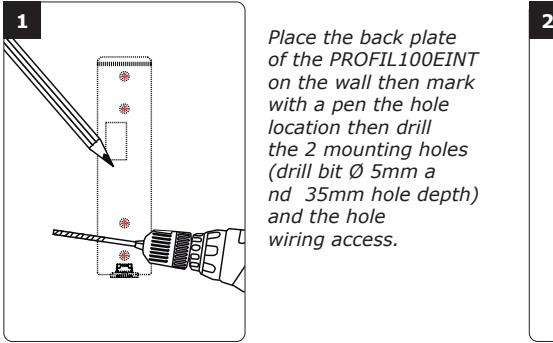

*Place the back plate of the PROFIL100EINT on the wall then mark with a pen the hole location then drill the 2 mounting holes (drill bit Ø 5mm a nd 35mm hole depth) and the hole wiring access.*

*Insert the 2 plastic anchors in the holes. Mount the back plate of the PROFIL100EINT with the screw on the wall.*

**(x2) (x2)**

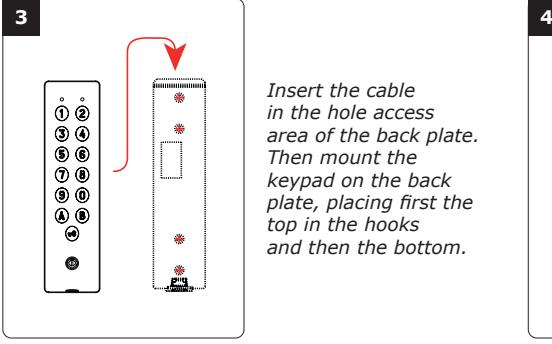

*Insert the cable in the hole access area of the back plate. Then mount the keypad on the back plate, placing first the top in the hooks and then the bottom.*

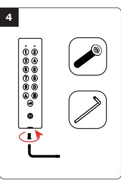

*Fasten the PROFIL100EINT keypad to the back plate with the M5x8 Diax® screw and T20 Diax® spanner hardware.*

**(x2) (x2)**

**PROFIL100EINT EN EN** Keypad PROFIL100EINT

### **5] WIRING DIAGRAM**

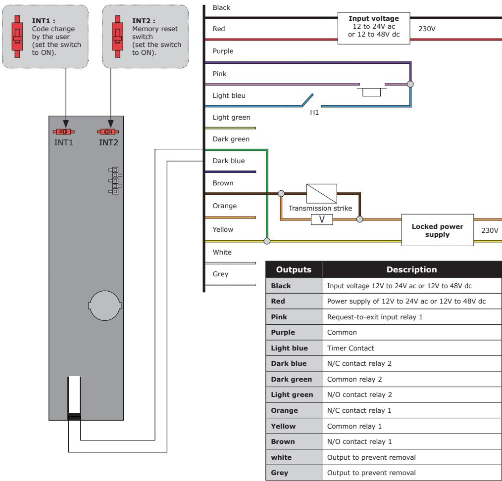

#### **This product is delivered with a varistor.**

The varistor must be installed directly on the terminals of the strike (electromagnetic lock, motor, etc.) controlled by the device. If the device operates with several strikes, each must be equipped with a varistor. The varistor prevents voltage surges caused by the coil of the strike – self effect. If the "shear lock" type of electromagnetic lock is used, it must be connected to a separate power supply from the PROFIL100EINT!

### **Default values**

- Without codes.
- Illumination time: 10 seconds*.*
- Relay release time: 1 second*.*
- Code length: 5-digits*.*
- Master Code: **1 2 3 4 5.**
- Programming security time : *120 secondes.*
- Code length for sub master code:
- *Version 1 relay (Group 1) = AB,*
- *Version 2 relays (Group 2) = 13.*
- One beep on switching on.

#### **Audible signal:**

- The buzzer indicates different audible signals.
- **1 short beep**: Keypad powered.
- **1 long beep**: Data computing in programming or access granted.
- **2 short beeps**: Enter or Exit from programming.
- **4 short beeps**: data computing error.

### **Code length**

- The master code and the user codes can be of 4 to 6-digits in length.
- All the keypad keys can be used to program a code.
- The master code CAN NOT be used as a user code.
- To delete a specific User pin Code

replace it by **0 0 0 0** if code length is 4-digits format or replace it by **0 0 0 0 0** if the code is in 5-digits format **or**  replace it by **0 0 0 0 0 0** if the code is in 6-digits format.

#### **Dipswitch INT2:**

Reset master code and user codes

#### **Dipswitch INT1:**

Modification of individual code by the user

- **A. Reset master code and user codes**
### **1. Enter the master code twice**

- (**1 2 3 4 5** default value master code). 2 beeps are emitted to confirm entry in programming mode.
#### **2. Press A6 to reset the Master Code and the User codes.**

- One beep is emitted.
- Press on **A** and **B** to confirm reset
- of all memory of the keypad.
- Wait for two beeps.
- The master code is restored to its default value **1 2 3 4 5** and all the user codes are deleted from the keypad.
- Once the reset is completed then the keypad returns to a stand-by operating mode.

### **OR**

### **1. Cut the power. Switch INT2 to ON.**

### **2. Put the power back.**

- Wait approximately 3 seconds.
- Two beeps are emitted to confirm reset of the keypad.
- Switch back INT2.

- The master code is restored to its default value **1 2 3 4 5** and all the User codes are deleted from the keypad.
### **B. Setting code length**

#### **1. Enter the master code twice.**

(**1 2 3 4 5** default value master code). 2 beeps are emitted to confirm entry in programming mode.

#### **2. Press A4 to program the code length.**

- -One beep is emitted.
- -Press **4, 5** or **6** for the digit code.
- - One beep is emitted to confirm
- programming of the code length.

#### **3. Press A5 to modify the master code.**

- One beep is emitted.
- Enter the new 4, 5 or 6-digits master code.
- One beep is emitted to confirm programming of the new master code.

#### **4. Press B to exit from programming mode.**

2 beeps are emitted to confirm that the keypad is in stand-by operating mode.

### **4 beeps indicate a data computing error.**

### **C. Changing the master code The master code is used only to enter in programming mode.**

- **1. Enter the master code twice** (**1 2 3 4 5** default value master code). 2 beeps are emitted to confirm entry in programming mode.
	- **2. Press A5 to modify the master code.**
- -One beep is emitted.
- -Enter the new 4, 5 or 6-digits master code.
- - One beep is emitted to confirm that the master code is programmed.
- **3. Press B to exit from the programming mode.** 2 beeps are emitted to confirm that the keypad is in stand-by operating mode.
- **D. Adding, changing or deleting a user code User location 00 to 59 is relay 1 User location 60 to 99 is relay 2**

### **1. Enter the master code twice**

(**1 2 3 4 5** default value master code). 2 beeps are emitted to confirm entry in programming mode.

- **2. To add a user code, enter the user location (from 00 to 99).**
If the user location is used 4 beeps are emitted, enter the 4, 5 or 6-digits user code.

- **3. To Change a User code enter the user location.**
- 4 beeps are emitted to indicate that the user location is already programmed.
- Enter a new 4, 5 or 6-digits code.
- A beep is emitted to confirm the new user code.
- **4. To delete a User code enter the user location.**
- 4 beeps are emitted.
- Press **0 as many times as digits in the user code.**

- **( ex. 0 0 0 0 0** in 5-digits length code ) - A beep is emitted to confirm the user code has been deleted.
#### *Note:*

*If the Pin code is already programmed or is identical to the master code, then 4 beeps are emitted. Press B to exit from the programming mode. 2 beeps are emitted to confirm that the keypad is in stand-by operating mode.*

### **E. Time outputs**

**This section allows to program the illumination time and the Relay activation time.**

- **1. Enter the master code twice** (**1 2 3 4 5** default value master code). 2 beeps are emitted to confirm entry in programming mode.
- **2. Press A0 to program the key-in keypad time and the keys lit time. -1 beep is emitted.**
- Enter the time in seconds with 2 digits **10 for 10 seconds up to 99 for 99 seconds.**  The backlighting dims after 10 seconds after the last keypress or switches off after entering a valid code.
- Press **00** for permanent illumination keys.
- One beep is emitted to validate the time.
- **3. Press A1 to program relay 1 output time (door release time). (Press A2 for relay 2).**
- 1 beep is emitted.
- For a latched output enter the time in seconds using 2 digits – **01 for 1 second up to 99 for 99 seconds.**
- Press **00** for a toggled output.
- One beep is emitted to validate the time.
- **4. Press B to exit from the programming mode.** 2 beeps are emitted to confirm that the keypad is in stand-by operating mode.

**4 beeps indicate a data computing error.**

- **F. Reset master code On stand-by operating mode, switch dip INT2 to ON.** 
	- Wait 1 second and then switch back INT2.
	- One beep is emitted.
- The master code is restored to its default value **1 2 3 4 5** in 5-digits code and **1 2 3 4** in 4-digits code.
- **G. Changing the code by a user To authorize a user to modify its own user code switch dip INT1 to ON. (to disable the function switch it back).**
- **1. Enter the old user code.** The relay is activated and a beep is emitted.
- **2. Enter the 2-digits sub master code (default sub master code AB).** A beep is emitted to authorize modification.
- **3. Enter the new user code.** 2 beeps are emitted to confirm the new code.
- **4. Check the new user code to be sure of the modification.**
- **H. Setting a sub master code**

**The Sub Master code allows the user to change its own code without entering in programming mode. For security reasons the code need to be changed periodically. This feature makes it easier and faster to change its code.** 

- **1. Enter the master code twice**
- (**1 2 3 4 5** default value master code). 2 beeps are emitted to confirm entry in programming mode.
- **2. Press A7 to program a sub master code for the user individual Pin code modification.**
- One beep is emitted.
- Enter the new 2-digits sub master code.
- One beep is emitted to confirm programming of the sub master code.
- **3. Press B to exit from the programming mode.**

2 beeps are emitted to confirm that the keypad is in stand-by operating mode.

### **I. Audible Feedback**

**The audible signal is enabled in programming mode and when the relay is energised after a valid code. To enable the audible feedback on a key press:**

### **1. Enter the master code twice**

(**1 2 3 4 5** default value master code). 2 beeps are emitted to confirm entry in programming mode.

### **2. Press AA.**

- One beep is emitted.
- Press **0** to disable the audible signal during a keypress.
- Press **1** to enable the audible signal during a keypress.
- One beep confirms the new setting.

### **3. Press B to exit from the programming mode.**

2 beeps are emitted to confirm that the keypad is in stand-by operating mode.

### **J. Use of the red and green LEDs:**

- The red and green LEDs are designed to receive 12V dc (built-in resistors),
- They are wired as follows:

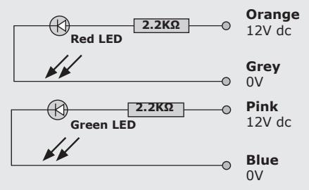

**NOTE! Only use** 12 Vdc for LED-lights.

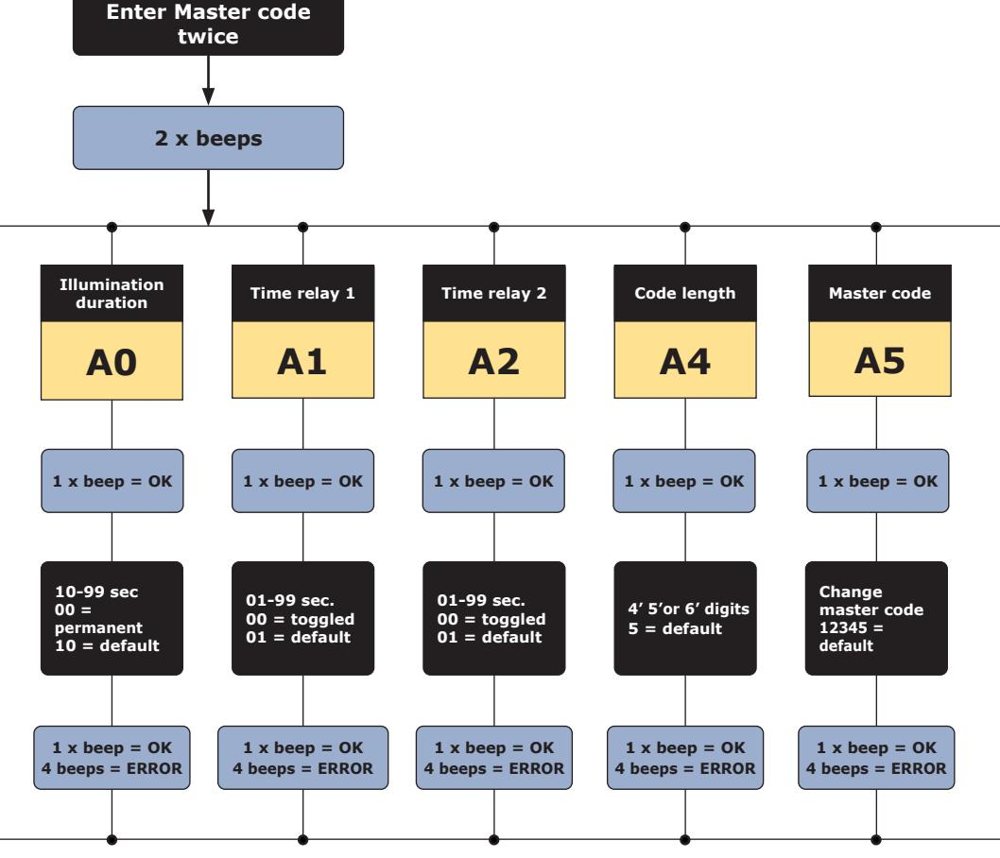

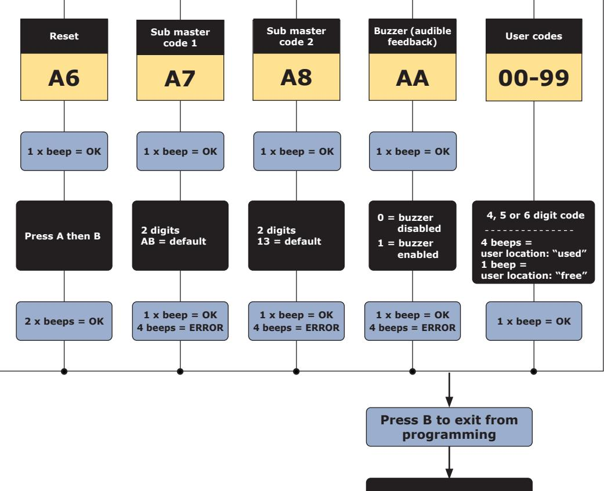

cdvigroup.com 9

**2 x beeps**

### *This spread sheet will help you keep track of the user codes programmed in the keypad*

| User location | Code |  | Name | User location |  | Code |                                         | Name | User location | Code |  | Name                         |         |  |  |  |
|------------------|------|--|------|------------------|--|------|-----------------------------------------|------|------------------|------|--|------------------------------|---------|--|--|--|
| 00               |      |  |      |                  |  |      | 34                                      |      |                  |      |  | 68                           |         |  |  |  |
| 01               |      |  |      |                  |  |      | 35                                      |      |                  |      |  | 69                           |         |  |  |  |
| 02               |      |  |      |                  |  |      | 36                                      |      |                  |      |  | 70                           |         |  |  |  |
| 03               |      |  |      |                  |  |      | 37                                      |      |                  |      |  | 71                           |         |  |  |  |
| 04               |      |  |      |                  |  |      | 38                                      |      |                  |      |  | 72                           |         |  |  |  |
| 05               |      |  |      |                  |  |      | 39                                      |      |                  |      |  | 73                           |         |  |  |  |
| 06               |      |  |      |                  |  |      | 40                                      |      |                  |      |  | 74                           |         |  |  |  |
| 07               |      |  |      |                  |  |      | 41                                      |      |                  |      |  | 75                           |         |  |  |  |
| 08               |      |  |      |                  |  |      | 42                                      |      |                  |      |  | 76                           |         |  |  |  |
| 09               |      |  |      |                  |  |      | 43                                      |      |                  |      |  | 77                           |         |  |  |  |
| 10               |      |  |      |                  |  |      | 44                                      |      |                  |      |  | 78                           |         |  |  |  |
| 11               |      |  |      |                  |  |      | 45                                      |      |                  |      |  | 79                           |         |  |  |  |
| 12               |      |  |      |                  |  |      | 46                                      |      |                  |      |  | 80                           |         |  |  |  |
| 13               |      |  |      |                  |  |      | 47                                      |      |                  |      |  | 81                           |         |  |  |  |
| 14               |      |  |      |                  |  |      | 48                                      |      |                  |      |  | 82                           |         |  |  |  |
| 15               |      |  |      |                  |  |      | 49                                      |      |                  |      |  | 83                           |         |  |  |  |
| 16               |      |  |      |                  |  |      | 50                                      |      |                  |      |  | 84                           |         |  |  |  |
| 17               |      |  |      |                  |  |      | 51                                      |      |                  |      |  | 85                           |         |  |  |  |
| 18               |      |  |      |                  |  |      | 52                                      |      |                  |      |  | 86                           |         |  |  |  |
| 19               |      |  |      |                  |  |      | 53                                      |      |                  |      |  | 87                           |         |  |  |  |
| 20               |      |  |      |                  |  |      | 54                                      |      |                  |      |  | 88                           |         |  |  |  |
| 21               |      |  |      |                  |  |      | 55                                      |      |                  |      |  | 89                           |         |  |  |  |
| 22               |      |  |      |                  |  |      | 56                                      |      |                  |      |  | 90                           |         |  |  |  |
| 23               |      |  |      |                  |  |      | 57                                      |      |                  |      |  | 91                           |         |  |  |  |
| 24               |      |  |      |                  |  |      | 58                                      |      |                  |      |  | 92                           |         |  |  |  |
| 25               |      |  |      |                  |  |      | 59                                      |      |                  |      |  | 93                           |         |  |  |  |
| 26               |      |  |      |                  |  |      | 60                                      |      |                  |      |  | 94                           |         |  |  |  |
| 27               |      |  |      |                  |  |      | 61                                      |      |                  |      |  | 95                           |         |  |  |  |
| 28               |      |  |      |                  |  |      | 62                                      |      |                  |      |  | 96                           |         |  |  |  |
| 29               |      |  |      |                  |  |      | 63                                      |      |                  |      |  | 97                           |         |  |  |  |
| 30               |      |  |      |                  |  |      | 64                                      |      |                  |      |  | 98                           |         |  |  |  |
| 31               |      |  |      |                  |  |      | 65                                      |      |                  |      |  | 99                           |         |  |  |  |
| 32               |      |  |      |                  |  |      | 66                                      |      |                  |      |  |                              |         |  |  |  |
| 33               |      |  |      |                  |  |      | 67                                      |      |                  |      |  |                              |         |  |  |  |
|                  |      |  |      |                  |  |      |                                         |      |                  |      |  |                              |         |  |  |  |
| Reminder         |      |  |      |                  |  |      | Relay 1 From user location 00 to 59. |      |                  |      |  | From user location 60 to 99. | Relay 2 |  |  |  |

### **6] LIMITED LIFETIME WARRANTY [EXTRACT]***

CDVI warrants this product to be free from defects in material and workmanship, when it has been installed in accordance with the manufacturer's instructions and has not been modified or tampered with. Only product recognized by CDVI to be defective should be returned under these warranty terms if accompanied by an RMA (Return Material Authorization Number) provided by CDVI. CDVI, at its option, shall repair or replace the defective product at CDVI premises or at any CDVI approved service center. This warranty does not cover any damage due to accident, misuse, abuse or negligence. This warranty is valid only if the product is registered, within 1 month from delivery to the final costumer. To obtain full details of this warranty and to register the product to commence the "Limited Lifetime Warranty", complete the enclosed registration card and return it, either by e-mail or post, to the relevant CDVI address or completion of the on line registration at www.cdvigroup.com. Repair or replacement of the defective product is the exclusive remedy. CDVI shall not be liable for any incidental or consequential damages arising from any defect in, or malfunction of, its product. In no event the entire liability can not exceed the purchase price of the product. The CDVI local country contact details can be found on line by visiting www.cdvigroup.com or on the back cover of the installation manual.

**DISCLAIMER OF WARRANTY:** EXCEPT AS STATED ABOVE, CDVI MAKES NO WARRANTIES, EITHER EXPRESS OR IMPLIED, AS TO ANY MATTER WHATSOEVER, INCLUDING THE CONDITION OF ITS PRODUCTS, THE TRANSPORTATION, THEIR MERCHANTABILITY OR FITNESS FOR ANY PARTICULAR PURPOSE.

| 7] NOTES |  |
|----------|--|
|          |  |
|          |  |
|          |  |
|          |  |
|          |  |
|          |  |
|          |  |
|          |  |
|          |  |
|          |  |
|          |  |
|          |  |
|          |  |
|          |  |
|          |  |
|          |  |
|          |  |
|          |  |
|          |  |
|          |  |
|          |  |
|          |  |

**Refer to Limited Lifetime Warranty conditions*

### **1] PRODUKTSPECIFIKATION**

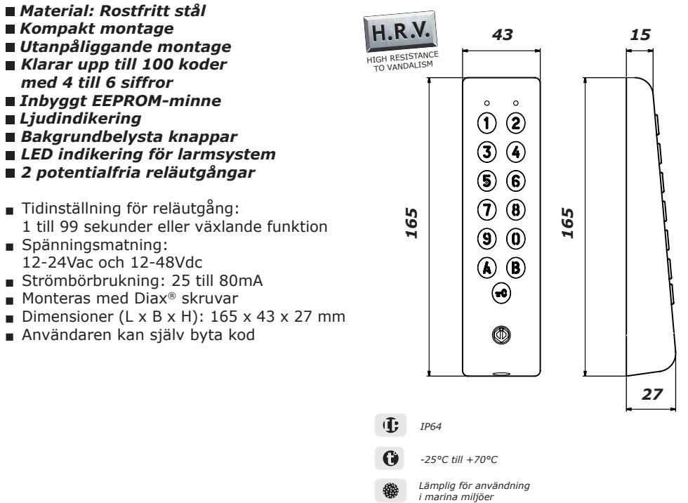

### **2] INFORMATION OCH REKOMMENDATIONER**

### **Rekommenderade nätaggregat**

- ADC335 (230Vac), BS60 (230Vac).
- Separat nätaggregat för tillkopplade enheter.

#### **Kablage**

Se till att isolera alla trådar som ej används.

### **Monteringsrekommendation**

**Montera** kodlåset på en plan yta för att förhindra vandalism och för att få bästa möjliga **montage**.

### **Säkerhets tips för koder**

- Av säkerhetsskäl bör den förinställda, standardiserade masterkoden ändras.
- Vid val av masterkod och användarkod, undvik sekventiella koder (ex: **3 4 5 6 7**).

### **Rekommenderad installation**

För att säkra systemet från strömspikar, glöm inte att montera varistorn parallellt med låset.

### **3] MONTERINGSSATS**

|               | Varistor 05D 680K | T20 Diax® nyckel | Diax® Monteringsskruv |
|---------------|----------------------|------------------|--------------------------|
| PROFIL100EINT | 1                    | 1                | 1                        |

### **4] MONTERING**

Kontrollera att monteringssatsen är komplett och att du förberett kablarna till Digicode® PROFIL100EINT kodlås innan monteringen påbörjas. Försäkra dig om att du har rätt verktyg tillgängliga (borr, skruvmejsel, måttstock mm) och följ sedan monteringsanvisningarna för PROFIL100EINT kodlås.

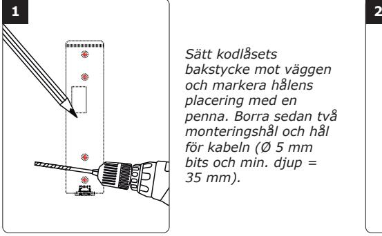

*Sätt kodlåsets bakstycke mot väggen och markera hålens placering med en penna. Borra sedan två monteringshål och hål för kabeln (Ø 5 mm bits och min. djup = 35 mm).*

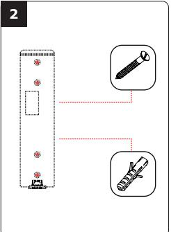

*Sätt plastpluggar i de borrade hålen. Placera kodlåsets bakstycke mot väggen och skruva fast.*

**(x2) (x2)**

*Trä kabeln från PROFIL100EINT genom kabelhålet i bakstycket. Kroka fast Digicode® kodlåset på bakstycket genom att föra det uppifrån och ner.*

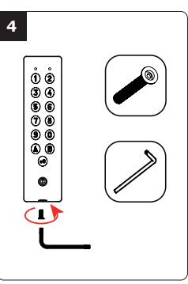

*Skruva fast Digicode® kodlåset med bifogad Diax® monteringsskruv M5x8 och T20 Diax® nyckeln.*

**(x2)**

**(x2)**

**PROFIL100EINT SE SE** Kodlås PROFIL100EINT

### **5] KOPPLINGSSCHEMA**

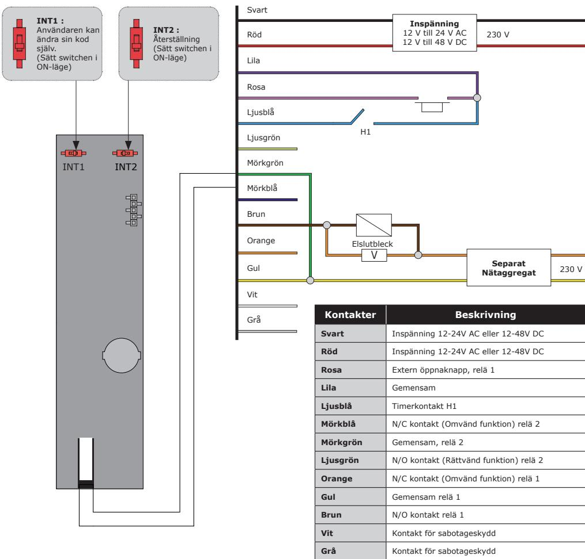

#### **Den här produkten levereras med varistor.**

Förse elslutblecket (elektromagneten) med varistor om det saknas. Om kodlåset styr mer än ett elslutbleck ska varje lås förses med en varistor. Varistorn kontrollerar den överspänning som produceras av magnetspolen – backspänningspikar. Det rekommenderas att använda en separat spänningskälla när man styr ett elektromagnetiskt lås.

### **SE SE PROFIL100EINT**  Kodlås PROFIL100EINT

### **Standard inställningar**

- Utan koder.
- Tidsinställd belysning : 10 sekunder.
- Reläslutningstid : 1 sekund.
- Kodlängd: 5 siffror.
- Masterkod: **1 2 3 4 5**.
- Tidsinställning för programmering: 120 sekunder.
- Undermasterkod:
	- Version med 1 relä (Relä 1) = **AB***.*
	- Version med 2 relän (Relä 2) = **13***.*

#### **Ljudsignal:**

- **1 kort pip signal** = *Kodlåset är*
### *spänningsatt.*

- **1 lång pipsignal** = *Data sparat i programmeringsläge eller dörr öppnas.*
- **2 korta pipsignaler** = *Åtkomst till eller lämna programmeringsläget.*
- **4 korta pipsignaler** = *Databehandlingsfel.*

### **Kodlängd:**

- Masterkoden och användarkoderna kan vara 4- till 6-siffriga.
- Alla knappar på knappsatsen kan användas för att programmera en kod**.**
- Ändras kodlängden till 4-siffrig blir även masterkoden 4-siffrig.
- Masterkoden **KAN INTE**
- användas som användarkod. - För att ta bort en specifik användarkod:

Ersätt den med **0 0 0 0 om kodlängden är 4-siffrig eller** Ersätt den med **0 0 0 0 0 om kodlängden är 5-siffrig eller** Ersätt den med **0 0 0 0 0 0 om kodlängden är 6-siffrig.**

**Dip INT2:** Total återställning.

**Dip INT1:** Användaren kan ändra sin kod själv.

### **A. Total återställning (masterkod och användarkoder)**

- **1. Knappa in masterkoden två gånger** (Masterkodens standardvärde: **1 2 3 4 5**). Två pipsignaler bekräftar att man är i programmeringsläget.
### **2. Knappa in A6 för att återställa masterkoden och användarkoderna.**

- En pipsignal hörs.
- Tryck på **A** och **B** för att bekräfta återställning av hela minnet.
- Vänta på två pipsignaler.
- Masterkoden återställs till sitt standardvärde ( **1 2 3 4 5** ) och alla användarkoder raderas.
- När återställningen är klar, återgår knappsatsen till standby-läge.

### **ELLER**

- **1. Slå av strömmen och sätt INT2 i ON-läge.**
	- **2. Slå på strömmen igen.**
- - **Vänta ungefär 3 sekunder**. - Två pipsignaler hörs som bekräftar att
- knappsatsen är återställd.
- Växla tillbaka dipswitch INT2.
- Masterkoden återställs till sitt standardvärde ( **1 2 3 4 5** ) och alla användarkoder raderas.

### **B. Ställ in kodlängden**

- **1. Knappa in masterkoden två gånger** (Masterkodens standardvärde: **1 2 3 4 5**). Två pipsignaler bekräftar att man är i programmeringsläget.
- **2. Knappa in A4 för att programmera kodlängden.**
- -En pipsignal hörs.
- -**Tryck på 4, 5 eller 6 för att ange kodlängd.**
- - En pipsignal bekräftar att kodlängden är programmerad.
	- **3. Tryck A5 för att ändra masterkoden.**
- En pipsignal hörs.
- Skriv in den nya 4, 5 eller 6-siffriga masterkoden
- En pipsignal bekräftar den nya masterkoden

### **4. Tryck B för att lämna programmeringsläget.**

 Två pipsignaler bekräftar att knapp satsen är standbyläge och redo att användas

### *4 pip indikerar ett databehandlingsfel.*

### **C. Byt masterkod**

**Masterkoden används endast till att komma in i programmeringsläget.**

- **1. Knappa in masterkoden två gånger** (Masterkodens standardvärde: **1 2 3 4 5**). Två pipsignaler bekräftar att man är i programmeringsläget.
	- **2. Tryck A5 för att ändra masterkoden.**
- En pipsignal hörs.
- Skriv in den nya 4, 5 eller 6-siffriga masterkoden
- En pipsignal bekräftar den nya masterkoden
- **3. Tryck B för att lämna programmeringsläget.**

 Två pipsignaler bekräftar att knapp satsen är i standbyläge och redo att användas

- **D. Lägg till, ändra eller ta bort en användarkod Kodplats 00 till 59 är reläutgång 1**
**Kodplats 60 till 99 är reläutgång 2**

- **1. Knappa in masterkoden två gånger** (Masterkodens standardvärde: **1 2 3 4 5**). Två pipsignaler bekräftar att man är i programmeringsläget.
- **2. Lägg till en användarkod Välj kodplats (00 till 99)** 
	- Skriv in den nya användarkoden
- En pipsignal bekräftar den nya användarkoden

### **3. Ändra en användarkod Knappa in kodplatsen**

- Fyra pipsignaler bekräftar att platsen är upptagen
- Skriv in den nya 4, 5 eller 6-siffriga användarkoden.
- En pipsignal bekräftar den nya användarkoden

### **4. Ta bort en användarkod Knappa in kodplatsen**

- Fyra pipsignaler bekräftar att platsen är upptagen
- Tryck **lika många 0 som kodlängden ( t.ex. 0 0 0 0 0 för 5-siffriga koder)**
- En pipsignal bekräftar användarkoden har raderats.

### *Notera:*

*Om användarkoden redan är programmerad eller densamma som masterkoden så hörs fyra pipsignaler. Tryck B för att gå ur programmeringen. Två pipsignaler bekräftar att knappsatsen är i standbyläge och redo att användas.*

### **E. Programmera tider**

**Här programmerar du tidsinställningen för reläutgångarna och bakgrunsbelysningen i knappsatsen**

- **1. Knappa in masterkoden två gånger** (Masterkodens standardvärde: **1 2 3 4 5**). Två pipsignaler bekräftar att man är i programmeringsläget.
- **2. Tryck A0 för att programmera bakgrundbelysningen på knappsatsen.**
- En pipsignal hörs.
- - **Skriv in tiden i sekunder med 2 siffror - 10 för 10 sekunder till 99 för 99 sekunder.**

 Bakgrundsbelysningen lyser 10 sekunder efter sista knapptryckningen eller släcks efter det en giltig kod matats in. 

- Tryck **00** för konstant bakgrundsbelysning.
- En pipsignal bekräftar den nya tiden.
- **3. Tryck A1 för att programmera relä 1. (Tryck A2 för relä 2).**
- En pipsignal hörs.
- - **Skriv in tiden i sekunder med 2 siffror - 01 för 1 sekund upp till 99 för 99 sekunder**
- Tryck **00** för växlande funktion.
- En pipsignal bekräftar den nya tiden.

#### **4. Tryck B för att lämna programmeringsläget.**

Två pipsignaler bekräftar att knapp satsen är i standbyläge och redo att användas

*4 pip indikerar ett databehandlingsfel.*

### **F. Återställ masterkod Ändra dipswitch INT2 i standby läge.**

- - **Vänta 1 sekund och växla sedan tillbaks dipswitchen.**
	- En pipsignal hörs.
- Masterkoden har nu återställts till standardvärde, 1 2 3 4 5 för en 5-siffrig kodlängd och 1 2 3 4 för en 4-siffrig kodlängd.
- **G. Låt användar byta sin egen kod För att tillåta en användare att byta sin egen kod, sätt en växla INT1 till ON. (för att avaktivera, växla tillbaka INT1).**
	- **1. Skriv in den gamla koden.**  Reläet växlar och en pipsignal hörs.
- **2. Skriv in den 2-siffriga under masterkoden. (standard AB).** En pipsignal bekräftar att du kan ändra koden.
- **3. Skriv in den nya koden.**  Två pipsignalen bekräftar ändring.
	- **4. Kontrollera att koden fungerar.**

### **H. Byt undermasterkod.**

**Undermasterkoden tillåter användarna att ändra sin egen kod, utan att komma in i programmerinsläget. Av säkerhetsskäl bör du byta undermasterkod med jämna mellanrum.**

- **1. Knappa in masterkoden två gånger** (Masterkodens standardvärde: **1 2 3 4 5**). Två pipsignaler bekräftar att man är i programmeringsläget.
### **2. Tryck A7 för att programmera under masterkod**

- En pipsignal hörs.
- Skriv in en ny 2-siffrig undermasterkod.
- En pipsignal bekräftar den nya under masterkoden
- **3. Tryck B för att lämna programmeringsläget.**

Två pipsignaler bekräftar att knapp satsen är i standbyläge och redo att användas

### **I. Ljudindikering**

**När du skriver in en giltig kod så får du en ljudindikering, här kan du aktivera ljudindikering vid varje knapptryckning.**

### **1. Knappa in masterkoden två gånger**

(Masterkodens standardvärde: **1 2 3 4 5**). Två pipsignaler bekräftar att man är i programmeringsläget.

### **2. Press AA.**

- En pipsignal hörs.
- Tryck **0** för att inaktivera ljudindikering vid knapptryckningar.
- Tryck **1** för att aktivera ljudindikering vid knapptryckningar.
- En pipsignal bekräftar den nya ändringen.

### **3. Tryck B för att lämna programmeringsläget.**

 Två pipsignaler bekräftar att knapp satsen är i standbyläge och redo att användas

### **J. Använd lysdioderna.**

- - **Den röda och gröna lysdioden är till för indikering om t.ex. larmstatus.**
- Koppla in enligt följande**:**

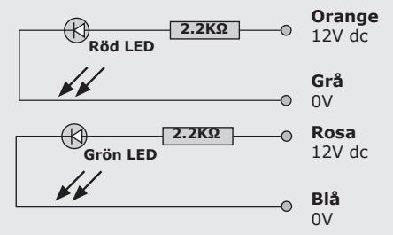

**OBS!** Använd endast 12 Vdc till LED-lamporna.

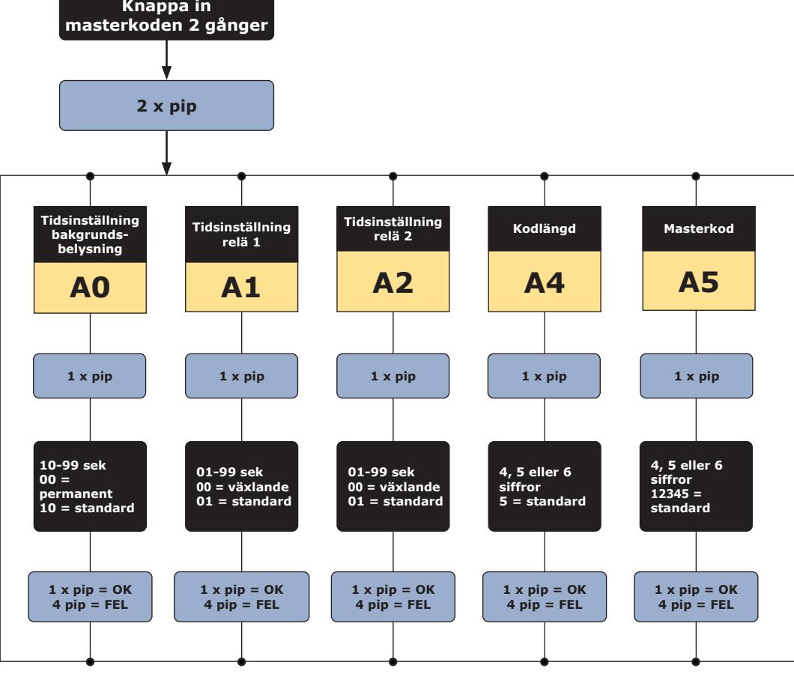

Kodlås PROFIL100EINT

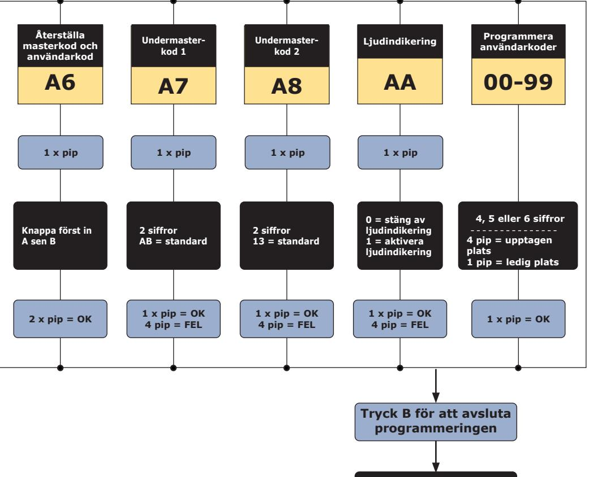

### *Anteckningar - Lista över användarkoder*

| Plats | Kod | Namn | Plats | Kod Namn |  | Plats | Kod | Namn |
|-------|-----|------|-------|-------------|--|-------|-----|------|
| 00    |     |      | 34    |             |  | 68    |     |      |
| 01    |     |      | 35    |             |  | 69    |     |      |
| 02    |     |      | 36    |             |  | 70    |     |      |
| 03    |     |      | 37    |             |  | 71    |     |      |
| 04    |     |      | 38    |             |  | 72    |     |      |
| 05    |     |      | 39    |             |  | 73    |     |      |
| 06    |     |      | 40    |             |  | 74    |     |      |
| 07    |     |      | 41    |             |  | 75    |     |      |
| 08    |     |      | 42    |             |  | 76    |     |      |
| 09    |     |      | 43    |             |  | 77    |     |      |
| 10    |     |      | 44    |             |  | 78    |     |      |
| 11    |     |      | 45    |             |  | 79    |     |      |
| 12    |     |      | 46    |             |  | 80    |     |      |
| 13    |     |      | 47    |             |  | 81    |     |      |
| 14    |     |      | 48    |             |  | 82    |     |      |
| 15    |     |      | 49    |             |  | 83    |     |      |
| 16    |     |      | 50    |             |  | 84    |     |      |
| 17    |     |      | 51    |             |  | 85    |     |      |
| 18    |     |      | 52    |             |  | 86    |     |      |
| 19    |     |      | 53    |             |  | 87    |     |      |
| 20    |     |      | 54    |             |  | 88    |     |      |
| 21    |     |      | 55    |             |  | 89    |     |      |
| 22    |     |      | 56    |             |  | 90    |     |      |
| 23    |     |      | 57    |             |  | 91    |     |      |
| 24    |     |      | 58    |             |  | 92    |     |      |
| 25    |     |      | 59    |             |  | 93    |     |      |
| 26    |     |      | 60    |             |  | 94    |     |      |
| 27    |     |      | 61    |             |  | 95    |     |      |
| 28    |     |      | 62    |             |  | 96    |     |      |
| 29    |     |      | 63    |             |  | 97    |     |      |
| 30    |     |      | 64    |             |  | 98    |     |      |
| 31    |     |      | 65    |             |  | 99    |     |      |
| 32    |     |      | 66    |             |  |       |     |      |
| 33    |     |      | 67    |             |  |       |     |      |

| Reläutgång 1 PM Plats 00 till plats 59. | Reläutgång 2 Plats 60 till plats 99. |
|-----------------------------------------------|-----------------------------------------|
|-----------------------------------------------|-----------------------------------------|

### **6] BEGRÄNSAD LIVSTIDSGARANTI [UTDRAG]***

CDVI garanterar att denna produkt är fri från fel i material och utförande, när den är installerad i enlighet med tillverkarens anvisningar och inte har ändrats eller manipulerats. Endast produkter godkända från CDVI som är deffekta, kan returneras enligt dessa villkor. Produkten skall skickas med ett RMA nummer (returnummer) som tillhandahålls av CDVI. CDVI skall efter eget val, reparera eller ersätta den defekta produkten på CDVI egen fabrik, eller enligt CDVI auktoriserat servicecenter. Denna garanti täcker inte skador på grund av olyckshändelse, felaktig användning, missbruk eller försummelse. Denna garanti är enbart giltigt om produkten är registrerad senast 1 månad efter leverans till slutkund. För att få fullständig information om denna garanti, och att registrera produkten för att påbörja "begränsad livstids garanti" fyll i det bifogade registreringsbeviset och återsänd detta, antingen via post eller e-mail till närmaste CDVI kontor, eller registrera online på www.cdvigroup.com. Reparation eller utbyte av den defekta produkten är de två alternativ som finns. CDVI ansvarar inte för oförutsedda skador eller följdskador. Inte under några som helst omständigheter kan skulden överstiga det totala inköpspriset för produkten. Du kan hitta ditt lokala CDVI kontor genom att besöka www.cdvigroup.se eller på baksidan av installationsmanualen.

**GARANTIFRISKRIVNING:** Med undantag från ovanstående, ger CDVI inga garantier, varken uttryckligt eller underförstått, oavsett grund, vilket inkluderar produktens skick, transport, dess säljbarhet eller lämplighet för ett särskilt ändamål.

### **7] ANTECKNINGAR**

| 40 - 6 0 0 - 0 - 1 - 1 - 1 - 1 - 1 - 1 - 1 - 1 - 1 - 1 - 1 - 1 - 1 - 1 - 1 - 1 - 1 - 1 - 1 - 1 - 1 - 1 - 1 - 1 - 1 - 1 - 1 - 1 - 1 - 1 - 1 - 1 - 1 - 1 - 1 - 1 - 1 - 1 - 1 - 1 |  |  |
|--------------------------------------------------------------------------------------------------------------------------------------------------------------------------------|--|--|

**Se fullständiga villkoren för "limited lifetime warranty" i sin helhet på hemsidan www.cdvigroup.com. Vid tveksamheter och tvist angående tolkning har den engelska originaltexten företräde.*

### **1] PRODUKTSPECIFIKATION**

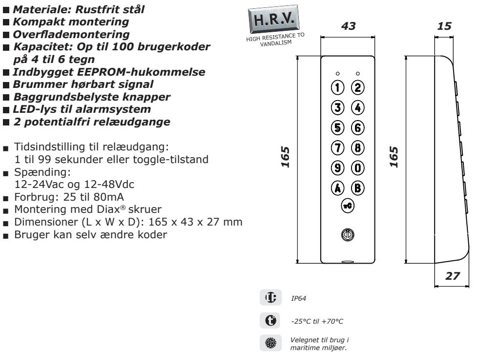

### **2] INFORMATION OG ANBEFALINGER**

### **Anbefalede strømforsyninger**

- ADC335 (230V input), BS60 (230V input).
- Separate strømforsyninger til tilkoblede enheder.

### **Kabelføring**

Sørg for, at alle kabler, som ikke er i brug, er isolerede.

### **Monteringsanbefalinger**

Monter kodelåsen på en plan overflade for at undgå vandalisme og sikre den bedst mulige montering.

### **Sikkerhedstips.**

Af hensyn til sikkerheden bør masterkoden fra fabrikken ændres. Undgå simple master- og brugerkoder (ex : **3 4 5 6 7**).

### **Beskyttelse mod EMF-stråling**

For at sikre systemet mod elektromagnetiske felter er det vigtigt at montere varistoren parallelt med låseenheden.

|               | Varistor | T20 Diax® nøgle | Diax® skrue (M5x8) |
|---------------|----------|-----------------|--------------------|
| PROFIL100EINT | 1        | 1               | 1                  |

### **4] MONTERINGSVEJLEDNING**

Når du har sikret dig, at monteringskittet er komplet, og du har klargjort kablerne til Digicode® PROFIL100EINT-kodelåsen, kan du fortsætte og montere produktet. Sørg for, at du har det nødvendige værktøj (bor, skruetrækker og et målebånd), og følg monteringsvejledningen til PROFIL100EINT.

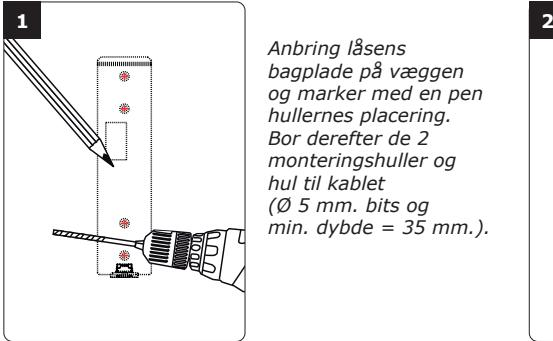

*Anbring låsens bagplade på væggen og marker med en pen hullernes placering. Bor derefter de 2 monteringshuller og hul til kablet (Ø 5 mm. bits og min. dybde = 35 mm.).*

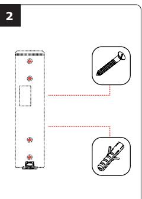

*Før kablet fra PROFIL100EINT gennem kabelhullet i bagdækslet. Sæt Digicode®-kodelåsen fast på bagdækslet, begyndende oppefra.* 

**(x2) (x2)**

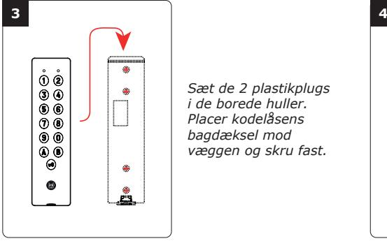

*Sæt de 2 plastikplugs i de borede huller. Placer kodelåsens bagdæksel mod væggen og skru fast.*

*Skru Digicode®kodelåsen fast med den medfølgende Diax®monteringsskrue M5x8 og T20 Diax®nøglen.*

**(x2) (x2)**

**PROFIL100EINT DK DK** Kodelås PROFIL100EINT

### **5] KOBLINGSSKEMA**

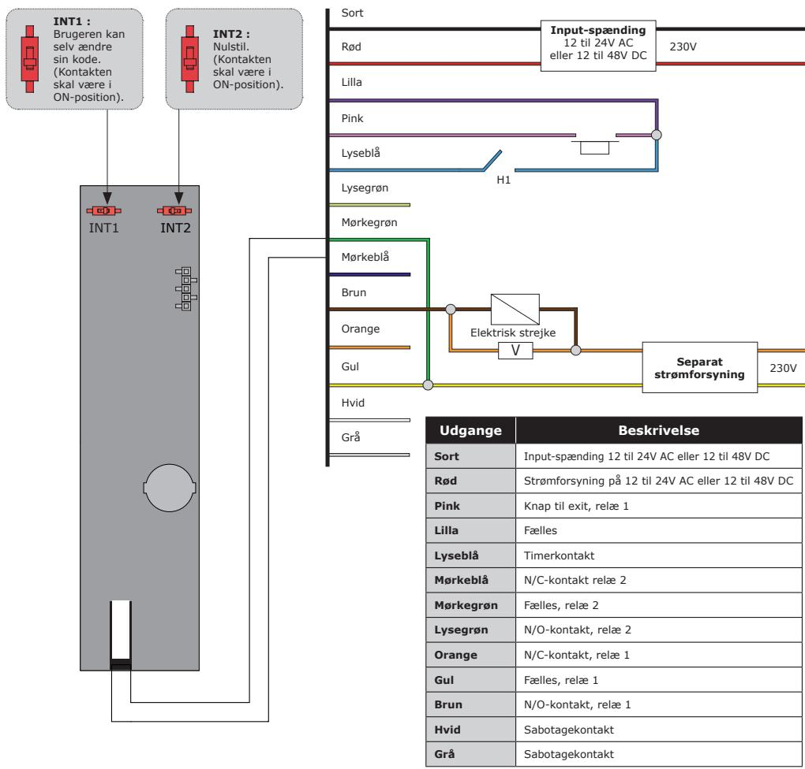

#### **Dette produkt leveres med en varistor.**

Varistoren installeres direkte på terminalerne på den strejke (magnetlås, motor, etc.), som enheden styrer. Hvis enheden styrer flere strejker, skal hver af dem være udstyret med en varistor. Varistoren forhindrer spændingsstød, der er forårsaget af strejken. Bruger man en magnetlås af typen "shear lock", skal den forbindes til en separat strømforsyning fra PROFIL100EINT!

### **DK DK PROFIL100EINT**  Kodelås PROFIL100EINT

### **Standardindstillinger**

- Uden koder.
- Belysningstid: 10 sekunder.
- Relæ-frigivelsestid: 1 sekund.
- Kodelængde: 5 cifre.
- Masterkode: **1 2 3 4 5.**
- Programmeringstid: 120 sekunder.
- Kodelængde for undermasterkoder:
- *Version med 1 relæ (Gruppe 1) = AB,*
- *Version med 2 relæer (Gruppe 2) = 13.*
- 1 bip udsendes, når der tændes for enheden.

#### **Lydsignaler:**

- Summeren udsender forskellige lydsignaler.

- **1 kort bip**: Kodelås er tilsluttet strøm.
- **1 langt bip**: Data behandles, eller døren åbnes.
- **2 korte bip**: Forlad eller gå i programmeringstilstand.
- **4 korte bip**: Fejl i databehandling.

#### **Kodelængde**

- Masterkoden og brugerkoderne kan have en længde på 4 til 6 cifre.
- Alle tastaturtasterne kan bruges til at programmere en kode.
- Masterkoden KAN IKKE bruges som en brugerkode.
- Sådan slettes en specifik brugerkode:

Udskift koden med **0 0 0 0**, hvis kodelængden er 4-cifret, erstat den med **0 0 0 0 0**, hvis koden er 5-cifret, eller erstat den med **0 0 0 0 0 0**, hvis koden er 6- cifret.

#### **Dip INT2:**

Nulstil masterkode og brugerkoder.

### **Dip INT1:**

Ændring af brugerens individuelle kode.

- **A. Nulstil masterkode og brugerkoder**
### **1. Indtast masterkoden 2 gange**

(**1 2 3 4 5**, som er masterkodens standardværdi). 2 bip bekræfter, at der nu er adgang til programmeringstilstand.

### **2. Tast A6 for at nulstille masterkoden og brugerkoder.**

- Et bip udsendes.
- Tryk på **A** og **B** for at bekræfte nulstilling af al hukommelse på tastaturet.
- Vent på 2 bip.
- Masterkoden gendannes til standard værdien **1 2 3 4 5**, og alle brugerkoder slettes fra tastaturet.
- Når nulstillingen er afsluttet, vender tastaturet tilbage til standby-tilstand.

### **ELLER**

### **1. Afbryd strømmen. Sæt INT2 på ON.**

- **2. Tilslut strømmen igen.**
- Vent cirka 3 sekunder.
- 2 bip bekræfter nulstilling af tastaturet.
- Sæt INT2 tilbage.

- Masterkoden gendannes til dens standard værdi **1 2 3 4 5**, og alle brugerkoder slettes fra tastaturet.
### **B. Indstil kodelængde**

#### **1. Indtast masterkoden to gange.**

(**1 2 3 4 5**, masterkodestandardværdi). 2 bip bekræfter, at der nu er adgang til programmeringstilstand.

### **2. Tast A4 for at programmere kodelængden.**

- Der lyder nu 1 bip.
- Tryk på **4, 5** eller **6** for at angive kodelængden.
- - 1 bip bekræfter programmeringen af kodelængden.

#### **3. Tast A5 for at ændre masterkoden.**

- Der lyder 1 bip.
- Indtast den nye 4, 5 eller 6-cifrede masterkode.
- 1 bip bekræfter programmeringen af den nye masterkode.

### **4. Tryk på B for at afslutte programmeringstilstand.**

2 bip bekræfter, at tastaturet er i standby tilstand.

**4 bip indikerer fejl i databehandlingen.** 

## **C. Skift masterkode**

**Masterkoden bruges kun for at få adgang til programmeringstilstand.**

### **1. Indtast masterkoden 2 gange**

(**1 2 3 4 5** standardværdi masterkode). 2 bip indikerer, at tastaturet nu er i programmeringstilstand.

### **2. Tast A5 for at ændre masterkoden.**

- Der lyder 1 bip.
- - Indtast den nye 4, 5 eller 6-cifrede masterkode.
- - 1 bip bekræfter, at masterkoden er programmeret.
- **3. Tryk på B for at forlade programmeringstilstand.** 2 bip bekræfter, at tastaturet er i standby-tilstand.

### **D. Tilføj, skift eller slet en brugerkode**

**Brugerplacering 00 til 59 er relæ 1 Brugerplacering 60 til 99 er relæ 2**

### **1. Indtast masterkoden 2 gange.**

(**1 2 3 4 5** er masterkodens standardværdi). 2 bip bekræfter, at man er i programmerings tilstand.

### **2. For at tilføje en brugerkode:**

- Indtast brugerplacering (fra 00 til 99).
- 4 bip indikerer, at brugerplaceringen er optaget.
- Indtast den 4, 5 eller 6-cifrede brugerkode.

#### **3. For at ændre en brugerkode:**

- Indtast brugerplacering.
- 4 bip indikerer, at brugerplaceringen allerede er programmeret.
- Indtast en ny 4, 5 eller 6-cifret kode.
- 1 bip bekræfter den nye brugerkode.

### **4. For at slette en brugerkode:**

- Indtast brugerplacering.
- Der lyder 4 bip.
- Tryk på **0** så mange gange, som der er cifre i brugerkoden.
- ( ex. **0 0 0 0 0** for at slette en 5-cifret kode)
- 1 bip bekræfter, at brugerkoden er slettet.

### *Bemærk:*

*Hvis en brugerkode allerede er programmeret eller er identisk med masterkoden, lyder der 4 bip. Tryk på B for at forlade programmeringstilstanden. 2 bip bekræfter, at tastaturet er i standby-tilstand.* 

### **E. Tidsindstilling Her programmerer du belysningstid og relæaktiveringstid.**

### **1. Indtast masterkoden 2 gange.**

(**1 2 3 4 5** er standardmasterkoden). 2 bip indikerer, at man er i programmeringstilstand.

#### **2. Tast A0 for at programmere tastaturets baggrundsbelysning.**

- 1 bip udsendes.
- Indtast tiden i sekunder med 2 cifre **10 for 10 sekunder op til 99 for 99 sekunder.** Baggrundsbelysningen dæmpes 10 sekunder efter det sidste tastetryk eller slukkes efter indtastning af en gyldig kode.
- Tast **00** for permanent belysning.
- 1 bip validerer tiden.

#### **3. Tast A1 for at programmere aktiveringstiden for relæ 1 (Tast A2 for relæ 2).**

- Der udsendes 1 bip.
- Indtast tiden i sekunder med 2 cifre **01 for 1 sekund op til 99 for 99 sekunder**.
- Tast **00** for at ændre funktion.
- 1 bip validerer tiden.

#### **4. Tryk på B for at forlade programmeringstilstand.**

2 bip bekræfter, at tastaturet er i standby-tilstand.

#### **4 bip indikerer fejl i databehandling.**

### **F. Nulstil masterkode INT2-kontakten sættes på standbytilstand.**

- Vent 1 sekund, og sæt derefter
- INT2-kontakten tilbage.
	- Der udsendes 1 bip.
	- Masterkoden gendannes til standardværdien,
	- **1 2 3 4 5** i 5-cifret og **1 2 3 4** i 4-cifret kode.

#### **G. Lad en bruger ændre kode For at autorisere en bruger til at ændre sin egen kode sæt INT1-kontakten på ON. (for at deaktivere sæt den tilbage).**

- **1. Indtast den gamle brugerkode.** Relæet aktiveres, og der udsendes 1 bip.
- **2. Indtast undermasterkoden med 2 cifre (standardkode AB).**

Der udsendes 1 bip for at autorisere ændringen.

- **3. Indtast den nye brugerkode.** Der udsendes 2 bip for at bekræfte den nye kode.
- **4. Kontroller den nye brugerkode for at være sikker på ændringen.**
- **H. Indstilling af en undermasterkode Undermasterkoden tillader brugeren at ændre sin egen kode uden at gå i programmeringstilstand. Af sikkerhedsmæssige årsager skal koden ændres med jævne mellemrum. Denne funktion gør det lettere og hurtigere at ændre sin kode.**
- **1. Indtast masterkoden 2 gange** (**1 2 3 4 5** er standardkode). Der udsendes 2 bip for at få adgang til programmerings tilstand.
- **2. Tast A7 for at programmere en undermasterkode.**
- Der udsendes 1 bip.
- Indtast den nye 2-cifrede undermasterkode.
- 1 bip bekræfter programmering af under masterkoden.
- **3. Tryk på B for at forlade programmeringstilstand.** 2 bip bekræfter, at tastaturet er i standby-tilstand.

### **I. Hørbar feedback**

**Lydsignalet er aktiveret i programmeringstilstand, og når en gyldig kode indtastes. For at aktivere hørbar feedback ved hvert tryk på en tast:** 

### **1. Indtast masterkoden 2 gange**

(**1 2 3 4 5** er standardværdi). Der udsendes 2 bip for at få adgang til i programmerings tilstand.

- **2. Tast AA.**
- Der udsendes 1 bip.
- Tryk på **0** for at deaktivere lydsignal ved tastetryk.
- Tryk på **1** for at aktivere lydsignal ved tastetryk.
- 1 bip bekræfter den nye indstilling.

#### **3. Tryk på B for at forlade programmeringstilstand.** Der udsendes 2 bip for at bekræfte,

at tastaturet er i standby-tilstand.

**J. Brug af de røde og grønne LED'er:** - De røde og grønne LED'er er designet til at modtage 12V DC (indbyggede modstande). - De er tilsluttet som følger:

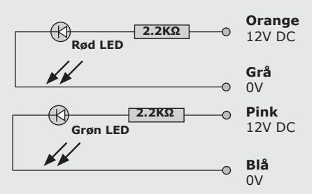

**VIGTIGT! Brug kun** 12V DC til LED-lys.

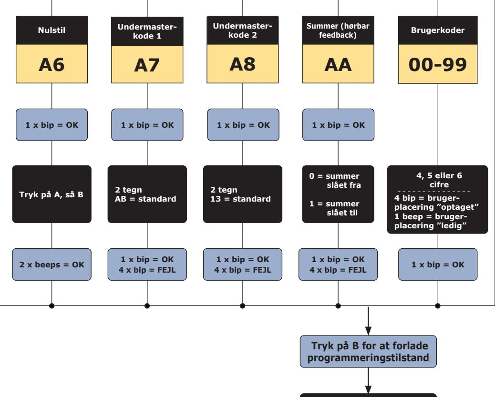

### *Med skemaet her kan du holde styr på de brugerkoder, der er programmeret på tastaturet.*

| Bruger placering                                                                             |  |  | Kode |  |  | Navn |  | Bruger placering |  |  | Kode |  | Navn | Bruger placering |  | Kode |  | Navn |
|-------------------------------------------------------------------------------------------------|--|--|------|--|--|------|--|---------------------|--|--|------|--|------|---------------------|--|------|--|------|
| 00                                                                                              |  |  |      |  |  |      |  | 34                  |  |  |      |  |      | 68                  |  |      |  |      |
| 01                                                                                              |  |  |      |  |  |      |  | 35                  |  |  |      |  |      | 69                  |  |      |  |      |
| 02                                                                                              |  |  |      |  |  |      |  | 36                  |  |  |      |  |      | 70                  |  |      |  |      |
| 03                                                                                              |  |  |      |  |  |      |  | 37                  |  |  |      |  |      | 71                  |  |      |  |      |
| 04                                                                                              |  |  |      |  |  |      |  | 38                  |  |  |      |  |      | 72                  |  |      |  |      |
| 05                                                                                              |  |  |      |  |  |      |  | 39                  |  |  |      |  |      | 73                  |  |      |  |      |
| 06                                                                                              |  |  |      |  |  |      |  | 40                  |  |  |      |  |      | 74                  |  |      |  |      |
| 07                                                                                              |  |  |      |  |  |      |  | 41                  |  |  |      |  |      | 75                  |  |      |  |      |
| 08                                                                                              |  |  |      |  |  |      |  | 42                  |  |  |      |  |      | 76                  |  |      |  |      |
| 09                                                                                              |  |  |      |  |  |      |  | 43                  |  |  |      |  |      | 77                  |  |      |  |      |
| 10                                                                                              |  |  |      |  |  |      |  | 44                  |  |  |      |  |      | 78                  |  |      |  |      |
| 11                                                                                              |  |  |      |  |  |      |  | 45                  |  |  |      |  |      | 79                  |  |      |  |      |
| 12                                                                                              |  |  |      |  |  |      |  | 46                  |  |  |      |  |      | 80                  |  |      |  |      |
| 13                                                                                              |  |  |      |  |  |      |  | 47                  |  |  |      |  |      | 81                  |  |      |  |      |
| 14                                                                                              |  |  |      |  |  |      |  | 48                  |  |  |      |  |      | 82                  |  |      |  |      |
| 15                                                                                              |  |  |      |  |  |      |  | 49                  |  |  |      |  |      | 83                  |  |      |  |      |
| 16                                                                                              |  |  |      |  |  |      |  | 50                  |  |  |      |  |      | 84                  |  |      |  |      |
| 17                                                                                              |  |  |      |  |  |      |  | 51                  |  |  |      |  |      | 85                  |  |      |  |      |
| 18                                                                                              |  |  |      |  |  |      |  | 52                  |  |  |      |  |      | 86                  |  |      |  |      |
| 19                                                                                              |  |  |      |  |  |      |  | 53                  |  |  |      |  |      | 87                  |  |      |  |      |
| 20                                                                                              |  |  |      |  |  |      |  | 54                  |  |  |      |  |      | 88                  |  |      |  |      |
| 21                                                                                              |  |  |      |  |  |      |  | 55                  |  |  |      |  |      | 89                  |  |      |  |      |
| 22                                                                                              |  |  |      |  |  |      |  | 56                  |  |  |      |  |      | 90                  |  |      |  |      |
| 23                                                                                              |  |  |      |  |  |      |  | 57                  |  |  |      |  |      | 91                  |  |      |  |      |
| 24                                                                                              |  |  |      |  |  |      |  | 58                  |  |  |      |  |      | 92                  |  |      |  |      |
| 25                                                                                              |  |  |      |  |  |      |  | 59                  |  |  |      |  |      | 93                  |  |      |  |      |
| 26                                                                                              |  |  |      |  |  |      |  | 60                  |  |  |      |  |      | 94                  |  |      |  |      |
| 27                                                                                              |  |  |      |  |  |      |  | 61                  |  |  |      |  |      | 95                  |  |      |  |      |
| 28                                                                                              |  |  |      |  |  |      |  | 62                  |  |  |      |  |      | 96                  |  |      |  |      |
| 29                                                                                              |  |  |      |  |  |      |  | 63                  |  |  |      |  |      | 97                  |  |      |  |      |
| 30                                                                                              |  |  |      |  |  |      |  | 64                  |  |  |      |  |      | 98                  |  |      |  |      |
| 31                                                                                              |  |  |      |  |  |      |  | 65                  |  |  |      |  |      | 99                  |  |      |  |      |
| 32                                                                                              |  |  |      |  |  |      |  | 66                  |  |  |      |  |      |                     |  |      |  |      |
| 33                                                                                              |  |  |      |  |  |      |  | 67                  |  |  |      |  |      |                     |  |      |  |      |
|                                                                                                 |  |  |      |  |  |      |  |                     |  |  |      |  |      |                     |  |      |  |      |
| Relæ 1 Relæ 2 Bemærk: Fra brugerplacering 00 til 59. Fra brugerplacering 60 til 99. |  |  |      |  |  |      |  |                     |  |  |      |  |      |                     |  |      |  |      |

### **6] BEGRÆNSET LEVETIDSGARANTI [UDDRAG]***

CDVI garanterer, at dette produkt er fri for defekter i materiale og udførelse, når det er installeret i overensstemmelse med producentens instruktioner og ikke er blevet ændret eller manipuleret. Kun produkter godkendt af CDVI, som er defekte, kan returneres under disse garantibetingelser. Produktet skal sendes med et RMA-nummer (Return Material Authorization Number) leveret af CDVI. CDVI skal efter eget valg reparere eller erstatte det defekte produkt på CDVIs egen fabrik eller et CDVI-godkendt servicecenter. Denne garanti dækker ikke skader, der skyldes en ulykke, forkert brug, misbrug eller forsømmelse. Denne garanti er kun gyldig, hvis produktet er registreret senest en måned efter levering til slutkunden. For fuldstændig information om denne garanti og for at registrere produktet for at udløse den «begrænsede levetidsgaranti», skal du udfylde det vedlagte registreringsbevis og returnere det, enten via e-mail eller post, til det nærmeste CDVI-kontor eller registrere produktet online på www.cdvigroup.com. Reparation eller ombytning af det defekte produkt er de eneste to alternativer, der findes. CDVI er ikke ansvarlig for nogen skader eller følgeskader. Under ingen omstændigheder kan den samlede gæld overstige produktets købspris. Du kan finde dit lokale CDVI-kontor online ved at besøge www.cdvigroup.com eller på bagsiden af installationshåndbogen.

**GARANTI-ANSVARSFRASKRIVELSE:** Med undtagelse af det ovenfor anførte giver CDVI ingen garantier, hverken udtrykkelige eller underforståede, og uanset hvilken grund, hvad enten det drejer sig om produktets tilstand, transport, salgbarhed eller egnethed til et bestemt formål.

| 7] NOTER |  |
|----------|--|
|          |  |
|          |  |
|          |  |
|          |  |
|          |  |
|          |  |
|          |  |
|          |  |
|          |  |
|          |  |
|          |  |
|          |  |
|          |  |
|          |  |
|          |  |
|          |  |
|          |  |
|          |  |
|          |  |
|          |  |
|          |  |

**Se betingelser for begrænset levetidsgaranti*

**Extranet :** CDVI_IM PROFIL100EINT CMYK A5 EN-SE-DK 01

**CDVI Group** FRANCE (Headquarters) Phone: +33 (0) 1 48 91 01 02

**CDVI FRANCE + EXPORT** +33 (0) 1 48 91 01 02 www.cdvi.com

**CDVI AMERICAS [CANADA - USA]** +1 (450) 682 7945 www.cdvi.ca

#### **CDVI BENELUX [BELGIUM - NETHERLANDS - LUXEMBOURG]**

+32 (0) 56 73 93 00 www.cdvibenelux.com

**CDVI TAIWAN** +886 (0) 42471 2188 www.cdvichina.cn

**CDVI SUISSE** +41 (0) 21 882 18 41 www.cdvi.ch

**CDVI CHINA** 

+86 (0) 10 84606132/82 www.cdvichina.cn

**CDVI IBÉRICA [SPAIN - PORTUGAL]** +34 (0) 935 390 966

www.cdviberica.com **CDVI ITALIA** +39 (0) 321 90 573 - www.cdvi.it

**CDVI MAROC** +212 (0) 5 22 48 09 40 www.cdvi.ma

**CDVI NORDICS [SWEDEN - DENMARK - NORWAY - FINLAND]** +46 (0) 31 760 19 30

www.cdvi.se

**CDVI UK [UNITED KINGDOM - IRELAND]** +44 (0) 1628 531300 www.cdvi.co.uk

**CDVI POLSKA** +48 (0) 12 659 23 44 www.cdvi.com.pl

*All the information contained within this document (pictures, drawings, features, specifications and dimensions)could be perceptibly different and can be changed without prior notice.*

### **www.cdvigroup.com**