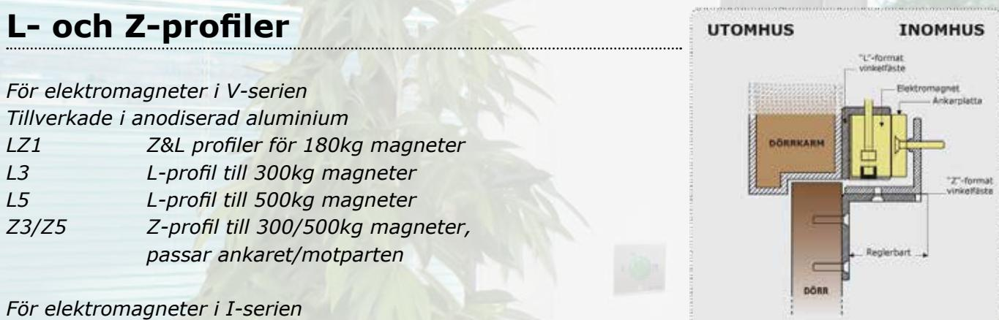
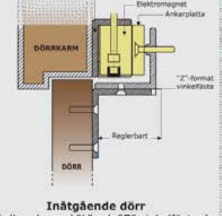

# MONTERINGSTILLBEHÖR ELEKTROMAGNETER

*The installer's choice*  **cdvi.se**

## **MONTERINGSTILLBEHÖR TILL ELEKTROMAGNETER**

*Tillverkade i epoxi lackerat stål*

| ESZ    | Z-profiler för 400 och 500 magneters ankarplatta |
|--------|--------------------------------------------------|
| ESL400 | L-profil till 400kg magneter                     |
| ESL500 | L-profil till 500kg magneter                     |

### **U-profiler och förstärkningsplattor**

| UBKU | U-profil för montering av ankare på glasdörrar,  |
|------|--------------------------------------------------|
|      | 185 x 62 x 33,5mm. Max glastjocklek 11 mm        |
| UBKP | U-profil för montering av magnet på glasdörrar,  |
|      | 266x 62 x 33,5mm. Max glastjocklek 11 mm         |
| AMA3 | Monteringsplatta för ankare till 300kg magneter, |
|      | längd 188mm                                      |
| AMA5 | Monteringsplatta för ankare till 500kg magneter, |
|      | längd 188mm                                      |

**CDVI** Sweden AB Datavägen 12B 43632 ASKIM (GÖTEBORG)

Tel: +46 (0)31 760 19 30

*cdvigroup.com cdvi.se*