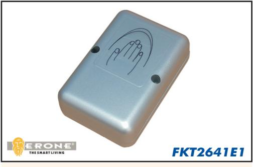
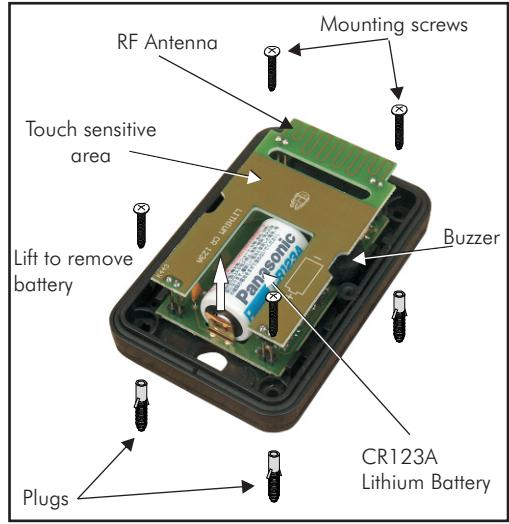

# **KEYFREE TRANSMITTER**

## **Use and installation manual**

*Thank you for choosing this product . You are recommended to read this manual carefully before installing this product.*

### *1 - INTRODUCTION*

The Erone Keyfree transmitter is a special radio transmitter operating at 433,92 MHz in AM/ASK modulation. It's mainly composed by a capacitive touch sensitive circuit and by a radio transmitter. It can be used to operate gates or garage doors or any device with the corresponding compatible 433 MHz receiver.The security protocol is a rolling code type. Each product is already factory programmed with a different security code. The button is battery supplied with a CR123A lithium battery for 2 year life. The enclosure protection grade IP55 allows outdoor installations. Hereby, CDVI Wireless Spa, declares that the radio equipment type FKT2641E1 is in compliance with directive 2014/53/EU. The full text of the EU declaration of conformity is available at the following internet address: www.erone.com.

#### *2 - TECHNICAL SPECIFICATIONS*

| Carrier frequency     | 433,92 MHz           |
|-----------------------|----------------------|
| Modulation            | AM/ASK               |
| N° channels           | 1                    |
| E.r.p.                | 1 mW                 |
| Battery type          | CR123A               |
| Operating voltage     | 3 Vdc                |
| Current consumption   | 12-15 µA : stand-by  |
|                       | 20 mA : transmission |
| Battery life          | 2 years              |
| Security protocol     | KeeLoq® Hopping code |
| Code combinations     | 2exp64               |
| Range in open space   | 200/400 m            |
| Operating temperature | -20°/+80°C           |
| Enclosure IP grade    | IP55                 |
| Dimensions (mm)       | 60 x 90 x 25         |
| Weight ( gr. )        | 93                   |
|                       |                      |

20 mA : transmission KeeLoq® Hopping code

#### *3 - INSTALLATION PHASES*

- 1. Locate the best position for the installation, avoiding metallic surfaces that could decrease the RF transmission.
- 2. Using the box bottom as a template mark the position of the 4 mounting holes.
- 3. Drill the mounting holes and insert the plugs.
- 4. Assemble base and seal together, install to mounting surface using 4 screws.
- 5. Install the module to base and secure with the screws.

#### *4 - OPERATE*

The Button operates when you skim over the external surface with the hand. The sensitivity of the detector can change according to the fixing surface type: metallic surfaces increase the sensitivity but can reduce the range of the radio transmission. Approach the cover or touch it until the buzzer sounds.The RF transmissions lasts all time the buzzer sounds. Normally it's necessary to skim over the cover with the hand and not only with a single finger.

#### *5 - BATTERY REPLACEMENT*

*The appliance uses a lithium battery type CR123A. Insert the new battery on the battery location, respecting the right polarity. The removal and the disposal of the battery must have effected before the elimination of the appliance and according to the current Regulations. ATTENTION: - Danger of explosion if the battery is not replaced in the correct way! Replace only with an equal or equivalent type.*

#### **WARRANTY**

The guarantee period of all Erone products is 24 months, beginning from the manufacturer date. During this period, if the product does not work correctly, due to a defective component, the product will be repaired or substituted at the discretion of the producer. The guarantee does not cover the plastic container integrity. After-sale service is supplied at the producer's factory.

Manufactured by CDVI Wireless Spa Via Piave, 23 - 31020 San Pietro di Feletto (TV) - Italy Tel: +39/0438/450860 - Fax:+39/0438/455628 E-Mail: info@erone.com Web: www.erone.com

IS-FKTERUK Rev. 1 del 13.06.2017