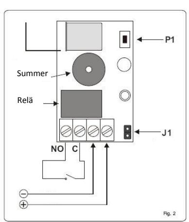
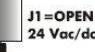
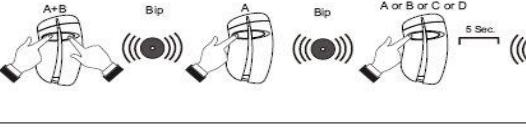
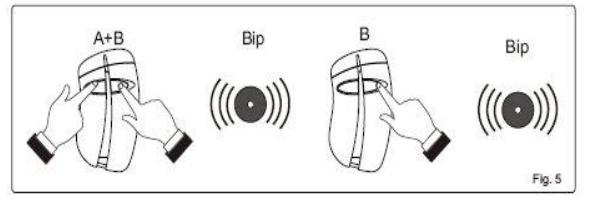

# **Manual för NANO RRA85-1NN**

Radiomottagarna RRA85-1NN är en superheterodyn mottagare med enkel konvertering, integrerad avkodning med typ rolling code och demodulation AM/ASK.

Mottagaren har konstruerats för styrning av automatiska stängningsfunktioner och alarmsystem och använder därför ett säkert inkodningssystem (KeeLoq Rolling code). Mottagarfrekvensen och den använda teknologin svarar mot europanormerna för radiofrekvens och elektromagnetisk kompatibilitet (CE). Den kod som tas emot från sändaren ändras vid varje ny aktivering. På så sätt kan risken för kodkopiering och obehörigt utnyttjande undvikas.

Ett inbyggt system ser till att mottagare och sändare alltid är synkroniserade med varandra. Mottagaren har en reläutgångar av typ NO. Man kan alltså ansluta till alla typer av mekanismer, till exempel grindar, garageportar, larmanordningar, belysning m.m. Reläerna i RRA85-1NN klarar en belastning på 24W eller 24VA

Memorering av sändarna sker antingen med knappen som finns på mottagaren eller trådlöst genom sändarna. Alla mottagare i serien ERONE kan memorera gjorda inställningar i EEPROM (Electrical Erasable Programmable ROM), seriekoden och synkroniseringsalgoritmen för flera sändare.

# **1. ALLMÄNT 2. KOPPLINGSSCHEMA**

### **3. DIMENSIONER 4. SPECIFIKATIONER**

|  |  | Mottagningstyp                | Superheterodyn  |
|--|--|-------------------------------|-----------------|
|  |  | Frekvensband                  | 433,92 MHz      |
|  |  | Frekvens för lokal oscillator | 6,6128 MHz      |
|  |  | Modulation                    | AM/ASK          |
|  |  | Ingångsimpedans               | 50 Ohm          |
|  |  | Kanalbredd                    | > 25 KHz        |
|  |  | Mellanfrekvens                | 10,7 MHz        |
|  |  | Ingångskänslighet             | -115 dBm        |
|  |  | Signal från lokal oscillator  | < -57 dBm       |
|  |  | Spänningsmatning              | 12/24 VAC/DC    |
|  |  | Strömförbrukning viloläge     | 25 mA           |
|  |  | Strömförbrukning max          | 55 mA           |
|  |  | Max belastning relä           | 24W eller 24VA  |
|  |  | Antal relä                    | 1               |
|  |  | Kontakter                     | C och NO        |
|  |  | Max antal användarkoder       | 85              |
|  |  | Arbetstemperatur              | -20° till +70°C |
|  |  | Skyddskapsling                | IP2X            |
|  |  | Dimensioner (mm)              | 50 x 32 x 20    |
|  |  |                               |                 |

**OBS! Det är ingen strömmatning ut från reläet på RRA85-1NN. För att få önskad funktion behöver reläet byglas.**

### **5. PROGRAMERING MED P1**

- 1. Håll P1 nedtryckt tills summern avger en kort signal.
- 2. Tryck på knappen på den sändare som ska memoreras.
- 3. Mottagaren väntar på fler sändare.
- 4. 5 sekunder efter den sista sändare memorerats ger mottagaren en signal och programeringen avslutas.

### **6. PROGRAMERING MED SÄNDARE**

- 1. Håll samtidigt ned knapp A + B på sändaren tills summern avger en kort signal.
- 2. Släpp knapparna och tryck på A tills summern avger en kort signal (öppna minnet).

- 3. Släpp knappen och tryck på knappen på den sändare som ska memoreras. Efter 5 sekunder ger mottagaren en signal och programeringen avslutas.
*OBS! Memorering av en ny sändare kan bara göras med hjälp av en sändare som redan memorerats.*

#### **7. MINNET FULLT**

Om minnet är fullt när du försöker memorera en ny sändare ger summern ifrån sig 3 signaler.

#### **8. RADERING AV EN SÄNDARE**

- 1. Tryck och håll ned P1 tills summern ger en signal, släpp knappen.
- 2. Tryck på knappen på sändaren som ska tas bort tills summern ger en signal.

### **9. TOTAL MINNES RADERING**

- 1. Tryck och håll ned P1 tills summern ger en signal, släpp knappen.
- 2. Tryck ytterligare en gång på P1 tills summern ger ifrån sig 3 signaler. Nu är minnet totalt rensat.

## **10. AKTIVERING/INAKTIVERING AV LJUDSIGNAL**

#### **Det är möjligt att programmera mottagaren att ge en signal på varje relä aktivering.**

Följ nedanstående procedur.

- 1. Tryck samtidigt på knapparna A + B på en sändare som redan memorerats tills summern ger en signal, släpp knapparna.
- 2. Tryck och håll in knappen B tills en signal ljuder.
- 3. För avaktivera signalen upprepa proceduren ovan.

#### **Garanti**

Garantin för denna produkt löper under 10 år från tillverkningsdatum. Om produkten under denna period inte fungerar på avsett sätt på grund av någon defekt komponent, kommer produkten att repareras eller bytas ut, allt efter tillverkarens beslut. Garantin gäller inte för apparatens plasthölje. Varje garantiåtgärd utförs vid tillverkarens säte.