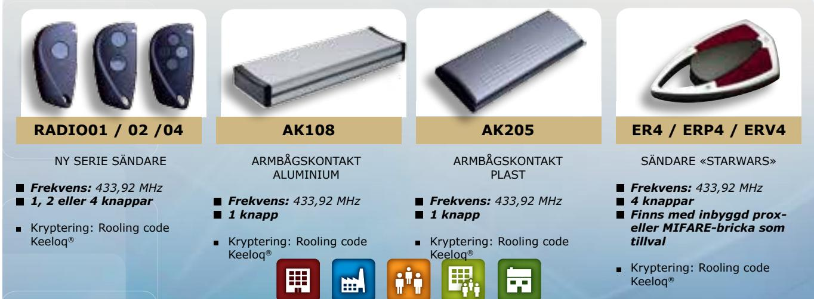

# RRA85-1NN

LITEN RADIOMOTTAGARE FÖR INBYGGNAD I DÖRRAUTOMATIK

> The installer's choice cdvi.se

## *LITEN RADIOMOTTAGARE FÖR INBYGGNAD I DÖRRAUTOMATIK*

### **RRA85-1NN**

- *> Liten och smidig, får plats under kåpan på de flesta dörrautomatiker*
- *> Krypterad kommunikation med Keeloq rolling code. Över 18,5 trilijoner kombinationer*
- *> En reläutgång, N/O*
- *> Endast pulsutgång, ca en sekund*
- *> Max belastning 24W eller 24VA*
- *> Mått: 50x32x20 mm*
- *> 12/24 VAC/DC*

#### *Alternativ RRA85-1NNV*

- *> 230 VAC*
- *> Pulsutgång, ca en sekund eller bistabil (ON/OFF)*
- *> Max belastning 500W*
- *PASSAR RADIOSÄNDARE **

Public Buildnings

Commercial Industrial

Multi-tenant Residential occupancy

*Naturlig storlek*

**CDVI** Sweden AB Datavägen 12B 43632 ASKIM (GÖTEBORG)

Tel: +46 (0)31 760 19 30

*cdvigroup.com cdvi.se*