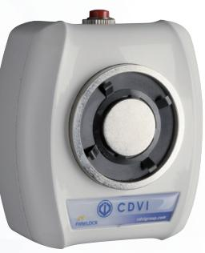
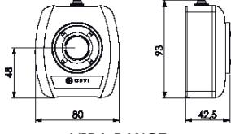
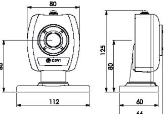
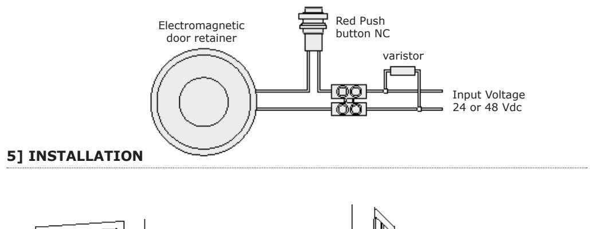
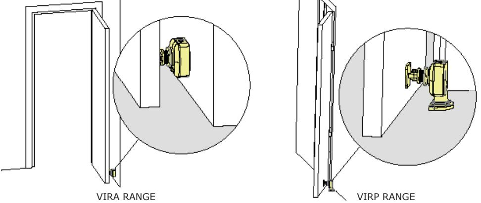
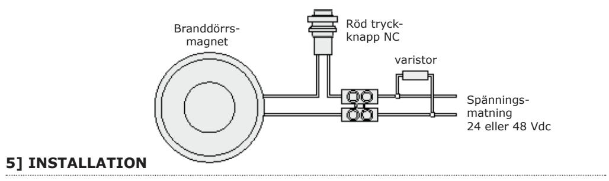
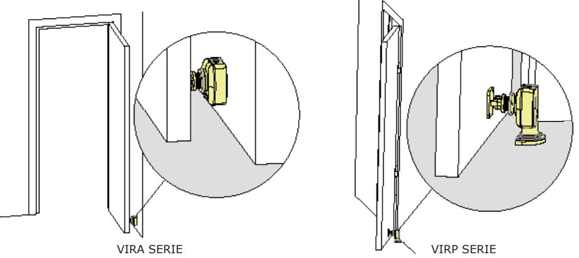

VIRA

VIRP

1

**VIRA20245048 VIRA2048 VIRA5024 VIRP20245048 VIRP2048 VIRP5024**

# *Firedoor Electromagnetic door retainers*

EN 1155 : 1997 + A1 : 2002 + AC : 2006 NF S61-937 N°12-M-141 EFECTIS

# **1] PRODUCT PRESENTATION**

 *All the references given below must be used as electrically powered hold-open devices for swing doors.*

- *In case of fire, the door is released. Built-in red push button to release the door*
- *manually (or for test purposes).*
- *Supplied with a universal armature.*
- *Holding force: 20 to 50kg*.*
- Extreme reliability, no mechanical parts subject to wear.
- Integrated electronic protection.
- Easy installation.
- No residual magnetism.
- Silent operation.
- Power supply: 24V or 48V*.
- Consumption: 20mA to 80mA*.

- HIGH RESISTANCE TO VANDALISM

VIRP RANGE

Certified products : Electromagnetic swing door retainers

Standardized classification : 3 5 3/7 1 1 4

Reference standard : EN 1155 : 1997 + A1 : 2002 + AC : 2006

The Declaration of Performance is avalaible on our website : www.cdvi.com

|              | Holding force | Power supply | Consumption | DEEE           |
|--------------|---------------|--------------|-------------|----------------|
| VIRA20245048 | 20/50 Kg      | 24/48V DC    | 24/48 mA    | IP42           |
| VIRA2048     | 20 Kg         | 48V DC       | 24 mA       |                |
| VIRA5024     | 50 Kg         | 24V DC       | 80 mA       | Recommended    |
| VIRP20245048 | 20/50 Kg      | 24/48V DC    | 24/48 mA    | power supplies |
| VIRP2048     | 20 Kg         | 48V DC       | 24 mA       |                |
| VIRP5024     | 50 Kg         | 24V DC       | 80 mA       | ARD24 BS24  |

** Depending on the version.*

### **2] REMINDERS AND RECOMMENDATIONS**

The function of electromagnetic door retainers is to ensure the integrity of a firedoor. This document is a guide of installation which will allow you to complete the installation according to the characteristics of the product, the site and the environmental requirements.

### **APPROVAL RELATIVE TO EMERGENCY EXITS:**

In the case of an installation of firedoor electromagnetic door retainers on emergency exits, it is imperative to make sure that these exit points will be automatically free in case of fire alarm, to open in the event of a fire alarm to allow evacuation of the premises. The firedoor electromagnetic door retainers installed on emergency exits must be in accordance with the fire approval department.

#### **POWER SUPPLY**

A firedoor electromagnetic door retainer always operates in DC current, a very low safety voltage. firedoor electromagnetic door retainers are recommended for use with power supplies manufactured by CDVI, however, other power supplies may be used on condition that they are of equivalent quality and characteristics rectified, filtered, regulated and protected by fuse in primary and secondary sectors.

#### **MOUNTING RECOMMENDATIONS**

- Define the level of security of the access.
- Determine the maximum strength of holding force to this level of security.
- Select the firedoor electromagnetic door retainer according to the environment.
- Indeed make sure that the frame and opening, receiving or supporting the firedoor electromagnetic door retainer, armature plate and their accessories, are solid and resistant to damage or wear over a period of time.
- Define the passage of cables to ensure the protection against the vandalism and the environmental requirements (in particular through flexible hoses of door, glands, gutters, cross cables, plastic tubes).

#### **MAINTENANCE**

*DEEE*

*IP42*

The Electro magnet and armature plate have a specific treatment which strengthens the protection against wear and corrosion. These products do not require high maintenance. Nevertheless to ensure optimum performance, it is recommended to clean regularly the surfaces in contact of the electro magnet and armature plate with a cloth and non abrasive products. If traces of corrosion appear, it is recommended to clean and oil the contact surfaces. Check and tighten regularly all the fixings of the Electro magnet and ensure that while the armature is able to pivot on its mounting, the fixing bolt is not liable to loosen (we recommend thread-lock for all fixing bolts).

# **3] PACKAGE CONTENTS**

|            | Armature plate | Fixed armature plate | Varistor | Label | M5 screw | Installation manual | Magnetic door retainer | Magnetic door retainer |
|------------|-------------------|----------------------------|----------|-------|----------|------------------------|------------------------------|------------------------------|
| VIRA RANGE | 1                 | 1                          | 1        | 1     | -        | 1                      | 1                            | -                            |
| VIRP RANGE | 1                 | 1                          | 1        | 1     | 4        | 1                      | -                            | 1                            |

** For more information, contact CDVI, the local fire officer or the safety officer responsible for the building.*

### **4] ELECTRICAL CONNECTIONS**

### *General instructions:*

- *The door retaining magnet must be mounted on the wall or floor.*
- *The armature plate is mounted on the door leaf. Ensure both parts are aligned correctly.*
- *The door must have a reliable door closer.*
- *Install the magnet and armature.*
- *Connect the power to the magnet and verify that the magnet holds the armature plate/door securely.*
- *Remove the power, or push the red test button, to ensure the magnet releases the armature, and allows the door to freely close via the door closer.*
- *The power to apply to release the door from the door holder has to be minimum 40Nm in case of switch-off button visible and accessible, whatever the force applied by the door closer, in accordance with EN1155 regulation. In case of non-accessible switch-off button or non-existing one, the power to apply to release the door from the door holder, whatever the force applied by the door closer, must be between 40 and 120Nm, in accordance with the EN1155 regulation.*
- *Depending an the position of the electromagnetic retainer the opening angle can be lower the 90°.*

| NOTES |  |
|-------|--|
|-------|--|

## **1] PRODUKTSPECIFIKATION**

 *All information nedan gäller vid användning för att ställa en dörr uppställd med hjälp av elektromagneten, är till för slagdörrar. Vid brand, släpper magnetlåset dörrbladet. Inbyggd röd knapp för att släppa dörrbladet manuellt (eller i prövningssyfte) Universal ankarplatta ingår. Hållkraft: 20 till 50kg*.*

- Extremt pålitlig, inget mekaniskt slitage.
- Inbyggt elektronikskydd.
- Enkel att installera.
- Ingen remenans.
- Ljudlös drift.
- Spänningsmatning: 24V or 48V*.
- Strömförbrukning: 20mA to 80mA*.

- HIGH RESISTANCE TO VANDALISM
VIRP SERIE

VIRA SERIE

| EC certificat n° 0333-CPR-200011                                 |
|------------------------------------------------------------------|
| Certifierade produkter : Branddörrsmagneter                      |
| Standardiserad klassning : 3 5 3/7 1 1 4                         |
| Refererar till standard : EN 1155 : 1997 + A1 : 2002 + AC : 2006 |

Declaration of Performance finns att hämta på våran hemsida : www.cdvi.se

|              | Hållkraft | Spänning  | Förbrukning | DEEE                           |  |
|--------------|-----------|-----------|-------------|--------------------------------|--|
| VIRA20245048 | 20/50 Kg  | 24/48V DC | 24/48 mA    | IP42                           |  |
| VIRA2048     | 20 Kg     | 48V DC    | 24 mA       |                                |  |
| VIRA5024     | 50 Kg     | 24V DC    | 80 mA       |                                |  |
| VIRP20245048 | 20/50 Kg  | 24/48V DC | 24/48 mA    | Rekommenderader nätaggregat |  |
| VIRP2048     | 20 Kg     | 48V DC    | 24 mA       |                                |  |
| VIRP5024     | 50 Kg     | 24V DC    | 80 mA       | ARD24 BS24                  |  |

** Beroende på version.*

### **2] INFORMATION OCH REKOMMENDATIONER**

Branddörrsmagnetens funktion är att säkerställa att branddörren fungerar som den skall. Det här är en installationsguide som ger vägledning hur man anpassar installationen efter rådande förutsättningar med avseende på produkten, platsen den placeras på och den omgivande miljön.

### **STANDARD FÖR NÖDUTGÅNGAR:**

Om en branddörrsmagneten monteras vid en nödutgång är det nödvändigt att kontrollera att dörren automatiskt låses upp vid ett brandlarm för att möjliggöra evakuering. En elektromagnet som sitter på en nödutgång måste installeras i enlighet med gällande brandsäkerhetslagar och förordningar (Ex : SS-EN1155).

### **STRÖMFÖRSÖRJNING**

En branddörrsmagnet drivs alltid med likström (DC), en säker svagströms matning. Det rekommenderas att branddörrsmagneter används tillsammans med nätaggregat tillverkade av CDVI. Det går att använda andra nätaggregat om de uppfyller kraven på motsvarande kvalitet och egenskaper, likriktad, filtrerad, regulerad och med dubbelautomatsäkring (primär och sekundär).

### **MONTERINGSINSTRUKTIONER**

- Bestäm säkerhetsnivån på passerkontrollen.
- Den maximala styrkan på hållkraften anpassas till vald säkerhetsnivå.
- Välj rätt branddörrsmagnet som passar de rådande förutsättningarna.
- Kontrollera att dörrposten och dörrkarmen, som stöttar eller håller branddörrsmagneten, ankarplattan med tillbehör, är robusta och står emot slitage över tid.
- Bestäm hur kablar ska dras på ett säkert sätt för att skyddas från vandalism och olika förhållanden (t ex genom flexibla karmöverföringar, kabelrännor, plaströr, …).

# **SKÖTSEL**

*DEEE*

*IP42*

Elektromagneten och ankarplattan är specialbehandlade för att motstå rostbildning och slitage. De här produkterna kräver inte mycket underhåll. För maximal effekt bör kontaktytorna på elektromagneten och ankarplattan torkas regelbundet med en trasa och milt rengöringsmedel. Om spår av rost uppstår, rekommenderar vi att kontaktytorna rengörs och oljas in. Kontrollera och skruva åt alla monteringsskruvarna på elektromagneten regelbundet. Kontrollera även att ankarplattan kan vicka runt monteringsskruven. Vi rekommenderar att lock-tight används till alla monteringsskruvarna.

# **3] MONTERINGSSATS**

|            | Rörlig ankarplatta | Fast ankarplatta | Varistor | Erikett | M5 bult | Installations manual | Branddörrs magnet | Branddörrs magnet |
|------------|-----------------------|---------------------|----------|---------|---------|-------------------------|----------------------|----------------------|
| VIRA SERIE | 1                     | 1                   | 1        | 1       | -       | 1                       | 1                    | -                    |
| VIRP SERIE | 1                     | 1                   | 1        | 1       | 4       | 1                       | -                    | 1                    |

** För mer information, kontakta CDVI, svenska brandskyddsföreningen eller säkerhetsansvarig för byggnaden.* 

### **4] INKOPPLINGAR**

#### *Generella instruktioner:*

- *Branddörrsmagneten måste monteras på väggen eller golvet.*
- *Ankarplattas skall monteras på dörrbladet. Se till att båda delarna är parallella med varandra.*
- *Dörren måste ha en pålitlig dörrstängare.*
- *Montera branddörrsmagneten och ankarplattan.*
- *Anslut strömmatningen till branddörrsmagneten och försäkra dig om att magnetlåset hållar ankarplattan eller dörren säkert.*
- *Koppla bort strömmen, eller tryck på den röda testknappen, för att försäkra dig om att branddörrsmagneten släpper ankarplattan så att dörren är fri och kan stängas med hjälp av dörrstängaren.*
- *Kraften som krävs för att branddörrsmagneten skall släppa dörren måste vara minst 40Nm i fall där knappen sitter synglig och åtkomlig, eller att kraften kommer från dörrstängaren, i enlighet med EN1155 standarden.*

*I fall där man inte kan komma åt knappen, eller där knappen inte finns, skall kraften som krävs för att branddörrsmagneten skall släppa dörren, oavsett kraften som dörrstängaren drar med, vara mellan 40 och 120Nm, för att vara i enlighet med EN1155 standarden.*

- *Beroende på vart branddörrsmagneten monteras kan öppningsvinkeln vara mindre än 90°.*

### **ANTECKNINGAR**

**CDVI Group** FRANCE (Headquarters) Phone: +33 (0) 1 48 91 01 02

**CDVI FRANCE + EXPORT** +33 (0) 1 48 91 01 02 www.cdvi.com

**CDVI AMERICAS [CANADA - USA]** +1 (450) 682 7945 www.cdvi.ca

#### **CDVI BENELUX [BELGIUM - NETHERLANDS - LUXEMBOURG]**

+32 (0) 56 73 93 00 www.cdvibenelux.com

**CDVI TAIWAN** +886 (0) 42471 2188 www.cdvichina.cn

**CDVI SUISSE** +41 (0) 21 882 18 41 www.cdvi.ch

**CDVI CHINA** 

+86 (0) 10 84606132/82 www.cdvichina.cn

**CDVI IBÉRICA [SPAIN - PORTUGAL]** +34 (0) 935 390 966

**CDVI ITALIA** +39 (0) 321 90 573 - www.cdvi.it

**CDVI MAROC** +212 (0) 5 22 48 09 40 www.cdvi.ma

www.cdviberica.com

**CDVI NORDICS [SWEDEN - DENMARK - NORWAY - FINLAND]** +46 (0) 31 760 19 30

www.cdvi.se **CDVI UK [UNITED KINGDOM - IRELAND]**

+44 (0) 1628 531300 www.cdvi.co.uk

**CDVI POLSKA** +48 (0) 12 659 23 44 www.cdvi.com.pl

*All the information contained within this document (pictures, drawings, features, specifications and dimensions) could be perceptibly different and can be changed without prior notice.*

## **www.cdvigroup.com**