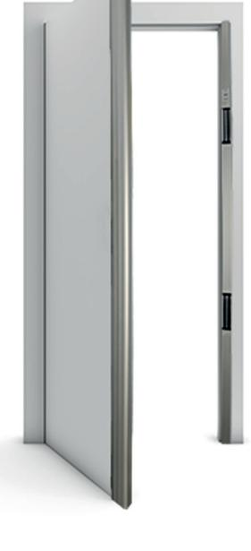
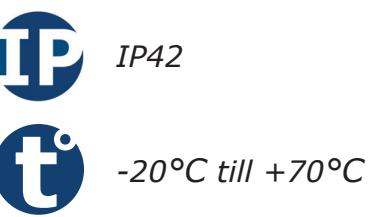
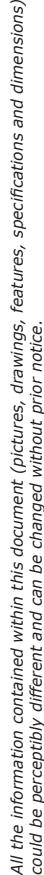
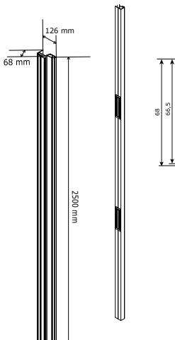
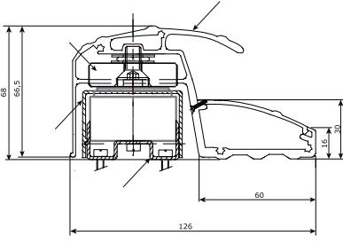
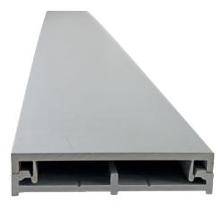
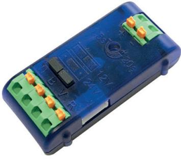
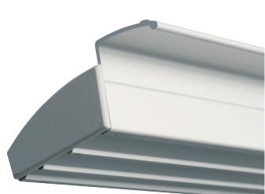

# **Produktblad**

# **Elektromagnetiskt lås - BO800RN**

### **Produktbeskrivning**

Dörrprofil med infällda magneter, en 3-i-1 lösning. Fungerar som handtag, brytskydd och lås i samma enhet. BO800RN har en hållkraft på 2x400kg och levereras med två magneter.

Ett elektromagnetiskt lås är perfekt till dörrar med mycket trafik då det inte finns några rörliga deler och slitaget är minimalt, till dörrar där sabotage förekommer t.ex. entréer till bostadsrättsföreningar eller dörrar i skolmiljöer eftersom magnetens ankarplatta är infällt i handtaget vilket försvårar manipulering av låsningen.

Våra dörrprofiler är enkla att installera och tack vare våra monteringstillbehör passar dörrprofilerna de allra flest dörrmiljöer.

## **Funktioner**

- Hållkraft: 2x400kg
- Lås, brytskydd och handtag i en enhet
- Snabb och enkel installation
- Inga rörliga delar
- För utanpåliggande montage

*IK10*

#### **Teknisk information**

**Material:** Aluminium **Montering:** Utanpåliggande **Antal magneter:** 2 magnetlås **Hållkraft per magnet:** 400kg **Indikering:** Ja **Funktion:** Omvänd funktion **Inbyggd varistor:** Ja **Dimensioner ( L x B x D ):** 2500 x 126 x 68mm **Spänningsmatning:** 12 eller 24Vdc **Strömförbrukning per magnet:** 550mA @ 12Vdc 275mA @ 24Vdc **Kapslingsklass:** IP42 **Temperaturområde:** -20°C till +70°C

2500 mm

126 mm

#### **Monteringstillbehör**

**ALMA** Kabelkanal till dörrprofil 2500mm

**TPV** Tidrelä för att förlänga öppningsimpulsen med tryckknapp

**UBK25** U-profil för montering på glasdörr 2500mm

**PRP800** Draghandtag för motsatt sida av dörrbladet. 2500mm

**10 WARRANTY YEAR**