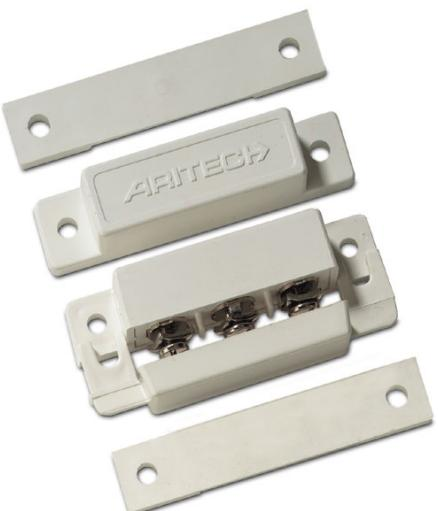
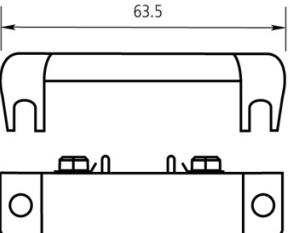
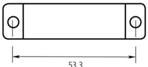
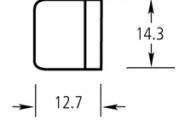

## Produktblad

# DC102

Utanpåliggande magnetkontakt - Med skruvanslutning

#### Standardprestanda

- EOmfattande produktserie
- EÖverlägsen kvalitet
- E Enkla att installera

- EVäxlande kontakt
- EKan på beställning levereras med önskat inbyggt motstånd

# DC102

Utanpåliggande magnetkontakt - Med skruvanslutning

### Tekniska data

| Arbetsavstånd (max) | 18 mm           |
|---------------------|-----------------|
| Funktion i drift    | Normalt sluten  |
| Anslutningstyp      | Skruvar         |
| Mått (L x B x H)    | 63 x 12 x 19 mm |
| Färg                | Brun            |

#### Order data

| Artikelnummer | Beskrivning |
|---------------|-------------|
| DC102         |             |

Utanpåliggande magnetkontakt - Med skruvanslutning

Reservationer för produktförändringar. För uppdatering av produktdata, gå in på www. utcfssecurityproducts.se eller kontakta din lokala UTC Fire & Security återförsäljare. DC102-2017-01-20 08:53:38 Released :02-SEP-11