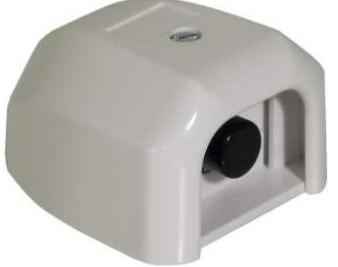
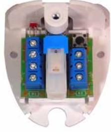
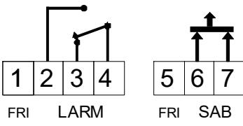
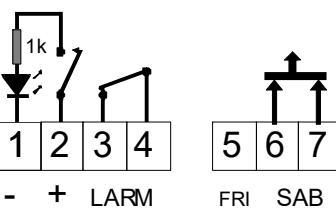

# **Installationsmanual HB 205 / HB 205-L**

# **Överfallskontakt**

# **BESKRIVNING**

HB 205 är en mekanisk överfallskontakt med enkeltryck som kan användas för olika applikationer i en larmanläggning.

## **INSTALLATION**

### **INKOPPLING**

Kontakten har 7 skruvplintar med trådskydd. Anslutningar enligt nedan:

**HB 205** 

- 1 Ledig
- 2 NO
- 3 NC
- 4 C
- 5 Ledig
- 6 Sabotageomkopplare
- 7 Sabotageomkopplare

HB 205 har återfjädrande NC funktion och HB 205- L har kvarstående tryckknapp. Återställning sker genom att trycka ytterligare en gång på knappen. HB 205-L har också en inbyggd lysdiod för indikering av larm. Sabotageomkopplare för skydd mot öppning.

HB 205 finns i två versioner:

- HB 205 med återfjädrande tryckknapp
- HB 205-L med kvarstående tryckknapp och lysdiod

**HB 205-L** 

1 Matningsspänning (-) till lysdiod

- 2 Matningsspänning (+) till lysdiod
- 3 C
- 4 NC
- 5 Ledig
- 6 Sabotageomkopplare
- 7 Sabotageomkopplare

### **TEKNISKA DATA**

Larmutgång HB 205: NC/NO Larmutgång HB 205-L: NC Kontaktdata: 30 VDC / 100 mA Matningsspänning till LED (HB 205-L): 9 – 30 VDC

Temperaturområde: -10 - +55o Kapslingsklass: IP 31 Mått (L x B x H): 62 x 50 x 35 Compliance:

Sabotageskydd: Ja lock, 12 VDC / 50 mA

LED (HB 205-L): Ja, med inbyggt seriemotstånd (1 Kohm) C