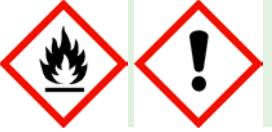

# **SÄKERHETSDATABLAD TG-PH03 TESTGAS AEROSOL - Sleep Safe Smoke Alarm Tester**

Säkerhetsdatabladet är i enlighet med Kommissionens förordning (EU) 2015/830 av den 28 maj 2015 om ändring av Europaparlamentets och rådets förordning (EG) nr 1907/2006 om registrering, utvärdering, godkännande och begränsning av kemikalier (Reach)

| AVSNITT 1: Namnet på ämnet/blandningen och bolaget/företaget            |                                                         |  |  |  |
|-------------------------------------------------------------------------|---------------------------------------------------------|--|--|--|
| Utgivningsdatum                                                         | 08.05.2015                                              |  |  |  |
| 1.1. Produktbeteckning                                                  |                                                         |  |  |  |
| Produktnamn                                                             | TG-PH03 TESTGAS AEROSOL - Sleep Safe Smoke Alarm Tester |  |  |  |
| Artikelnr.                                                              | 601020                                                  |  |  |  |
| GTIN-nr.                                                                | 5012804043041                                           |  |  |  |
| 1.2 Relevanta identifierade användningar av ämnet eller blandningen och |                                                         |  |  |  |
| användningar som det avråds från                                        |                                                         |  |  |  |
| Produktgrupp                                                            | Aerosol                                                 |  |  |  |
| Användningsområde                                                       | Brandvarnartest                                         |  |  |  |
| 1.3 Närmare upplysningar om den som tillhandahåller säkerhetsdatablad   |                                                         |  |  |  |
| Distributör                                                             |                                                         |  |  |  |
| Företagsnamn                                                            | GPBM Nordic AB                                          |  |  |  |
| Postadress                                                              | Argongatan 2B                                           |  |  |  |
| Postnr.                                                                 | SE-431 53                                               |  |  |  |
| Postort                                                                 | Mölndal                                                 |  |  |  |
| Land                                                                    | Sverige                                                 |  |  |  |
| Telefon                                                                 | +46 31 799 16 00                                        |  |  |  |
| Fax                                                                     | +46 31 799 16 01                                        |  |  |  |
| E-post                                                                  | info@gpbmnordic.se                                      |  |  |  |

## **1.4. Telefonnummer för nödsituationer**

Nödtelefon Ring 112:Begär Giftinformationscentralen

## **AVSNITT 2: Farliga egenskaper**

## **2.1 Klassificering av ämnet eller blandningen**

Webbadress http://www.gpbmnordic.se

| Klassificering enligt 67/548/EEC eller | F+; R12                                                                 |
|----------------------------------------|-------------------------------------------------------------------------|
| 1999/45/EC                             |                                                                         |
| Klassificering enligt (EC) No          | Flam Aerosol 1; H222                                                    |
| 1272/2008 [CLP/GHS]                    | Flam Aerosol 1; H229                                                    |
|                                        | Eye Irrit. 2; H319                                                      |
| Ämnets / blandningens farliga          | Aerosolbehållare med extremt brandfarligt innehåll. Tryckbehållare: Kan |
| egenskaper                             | explodera vid uppvärmning. Orsakar allvarlig ögonirritation.            |
|                                        |                                                                         |

## **2.2. Märkningsuppgifter**

## **Faropiktogram (CLP)**

#### TG-PH03 TESTGAS AEROSOL - Sleep Safe Smoke Alarm Tester Sida 2 av 8

| Sammansättning på etiketten | 2-Propanol                                                                          |
|-----------------------------|-------------------------------------------------------------------------------------|
| Signalord                   | Fara                                                                                |
| Faroangivelser              | H222 Extremt brandfarlig aerosol.                                                   |
|                             | H229 Tryckbehållare: Kan sprängas vid uppvärmning                                   |
|                             | H319 Orsakar allvarlig ögonirritation.                                              |
| Skyddsangivelser            | P102 Förvaras oåtkomligt för barn.                                                  |
|                             | P210 Får inte utsättas för värme, heta ytor, gnistor, öppna lågor och andra         |
|                             | antändningskällor. Rökning förbjuden.                                               |
|                             | P211 Spreja inte över öppen låga eller andra antändningskällor.                     |
|                             | P251 Får inte punkteras eller brännas, gäller även tömd behållare.                  |
|                             | P410+P412 Skyddas från solljus. Får inte utsättas för temperaturer över 50 °C       |
|                             | / 122 °F.                                                                           |
|                             | P305+P351+P338 VID KONTAKT MED ÖGONEN: Skölj försiktigt med vatten i                |
|                             | flera minuter. Ta ur eventuella kontaktlinser om det går lätt. Fortsätt att skölja. |
|                             | P501 Innehållet / behållaren lämnas till insamlingsställe för farligt avfall.       |
| 2.3. Andra faror            |                                                                                     |
| PBT / vPvB                  | PBT/vPvB-bedömning ej utförd.                                                       |
| Beskrivning av risk         | Ångorna kan antändas av en gnista, en varm yta eller glöd. Ångorna är               |

|                          | tyngre än luften och utbreder sig därför längs golvet och kärlens botten. |
|--------------------------|---------------------------------------------------------------------------|
| Generell riskbeskrivning | Aerosolburkar kan explodera vid brand.                                    |
| Hälsoeffekt              | Narkotisk effekt vid inandning.                                           |

## **AVSNITT 3: Sammansättning/information om beståndsdelar**

## **3.2. Blandningar**

| Ämne                                | Identifiering                                              | Klassificering    | Innehåll  |
|-------------------------------------|------------------------------------------------------------|-------------------|-----------|
| Petroleumgaser, flytande (< 0,1% 1, | CAS-nr.: 68476-85-7                                        | Flam gas 1; H220  | 60 - 90 % |
| 3-butadien)                         | EG-nr.: 270-704-2                                          | Press. Gas; H280  |           |
| 2-Propanol                          | CAS-nr.: 67-63-0                                           | Flam. Liq. 2;H225 | 10 - 30 % |
|                                     | EG-nr.: 200-661-7                                          | Eye Irrit. 2;H319 |           |
|                                     | Indexnr.: 603-064-00-3                                     | STOT SE3;H336     |           |
|                                     | Synonymer: Isopropanol, Propan                             |                   |           |
|                                     | 2-ol                                                       |                   |           |
| Ämne, kommentar                     | Se avsnitt 16 för förklaring av H-angivelser och R-fraser. |                   |           |

## **AVSNITT 4: Åtgärder vid första hjälpen**

#### **4.1. Beskrivning av åtgärder vid första hjälpen**

| Allmänt                                                              | Nödtelefon: se avsnitt 1.4. Vid medvetslöshet eller allvarliga fall, ring 112.                                                                                                                                                                             |  |
|----------------------------------------------------------------------|------------------------------------------------------------------------------------------------------------------------------------------------------------------------------------------------------------------------------------------------------------|--|
| Inandning                                                            | Den skadade flyttas genast från exponeringskällan. Frisk luft, värme och vila.                                                                                                                                                                             |  |
|                                                                      | Kontakta läkare om besvär kvarstår.                                                                                                                                                                                                                        |  |
| Hudkontakt                                                           | Värm det köldskadade området med ljummet vatten. Gnid inte det skadade området.                                                                                                                                                                         |  |
|                                                                      | Tag av förorenade kläder. Tvätta huden med tvål och vatten. Kontakta läkare om besvär kvarstår.                                                                                                                                                         |  |
| Ögonkontakt                                                          | Skölj genast med rikliga mängder vatten i upp till 15 min. Avlägsna eventuella kontaktlinser och håll ögat vidöppet. Vid längre tids sköljning, använd ljummet vatten för att undvika skador på ögat. Kontakta ögonläkare om irritation kvarstår. |  |
| Förtäring                                                            | Mindre sannolikt. Ge grädde eller matolja. Framkalla ej kräkning. Kontakta läkare om besvär kvarstår.                                                                                                                                                   |  |
| 4.2 De viktigaste symptomen och effekterna, både akuta och fördröjda |                                                                                                                                                                                                                                                            |  |
| Akuta symptom och effekter                                           | Inandning: I höga koncentrationer verkar ångorna/dimma förslöande och kan ge huvudvärk, trötthet, yrsel och illamående. Missbruk kan ge andnöd, hjärtarytmi och leda till dödsfall.                                                                  |  |

Ögonkontakt: Irritation, sveda, tårflöde och dimsyn vid stänk.

Fördröjda symptom och effekter Långvarig eller upprepad kontakt avfettar huden och kan ge hudirritation. **4.3 Angivande av omedelbar medicinsk behandling och särskild behandling som eventuellt krävs**

Andra upplysningar Symptomatisk behandling. Ingen specifik information från tillverkaren.

## **AVSNITT 5: Brandbekämpningsåtgärder**

| 5.1 Släckmedel                         |                                                                                                                                                                                              |
|----------------------------------------|----------------------------------------------------------------------------------------------------------------------------------------------------------------------------------------------|
| Lämpliga släckmedel                    | Pulver, koldioxid (CO2), alkoholresistent skum.                                                                                                                                              |
| Olämpliga brandsläckningsmedel         | Vid brandsläckning får vattenstråle inte användas - branden sprids därigenom.                                                                                                                |
|                                        | 5.2 Särskilda faror som ämnet eller blandningen kan medföra                                                                                                                                  |
| Brand- och explosionsrisker            | Extremt brandfarligt. Ångor kan bilda explosiva blandningar tillsammans med luft. Ångorna är tyngre än luft och kan sprida sig längs marken. Aerosolbehållare kan explodera vid brand. |
| Farliga förbränningsprodukter          | Kan inkludera, men är inte begränsade till: Koldioxid (CO2). Kolmonoxid (CO).                                                                                                                |
| 5.3. Råd till brandbekämpningspersonal |                                                                                                                                                                                              |
| Personlig skyddsutrustning             | Använd andningsapparat om produkten är utsatt för brand. Vid utrymning används godkänd flyktmask. Se även avsnitt 8.                                                                      |
| Andra upplysningar                     | Om det kan ske utan risk, flytta behållarna till säker plats. I annat fall kyl med vatten från skyddad plats. Förhindra utsläpp av släckvatten i avloppet.                                |

## **AVSNITT 6: Åtgärder vid oavsiktliga utsläpp**

## **6.1 Personliga skyddsåtgärder, skyddsutrustning och åtgärder vid nödsituationer**

| Allmänna åtgärder         | Förvaras åtskilt från antändningskällor - Rökning förbjuden.                     |
|---------------------------|----------------------------------------------------------------------------------|
| Personliga skyddsåtgärder | Ventilationen skall vara effektiv. Använd personlig skyddsutrustning (se avsnitt |
|                           | 8).                                                                              |
| 6.2. Miljöskyddsåtgärder  |                                                                                  |
| Miljöskyddsåtgärder       | Förhindra utsläpp till avlopp, vattendrag och mark.                              |
|                           | 6.3. Metoder och material för inneslutning och sanering                          |
| Rengöringsmetod           | Innehållet i aerosolbehållaren: Spill tas upp med inert absorberande material.   |

## Förslag på inerta material: sand, kiselgur eller universalbindare. Tvätta spillområdet med rikliga mängder vatten och rengöringsmedel. Aerosolbehållare samlas upp mekaniskt. Samlas upp i för ändamålet avsedda behållare och skickas som farligt avfall i överensstämmelse med avsnitt 13.

### **6.4 Hänvisning till andra avsnitt**

Andra anvisningar Se även avsnitten 8 och 13.

## **AVSNITT 7: Hantering och lagring**

## **7.1 Försiktighetsmått för säker hantering**

| Hantering                                    | Sörj för tillräcklig ventilation. Undvik inandning av sprutdimma samt kontakt med hud och ögon. Använd skyddsutrustning enligt avsnitt 8.                                                         |
|----------------------------------------------|------------------------------------------------------------------------------------------------------------------------------------------------------------------------------------------------------|
| Skyddsåtgärder                               |                                                                                                                                                                                                      |
| Säkerhetsåtgärder för att förhindra brand | Spraya inte mot öppen låga eller glödande material. Förvaras åtskilt från antändningskällor - Rökning förbjuden. Använd elektrisk/ventilations-/belysnings utrustning som är explosionssäkert. |
| Råd om allmän arbetshygien                   | Man får inte äta, dricka eller röka under arbetet. Tvätta händerna efter varje arbetsskift och innan måltid, rökpaus eller toalettbesök. Tvätta nedsölade kläder innan de används igen.        |
|                                              | 7.2 Förhållanden för säker lagring, inklusive eventuell oförenlighet                                                                                                                                 |
| Lagring                                      | Förvaras enligt bestämmelser för brandfarliga varor. Förvaras i ett svalt, välventilerat utrymme.                                                                                                 |
| Speciella egenskaper och risker              | Ångorna är tyngre än luft och kan spridas längs golvet. Ångorna kan bilda                                                                                                                            |

explosiva blandningar med luft.

## **Förhållanden för säker lagring**

Anvisningar angående samlagring Brandfarligt/brännbart - Förvaras åtskilt från oxidationsmedel, värme och eld.

#### **7.3 Specifik slutanvändning**

Specifika användningsområden Se avsnitt 1.2.

## **AVSNITT 8: Begränsning av exponeringen/personligt skydd**

#### **8.1 Kontrollparametrar Hygieniska gränsvärden** Ämne Identifiering Värde År Dekaner och andra högre alifatiska kolväten Nivågränsvärde (NGV): 350 mg/m³ KTV: 500 mg/m³ 2007 2-Propanol CAS-nr.: 67-63-0 EG-nr.: 200-661-7 Indexnr.: 603-064-00-3 Synonymer: Isopropanol, Propan-2-ol Nivågränsvärde (NGV): 150 ppm Nivågränsvärde (NGV): 350 mg/m³ KTV: 250 ppm KTV: 600 mg/m³ Övrig information om gränsvärden Referenser (lagar/förordningar): Arbetsmiljöverkets föreskrifter och allmänna råd om hygieniska gränsvärden, "Hygieniska gränsvärden", AFS 2011:18. **8.2 Begränsning av exponeringen** Begränsning av exponeringen på arbetsplatsen Ventilationen skall vara effektiv. Personlig skyddsutrustning skall vara CEmärkt och bör väljas i samråd med leverantören av sådan utrustning. Rekommenderad skyddsutrustning och angivna standarder är vägledande. Standarder bör vara av senaste version. En riskbedömning av arbetsplatsen/verksamheten (den faktiska risken) kan leda till andra kontrollåtgärder. Skyddsutrustningens lämplighet och hållbarhet beror på användningen. **Andningsskydd** Andningsskydd Använd andningsskydd vid otillräcklig ventilation. Kombinationsfilter A/P2 för aerosol eller vid sprutning. Hänvisning till relevanta standarder SS-EN 14387 (Andningsskydd - Gasfilter och kombinationsfilter - Fordringar, provning, märkning). **Handskydd** Handskydd Använd handskar av motståndskraftigt material, t.ex.: Nitrilgummi. Butylgummi. Hänvisning till relevanta standarder SS-EN 374 (Skyddshandskar mot kemikalier och mikroorganismer). SS-EN 420 (Skyddshandskar - Allmänna krav och provningsmetoder). Genombrottstid Ingen specifik information från tillverkaren. Tjocklek av handskmaterial Ingen specifik information från tillverkaren. **Ögon- / ansiktsskydd** Ögonskydd Använd stänktäta skyddsglasögon vid risk för kontakt med ögonen. Hänvisning till relevanta standarder SS-EN 166 (Ögonskydd - Fordringar och specifikationer). **Hudskydd** Hudskydd (av annat än händerna) Använd skyddskläder vid risk för hudkontakt. **Begränsning av miljöexponeringen** Begränsning av miljöexponeringen Förhindra utsläpp till avlopp, vattendrag och mark. **Andra upplysningar** Andra upplysningar Nöddusch och ögondusch ska finnas på arbetsplatsen.

Brandfarlighet (fast form, gas) Inte specificerad av tillverkaren.

#### **AVSNITT 9: Fysikaliska och kemiska egenskaper 9.1 Information om grundläggande fysikaliska och kemiska egenskaper** Fysisk form Aerosol. Färg Inte specificerad av tillverkaren. Lukt Kolväte. Kommentarer, Luktgräns Inte specificerad av tillverkaren. Kommentarer, pH (leverans) Inte relevant. Kommentarer, Smältpunkt / smältpunktsintervall Inte specificerad av tillverkaren. Kommentarer, Kokpunkt / kokpunktsintervall Inte specificerad av tillverkaren. Flampunkt Värde: < 0 °C Kommentarer, Avdunstningshastighet Inte specificerad av tillverkaren.

| Kommentarer, Explosionsgräns         | Inte specificerad av tillverkaren.                                         |
|--------------------------------------|----------------------------------------------------------------------------|
| Kommentarer, Ångtryck                | Inte specificerad av tillverkaren.                                         |
| Ångdensitet                          | Värde: > 1                                                                 |
|                                      | Referensgas: luft = 1                                                      |
| Kommentarer, Relativ densitet        | Inte specificerad av tillverkaren.                                         |
| Löslighet i vatten                   | Delvis blandbar.                                                           |
| Kommentarer, Fördelningskoefficient: | Ej relevant för en blandning.                                              |
| n-oktanol / vatten                   |                                                                            |
| Kommentarer,                         | Inte specificerad av tillverkaren.                                         |
| Självantändningstemperatur           |                                                                            |
| Kommentarer, Sönderfallstemperatur   | Inte specificerad av tillverkaren.                                         |
| Kommentarer, Viskositet              | Inte specificerad av tillverkaren.                                         |
| Explosiva egenskaper                 | Kemikalien är inte explosiv, men kan bilda explosiva blandningar med luft. |
| Oxiderande egenskaper                | Ej oxiderande.                                                             |
|                                      |                                                                            |

## **9.2 Annan information**

## **Andra fysiska och kemiska egenskaper**

Kommentar Inga ytterligare uppgifter tillgängliga.

## **AVSNITT 10: Stabilitet och reaktivitet**

| 10.1 Reaktivitet                     |                                                                                                                                                                               |
|--------------------------------------|-------------------------------------------------------------------------------------------------------------------------------------------------------------------------------|
| Reaktivitet                          | Inga testdata finns tillgängliga.                                                                                                                                             |
| 10.2 Kemisk stabilitet               |                                                                                                                                                                               |
| Stabilitet                           | Stabil vid normala temperaturer och rekommenderad användning.                                                                                                                 |
| 10.3 Risk för farliga reaktioner     |                                                                                                                                                                               |
| Risken för farliga reaktioner        | Uppstår vid kontakt med oförenliga material (avsnitt 10.5) och under olämpliga förhållanden (avsnitt 10.4). Ångor kan bilda explosiva blandningar tillsammans med luft. |
| 10.4 Förhållanden som ska undvikas   |                                                                                                                                                                               |
| Förhållanden som skall undvikas      | Undvik värme, flammor och andra antändningskällor. Får ej utsättas för temperaturer över 50 °C.                                                                            |
| 10.5. Oförenliga material            |                                                                                                                                                                               |
| Material som skall undvikas          | Starka oxidationsmedel.                                                                                                                                                       |
| 10.6 Farliga sönderdelningsprodukter |                                                                                                                                                                               |
| Farliga sönderdelningsprodukter      | Inga vid normala förhållanden. Se även avsnitt 5.2.                                                                                                                           |

## **AVSNITT 11: Toxikologisk information**

## **11.1 Information om de toxikologiska effekterna**

| Övriga upplysningar om hälsofara                 |                                                                                                                                                                                |
|--------------------------------------------------|--------------------------------------------------------------------------------------------------------------------------------------------------------------------------------|
| Allmänt                                          | Produkten har ej testats i sin helhet. Klassificeringen grundar sig på de ingående komponenternas egenskaper.                                                               |
| Uppskattning av blandningens akuttoxicitet       |                                                                                                                                                                                |
| Utvärdering av akut toxicitet, klassificering | Kriterierna för klassificering kan på grundval av tillgängliga data inte anses vara uppfyllda.                                                                              |
| Potentiella akuta effekter                       |                                                                                                                                                                                |
| Inandning                                        | I höga koncentrationer verkar ångorna/dimma förslöande och kan ge huvudvärk, trötthet, yrsel och illamående. Missbruk kan ge andnöd, hjärtarytmi och leda till dödsfall. |
| Hudkontakt                                       | Verkar avfettande.                                                                                                                                                             |
| Ögonkontakt                                      | Irritation, sveda, tårflöde och dimsyn vid stänk.                                                                                                                              |
| Förtäring                                        | Osannolik på grund av kemikaliens tillståndsform. Förtäring kan dock orsaka irritation och obehag. Förtäring kan ge liknande symptom som vid inandning.                     |
| Irritation                                       | Irriterar ögonen.                                                                                                                                                              |
| Frätande effekt                                  | Kriterierna för klassificering kan på grundval av tillgängliga data inte anses vara uppfyllda.                                                                              |
| Fara vid aspiration                              | Kriterierna för klassificering kan på grundval av tillgängliga data inte anses vara uppfyllda.                                                                              |
| Fördröjda effekter / upprepad exponering         |                                                                                                                                                                                |
| Hudkontakt                                       | Långvarig eller upprepad kontakt avfettar huden och kan ge hudirritation.                                                                                                      |
| Sensibilisering                                  | Kriterierna för klassificering kan på grundval av tillgängliga data inte anses vara uppfyllda.                                                                              |
| Specifik organtoxicitet – enstaka                | Kriterierna för klassificering kan på grundval av tillgängliga data inte anses                                                                                                 |

vara uppfyllda.

vara uppfyllda.

vara uppfyllda.

vara uppfyllda.

vara uppfyllda.

## **AVSNITT 12: Ekologisk information**

**Cancerogen, Mutagen och Reproduktionstoxisk**

#### **12.1 Toxicitet**

exponering

exponering

Specifik organtoxicitet – upprepad

Ekotoxicitet Produkten är inte klassificerad som miljöfarlig. Produkten som sådan är inte testad. Bedömningen grundas på information om ingående ämnen.

Kriterierna för klassificering kan på grundval av tillgängliga data inte anses

## **12.2 Persistens och nedbrytbarhet**

Persistens och nedbrytbarhet Förväntas vara biologiskt nedbrytbar. Flyktiga lösningsmedel oxideras snabbt vid fotokemiska reaktioner i luft.

Cancerframkallande Kriterierna för klassificering kan på grundval av tillgängliga data inte anses

Ärftlighetsskador Kriterierna för klassificering kan på grundval av tillgängliga data inte anses

Reproduktionstoxicitet Kriterierna för klassificering kan på grundval av tillgängliga data inte anses

#### **12.3 Bioackumuleringsförmåga**

Bioackumuleringsförmåga Data saknas. Förväntas ej bioackumulera.

#### **12.4 Rörligheten i jord**

Rörlighet Delvis löslig i vatten. Produkten innehåller organiska lösningsmedel som avdunstar lätt från alla ytor.

## **12.5 Resultat av PBT- och vPvB-bedömningen**

PBT-bedömning, resultat PBT-bedömning ej utförd. Resultat av vPvB-bedömningen vPvB-bedömning ej utförd.

#### **12.6 Andra skadliga effekter**

Andra skadliga effekter / Undvik utsläpp till miljön.

#### Anmärkning

## **AVSNITT 13: Avfallshantering**

#### **13.1 Avfallsbehandlingsmetoder**

| Specificera lämpliga metoder för avfallshantering | Omhändertas som farligt avfall av godkänd entreprenör. Koden för farligt avfall (EWC-kod) är vägledande. Användaren måste själv ange riktig EWC-kod om användningsområdet avviker. |
|------------------------------------------------------|------------------------------------------------------------------------------------------------------------------------------------------------------------------------------------------|
| Produkten är klassificerad som farligt avfall     | Ja                                                                                                                                                                                       |
| Förpackningen är klassificerad som farligt avfall | Ja                                                                                                                                                                                       |
| EWC-kod                                              | EWC: 14 06 03 Andra lösningsmedel och lösningsmedelsblandningar EWC: 15 01 04 Metallförpackningar                                                                                     |

## **AVSNITT 14: Transportinformation**

| 14.1. UN-nummer                   |                                               |
|-----------------------------------|-----------------------------------------------|
| ADR / RID / ADN                   | 1950                                          |
| RID                               | 1950                                          |
| IMDG                              | 1950                                          |
| ICAO/IATA                         | 1950                                          |
| Kommentar                         | Kan skickas som begränsad mängd (LQ). 1 liter |
| 14.2 Officiell transportbenämning |                                               |
| ADR                               | AEROSOLER                                     |
| RID                               | AEROSOLER                                     |
| IMDG                              | AEROSOLS                                      |
| ICAO/IATA                         | AEROSOLS, FLAMMABLE                           |
| 14.3 Faroklass för transport      |                                               |
| ADR / RID / ADN                   | 2.1                                           |
| RID                               | 2.1                                           |
| IMDG                              | 2.1                                           |
| ICAO/IATA                         | 2.1                                           |
| 14.4 Förpackningsgrupp            |                                               |
| Anmärkning                        | Inte relevant.                                |

#### **14.5 Miljöfaror**

IMDG Marine Pollutant Nei

#### **14.6 Särskilda försiktighetsåtgärder**

EmS F-D, S-U

#### **14.7. Bulktransport enligt bilaga II till MARPOL 73/78 och IBC-koden**

Förorening kategori Inte relevant.

### **ADR / RID - övrig information**

ADR, annan relevant information Tunnelrestriktionskod: (D)

## **AVSNITT 15: Gällande föreskrifter**

## **15.1 Föreskrifter/lagstiftning om ämnet eller blandningen när det gäller säkerhet, hälsa och miljö**

| Referenser (lagar/förordningar) | Förordning (EG) nr 1272/2008 om klassificering, märkning och förpackning av   |
|---------------------------------|-------------------------------------------------------------------------------|
|                                 | ämnen och blandningar (CLP-förordningen) med senare ändringar.                |
|                                 | Kemikalieinspektionens föreskrifter om klassificering och märkning av kemiska |
|                                 | produkter KIFS 2005:7, med ändringar.                                         |
|                                 | Europaparlamentets och rådets förordning (EG) nr 1907/2006 av den 18          |
|                                 | december 2006 om registrering, utvärdering, godkännande och begränsning       |

av kemikalier (REACH) med senare ändringar. Avfallsförordning, SFS 2011:927. ADR-S 2015 (MSBFS 2015:6) samt RID-S 2015 (MSBFS 2015:2) MSBFS 2014:1, Myndigheten för samhällsskydd och beredskaps föreskrifter om aerosolbehållare.

## **15.2 Kemikaliesäkerhetsbedömning**

En Kemikaliesäkerhetsbedömning har utförts Nej

## **AVSNITT 16: Annan information**

| Leverantörens anmärkningar                                        | Informationen i detta dokument skall finnas tillgänglig för alla som hanterar produkten. |
|-------------------------------------------------------------------|---------------------------------------------------------------------------------------------|
| Klassificering enligt (EC) No                                     | Aerosol 1; H222;                                                                            |
| 1272/2008 [CLP/GHS]                                               | Eye Irrit. 2; H319;                                                                         |
|                                                                   | Aerosol 1; H229;                                                                            |
| Förteckning över relevanta R-fraser (under avsnitten 2 och 3). | R12 Extremt brandfarligt.                                                                   |
| Lista över relevanta                                              | H280 Innehåller gas under tryck. Kan explodera vid uppvärmning.                             |
| Faroangivelser/H-fraser (i avsnitt 2                              | H222 Extremt brandfarlig aerosol.                                                           |
| och 3)                                                            | H336 Kan göra att man blir dåsig eller omtöcknad.                                           |
|                                                                   | H229 Tryckbehållare: Kan sprängas vid uppvärmning                                           |
|                                                                   | H220 Extremt brandfarlig gas.                                                               |
|                                                                   | H319 Orsakar allvarlig ögonirritation.                                                      |
|                                                                   | H225 Mycket brandfarlig vätska och ånga.                                                    |
| Använda förkortningar och                                         | ADR: The European Agreement concerning the International Carriage of                        |
| akronymer                                                         | Dangerous Goods by Road                                                                     |
|                                                                   | EWC-kod: kod från EU:s gemensamma klassificeringssystem för avfall                          |
|                                                                   | (European Waste Code).                                                                      |
|                                                                   | IATA: The International Air Transport Association                                           |
|                                                                   | ICAO: The International Civil Aviation Organisation                                         |
|                                                                   | IMDG: The International Maritime Dangerous Goods Code                                       |
|                                                                   | PBT: Persistent, Bioackumulerande och Toxisk (giftig)                                       |
|                                                                   | RID: The Regulations concerning the International Carriage of Dangerous                     |
|                                                                   | Goods by Rail                                                                               |
|                                                                   | vPvB: very Persistent and very Bioaccumulative (mycket Persistent och mycket                |
|                                                                   | Bioackumulerande)                                                                           |
| Viktiga källor vid utarbetandet av säkerhetsdatablad           | Säkerhetsdatablad från leverantör daterat: 18.01.2010                                       |
| Version                                                           | 2                                                                                           |
| Ansvarig för säkerhetsdatablad                                    | GPBM Nordic AB                                                                              |
| Utarbetat av                                                      | Teknologisk Lab AB, Göteborg / Milvi Rohtla                                                 |