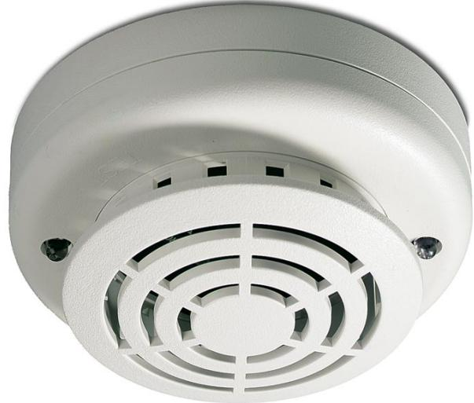

## Produktblad

# DT713-7

Värmedetektor med fast 70° maxvärde samt differentialavkänning

### DT713-7

DT713-7 är en differentialvärmedetektor klass B med 70 gr C maximaltemperaturgräns avsedd för anslutning till konventionella centralapparater för brandlarm.

#### Driftsäker

Samtliga värmedetektorer i DT700-serien har en inbyggd testfunktion. En gång per dygn sker en fullständig test av elektronik och sensorelement. Vid fel tänds en gul lysdiodsindikering på detektorn och på centralapparater i 1Xserien.

#### Detektorsockel

För samtliga detektorer i 700-serien används sockel DB702. Sockeln är försedd med en låsningsfunktion för extra säkerhet. Vid demontering av en detektor indikeras normalt fel i centralapparaten. Med hjälp av en i detektorsockeln inbyggd kortslutningsbygel, kan sektionsslingan bibehållas intakt. Funktionen är ett bra hjälpmedel vid installation och kontrollmätning av slingorna. Kortslutningsbygeln bortkopplas automatiskt då en detektor monteras.

#### Standardprestanda

- EAutomatisk egendiagnostik
- EInbyggd reläutgång
- EMycket driftsäker mot falsklarm
- E Separata lysdioder för brand och fel
- E Kan matas med 12-24 VDC
- EInte polaritetskänslig
- EEN54 och CPR-certifierad

# DT713-7

Värmedetektor med fast 70° maxvärde samt differentialavkänning

### Tekniska data

| Drivspänning         | 8,5-33 VDC                         |
|----------------------|------------------------------------|
| Strömförbrukning     |                                    |
| I vila vid 24 V      | 100 µA max, 70 µA max i genomsnitt |
| Vid larm vid 24 V    | 15-60 mA                           |
| Larmindikering       | Röd lysdiod                        |
| Felindikering        | Gul lysdiod                        |
| Luftfuktighet        | 0-95 %, icke kondenserande         |
| IP-klass             | IP 43                              |
| Specifikation, värme |                                    |
| Max                  | 70 °C +/- 1,5 °C                   |
| Differential         | 8°/min och >40 °C                  |
| Mått                 | Ø 10 cm, H = 5 cm                  |
| Temperaturområde     | -10 till +60 °C                    |

Order data

| Artikelnummer | Beskrivning                                                       |
|---------------|-------------------------------------------------------------------|
| DB702         | Sockel för detektorer i 700-serien                                |
| DT713-7       | Värmedetektor med fast 70° maxvärde samt differentialavkänning |
| DT713-5R      | Värmedetektor med fast 57° maxvärde samt differentialavkänning |
| DT713-5       | Värmedetektor med fast 57° maxvärde samt differentialavkänning |

