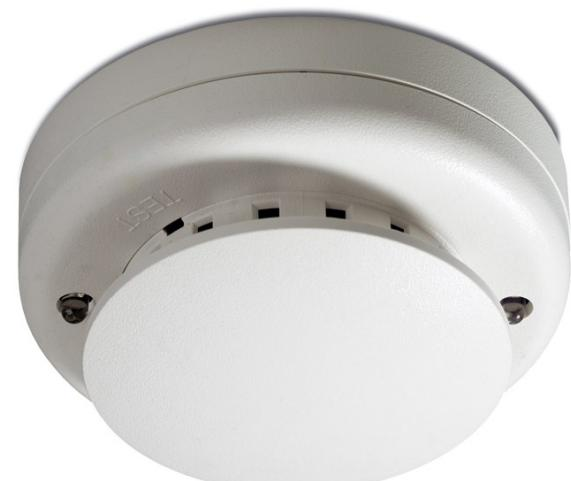

## Produktblad

# DP721I

Optisk rökdetektor med indikeringsutgång

### DP721I

DP721I är en rökdetektor avsedd för anslutning till konventionella centralapparater som till exempel UTC Fire & Securitys 1X-serie. Detektorn uppfyller kraven enligt EN54.

#### Unik mätkammare

DP721I arbetar efter principen med reflekterat ljus och den patenterade mätkammaren ger en säker detektering även i ett tidigt stadium av ett brandförlopp. En gång per dygn sker en fullständig egentest av elektronik och mätkammaren. Vid fel tänds en gul lysdiod på detektorn och det behövs ej någon speciell testutrustning.

#### Kompensering

Förändringar av detektorns känslighet förorsakad av till exempel nedsmutsning kompenseras automatiskt. På så sätt bibehålles den känslighet som ursprungligen kalibrerats enligt specifikationen i EN54 och risken för obefogade larm minimeras.

#### Servicevänlig

Tack vare att mätkammaren är lätt utbytbar kan service och underhåll effektiviseras. Detektorns status och behov av rengöring kan kontrolleras med hjälp av den inbyggda testfunktionen. För vissa av UTC Fire & Securitys centralapparater sker även en automatisk felindikering.

#### Standardprestanda

- EAutomatisk egendiagnostik
- ETest på plats utan extra mätutrustning
- EOptisk sensor med kammare som kan bytas på plats och lämnas för återvinning (miljövänlig)
- ESeparata lysdioder för brand och fel
- E Kan matas med 12-24 VDC
- E Inte polaritetskänslig
- EHög immunitet mot falsklarm
- EUtgång för dold detektorindikering
- EGodkänd enligt EN 54 och CPR-certifierad

# DP721I

Optisk rökdetektor med indikeringsutgång

### Tekniska data

| Drivspänning               | 8,5-33 VDC                 |
|----------------------------|----------------------------|
| Strömförbrukning           |                            |
| I vila vid 24 V            | 100 µA max                 |
| Vid larm vid 24 V          | 60 mA                      |
| Larmindikering             | Vit lysdiod (röd vid larm) |
| Felindikering              | Gul lysdiod                |
| Utgång för fjärrindikering | 30 mA                      |
| Luftfuktighet              | 0-95 %, icke kondenserande |
| IP-klass                   | IP43                       |
| Mått                       | Ø 10 cm, H = 5 cm          |
| Temeperaturområde          | -10 °C till +60 °C         |

| Order data    |                                                                                     |
|---------------|-------------------------------------------------------------------------------------|
| Artikelnummer | Beskrivning                                                                         |
| DP721I        | Optisk rökdetektor med indikeringsutgång                                            |
| DP721R        | Optisk rökdetektor med växlande reläutgång                                          |
| DP721RT       | Kombinerad optisk rök- och värmedetektor med växlande relä                          |
| DP721RTA      | Kombinerad optisk rök- och värmedetektor växlande reläutgång & autoåterställning |
| DB702         | Sockel för detektorer i 700-serien                                                  |
| 211           | Sats om 10 optiska rökkammare för utbyte                                            |

