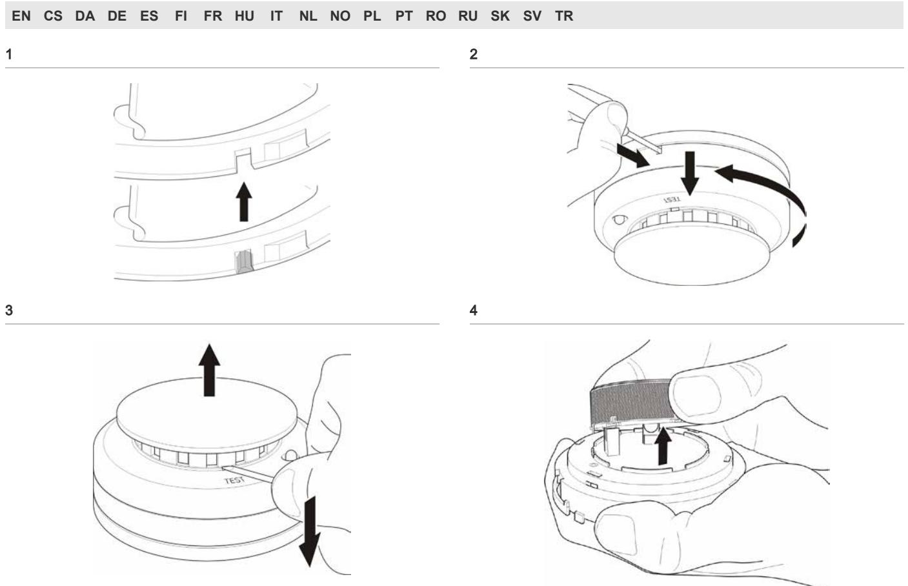

# 700 Series Conventional Point Detectors Installation Sheet

## **EN: Installation Sheet**

#### **Description**

The Dx700 series of conventional point fire detectors are used with DB702 and DB702U Mounting Bases.

|  |  | Table 1: Dx700 Series Conventional Point Detectors |  |  |
|--|--|----------------------------------------------------|--|--|
|--|--|----------------------------------------------------|--|--|

| Model     | Detector type                                                                  |
|-----------|--------------------------------------------------------------------------------|
| DP721I    | Optical Smoke Detector with Remote Indicator Output                            |
| DP721R    | Optical Smoke Detector with Relay Output                                       |
| DP721RT   | Optical/Heat Multi Detector with Relay Output                                  |
| DP721RTA* | Multi Detector, complete with Relay Auto Reset                                 |
| DP721T    | Optical/Heat Multi Detector with Remote Indicator Output                       |
| DT713-5   | Heat Detector, 57° C fixed and rate of rise heat detector                      |
| DT713-5R  | Heat Detector, 57° C fixed and rate of rise heat detector with relay output |
| DT713-7   | Heat Detector, 70°C fixed and rate of rise heat detector                       |

**WARNING:** The DP721RTA* must not be used in fire detection systems requiring detectors to comply with EN 54-7/CEA4021 standards.

## **Installation**

**Caution:** For general guidelines on system planning, design, installation, commissioning, use and maintenance, refer to CEN/TS 54-14 and to local regulations.

**To install a detector:** 

- 1. Insert the detector head into the mounting base and rotate it clockwise until it clicks into place.
The detector may be locked into the mounting base if required. To do this remove the locking tab on the detector before installation (Figure 1).

Every 700 Series base features a continuity link between LINE IN (1) and LINE OUT (2) terminals of the conventional detector circuit. The base is supplied with the link in closed position. The link is enabled by default allowing you to check the zone wiring using only the bases. The link will automatically disconnect when a detector is inserted, allowing the panel to generate a fault message when the detector is removed.

Always test detectors after installation.

**Note**: Please note that all models in the Dx700 series are polarity insensitive. Polarity must be observed when using remote indicators.

### **Maintenance**

**To remove a locked detector:** 

- 1. Insert a small screwdriver into the locking tab slot (Figure 2).
- 2. Press in and rotate the detector anticlockwise.

All detectors ship with a plastic dust cover. Smoke detectors will not work with the dust cover in place. It must be removed when installation is completed, before testing.

**To replace the optical chamber:**

- 1. Remove the detector head from the mounting base.
- 2. Remove the detector cover by inserting a screwdriver and lifting as shown in Figure 3.
- 3. Remove the used optical chamber from the detector (Figure 4) and insert the replacement optical chamber.
- 4. Replace the detector cover by placing onto detector head and pushing down until it clicks into place. Install the detector back into the mounting base.
- 5. Test the detector according to local regulations and verify that it signals an alarm at the control panel.

To clean the optical chamber, follow the above instructions for removal and use compressed air to clear the dust.

**Caution:** After replacing or cleaning the optical chamber, check for sensitivity with the sensitivity level test described below.

#### **Testing**

For in-depth sensitivity testing, see sensitivity level test mode in Table 2 below. The test is initiated by holding a magnet to the integral reed switch, marked by the word TEST on the detector housing. The test results are indicated by the number of times the LED flashes, as shown. Reset the detector once testing is completed.

| Obscuration [1] | Flashes | Indication                                                                                           |
|-----------------|---------|------------------------------------------------------------------------------------------------------|
|                 | 1       | Unserviceable hardware fault is detected.                                                         |
|                 |         | Reset detector and re-run test. If indication remains the same, replace detector.              |
| > 9             | 2       | The detector is not sensitive enough.                                                                |
| 8.4             | 3       | Clean per instructions. Check to make sure the optical block cover is snapped down completely. |
| 7.2             | 4       | The detector is within the sensitivity limits.                                                    |
| 6.1             | 5       | None.                                                                                                |
| 4.9             | 6       |                                                                                                      |
| 3.8             | 7       |                                                                                                      |
| 2.6             | 8       | The detector is too sensitive.                                                                       |
| < 2             | 9       | Clean per instructions                                                                               |

[1] Approximate based on (% / m) photo detector

## **Specifications**

| Operating voltage                                                                         | 8.5 to 33 VDC                                   |
|-------------------------------------------------------------------------------------------|-------------------------------------------------|
| Current Standby Alarm                                                               | 100 µA 15 to 60 mA                           |
| Relay contact                                                                             | 2 A at 30 VDC 1 A at 120 VAC                 |
| IP rating                                                                                 | IP43                                            |
| Compatible mounting bases                                                              | DB702, DB702U                                   |
| Relative humidity                                                                         | 0 to 95% noncondensing                          |
| Temperature Operating Storage                                                       | −10 to 60ºC −10 to 70ºC                      |
| Colour                                                                                    | White                                           |
| Dimensions (Ø × H)                                                                        | 100 × 50 mm                                     |
| Weight DP721I, DP721RTA DP721R, DP721RT DP721T DT713-5 DT713-5R DT713-7 | 112 g 115 g 109 g 84 g 87 g 85 g |

## **Regulatory information**

This section includes both regulatory information and a summary on the declared performance according to the Construction Products Regulation 305/2011. For detailed information refer to the product Declaration of Performance.

| Certification                                                      |                                                                                                                               |
|--------------------------------------------------------------------|-------------------------------------------------------------------------------------------------------------------------------|
| Certification body                                                 | 1134                                                                                                                          |
| Declaration of Performance number                               |                                                                                                                               |
| DP721I, DP721R DT713-5, DT713-5R, DT713-7 DP721RT, DP721T | 360-4227-0399 360-4227-0599 360-4227-0599 360-4227-0799                                                              |
| Year of first CE marking                                           | 05                                                                                                                            |
| Product identification                                             | DP721I, DP721RTA, DP721R, DP721RT, DP721T, DT713-5, DT713-5R, DT713-7                                                   |
| Intended use                                                       | See DoP point 3                                                                                                               |
| Essential characteristics                                          | See DoP point 9                                                                                                               |
| Manufacturer                                                       | Gulf Security Technology Co.,Ltd 80, Changjiang East Road, QETDZ, Qinhuangdao, Hebei Province, China 066004          |
|                                                                    | EU authorized manufacturing representative: UTC Fire & Security B.V., Kelvinstraat 7, 6003 DH Weert, The Netherlands |

## **Contact information**

For contact information see our Web site: www.utcfssecurityproducts.eu.

## **CS: Instalační návod**

## **Popis**

Řada Dx700 konvenčních bodových požárních hlásičů se používá s montážními základnami DB702 a DB702U.

#### **Tabulka 1: Konvenční bodové hlásiče řady Dx700**

| Model    | Typ hlásiče                                                                                       |
|----------|---------------------------------------------------------------------------------------------------|
| DP721I   | Optický kouřový hlásič s výstupem pro vzdálený indikátor                                          |
| DP721R   | Optický kouřový hlásič s výstupem relé                                                            |
| DP721RT  | Optický/teplotní kombinovaný hlásič s výstupem relé                                               |
| DP721RTA | Optický/teplotní kombinovaný hlásič s funkcí automatického resetování relé (viz poznámka dole) |
| DP721T   | Optický/teplotní kombinovaný hlásič s výstupem pro vzdálený indikátor                          |
| DT713-5  | Teplotní hlásič, teplota 57° C a nárůst teploty                                                   |
| DT713-5R | Teplotní hlásič, teplota 57° C a nárůst teploty, výstup relé                                   |
| DT713-7  | Teplotní hlásič, teplota 70° C a nárůst teploty                                                   |

**VAROVÁNÍ:** Hlásič DP721RTA nesmí být používán v rámci protipožárních systémů, u nichž je vyžadován soulad hlásičů s normami EN 54-7/CEA4021.

#### **Instalace**

**Upozornění:** Všeobecné pokyny týkající se projektování systému, návrhu, instalace, uvedení do provozu, používání a údržby podléhají normě CEN/TS 54-14 a místním předpisům.

#### **Postup instalace hlásiče:**

- 1. Vložte hlavu hlásiče do montážní základny a otočte ji ve směru hodin, až zapadne na místo.
V případě potřeby lze hlásič v montážní základně uzamknout. Chcete-li to provést, vyjměte před instalací pojistnou západku z hlásiče (Obr. 1).

Základny řady 700 jsou vybaveny obvodem zajišťujícím propojení mezi svorkami LINE IN (1) a LINE OUT (2) obvodu konvenčního hlásiče. Základna je dodávána s propojovacím obvodem v sepnuté poloze. Propojení je ve výchozím stavu aktivní a umožňuje kontrolu zapojení zóny pouze pomocí základen. Propojení se automaticky přeruší, když vložíte hlásič; ústředna pak bude generovat chybové zprávy, dojde-li k odstranění hlásiče.

Po instalaci vždy hlásiče otestujte.

**Poznámka**: Všechny modely řady Dx700 umožňují použití libovolné polarity. Polaritu je nutné zohlednit při použití vzdálených indikátorů.

### **Údržba**

**Postup vyjmutí uzamknutého hlásiče:**

- 1. Vsuňte malý šroubovák do otvoru pro pojistnou západku (Obr. 2).
- 2. Zatlačte na hlásič a otočte jej proti směru hodin.

Všechny hlásiče jsou dodávány s platovým krytem proti prachu. Kouřové hlásiče nebudou funkční, ponecháte-li protiprachový kryt na místě. Kryt je nutné po dokončení instalace před testováním sejmout.

#### **Postup výměny optické komory:**

- 1. Vyjměte hlavu hlásiče z montážní základny.
- 2. Sejměte kryt hlásiče zasunutím šroubováku a zvednutím podle znázornění na Obr. 3.
- 3. Vyjměte použitou optickou komoru z hlásiče (Obr. 4) a vložte náhradní optickou komoru.
- 4. Vraťte zpět kryt hlásiče umístěním na hlavu hlásiče a zatlačením, až zapadne na místo. Umístěte hlásič zpět do montážní základny.
- 5. Otestujte hlásič podle místních nařízení a ověřte, že signalizuje poplach na ústředně.

Chcete-li optickou komoru vyčistit, postupujte podle výše uvedených pokynů pro demontáž a odstraňte prach pomocí stlačeného vzduchu.

**Upozornění:** Po výměně nebo čištění optické komory zkontrolujte citlivost pomocí testu úrovně citlivosti, který je popsán níže.

#### **Testování**

Chcete-li provést podrobný test citlivosti, použijte test úrovně citlivosti popsaný v tabulce 2 dále. Test zahájíte přidržením magnetu u integrálního spínače s jazýčkovými kontakty označeného slovem TEST na krytu hlásiče. Výsledky testu jsou udávány počtem bliknutí indikátoru LED; viz znázornění. Po dokončení testování hlásič resetujte.

#### **Tabulka 2: Test úrovně citlivosti**

| Zakouření [1] | Počet bliknutí | Indikace                                                                                               |
|---------------|-------------------|--------------------------------------------------------------------------------------------------------|
|               | 1                 | Byla zjištěna neopravitelná závada zařízení.                                                        |
|               |                   | Resetujte hlásič a spusťte test znovu. Pokud je indikace stejná, vyměňte hlásič.                 |
| > 9           | 2                 | Hlásič není dostatečně citlivý.                                                                        |
| 8.4           | 3                 | Proveďte čištění podle pokynů. Zkontrolujte, zda je kryt optického bloku zcela zasazen na místo. |
| 7.2           | 4                 | Hlásič funguje v rámci mezí citlivosti.                                                                |
| 6.1           | 5                 | Žádná.                                                                                                 |
| 4.9           | 6                 |                                                                                                        |
| 3.8           | 7                 |                                                                                                        |
| 2.6           | 8                 | Hlásič je příliš citlivý.                                                                              |
| < 2           | 9                 | Proveďte čištění podle pokynů.                                                                         |

[1] Přibližná hodnota na základě hodnoty ze snímače (% / m).

### **Specifikace**

| Provozní napětí                                                                             | 8,5 až 33 V ss                                  |
|---------------------------------------------------------------------------------------------|-------------------------------------------------|
| Proud Pohotovost Poplach                                                              | 100 µA 15 až 60 mA                           |
| Kontakty relé                                                                               | 2 A při 30 V ss 1 A při 120 V st             |
| Stupeň krytí                                                                                | IP43                                            |
| Kompatibilní montážní základny                                                           | DB702, DB702U                                   |
| Relativní vlhkost                                                                           | 0 až 95 % (nekondenzující)                      |
| Teplota Provoz Skladování                                                             | −10 až 60 ºC −10 až 70 ºC                    |
| Barva                                                                                       | Bílá                                            |
| Rozměry (Ø × V)                                                                             | 100 × 50 mm                                     |
| Hmotnost DP721I, DP721RTA DP721R, DP721RT DP721T DT713-5 DT713-5R DT713-7 | 112 g 115 g 109 g 84 g 87 g 85 g |

## **Informace o příslušných předpisech a nařízeních**

Tato část zahrnuje jak informace o předpisech tak i shrnutí vlastností uvedených v prohlášení podle Nařízení EU č. 305/2011 o stavebních výrobcích. Podrobné informace naleznete v prohlášení o vlastnostech výrobku.

| Certifikace                        |                                                                                                                     |
|------------------------------------|---------------------------------------------------------------------------------------------------------------------|
| Certifikační orgán                 | 1134                                                                                                                |
| Číslo Prohlášení o vlastnostech |                                                                                                                     |
| DP721I, DP721R                     | 360-4227-0399                                                                                                       |
| DT713-5, DT713-5R,                 | 360-4227-0599                                                                                                       |
| DT713-7                            | 360-4227-0599                                                                                                       |
| DP721RT, DP721T                    | 360-4227-0799                                                                                                       |
| Rok prvního označení CE            | 05                                                                                                                  |
| Identifikace výrobku               | DP721I, DP721RTA, DP721R, DP721RT, DP721T, DT713-5, DT713-5R, DT713-7                                         |
| Účel použití                       | Viz bod 3 v Prohlášení o vlastnostech                                                                               |
| Základní charakteristiky           | Viz bod 9 v Prohlášení o vlastnostech                                                                               |
| Výrobce                            | Gulf Security Technology Co.,Ltd 80, Changjiang East Road, QETDZ, Qinhuangdao, Hebei Province, Čína 066004 |
|                                    | Autorizované zastoupení výrobce v EU: UTC Fire & Security B.V., Kelvinstraat 7, 6003 DH Weert, Nizozemsko  |

### **Kontaktní informace**

Kontaktní informace naleznete na našich webových stránkách: www.utcfssecurityproducts.eu.

## **DA: Installationsvejledning**

#### **Beskrivelse**

Dx700-seriens konventionelle punkt-branddetektorer bruges sammen med soklerne DB702 og DB702U.

| Model    | Detektortype                                                                    |
|----------|---------------------------------------------------------------------------------|
| DP721I   | Optisk røgdetektor med eksternt indikator-output                                |
| DP721R   | Optisk røgdetektor med relæ-output                                              |
| DP721RT  | Optisk/varme multidetektor med relæ-output                                      |
| DP721RTA | Multidetektor, komplet med automatisk retablering af relæ (se note herunder) |
| DP721T   | Optisk/varme multidetektor med eksternt indikator-output                        |
| DT713-5  | Varmedetektor, 57° C statisk og differential detektering                        |
| DT713-5R | Varmedetektor, 57° C statisk og differential detektering, med relæ-output    |
| DT713-7  | Varmedetektor, 70° C statisk og differential detektering                        |

#### **ADVARSEL:** DP721RTA må ikke bruges i branddetekteringssystemer, hvor der kræves detektorer for at

overholde EN 54-7/CEA4021-standarderne.

## **Installation**

**Bemærk:** Vær opmærksom på de generelle retningslinjer for systemplanlægning, installation, ibrugtagning, anvendelse og vedligeholdelse i henhold til CEN/TS 54-14 samt lokale bestemmelser.

#### **Sådan installeres en detektor:**

- 1. Indsæt detektorhovedet i soklen, og drej det med uret, indtil det klikker på plads.
Detektoren kan låses fast i soklen, hvis det er nødvendigt. For at gøre dette skal låsemekanismen på detektoren fjernes før installation (figur 1).

Alle 700-seriens sokler har et kontinuitetslink mellem det konventionelle detektorkredsløbs LINE IN (1)- og LINE OUT (2)-terminaler. Soklen leveres med linket i lukket position. Linket er deaktiveret som standard, så du kan tjekke gruppetilslutningerne med soklerne alene. Linket vil automatisk afbryde, når der indsættes en detektor, så centralen kan generere en fejlmeddelelse, når detektoren fjernes.

Test altid detektorer efter installation.

**Bemærk**! Detektorer hovederne i Dx700 serien er ikke polaritetsafhængige.

Polariteten skal dog overholdes, når der anvendes fjernindikatorer.

## **Vedligeholdelse**

**Sådan fjernes en låst detektor:** 

- 1. Indsæt en lille skruetrækker i låsemekanismen (figur 2).
- 2. Tryk ind og drej detektoren mod uret.

Alle detektorer leveres med et støvdæksel af plastik. Røgdetektorer fungerer ikke med støvdækslet monteret. Det skal fjernes efter installeringen, inden der testes.

#### **Sådan udskiftes det optiske kammer:**

- 1. Fjern detektorhovedet fra soklen.
- 2. Fjern detektordækslet ved at indsætte en skruetrækker og løfte som vist i figur 3.
- 3. Fjern det brugte optiske kammer fra detektoren (figur 4) og indsæt det nye optiske kammer.
- 4. Montér et nyt detektordæksel ved at placere det på detektorhovedet, indtil det kommer på plads med et klik. Installér detektoren på soklen igen.
- 5. Test detektoren i henhold til lokale regler, og kontroller, at der vises en alarm på centralen.

For at rengøre det optiske kammer skal du følge vejledningen ovenfor, for fjernelse og brug af trykluft til fjernelse af støv.

**Bemærk:** Efter udskiftning eller rengøring af det optiske kammer skal du kontrollere følsomheden ved hjælp af følsomhedstesten som beskrevet herunder.

#### **Test**

For en mere udførlig beskrivelse af følsomhedsniveau, se venligst tabel 2. Testen startes ved at holde en magnet op imod den interne reedkontakt, som er markeret med ordet TEST på detektoren Testresultaterne indikeres som vist med antallet af gange, LED'en blinker. Retablér detektoren efter testen.

|  |  |  |  |  | Tabel 2: Tilstand for test af følsomhedsniveau |  |
|--|--|--|--|--|------------------------------------------------|--|
|--|--|--|--|--|------------------------------------------------|--|

| Dæmpning [1] | Blink | Indikation                                                                                                     |
|--------------|-------|----------------------------------------------------------------------------------------------------------------|
|              | 1     | Der er registreret en hardwarefejl, som ikke kan rettes.                                                    |
|              |       | Retabler detektoren, og kør testen igen. Udskift detektoren, hvis indikationen forbliver den samme.      |
| > 9          | 2     | Detektoren er ikke tilstrækkelig følsom.                                                                    |
| 8.4          | 3     | Rengør ifølge vejledningen. Kontroller for at sikre, at det optiske blokeringsdæksel er lukket helt ned. |
| 7.2          | 4     | Sensoren er inden for følsomhedsgrænserne.                                                                  |
| 6.1          | 5     | Ingen.                                                                                                         |
| 4.9          | 6     |                                                                                                                |
| 3.8          | 7     |                                                                                                                |
| 2.6          | 8     | Detektoren er for følsom.                                                                                      |
| < 2          | 9     | Rengør ifølge vejledningen.                                                                                    |

[1] Anslået baseret på (% / m) fotodetektor

#### **Specifikationer**

| Driftsspænding                                                                          | 8,5 til 33 V DC                                 |  |  |
|-----------------------------------------------------------------------------------------|-------------------------------------------------|--|--|
| Strøm Standby Alarm                                                               | 100 µA 15 til 60 mA                          |  |  |
| Relækontakt                                                                             | 2 A ved 30 V DC 1 A ved 120 V AC             |  |  |
| IP-klasse                                                                               | IP43                                            |  |  |
| Kompatible detektorsokler                                                               | DB702, DB702U                                   |  |  |
| Relativ luftfugtighed                                                                   | 0 til 95 % ikke-kondenserende                   |  |  |
| Temperatur Drift Opbevaring                                                       | –10 til 60 ºC –10 til 70 ºC                  |  |  |
| Farve                                                                                   | Hvid                                            |  |  |
| Dimensioner (Ø × H)                                                                     | 100 × 50 mm                                     |  |  |
| Vægt DP721I, DP721RTA DP721R, DP721RT DP721T DT713-5 DT713-5R DT713-7 | 112 g 115 g 109 g 84 g 87 g 85 g |  |  |

## **Lovgivningsmæsig information**

Dette afsnit omfatter både lovgivningsmæssige oplysninger og et resumé på den deklarerede ydeevne i henhold til byggevare forordningen 305/2011. For nærmere oplysninger henvises til produktet erklæring af ydeevne.

| Certificering                                                      |                                                                                                                         |  |  |
|--------------------------------------------------------------------|-------------------------------------------------------------------------------------------------------------------------|--|--|
| Certificeringsorgan                                                | 1134                                                                                                                    |  |  |
| Erklæring af ydeevne nummer                                     |                                                                                                                         |  |  |
| DP721I, DP721R DT713-5, DT713-5R, DT713-7 DP721RT, DP721T | 360-4227-0399 360-4227-0599 360-4227-0599 360-4227-0799                                                        |  |  |
| År for første CE-mærkning                                          | 05                                                                                                                      |  |  |
| Produktidentifikation                                              | DP721I, DP721RTA, DP721R, DP721RT, DP721T, DT713-5, DT713-5R, DT713-7                                             |  |  |
| Tilsigtet brug                                                     | Se punkt 3 i erklæringen                                                                                                |  |  |
| Væsentlige karakteristika                                          | Se punkt 9 i erklæringen                                                                                                |  |  |
| Producent                                                          | Gulf Security Technology Co.,Ltd 80, Changjiang East Road, QETDZ, Qinhuangdao, Hebei Province, Kina 066004     |  |  |
|                                                                    | Virksomhedens autoriserede repræsentant i EU: UTC Fire & Security B.V., Kelvinstraat 7, 6003 DH Weert, Holland |  |  |

## **Kontaktinformation**

Kontaktinformation kan findes på vores webside: www.utcfssecurityproducts.eu.

## **DE: Installationsanleitung**

## **Beschreibung**

Die Dx700-Reihe der konventionellen Melder wird mit DB702 und DB702U-Meldersockeln verwendet.

#### **Tabelle 1: Dx700-Serie konventioneller Melder**

| Modell   | Meldertyp                                                                                            |
|----------|------------------------------------------------------------------------------------------------------|
| DP721I   | Optischer Rauchmelder mit der Möglichkeit zum Anschluss einer externen Parallelanzeige            |
| DP721R   | Optischer Rauchmelder mit Relaisausgang                                                              |
| DP721RT  | Mehrsensormelder (Optisch/Wärme) mit Relaisausgang                                                   |
| DP721RTA | Mehrsensormelder, komplett mit automatischem Relais Reset (siehe Notiz unten)                     |
| DP721T   | Mehrsensormelder (Optisch/Wärme) mit der Möglichkeit zum Anschluss einer externen Parallelanzeige |
| DT713-5  | Wärmemelder, 57° C Maximal-und Differentialauswertung                                             |
| DT713-5R | Wärmemelder, 57° C Maximal-und Differentialauswertung mit Relaisausgang                           |
| DT713-7  | Wärmemelder, 70°C Maximal-und Differentialauswertung                                              |

**WARNUNG:** Der Rauchmelder DP721RTA darf nicht in Brandmelderzentralen verwendet werden, in denen die Melder den Standards EN 54-7/CEA4021 entsprechen müssen!

### **Installation**

**Achtung:** Beachten Sie bitte die allgemeinen Richtlinien zu Systemplanung und -entwurf, Installation, Inbetriebnahme, Verwendung und Wartung gemäß CEN/TS 54-14, sowie die örtlichen Vorschriften.

#### **Melder installieren:**

- 1. Setzen Sie den Melderkopf in den Montagesockel ein und drehen Sie ihn im Uhrzeigersinn, bis er einrastet.
Der Melder kann falls erforderlich im Montagesockel verriegelt werden. Entfernen Sie dazu vor der Installation das Verschlussstück am Melder (Abbildung 1).

Jeder Sockel der 700-Serie verfügt über einen Überbrückungsschalter zwischen der LINE IN (1)- und LINE OUT (2)-Anschlussklemme im Schaltkreis des konventionellen Melders. Der Sockel wird mit geschlossenem Überbrückungsschalter geliefert. Der Überbrückungsschalter ist standardmäßig aktiviert, was Ihnen ermöglicht, die Meldergruppenverkabelung nur mithilfe der Sockel zu überprüfen. Der Überbrückungsschalter wird automatisch getrennt, wenn ein Melder eingesetzt wird, wodurch die Brandmelderzentrale eine Störungsmeldung bei Entfernen des Melders erzeugen kann.

Melder sollten nach der Installation stets getestet werden.

**Hinweis**: Beachten Sie bitte, dass für die Modelle der Dx700- Serie keine Polaritätsvorgabe gilt. Beim Anschluss einer Parallelanzeige muss die Polarität beachtet werden.

## **Wartung**

#### **Einen verriegelten Melder entfernen:**

- 1. Führen Sie einen kleinen Schraubendreher in die Aussparung des Verschlussstücks ein (Abbildung 2).
- 2. Drücken Sie ihn nach innen und drehen Sie den Melder gegen den Uhrzeigersinn.

Alle Melder werden mit einer Staubschutzabdeckung aus Kunststoff ausgeliefert. Der Rauchmelder funktioniert nicht mit angebrachter Schutzabdeckung. Die Schutzabdeckung muss nach abgeschlossener Installation und vor dem Testlauf entfernt werden.

#### **So ersetzen Sie die Rauchkammer:**

- 1. Entfernen Sie den Melderkopf vom Montagesockel.
- 2. Entfernen Sie die Melderabdeckung, indem Sie einen Schraubendreher einführen und die Abdeckung anheben, wie in Abbildung 3 gezeigt.
- 3. Entfernen Sie die alte Rauchkammer aus dem Melder (Abbildung 4) und setzen Sie die Ersatzrauchkammer ein.
- 4. Setzen Sie die Melderabdeckung wieder auf den Melderkopf und drücken Sie die Abdeckung nach unten, bis sie einrastet. Setzen Sie den Melder zurück in den Montagesockel.

- 5. Testen Sie den Melder gemäß den örtlichen Vorschriften und prüfen Sie, ob er ein Alarmsignal an die Brandmelderzentrale senden kann.
Um die Rauchkammer zu reinigen, befolgen Sie die oben genannten Anweisungen zur Entfernung der Kammer, und verwenden Sie Druckluft, um die Kammer von Staub zu befreien.

**Achtung:** Nach Ersetzen oder Reinigen der Rauchkammer muss die Empfindlichkeit geprüft werden. Verwenden Sie dazu den unten beschriebenen Empfindlichkeitstest.

#### **Testen**

Weitere Informationen zum genaueren Feststellen der Empfindlichkeit finden Sie unter "Empfindlichkeitstestmodus" in Tabelle 2 unten. Der Test wird initiiert, indem ein Magnet an den integrierten Reedschalter gehalten wird, der durch das Wort TEST am Meldergehäuse gekennzeichnet ist. Die Testergebnisse werden an der Anzahl der LED-Blinksignale abgelesen, wie unten beschrieben. Setzen Sie den Melder zurück, wenn der Test abgeschlossen ist.

#### **Tabelle 2: Empfindlichkeitstestmodus**

| Verdunkelung [1] | Blinksignale | Anzeige                                                                                                                                |
|------------------|--------------|----------------------------------------------------------------------------------------------------------------------------------------|
|                  | 1            | Nicht behebbaren Hardwarefehler gefunden.                                                                                           |
|                  |              | Setzen Sie den Melder zurück, und führen Sie den Test erneut aus. Bleibt die Anzeige unverändert, ersetzen Sie den Melder. |
| > 9              | 2            | Der Melder ist nicht empfindlich genug.                                                                                             |
| 8.4              | 3            | Reinigen Sie ihn wie vorgeschrieben. Überprüfen Sie, dass der Rauchkammerblock vollständig eingerastet ist.                   |
| 7.2              | 4            | Die Empfindlichkeit des Melders liegt innerhalb der Grenzwerte.                                                                     |
| 6.1              | 5            | Keine.                                                                                                                                 |
| 4.9              | 6            |                                                                                                                                        |
| 3.8              | 7            |                                                                                                                                        |
| 2.6              | 8            | Der Melder ist zu empfindlich.                                                                                                         |
| < 2              | 9            | Reinigen Sie ihn wie vorgeschrieben.                                                                                                |

[1] Ungefährer Wert, basierend auf (% / m) Fotodetektor

## **Technische Daten**

| 8,5 bis 33V Gleichspannung |  |
|----------------------------|--|
|                            |  |
| 100µA                      |  |
| 15 bis 60mA                |  |
| 2A bei 30V Gleichspannung  |  |
| 1A bei 120V Gleichspannung |  |
| IP43                       |  |
|                            |  |

| Kompatible Montagesockel | DB702, DB702U                 |
|-----------------------------|-------------------------------|
| Relative Luftfeuchtigkeit   | 0 bis 95% nicht kondensierend |
| Temperatur                  |                               |
| Betrieb                     | −10 bis 60ºC                  |
| Lagerung                    | −10 bis 70ºC                  |
| Farbe                       | Weiß                          |
| Abmessungen (Ø × H)         | 100 × 50 mm                   |
| Gewicht                     |                               |
| DP721I, DP721RTA            | 112g                          |
| DP721R, DP721RT             | 115 g                         |
| DP721T                      | 109 g                         |
| DT713-5                     | 84 g                          |
| DT713-5R                    | 87 g                          |
| DT713-7                     | 85 g                          |

## **Regulatorische Informationen**

Dieser Abschnitt beinhaltet sowohl regulatorische Informationen und eine Zusammenfassung der erklärten Leistung nach der Bauproduktenrichtlinie Verordnung 305/2011. Ausführliche Informationen finden Sie auf der Produkt-Erklärung der Leistung.

| Zertifikat                                                                                                |                                                                                                                      |
|-----------------------------------------------------------------------------------------------------------|----------------------------------------------------------------------------------------------------------------------|
| Hersteller                                                                                                | 1134                                                                                                                 |
| Erklärung der Performance-Nummer DP721I, DP721R DT713-5, DT713-5R, DT713-7 DP721RT, DP721T | 360-4227-0399 360-4227-0599 360-4227-0599 360-4227-0799                                                     |
| Jahr der ersten CE Kennzeichnung                                                                       | 05                                                                                                                   |
| Produktidentifikation                                                                                     | DP721I, DP721RTA, DP721R, DP721RT, DP721T, DT713-5, DT713-5R, DT713-7                                          |
| Beabsichtigte Verwendung                                                                                  | Siehe Punkt 3 in der Erklärung                                                                                       |
| Wesentlichen Merkmale                                                                                     | Siehe Punkt 9 in der Erklärung                                                                                       |
| Hersteller                                                                                                | Gulf Security Technology Co.,Ltd 80, Changjiang East Road, QETDZ, Qinhuangdao, Hebei Province, China 066004 |
|                                                                                                           | Autorisierter EU-Produktionsvertreter: UTC Fire & Security B.V., Kelvinstraat 7, 6003 DH Weert, Niederlande    |

## **Kontaktinformationen**

Kontaktinformationen finden Sie auf unserer Website: www.utcfssecurityproducts.eu.

## **ES: Hoja de instalación**

## **Descripción**

La serie Dx700 de detectores de incendio puntuales convencionales se utiliza con los zócalos de montaje DB702 y DB702U.

#### **Tabla 1: Detectores puntuales convencionales de la serie Dx700**

| Modelo   | Tipo de detector                                                                               |  |
|----------|------------------------------------------------------------------------------------------------|--|
| DP721I   | Detector óptico de humo con salida de piloto de acción                                         |  |
| DP721R   | Detector óptico de humo con salida de relé                                                     |  |
| DP721RT  | Detector múltiple óptico/térmico con salida de relé                                            |  |
| DP721RTA | Detector múltiple, completo con restablecimiento automático de relé (ver nota más adelante) |  |
| DP721T   | Detector múltiple óptico/térmico con salida de piloto de acción                             |  |
| DT713-5  | Detector de temperatura, 57° C termovelocimétrico                                              |  |
| DT713-5R | Detector de temperatura, 57° C termovelocimétrico con salida de relé                        |  |
| DT713-7  | Detector de temperatura, 70°C termovelocimétrico                                               |  |

**ADVERTENCIA:** El DP721RTA no debe utilizarse en sistemas de detección de incendios que exijan que los detectores cumplan con las normas EN 54-7/CEA4021.

## **Instalación**

**Precaución:** Consulte la norma CEN/TS 54-14 y las normativas locales para obtener información acerca de las directrices de planificación, diseño, instalación, funcionamiento, utilización y mantenimiento del sistema.

#### **Cómo instalar un detector:**

- 1. Inserte la cabeza del detector en el zócalo de montaje y gírela en el sentido de las agujas del reloj hasta que oiga un click.
Si es necesario, el detector se puede bloquear en el zócalo de montaje. Para ello, hay que retirar la lengüeta de bloqueo del detector antes de la instalación (Figura 1).

Todos los zócalos de la serie 700 cuentan con un interruptor de continuidad entre los terminales de Línea de entrada (1) y Línea de salida (2). El zócalo es suministrado con el interruptor en su posición cerrada. El interruptor está habilitado por defecto, lo que le permite comprobar el cableado de la zona utilizando únicamente los zócalos. El enlace se desconectará automáticamente al insertar un detector, lo que permite que el panel genere un mensaje de fallo cuando se quite el detector.

Compruebe siempre los detectores tras su instalación.

**Nota**: Tenga en cuenta que todos los modelos de la serie Dx700 son insensibles a la polaridad. La polaridad se debe respetar al utilizar pilotos de acción.

## **Mantenimiento**

#### **Para quitar un detector bloqueado:**

- 1. Inserte un destornillador pequeño en la ranura de la lengüeta de bloqueo (Figura 2).
- 2. Apriete y gire el detector en el sentido contrario a las agujas del reloj.

Todos los detectores incluyen un protector contra el polvo de plástico. Los detectores de humo no funcionarán con el protector contra el polvo puesto. Hay que quitarlo una vez completada la instalación, antes de realizar la prueba.

**Para sustituir la cámara óptica:**

- 1. Extraiga la cabeza del detector del zócalo de montaje.
- 2. Retire el protector del detector insertando un destornillador y levantándolo como se muestra en la Figura 3.
- 3. Quite la cámara óptica usada del detector (Figura 4) e inserte la cámara óptica de sustitución.
- 4. Vuelva a colocar el protector del detector colocándolo sobre la cabeza del detector y apretando hasta que oiga 'click'. Vuelva a instalar el detector en el zócalo de montaje.
- 5. Pruebe el detector de acuerdo con las regulaciones locales y verifique que envía una señal de alarma al panel de control.

Para limpiar la cámara óptica, siga las instrucciones anteriores para su extraerlo y utilice aire comprimido para quitar el polvo.

**Precaución:** Tras sustituir o limpiar la cámara óptica, compruebe la sensibilidad con la prueba de nivel de sensibilidad que se describe más adelante.

#### **Prueba**

Si desea información detallada sobre las pruebas de sensibilidad, consulte a continuación el modo de prueba de nivel de sensibilidad en la tabla 2. La prueba se inicia colocando un imán en el interruptor 'reed', marcado con la palabra TEST en la carcasa del detector. Los resultados de las pruebas se indican con el número de veces que parpadea el LED, como se muestra. Restablezca el detector cuando se haya completado la prueba.

|  | Tabla 2: Modo de prueba de nivel de sensibilidad |
|--|--------------------------------------------------|
|--|--------------------------------------------------|

| Obscuración [1] | Parpadeos | Indicación                                                                                                                      |
|-----------------|-----------|---------------------------------------------------------------------------------------------------------------------------------|
|                 | 1         | Se ha detectado fallo de hardware inservible.                                                                                |
|                 |           | Restablezca el detector y vuelva a realizar la prueba. Si el indicador sigue igual, sustituya el detector.                |
| > 9             | 2         | El detector no es lo bastante sensible.                                                                                      |
| 8.4             | 3         | Realice una limpieza según las instrucciones. Asegúrese de que la cubierta del bloque óptico está totalmente encajada. |

| Obscuración [1] | Parpadeos | Indicación                                                 |
|-----------------|-----------|------------------------------------------------------------|
| 7.2             | 4         | El detector está dentro de los límites de sensibilidad. |
| 6.1             | 5         | Ninguna.                                                   |
| 4.9             | 6         |                                                            |
| 3.8             | 7         |                                                            |
| 2.6             | 8         | El detector es demasiado sensible.                         |
| < 2             | 9         | Realice una limpieza según las instrucciones            |

[1] Aproximación basada en el fotodetector (%/m)

## **Especificaciones**

| Tensión de funcionamiento      | De 8,5 a 33 VCC             |
|-----------------------------------|-----------------------------|
| Corriente                         |                             |
| Reposo                            | 100 µA                      |
| Alarma                            | de 15 a 60 mA               |
| Contacto de relé                  | 2 A a 30 VCC                |
|                                   | 1 A a 120 VCA               |
| Índice de protección              | IP43                        |
| Zócalos de montaje compatibles | DB702, DB702U               |
| Humedad relativa                  | De 0 a 95% sin condensación |
| Temperatura                       |                             |
| Funcionamiento                    | De –10 a 60 ºC              |
| Almacenamiento                    | De –10 a 70 ºC              |
| Color                             | Blanco                      |
| Dimensiones (Ø × Al)              | 100 × 50 mm                 |
| Peso                              |                             |
| DP721I, DP721RTA                  | 112 g                       |
| DP721R, DP721RT                   | 115 g                       |
| DP721T                            | 109 g                       |
| DT713-5                           | 84 g                        |
| DT713-5R                          | 87 g                        |
| DT713-7                           | 85 g                        |

## **Información relativa a las normativas**

Esta sección incluye información sobre normativas y un resumen sobre las características declaradas conforme al Reglamento de Productos de Construcción 305/2011. Para más información, consulte la Declaración de Prestaciones.

| Certificado                              |                                    |
|------------------------------------------|------------------------------------|
| Entidad de certificación                 | 1134                               |
| Número de Declaración de Prestaciones |                                    |
| DP721I, DP721R                           | 360-4227-0399                      |
| DT713-5, DT713-5R,                       | 360-4227-0599                      |
| DT713-7                                  | 360-4227-0599                      |
| DP721RT, DP721T                          | 360-4227-0799                      |
| Año inicial de marcado CE                | 05                                 |
| Identificación de producto               | DP721I, DP721RTA, DP721R,          |
|                                          | DP721RT, DP721T, DT713-5,          |
|                                          | DT713-5R, DT713-7                  |
| Uso previsto                             | Mirar el punto 3 de la Declaración |
| Características esenciales               | Mirar el punto 9 de la Declaración |

| Fabricante | Gulf Security Technology Co.,Ltd 80, Changjiang East Road, QETDZ, Qinhuangdao, Hebei Province, China 066004                 |
|------------|--------------------------------------------------------------------------------------------------------------------------------------|
|            | Representante de fabricación autorizado en Europa: UTC Fire & Security B.V., Kelvinstraat 7, 6003 DH Weert, Países Bajos |
|            |                                                                                                                                      |

## **Información de contacto**

Para obtener información de contacto, consulte nuestra página Web: www.utcfssecurityproducts.eu.

## **FI: Asennusohje**

## **Kuvaus**

Dx700-sarjan konventionaalisia paloilmaisimia käytetään DB702- ja DB702U-asennuspohjien kanssa.

**Taulukko 1: Dx700-sarjan konventionaaliset ilmaisimet**

| Malli    | Ilmaisimen tyyppi                                                                                         |
|----------|-----------------------------------------------------------------------------------------------------------|
| DP721I   | Optinen savuilmaisin, 2-johdinilmaisin                                                                    |
| DP721R   | Optinen savuilmaisin, jossa on relelähtö                                                                  |
| DP721RT  | Lämpö/savuyhdistelmäilmaisin, jossa on relelähtö                                                          |
| DP721RTA | Lämpö/savuyhdistelmäilmaisin, jossa on automaattikuittaus ja relelähtö (katso alla oleva huomautus) |
| DP721T   | Lämpö/savuyhdistelmäilmaisin, 2-johdinilmaisin                                                            |
| DT713-5  | Lämpöilmaisin, 57° C, 2-maksimaali ja differentiaali - ilmaisin                                        |
| DT713-5R | Lämpöilmaisin 57° C, maksimaali ja differentiaali - ilmaisin jossa on relelähtö                        |
| DT713-7  | Lämpöilmaisin, 70°C, maksimaali ja differentiaali - ilmaisin                                           |

#### **VAROITUS:** DP721RTA:ta ei saa käyttää paloilmoitinjärjestelmissä, joiden ilmaisimien on oltava EN 54-7- ja CEA4021-standardien mukaisia.

# **Asentaminen**

**Varoitus:** CEN/TS 54-14 -standardissa ja paikallisissa säännöksissä annetaan yleiset ohjeet järjestelmän suunnittelusta, mallista, asennuksesta, käyttöönotosta, käytöstä ja huollosta.

#### **Ilmaisimen asennus:**

- 1. Kiinnitä ilmaisinosa asennuspohjaan kiertämällä sitä myötäpäivään, kunnes se napsahtaa paikalleen.
Ilmaisin voidaan tarvittaessa lukita asennuspohjaan. Lukitse ilmaisin poistamalla ilmaisimen lukitusliuska ennen asennusta (kuva 1).

Jokaisessa 700-sarjan asennuspohjan kytkentänastat LINE IN (1) - ja LINE OUT (2) on ketjutettu. Pohja toimitetaan siten, että ketjutus on käytössä. Ketjutus on oletusarvoisesti käytössä, jotta asennuspohjien kytkentä voidaan tarkastaa kiinnittämättä ilmaisimia. Ketjutus katkeaa automaattisesti kun ilmaisin asetetaan paikalleen, jotta paneeli voi luoda vikailmoituksen, kun ilmaisin poistetaan.

Testaa aina ilmaisimet asennuksen jälkeen.

**Huomautus**: Huomaa, että mitkään Dx700-sarjan mallit eivät huomioi polaarisuutta. Polaarisuutta on seurattava hälytysmerkkivaloja käytettäessä.

### **Huolto**

**Avaa lukittu ilmaisin seuraavasti:**

- 1. Aseta pieni ruuvimeisseli lukitusliuskan uraan (kuva 2).
- 2. Paina se sisään ja kierrä ilmaisinta vastapäivään.

Toimitettaessa ilmaisimien päällä on punainen muovinen pölysuojus. Savuilmaisimet eivät toimi, jos pölysuojus on paikallaan. Se on poistettava ennen testaamista, kun asennus on valmis.

**Vaihda optinen kammio seuraavasti:**

- 1. Irrota ilmaisin asennuspohjasta.
- 2. Poista ilmaisimen kansiosa asettamalla ruuvimeisseli sen sisään ja nostamalla ruuvimeisseliä kuvassa 3 esitetyllä tavalla.
- 3. Poista käytetty optinen kammio ilmaisimesta (kuva 4) ja aseta uusi optinen kammio paikalleen.
- 4. Kiinnitä ilmaisimen kansiosa takaisin asettamalla se ilmaisimen päälle ja painamalla sitä alaspäin, kunnes se napsahtaa paikalleen. Kiinnitä ilmaisin takaisin asennuspohjaan.
- 5. Testaa ilmaisin paikallisten säännösten mukaisesti ja varmista, että se antaa hälytyssignaalin keskuslaitteelle.

Puhdista optinen kammio noudattamalla edellä kuvattuja irroitusohjeita ja poistamalla pöly paineilman avulla.

**Varoitus:** Kun olet vaihtanut tai puhdistanut optisen kammion, tarkista herkkyys alla kuvatulla herkkyystestillä.

#### **Testaaminen**

Alla olevan taulukon 2 Herkkyystestitila-kohdassa on tarkemmat tiedot herkkyyden testauksesta. Testi aloitetaan pitämällä magneettia TEST-merkinnän kohdalla. Testin tulos ilmaistaan merkkivalon vilkkumiskertojen määrällä (katso kuva). Palauta ilmaisin alkutilaan, kun testi on valmis.

| Herkkyys [1] | Vilkkumis kerrat | Selitys                                                                                                         |
|--------------|---------------------|-----------------------------------------------------------------------------------------------------------------|
|              | 1                   | Laitteistovika, jota ei voi korjata.                                                                            |
|              |                     | Palauta ilmaisin alkutilaan ja toista testi. Jos testi antaa saman ilmaisutuloksen, vaihda ilmaisin.      |
| > 9          | 2                   | Ilmaisin ei ole tarpeeksi herkkä.                                                                               |
| 8.4          | 3                   | Puhdista se ohjeiden mukaan. Tarkista, että optisen ilmaisimen kansiosa napsahtaa kokonaan paikalleen. |
| 7.2          | 4                   | Ilmaisimen herkkyys on rajojen sisäpuolella.                                                                 |
| 6.1          | 5                   | Ei lisätoimia.                                                                                                  |
| 4.9          | 6                   |                                                                                                                 |
| 3.8          | 7                   |                                                                                                                 |
| 2.6          | 8                   | Ilmaisin on liian herkkä.                                                                                       |
| < 2          | 9                   | Puhdista se ohjeiden mukaan.                                                                                    |

[1] Likimääräinen (% / m) fotoilmaisimeen perustuen

### **Tekniset tiedot**

| Käyttöjännite                                                                            | 8,5–33 VDC                                          |  |
|------------------------------------------------------------------------------------------|-----------------------------------------------------|--|
| Virta Valmiustila Hälytys                                                          | 100 µA 15–60 mA                                  |  |
| Rele                                                                                     | 2 A jännitteellä 30 VDC 1 A jännitteellä 120 VAC |  |
| IP-luokka                                                                                | IP43                                                |  |
| Yhteensopivat asennuspohjat                                                           | DB702, DB702U                                       |  |
| Suhteellinen ilmankosteus                                                                | 0–95 % (lauhtumaton)                                |  |
| Lämpötila Käyttö Varastointi                                                       | –1060 ºC –1070 ºC                                |  |
| Väri                                                                                     | Valkoinen                                           |  |
| Mitat (Ø × k)                                                                            | 100 × 50 mm                                         |  |
| Paino DP721I, DP721RTA DP721R, DP721RT DP721T DT713-5 DT713-5R DT713-7 | 112 g 115 g 109 g 84 g 87 g 85 g     |  |

## **Lain edellyttämät tiedot**

Tämä osio sisältää sekä tietoa sääntelystä ja yhteenveto ilmoitetun suoritustason mukainen Construction Products asetus 305/2011. Katso tarkat tiedot tuotteen julistuksen Performance.

| Sertifiointi                                                                                                 |                                                                                                                          |  |
|--------------------------------------------------------------------------------------------------------------|--------------------------------------------------------------------------------------------------------------------------|--|
| Sertifiointielin                                                                                             | 1134                                                                                                                     |  |
| lukumäärä suoritustasoilmoituksesta DP721I, DP721R DT713-5, DT713-5R, DT713-7 DP721RT, DP721T | 360-4227-0399 360-4227-0599 360-4227-0599 360-4227-0799                                                         |  |
| Vuosi ensimmäisen CE merkinnän                                                                            | 05                                                                                                                       |  |
| Tuotteen tunnistminen                                                                                        | DP721I, DP721RTA, DP721R, DP721RT, DP721T, DT713-5, DT713-5R, DT713-7                                              |  |
| Käyttötarkoitus                                                                                              | Viittaus kohtaan 3 on mainittava ilmoituksessa                                                                        |  |
| Olennaiset ominaisuudet                                                                                      | Viittaus kohtaan 9 on mainittava ilmoituksessa                                                                        |  |
| Valmistaja                                                                                                   | Gulf Security Technology Co.,Ltd 80, Changjiang East Road, QETDZ, Qinhuangdao, Hebei Province, Kiina 066004     |  |
|                                                                                                              | Valtuutettu EU-alueen valmistusedustaja: UTC Fire & Security B.V., Kelvinstraat 7, 6003 DH Weert, Alankomaat |  |

## **Yhteystiedot**

Yhteystiedot saat verkkosivustostamme: www.utcfssecurityproducts.eu.

## **FR: Fiche d'installation**

## **Description**

Les détecteurs d'incendie conventionnels de la série Dx700 s'utilisent avec les bases de montage DB702 et DB702U.

**Tableau 1 : Détecteurs conventionnels de la série Dx700**

| Modèle   | Type de détecteur                                                                        |  |
|----------|------------------------------------------------------------------------------------------|--|
| DP721I   | Détecteur de fumée optique avec sortie indicateur                                        |  |
| DP721R   | Détecteur de fumée optique avec sortie de relais                                         |  |
| DP721RT  | Détecteur multiple optique/thermique avec sortie relais                                  |  |
| DP721RTA | Détecteur multiple avec réinitialisation automatique du relais (voir note ci-dessous) |  |
| DP721T   | Détecteur multiple optique/thermique avec sortie indicateur                           |  |
| DT713-5  | Détecteur thermique, 57° C fixe et vélocimétrique                                        |  |
| DT713-5R | Détecteur thermique, 57° C fixe et vélocimétrique avec sortie relais                  |  |
| DT713-7  | Détecteur thermique, 70 C fixe et vélocimétrique                                         |  |

**AVERTISSEMENT :** Le DP721RTA ne doit pas être utilisé dans des systèmes de détection d'incendie nécessitant des détecteurs conformes aux normes EN 54-7/CEA4021.

## **Installation**

**Attention :** Pour obtenir des instructions générales sur la planification, la conception, l'installation, la mise en service, l'utilisation et la maintenance des systèmes, reportez-vous à la norme CEN/TS 54-14 et aux réglementations locales en vigueur.

#### **Installation d'un détecteur:**

- 1. Insérez la tête du détecteur dans le socle et faites-la tourner dans le sens des aiguilles d'une montre jusqu'à ce que vous entendiez un clic indiquant qu'elle est correctement placée.
Si nécessaire, le détecteur peut être verrouillé au niveau du socle. Pour ce faire, retirez la languette de verrouillage située sur le détecteur avant l'installation (fig. 1).

Les bases de la série 700 comportent une liaison de continuité entre les bornes LINE IN (1) et LINE OUT (2) du circuit de détection conventionnel. La liaison de la base est fournie en position fermée. Elle est activée par défaut, ce qui vous permet de contrôler le câblage de la zone au moyen des bases uniquement. La liaison sera automatiquement déconnectée lors de l'insertion d'un détecteur, permettant la génération par la centrale d'un message de dérangement en cas de retrait du détecteur.

Vous devez toujours tester les détecteurs après leur installation.

**Remarque** : tous les modèles de la série Dx700 sont insensibles à la polarité. Les polarités doivent être respectées lorsque sont utilisés des indicateurs.

### **Entretien**

#### **Retrait d'un détecteur verrouillé:**

- 1. Insérez un petit tournevis dans le logement de la languette de verrouillage (fig. 2).
- 2. Appuyez, puis faites tourner le détecteur dans le sens contraire des aiguilles d'une montre.

Tous les détecteurs sont fournis avec une housse de protection en plastique. Les détecteurs de fumée ne fonctionnent pas lorsque la housse de protection est installée. Elle doit être retirée une fois l'installation terminée, avant d'effectuer les tests.

#### **Pour remplacer la chambre optique:**

- 1. Retirez la tête du détecteur du socle.
- 2. Retirez le couvercle du détecteur en y insérant un tournevis et en le soulevant (fig. 3).
- 3. Retirez la chambre optique usagée du détecteur (fig. 4) et insérez celle de remplacement.
- 4. Replacez le couvercle du détecteur sur la tête du détecteur et appuyez dessus vers le bas jusqu'à ce que vous entendiez un clic indiquant qu'il est correctement placé. Réinstallez le détecteur dans son socle.
- 5. Testez le détecteur conformément aux réglementations locales et vérifiez qu'une alarme se déclenche au niveau de la centrale de détection incendie.

Pour nettoyer la chambre optique, suivez les instructions cidessus relatives au remplacement, puis utilisez de l'air comprimé pour enlever la poussière.

**Attention :** Après avoir remplacé ou nettoyé la chambre optique, contrôlez la sensibilité en effectuant le test du niveau de sensibilité décrit ci-dessous.

#### **Test**

Pour effectuer un test de sensibilité approfondi, reportez-vous au mode test du niveau de sensibilité décrit au tableau 2 cidessous. Pour démarrer le test, positionnez un aimant sur le contact en ampoule, indiqué par le mot TEST sur le boîtier du détecteur. Les résultats du test sont indiqués par le nombre de clignotements des LED (voir tableau). Une fois le test terminé, réinitialisez le détecteur.

**Tableau 2 : Mode test du niveau de sensibilité**

| Obscurcissement [1] | Clignotements | Symptôme                                                                                                             |
|------------------------|---------------|----------------------------------------------------------------------------------------------------------------------|
|                        | 1             | Une panne matérielle irrémédiable a été détectée.                                                                 |
|                        |               | Réinitialisez le détecteur et exécutez de nouveau le test. Si le symptôme subsiste, remplacez le détecteur. |
| > 9                    | 2             | Le détecteur n'est pas suffisamment sensible.                                                                     |
| 8.4                    | 3             | Nettoyez-le conformément aux instructions. Vérifiez que le couvercle du bloc optique est correctement fixé. |
| 7.2                    | 4             | Le détecteur se trouve dans les limites de sensibilité.                                                           |
| 6.1                    | 5             | Aucun.                                                                                                               |
| 4.9                    | 6             |                                                                                                                      |
| 3.8                    | 7             |                                                                                                                      |
| 2.6                    | 8             | Le détecteur est trop                                                                                                |
| < 2                    | 9             | sensible.                                                                                                            |
|                        |               | Nettoyez-le conformément aux instructions                                                                         |

| Socles compatibles                                                                       | DB702, DB702U                                   |  |
|------------------------------------------------------------------------------------------|-------------------------------------------------|--|
| Humidité relative                                                                        | 10 à 95 % (sans condensation)                   |  |
| Température Fonctionnement Stockage                                                | –10 à 60 ºC –10 à 70 ºC                      |  |
| Couleur                                                                                  | Blanc                                           |  |
| Dimensions (Ø × H)                                                                       | 100 × 50 mm                                     |  |
| Poids DP721I, DP721RTA DP721R, DP721RT DP721T DT713-5 DT713-5R DT713-7 | 112 g 115 g 109 g 84 g 87 g 85 g |  |

## **Informations sur la réglementation**

Cette section inclut à la fois des informations réglementaires et un résumé sur la performance déclarée conformément au Règlement sur les produits de construction 305/2011. Pour plus d'informations consulter la Déclaration des produits de performance.

| Certification                                                |                                                                                                                           |
|--------------------------------------------------------------|---------------------------------------------------------------------------------------------------------------------------|
| Organisme de certification                                   | 1134                                                                                                                      |
| Numéro de la Déclaration de Performance DP721I, DP721R | 360-4227-0399                                                                                                             |
| DT713-5, DT713-5R,                                           | 360-4227-0599                                                                                                             |
| DT713-7                                                      | 360-4227-0599                                                                                                             |
| DP721RT, DP721T                                              | 360-4227-0799                                                                                                             |
| Année du premier marquage CE                              | 05                                                                                                                        |
| Identification du produit                                    | DP721I, DP721RTA, DP721R, DP721RT, DP721T, DT713-5, DT713-5R, DT713-7                                               |
| Utilisation prévue                                           | Consultez le point 3 de la Déclaration                                                                                    |
| Caractéristiques essentielles                             | Consultez le point 9 de la Déclaration                                                                                    |
| Fabricant                                                    | Gulf Security Technology Co.,Ltd 80, Changjiang East Road, QETDZ, Qinhuangdao, Hebei Province, Chine 066004      |
|                                                              | Représentant européen agréé de la fabrication: UTC Fire & Security B.V., Kelvinstraat 7, 6003 DH Weert, Pays-Bas |

[1] Approximation basée sur photodétecteur (% / m)

#### **Pour nous contacter**

Trouvez les informations pour nous contacter sur notre site Web : www.utcfssecurityproducts.eu.

## **Spécifications**

| Tension nominale  | 8,5 à 33 Vcc |  |
|-------------------|--------------|--|
| Courant           |              |  |
| Veille            | 100 µA       |  |
| Alarme            | 15 à 60 mA   |  |
| Contact de relais | 2A à 30 Vcc  |  |
|                   | 1A à 120 Vca |  |
| Indice IP         | IP43         |  |
|                   |              |  |

## **HU: Telepítési lap**

## **Leírás**

A Dx700 sorozatú hagyományos, pontszerű érzékelők DB702 és DB702U aljzatokkal használhatók.

#### **1. táblázat: Dx700 sorozatú hagyományos, pontszerű érzékelők**

| Típus    | Érzékelő típusa                                                      |
|----------|----------------------------------------------------------------------|
| DP721I   | Optikai füstérzékelő másodkijelző kimenettel                         |
| DP721R   | Optikai füstérzékelő relékimenettel                                  |
| DP721RT  | Optikai/hő multikritériumos érzékelő relékimenettel                  |
| DP721RTA | Multikritériumos érzékelő öntörlő (lásd a lenti megjegyzést)      |
| DP721T   | Optikai/hő multikritériumos érzékelő másodkijelző kimenettel      |
| DT713-5  | Hőérzékelő, 57° C hőmaximum és hősebesség érzékelő                   |
| DT713-5R | Hőérzékelő, 57° C hőmaximum és hősebesség érzékelő relékimenettel |
| DT713-7  | Hőérzékelő, 70°C hőmaximum és hősebesség érzékelő                    |

**FIGYELEM:** A DP721RTA nem használható olyan tűzjelző rendszerekben, melyekben az EN 54-7/CEA4021 szabványnak megfelelő érzékelőknek kell lenniük.

## **Telepítés**

**Vigyázat:** A rendszer tervezésére, kialakítására, felszerelésére, próbaüzemére, használatára és karbantartására vonatkozó általános alapelveket CEN/TS 54- 14 számú szabvány és a helyi előírások szabják meg.

#### **Az érzékelő felszerelése:**

- 1. Illessze az érzékelő fejét az aljzathoz, és forgassa el az óramutató járásával megegyező irányba, amíg a helyére nem kattan.
Az érzékelőt az aljzathoz lehet zárni, ha szükséges. Ehhez felszerelés előtt vegye le a rögzítőfület az érzékelőről (1. ábra).

A 700-as sorozatú aljzatok folytonossági összeköttetést hoznak létre a hagyományos érzékelő áramkör LINE IN (1) és LINE OUT (2) csatlakozói között. Kiszállításkor az összeköttetés zárt helyzetben van. Alapértelmezés szerint az összeköttetés engedélyezett, így csak az aljzatok használatával is ellenőrizheti a zóna kábelezését. Az összeköttetés automatikusan szétkapcsol egy érzékelő behelyezésekor, így a központ hibaüzenetet generálhat az érzékelő eltávolításakor.

Mindig tesztelje az érzékelőket telepítés után.

**Megjegyzés**: Vegye figyelembe, hogy a Dx700 sorozat modelljei nem érzékenyek a polaritásra. A polaritást csak másodkijelzők használatakor kell figyelembe venni.

### **Karbantartás**

#### **Rögzített érzékelő eltávolítása:**

- 1. Helyezzen egy kis csavarhúzót a rögzítőfülön lévő lyukba (2. ábra).
- 2. Nyomja be és forgassa el az érzékelőt az óramutató járásával ellentétes irányba.

Minden érzékelő műanyag porvédővel kerül forgalomba. A füstérzékelők nem működnek, ha rajtuk van a porvédő. A beszerelés után, a tesztelés előtt el kell távolítani róla.

**Az optikai kamra cseréje:**

- 1. Csavarja ki az érzékelőfejet az aljzatból.
- 2. Távolítsa el az érzékelő fedelét úgy, hogy behelyez egy csavarhúzót, és a 3. ábrán látható módon megemeli.
- 3. Vegye ki a használt optikai kamrát az érzékelőből (4. ábra), és helyezze be az újat.
- 4. Helyezze vissza az érzékelő fedelét úgy, hogy ráteszi az érzékelő fejére, és lenyomja, amíg a helyére nem kattan. Csavarja vissza az érzékelőt az aljzatba.
- 5. Tesztelje az érzékelőt a helyi előírások szerint, és ellenőrizze, hogy riasztást ad ki a központon.

Az optikai kamra tisztításához kövesse a fenti utasításokat, és használjon sűrített levegőt a por eltávolításához.

**Vigyázat:** Az optikai kamra cseréje vagy tisztítása után ellenőrizze az érzékenységet a lenti teszttel.

#### **Tesztelés**

A mélyreható érzékenységteszteléshez lásd az érzékenységszintet tesztelő üzemmódot a lenti 2. táblázatban. A teszt indításához tartson egy mágnest az érzékelő burkolatán TEST szóval jelzett kapcsolóhoz. A teszt eredményét az mutatja, hányszor villan fel a LED, az alábbiak szerint. A teszt végeztével állítsa alaphelyzetbe az érzékelőt.

|  |  | 2. táblázat: Érzékenységi szintet tesztelő üzemmód |  |  |  |
|--|--|----------------------------------------------------|--|--|--|
|--|--|----------------------------------------------------|--|--|--|

| Elsötétedés [1] | Villanás | Jelzés                                                                                                                 |
|-----------------|----------|------------------------------------------------------------------------------------------------------------------------|
|                 | 1        | Javíthatatlan hardverhiba lépett fel.                                                                                  |
|                 |          | Állítsa alaphelyzetbe az érzékelőt, és futtassa újra a tesztet. Ha a jelzés nem változik, cserélje az érzékelőt. |
| > 9             | 2        | Az érzékelő nem eléggé érzékeny.                                                                                       |
| 8.4             | 3        | Tisztítsa meg az utasítások szerint. Ellenőrizze, hogy az optikai blokk burkolata teljesen le van-e nyomva.      |
| 7.2             | 4        | Az érzékelő az érzékenységi határértékek között van.                                                                |
| 6.1             | 5        | Nincs.                                                                                                                 |
| 4.9             | 6        |                                                                                                                        |
| 3.8             | 7        |                                                                                                                        |
| 2.6             | 8        | Az érzékelő túl érzékeny                                                                                               |
| < 2             | 9        | Tisztítsa meg az utasítások szerint.                                                                                   |

[1] Hozzávetőleges érték a (% / m) fényérzékelő alapján

## **Műszaki adatok**

| Üzemi feszültség                                                                         | 8,5 - 33 VDC                                    |
|------------------------------------------------------------------------------------------|-------------------------------------------------|
| Áramerősség Készenléti Riasztási                                                   | 100 µA 15 - 60 mA                            |
| Relé terhelhetősége                                                                      | 2 A / 30 VDC 1 A / 120 VDC                   |
| IP-védettség                                                                             | IP43                                            |
| Kompatibilis aljzatok                                                                    | DB702, DB702U                                   |
| Relatív páratartalom                                                                     | 0 – 95% (nem lecsapódó)                         |
| Hőmérséklet Üzemi Tárolási                                                         | −10 - 60ºC −10 - 70ºC                        |
| Szín                                                                                     | Fehér                                           |
| Méretek (Ø × M)                                                                          | 100 × 50 mm                                     |
| Tömeg DP721I, DP721RTA DP721R, DP721RT DP721T DT713-5 DT713-5R DT713-7 | 112 g 115 g 109 g 84 g 87 g 85 g |

## **Gyártói információk**

Ez a rész a szabályozási információkat és egy összefoglalót tartalmaz a teljesítménynyilatkozatban az építési termékekről szóló rendelet 305/2011 alapján. Részletes információkat keressen a termék teljesítménynyilatkozatában.

| Tanúsítvány                                                        |                                                                                                                     |
|--------------------------------------------------------------------|---------------------------------------------------------------------------------------------------------------------|
| Minősítő szervezet                                                 | 1134                                                                                                                |
| Teljesítménynyilatkozat száma                                   |                                                                                                                     |
| DP721I, DP721R DT713-5, DT713-5R, DT713-7 DP721RT, DP721T | 360-4227-0399 360-4227-0599 360-4227-0599 360-4227-0799                                                    |
| Az első CE megfelelősség éve                                    | 05                                                                                                                  |
| Termék azonosító                                                   | DP721I, DP721RTA, DP721R, DP721RT, DP721T, DT713-5, DT713-5R, DT713-7                                         |
| Tervezett felhasználás                                             | Lásd a teljesítménynyilatkozat 3 pontjában                                                                       |
| Főbb jellemzők                                                     | Lásd a teljesítménynyilatkozat 9 pontjában                                                                       |
| Gyártó                                                             | Gulf Security Technology Co.,Ltd 80, Changjiang East Road, QETDZ, Qinhuangdao, Hebei Province, Kína 066004 |
|                                                                    | Európai hivatalos gyártási képviselő: UTC Fire & Security B.V., Kelvinstraat 7, 6003 DH Weert, Hollandia      |

## **Elérhetőség**

Az elérhetőségekért keresse fel honlapunkat: www.utcfssecurityproducts.eu.

## **IT: Istruzioni per l'installazione**

### **Descrizione**

I rivelatori antincendio per punti convenzionali della serie Dx700 vengono utilizzati con le basi di montaggio DB702 e DB702U.

|  |  |  | Tabella 1: Rivelatori puntiforme convenzionali Serie DX700 |  |  |
|--|--|--|------------------------------------------------------------|--|--|
|--|--|--|------------------------------------------------------------|--|--|

| Modello  | Tipo di rivelatore                                                                                  |
|----------|-----------------------------------------------------------------------------------------------------|
| DP721I   | Rivelatore ottico di fumo con uscita indicatore remoto                                              |
| DP721R   | Rivelatore ottico di fumo con uscita relè                                                           |
| DP721RT  | Rivelatore multicriterio ottico/termico con uscita relè                                             |
| DP721RTA | Rivelatore multicriterio, con uscita relè a reset automatico (vedere nota qui sotto)             |
| DP721T   | Rivelatore multicriterio ottico/termico con uscita indicatore remoto                             |
| DT713-5  | Rivelatore termico, rivelatore a temperatura fissa di 57° C e termovelocimetrico                 |
| DT713-5R | Rivelatore termico, rivelatore a temperatura fissa di 57° C e termovelocimetrico con uscita relè |
| DT713-7  | Rivelatore termico, rivelatore a temperatura fissa di 70° C e termovelocimetrico                 |
|          |                                                                                                     |

**AVVERTENZA:** Il rilevatore DP721RTA non deve essere utilizzato con sistemi di rilevazione antincendio che richiedono rilevatori conformi alle norme EN 54-7/CEA4021.

#### **Installazione**

**Attenzione:** Per istruzioni generali su organizzazione, progettazione, installazione, messa in servizio, uso e manutenzione del sistema, fare riferimento alla norma CEN/TS 54-14 e alle normative locali.

#### **Installazione di un rivelatore:**

- 1. Inserire il rivelatore nella base di montaggio e ruotarlo in senso orario fino alla posizione di scatto.
Se necessario, il rivelatore può essere bloccato nella base di montaggio. A tal fine, prima dell'installazione rimuovere la linguetta di blocco sul rivelatore (Figura 1).

Ogni base della Serie 700 dispone di un collegamento di continuità tra i terminali LINE IN (1) e LINE OUT (2) del circuito del rilevatore convenzionale. La base viene fornita con il collegamento nella posizione chiusa. Per impostazione predefinita il collegamento è attivo; questo consente di controllare il cablaggio di zona usando solo le basi. Quando viene inserito un rivelatore, il collegamento viene interrotto automaticamente in modo che la centrale possa generare un messaggio di errore quando il rivelatore viene rimosso.

Testare sempre i rivelatori dopo l'installazione.

**Nota**: notare che tutti i modelli della Serie Dx700 sono insensibili alla polarità. La polarità deve essere rispettata quando si usano indicatori remoti.

### **Manutenzione**

#### **Rimozione di un rivelatore bloccato:**

- 1. Inserire un cacciavite di piccole dimensioni nell'apposita fessura di blocco (Figura 2).
- 2. Premere col cacciavite la linguetta interna e ruotare il rivelatore in senso antiorario.

Tutti i rivelatori vengono spediti con una copertura antipolvere in plastica. Per azionare i rivelatori di fumo è necessario rimuovere la copertura antipolvere. Tale copertura deve essere rimossa ad installazione completata, prima di effettuare i test.

#### **Per sostituire la camera ottica:**

- 1. Rimuovere il rivelatore dalla base di montaggio.
- 2. Rimuovere il coperchio del rivelatore inserendovi un cacciavite e sollevandolo come mostrato nella Figura 3.
- 3. Rimuovere dal rivelatore la camera ottica utilizzata (Figura 4) ed inserire la camera ottica sostitutiva.
- 4. Sostituire il coperchio del rivelatore posizionandolo sul rivelatore spingendo verso il basso fino alla posizione di scatto. Reinstallare il rivelatore sulla base di montaggio.
- 5. Testare il rivelatore conformemente alle normative locali e verificare che segnali un allarme alla centrale.

Per pulire la camera ottica, seguire le istruzioni riportate sopra per la rimozione ed utilizzare aria compressa per rimuovere la polvere.

**Attenzione:** Dopo la sostituzione o la pulizia della camera ottica, verificare la sensibilità con il test del livello di sensibilità descritto di seguito.

#### **Test**

Per verificare la sensibilità in modo approfondito, consultare la modalità di verifica del livello di sensibilità nella tabella 2 qui sotto. Il test viene avviato posizionando un magnete sull'interruttore reed integrato e contrassegnato dalla parola TEST sull'involucro del rivelatore. I risultati del test sono rappresentati dal numero di volte che il LED lampeggia, come mostrato. Una volta completato il test, effettuare il reset del rivelatore.

| Oscuramento [1] | Lampeggiamenti | Indicazione                                                                                                                   |
|-----------------|----------------|-------------------------------------------------------------------------------------------------------------------------------|
|                 | 1              | Dispositivo non utilizzabile a causa di guasto hardware                                                                    |
|                 |                | Effettuare il reset del rivelatore e riavviare il test. Se l'indicazione rimane la stessa, sostituire il rivelatore. |
| > 9             | 2              | La sensibilità del rivelatore è insufficiente.                                                                             |
| 8.4             | 3              | Pulire seguendo le istruzioni. Assicurarsi che il coperchio del blocco ottico sia stato inserito correttamente.      |

| Oscuramento [1] | Lampeggiamenti | Indicazione                                                  |  |
|-----------------|----------------|--------------------------------------------------------------|--|
| 7.2             | 4              | Il rivelatore rientra nei limiti di sensibilità previsti. |  |
| 6.1             | 5              | nessuna.                                                     |  |
| 4.9             | 6              |                                                              |  |
| 3.8             | 7              |                                                              |  |
| 2.6             | 8              | La sensibilità del rivelatore è                              |  |
| < 2             | 9              | eccessiva.                                                   |  |
|                 |                | Pulire seguendo le istruzioni                                |  |

[1] Approssimazione in base al fotorivelatore (%/m)

## **Specifiche**

| Tensione di funzionamento     | da 8,5 a 33 V CC                    |
|----------------------------------|-------------------------------------|
| Corrente                         |                                     |
| Standby Allarme               | 100 µA da 15 a 60 mA             |
| Contatto relé                    | da 2A a 30 V CC da 1A a 120 V CA |
| Grado di protezione IP           | IP43                                |
| Basi di montaggio compatibili | DB702, DB702U                       |
| Umidità relativa                 | da 0 a 95% senza condensa           |
| Temperatura                      |                                     |
| Funzionamento Stoccaggio      | da −10 a 60ºC da −10 a 70ºC      |
| Colore                           | Bianco                              |
| Dimensioni (Ø × H )              | 100 × 50 mm                         |
| Peso                             |                                     |
| DP721I, DP721RTA                 | 112 g                               |
| DP721R, DP721RT                  | 115 g                               |
| DP721T                           | 109 g                               |
| DT713-5                          | 84 g                                |
| DT713-5R                         | 87 g                                |
| DT713-7                          | 85 g                                |

#### **Informazioni sulle normative**

Questa sezione include sia informazioni normative e un riepilogo sulle prestazioni dichiarate ai sensi del regolamento sui prodotti da Costruzione 305/2011. Per informazioni dettagliate consultare il Dop (Dichiarazione di prestazione del prodotto).

| Certificazione                   |               |
|----------------------------------|---------------|
| Organismo di certificazione   | 1134          |
| Numero della                     |               |
| Dichiarazione di                 |               |
| Prestazione                      |               |
| DP721I, DP721R                   | 360-4227-0399 |
| DT713-5, DT713-5R,               | 360-4227-0599 |
| DT713-7                          | 360-4227-0599 |
| DP721RT, DP721T                  | 360-4227-0799 |
| Anno della prima marcatura CE | 05            |

| Identificazione del prodotto | DP721I, DP721RTA, DP721R, DP721RT, DP721T, DT713-5, DT713-5R, DT713-7                                                      |
|---------------------------------|----------------------------------------------------------------------------------------------------------------------------------|
| Uso previsto                    | Vedere punto 3 della dichiarazione DoP                                                                                           |
| Caratteristiche essenziali      | Vedere punto 9 della dichiarazione DoP                                                                                           |
| Produttore                      | Gulf Security Technology Co.,Ltd 80, Changjiang East Road, QETDZ, Qinhuangdao, Hebei Province, Cina 066004              |
|                                 | Rappresentante di produzione autorizzato per l'UE: UTC Fire & Security B.V., Kelvinstraat 7, 6003 DH Weert, Paesi Bassi |

## **Informazioni di contatto**

Le informazioni di contatto sono disponibili sul sito Web www.utcfssecurityproducts.eu.

## **NL: Installatieblad**

## **Omschrijving**

De conventionele puntdetectoren serie Dx700 worden gebruikt in combinatie met de montagevoeten DB702 en DB702U.

**Tabel 1: Conventionele puntdetectoren serie Dx700**

| Model    | Detectortype                                                                      |
|----------|-----------------------------------------------------------------------------------|
| DP721I   | Optische rookdetector met nevenindicatoruitgang                                   |
| DP721R   | Optische rookdetector met relaisuitgang                                           |
| DP721RT  | Multidetector (optisch/hitte) met relaisuitgang                                   |
| DP721RTA | Multidetector, compleet met automatische relaisreset (zie opmerking hieronder) |
| DP721T   | Multidetector (optisch/hitte) met nevenindicatoruitgang                           |
| DT713-5  | Hittedetector, differentiaal met maximaalelement 57° C                            |
| DT713-5R | Hittedetector, differentiaal met maximaalelement 57° C en relaisuitgang        |
| DT713-7  | Hittedetector, differentiaal met maximaalelement 70 °C                            |

**WAARSCHUWING:** De DP721RTA mag niet worden gebruikt in brandmeldsystemen waarvan de detectoren moeten voldoen aan de normen van EN 54-7/CEA4021.

#### **Installatie**

**Waarschuwing:** Raadpleeg voor algemene richtlijnen met betrekking tot systeemplanning, ontwerp, installatie, ingebruikname, gebruik en onderhoud CEN/TS 54-14 en de lokale regelgeving.

#### **Een detector installeren:**

- 1. Plaats de detector in de montagevoet en draai de detector rechtsom tot deze vastklikt.
Indien gewenst, kan de detector in de montagevoet worden vergrendeld. U kunt dit doen door voor de installatie het vergrendelingslipje te verwijderen (Afbeelding 1).

Elke montagevoet van de serie 700 heeft een doorverbindingsschakelaar tussen de LINE IN (1)- en LINE OUT (2)-aansluitingen van het conventionele detectorcircuit. De montagevoet wordt geleverd met de schakeling in de gesloten positie. Standaard is de verbinding ingeschakeld, zodat u de groepenbedrading kunt controleren met behulp van uitsluitend de montagevoeten. Bij het plaatsen van een detector wordt de verbinding automatisch verbroken. Dit stelt de centrale in staat om een foutmelding te genereren als de detector weer wordt verwijderd.

Test detectoren na de installatie altijd.

**Opmerking**: Alle modellen van de serie Dx700 zijn ongevoelig voor polariteit. Bij het gebruik van nevenindicatoren moet wel rekening worden gehouden met de polariteit.

## **Onderhoud**

**Een vergrendelde detector verwijderen:** 

- 1. Steek een kleine schroevendraaier in de sleuf van het vergrendelingslipje (Afbeelding 2).
- 2. Druk de detector in en draai de detector linksom.

Elke detector is bij levering voorzien van een rood plastic stofkapje. Zolang het stofkapje op de rookdetector zit, werkt de detector niet. Na het installeren van de rookdetector, nog vóór het testen, moet het stofkapje worden verwijderd.

**Ga als volgt te werk om de optische kamer te vervangen:**

- 1. Verwijder de detector van de montagevoet.
- 2. Verwijder de kap van de detector door er een schroevendraaier in te steken en de kap op te tillen (Afbeelding 3).
- 3. Verwijder de gebruikte optische kamer uit de detector (Afbeelding 4) en plaats een nieuwe optische kamer.
- 4. Plaats de kap van de detector terug. Dit doet u door de kap op de detector te positioneren en in te drukken tot deze vastklikt. Installeer vervolgens de detector weer op de montagevoet.
- 5. Test de detector volgens de lokale wet- en regelgeving en controleer of de detector in de centrale een alarm afgeeft.

Om de optische kamer te reinigen, volgt u bovenstaande instructies voor het verwijderen en gebruikt u perslucht om het stof te verwijderen.

**Waarschuwing:** Na het vervangen of reinigen van de optische kamer moet u de gevoeligheid testen met behulp van de gevoeligheidsniveautest die hieronder wordt beschreven.

#### **Testen**

Om de gevoeligheid nauwkeurig te testen, maakt u gebruik van de testmode voor het gevoeligheidsniveau, zoals beschreven in Tabel 2 hieronder. U start de test door een magneet bij het interne reedcontact, gemarkeerd met het woord TEST op de detectorbehuizing, te houden. Het testresultaat wordt bepaald door het aantal knippersignalen van de LED. Zie hiertoe de tabel. Na het testen moet u de detector resetten.

#### **Tabel 2: Testmode voor het gevoeligheidsniveau**

| Verduistering [1] | Aantal knippersignalen | Indicatie                                                                                                                               |
|-------------------|---------------------------|-----------------------------------------------------------------------------------------------------------------------------------------|
|                   | 1                         | Er is een hardwarefout gevonden die niet kan worden verholpen.                                                                    |
|                   |                           | Reset de detector en voer de test nogmaals uit. Als er nog steeds hetzelfde wordt aangegeven, moet u de detector vervangen. |
| > 9               | 2                         | Het gevoeligheidsniveau van de detector is te laag.                                                                                  |
| 8.4               | 3                         | Reinig de detector volgens de instructies. Controleer of de kap van het optische blok volledig is gesloten.                    |
| 7.2               | 4                         | Het gevoeligheidsniveau van de detector valt binnen de normen.                                                                    |
| 6.1               | 5                         | Geen.                                                                                                                                   |
| 4.9               | 6                         |                                                                                                                                         |
| 3.8               | 7                         |                                                                                                                                         |
| 2.6               | 8                         | Het gevoeligheidsniveau van de detector is te hoog.                                                                                  |
| < 2               | 9                         | Reinig de detector volgens de instructies.                                                                                           |

[1] Schatting gebaseerd op (% / m) optische detector

## **Technische specificaties**

| Bedrijfsspanning                                                                           | 8,5 t/m 33 V gelijkstroom                             |
|--------------------------------------------------------------------------------------------|-------------------------------------------------------|
| Stroom Standby Alarm                                                                 | 100 µA 15 t/m 60 mA                                |
| Relaiscontact                                                                              | 2A bij 30 V gelijkstroom 1A bij 120 V wisselstroom |
| IP-waarde                                                                                  | IP43                                                  |
| Montagevoeten                                                                              | DB702, DB702U                                         |
| Relatieve luchtvochtigheid                                                                 | 0 tot 95% (niet-condenserend)                         |
| Temperatuur In bedrijf Opslag                                                        | –10 tot 60 ºC –10 tot 70 ºC                        |
| Kleur                                                                                      | Wit                                                   |
| Afmetingen (Ø × H)                                                                         | 100 × 50 mm                                           |
| Gewicht DP721I, DP721RTA DP721R, DP721RT DP721T DT713-5 DT713-5R DT713-7 | 112 g 115 g 109 g 84 g 87 g 85 g       |

#### **Informatie over regelgeving**

Dit gedeelte bevat zowel informatie over regelgeving en een samenvatting op de aangegeven prestaties volgens de Construction Products Regulation 305/2011. Voor gedetailleerde informatie verwijzen naar de verklaring product of Performance.

| Certificering                          |                                                                                                                      |
|----------------------------------------|----------------------------------------------------------------------------------------------------------------------|
| Certificerings instelling              | 1134                                                                                                                 |
| Verklaring van prestatie nummer     |                                                                                                                      |
| DP721I, DP721R                         | 360-4227-0399                                                                                                        |
| DT713-5, DT713-5R,                     | 360-4227-0599                                                                                                        |
| DT713-7                                | 360-4227-0599                                                                                                        |
| DP721RT, DP721T                        | 360-4227-0799                                                                                                        |
| Jaar van de eerste CE certificering | 05                                                                                                                   |
| Productidentificatie                   | DP721I, DP721RTA, DP721R, DP721RT, DP721T, DT713-5, DT713-5R, DT713-7                                          |
| Beoogde gebruik                        | Zie punt 3 van de verklaring van prestatie nummer                                                                 |
| Essentiële kenmerken                   | Zie punt 9 van de verklaring van prestatie nummer                                                                 |
| Fabrikant                              | Gulf Security Technology Co.,Ltd 80, Changjiang East Road, QETDZ, Qinhuangdao, Hebei Province, China 066004 |
|                                        | EU-geautoriseerde vertegenwoordiger: UTC Fire & Security B.V., Kelvinstraat 7, 6003 DH Weert, Nederland        |

#### **Contactgegevens**

Voor contactgegevens bezoekt u onze website: www.utcfssecurityproducts.eu.

## **NO: Installasjonsark**

#### **Beskrivelse**

Dx700-serien med konvensjonelle punktdetektorer for brannalarmsystemer brukes sammen med DB702- og DB702U-sokler.

|          | Tabell 1: Dx700-seriens konvensjonelle punktdetektorer                                  |
|----------|-----------------------------------------------------------------------------------------|
| Modell   | Detektortype                                                                            |
| DP721I   | Optisk røykdetektor med parallellindikatorutgang                                        |
| DP721R   | Optisk røykdetektor med reléutgang                                                      |
| DP721RT  | Optisk/varme multidetektor med reléutgang                                               |
| DP721RTA | Multidetektor, komplett med automatisk tilbakestilling av relé (se merknad nedenfor) |
| DP721T   | Optisk/varme multidetektor med parallellindikatorutgang                                 |
| DT713-5  | Varmedetektor, 57° C og temperaturstigning                                              |
| DT713-5R | Varmedetektor, 57° C og temperaturstigning med relèutgang                            |
| DT713-7  | Varmedetektor, 70 ℃ og temperaturstigning                                               |

## **Installasjon**

**Forsiktig:** For generell veiledning om planlegging, utforming, installasjon, oppstart, bruk og vedlikehold av systemer, kan du se CEN/TS 54-14 og lokale forskrifter.

**Slik installerer du en detektor:**

- 1. Sett detektorhodet inn i sokkelen og vri det med klokka helt til det smekker på plass.
Detektoren kan låses inn i sokkelen om nødvendig. Dette gjøres ved å fjerne låsefliken på detektoren før du installerer den (figur 1).

Alle soklene i 700-serien har en kontinuitetskobling mellom terminalene LINJE INN (1) og LINJE UT (2) i den konvensjonelle detektorkretsen. Sokkelen leveres med koblingen i lukket posisjon. Koblingen er aktivert som standard og gjør at du kan kontrollere sonekablingen ved å bare bruke soklene. Koblingen kobles fra automatisk når en detektor settes inn og dette gjør at sentralen kan generere en feilmelding når detektoren fjernes.

Du må alltid teste detektorene etter installasjon.

**Merk!** Vær oppmerksom på at alle modeller i Dx700-serien er ufølsomme for polaritet. Polaritet må tas hensyn til når du bruker parallellindikatorer.

## **Vedlikehold**

**Slik fjerner du en låst detektor:**

- 1. Sett en liten skrutrekker inn i sporet for låsefliken (figur 2).
- 2. Trykk inn og vri detektoren mot klokka.

Alle detektorer leveres med et støvdeksel av plast. Røykdetektorer fungerer ikke når støvdekslet er på plass. Det må fjernes når installasjonen er fullført og før du tester.

#### **Slik skifter du ut det optiske kammeret:**

- 1. Ta detektorhodet ut av sokkelen.
- 2. Ta detektordekslet av ved å sette inn en skrutrekker og løft slik det vises i figur 3.
- 3. Fjern det brukte optiske kammeret fra detektoren (figur 4) og sett inn et nytt optisk kammer.
- 4. Sett detektordekslet på igjen ved å plassere det på detektorhodet og trykk ned helt til det smekker på plass. Sett detektoren inn i sokkelen igjen.
- 5. Test detektoren i henhold til lokale forskrifter og kontroller at det sendes en alarm til sentralapparatet.

Rengjør det optiske kammeret ved å følge instruksjonene ovenfor om fjerning av kammeret og bruk trykkluft til å fjerne støvet.

**Forsiktig:** Etter at du har skiftet ut eller rengjort det optiske kammeret må du kontrollere følsomheten med følsomhetsnivåtesten som beskrives nedenfor.

#### **Testing**

For grundig følsomhetstesting kan du se modus for følsomhetsnivåtest i tabell 2 nedenfor. Testen startes ved å holde en magnet på den integrerte reed-bryteren, markert med ordet TEST på detektorhuset. Testresultatene indikeres av antall ganger LED-en blinker, slik det vises. Tilbakestill detektoren når testingen er fullført.

#### **Tabell 2: Modus for følsomhetsnivåtest**

| Følsomhet [1] | Blink | Indikasjon                                                                                                  |
|---------------|-------|-------------------------------------------------------------------------------------------------------------|
|               | 1     | Uopprettelig maskinvarefeil oppdaget.                                                                    |
|               |       | Tilbakestill detektoren og kjør testen på nytt. Hvis indikasjonen vedvarer, må detektoren skiftes ut. |
| > 9           | 2     | Detektoren er ikke følsom nok.                                                                              |
| 8.4           | 3     | Rengjør ifølge instruksjoner. Kontroller at det optiske kammeret er fullstendig smekket ned.          |
| 7.2           | 4     | Detektoren er innen følsomhetsgrensene.                                                                  |
| 6.1           | 5     | Ingen.                                                                                                      |
| 4.9           | 6     |                                                                                                             |
| 3.8           | 7     |                                                                                                             |
| 2.6           | 8     | Detektoren er for følsom.                                                                                   |
| < 2           | 9     | Rengjør ifølge instruksjoner                                                                                |

[1] Beregning er basert på (% / m) fotodetektor

#### **Spesifikasjoner**

| Driftsspenning                                                                          | 8,5 til 33 VDC                                  |
|-----------------------------------------------------------------------------------------|-------------------------------------------------|
| Strøm Standby Alarm                                                               | 100 µA 15 til 60 mA                          |
| Relèkontakt                                                                             | 2A ved 30 VDC 1A ved 120 VAC                 |
| IP-klassifisering                                                                       | IP43                                            |
| Kompatible sokler                                                                       | DB702, DB702U                                   |
| Relativ luftfuktighet                                                                   | 0 til 95 % ikke-kondenserende                   |
| Temperatur Drift Oppbevaring Farge                                             | −10 til 60 ºC −10 til 70 ºC Hvit          |
| Mål (Ø × H)                                                                             | 100 × 50 mm                                     |
| Vekt DP721I, DP721RTA DP721R, DP721RT DP721T DT713-5 DT713-5R DT713-7 | 112 g 115 g 109 g 84 g 87 g 85 g |

## **Informasjon om forskrifter**

Denne delen inkluderer både informasjon om forskrifter og et sammendrag av erklært ytelse i samsvar med byggevaredirektiv 305/2011. Se produktets ytelseserklæring for detaljert informasjon.

| Sertifisering                                                                                 |                                                                                                                           |
|-----------------------------------------------------------------------------------------------|---------------------------------------------------------------------------------------------------------------------------|
| Sertifiseringsorgan                                                                           | 1134                                                                                                                      |
| Ytelseserklæringsnummer DP721I, DP721R DT713-5, DT713-5R, DT713-7 DP721RT, DP721T | 360-4227-0399 360-4227-0599 360-4227-0599 360-4227-0799                                                          |
| År for første CE-merking                                                                      | 05                                                                                                                        |
| Produktidentifikasjon                                                                         | DP721I, DP721RTA, DP721R, DP721RT, DP721T, DT713-5, DT713-5R, DT713-7                                               |
| Tiltenkt bruk                                                                                 | Se punkt 3 i erklæringen                                                                                                  |
| Essensielle egenskaper                                                                        | Se punkt 9 i erklæringen                                                                                                  |
| Produsent                                                                                     | Gulf Security Technology Co.,Ltd 80, Changjiang East Road, QETDZ, Qinhuangdao, Hebei Province, Kina 066004       |
|                                                                                               | Produsentens EU-autoriserte representativ: UTC Fire & Security B.V., Kelvinstraat 7, 6003 DH Weert, Nederland |

## **Kontaktinformasjon**

Se vår nettside for kontaktinformasjon: www.utcfssecurityproducts.eu.

## **PL: Arkusz instalacyjny**

## **Opis**

Konwencjonalne punktowe czujki pożaru serii Dx700 są używane z podstawami montażowymi DB702 i DB702U.

| Tabela 1: Konwencjonalne czujki punktowe serii Dx700 |
|------------------------------------------------------|
|------------------------------------------------------|

| Model    | Typ czujki                                                                           |  |
|----------|--------------------------------------------------------------------------------------|--|
| DP721I   | Optyczna czujka dymu z wyjściem zdalnego wskaźnika                                   |  |
| DP721R   | Optyczna czujka dymu z wyjściem przekaźnika                                          |  |
| DP721RT  | Optyczno-termiczna czujka multisensor z wyjściem przekaźnika                      |  |
| DP721RTA | Czujka multisensor z automatycznym resetowaniem przekaźnika (patrz uwaga poniżej) |  |
| DP721T   | Optyczno-termiczna czujka multisensor z wyjściem zdalnego wskaźnika               |  |
| DT713-5  | Czujka termiczna nadmiarowo-różniczkowa 57° C                                        |  |
| DT713-5R | Czujka termiczna nadmiarowo-różniczkowa 57° C, wyjście przekaźnikowe              |  |
| DT713-7  | Czujka termiczna nadmiarowo-różniczkowa 70° C                                        |  |

**OSTRZEŻENIE:** Czujki DP721RTA nie należy używać w systemach wykrywania, które wymagają użycia czujek zgodnych ze standardami EN 54-7/CEA4021.

## **Montaż**

**Przestroga:** Aby uzyskać ogólne wytyczne dotyczące planowania, projektowania, montażu, przekazywania do eksploatacji, użycia i konserwacji systemu, należy zapoznać się z normą CEN/TS 54-14 i przepisami lokalnymi.

#### **Aby zamontować czujkę:**

- 1. Włóż głowicę czujki do podstawy montażowej i obracaj w prawo aż do zatrzaśnięcia.
Czujkę można zablokować w podstawie montażowej, jeśli jest to wymagane. Aby to zrobić, usuń występ blokujący na czujce przed zamontowaniem (rysunek 1).

Każda podstawa serii 700 zapewnia połączenie ciągłości między złączami LINE IN (1) i LINE OUT (2) układu konwencjonalnej czujki. Podstawa jest dostarczana z połączeniem w pozycji zamkniętej. Połączenie jest włączone domyślnie, umożliwiając sprawdzenie przewodów linii tylko przy użyciu podstaw. Połączenie zostanie automatycznie rozłączone po włożeniu czujki, umożliwiając centrali wygenerowanie komunikatu o awarii w przypadku usunięcia czujki.

Po zainstalowaniu należy zawsze przetestować czujki.

**Uwaga**: Wszystkie modele serii Dx700 są niewrażliwe na biegunowość. Należy zachować biegunowość w przypadku korzystania ze zdalnych wskaźników.

## **Konserwacja**

#### **Aby zdemontować zablokowaną czujkę:**

- 1. Włóż mały śrubokręt do szczeliny występu blokującego (rysunek 2).
- 2. Wciśnij i obróć czujkę w lewo.

Wszystkie czujki są dostarczane z plastikową osłoną chroniącą przed kurzem. Czujki dymu nie działają, kiedy osłona chroniąca przed kurzem jest założona. Osłonę należy zdjąć po zakończeniu montażu i przed rozpoczęciem testowania.

#### **Aby wymienić komorę optyczną:**

- 1. Wyjmij głowicę czujki z podstawy montażowej.
- 2. Zdejmij pokrywę czujki, wkładając śrubokręt i podnosząc w sposób pokazany na rysunku 3.
- 3. Wyjmij zużytą komorę optyczną z czujki (rysunek 4) i włóż zastępczą komorę optyczną.
- 4. Załóż pokrywę czujki, umieszczając ją na głowicy czujki i naciskając aż do zatrzaśnięcia. Zamocuj czujkę z powrotem w podstawie montażowej.
- 5. Przetestuj czujkę zgodnie z przepisami optycznymi i upewnij się, że czujka sygnalizuje alarm na centrali.

Aby wyczyścić komorę optyczną, wykonaj powyższe instrukcje demontażu i użyj sprężonego powietrza do usunięcia kurzu.

**Przestroga:** Po wymianie lub wyczyszczeniu komory optycznej należy sprawdzić czułość, wykonując opisany poniżej test poziomu czułości.

#### **Testowanie**

Aby wykonać szczegółowy test czułości, należy zapoznać się z trybem testu poziomu czułości w tabeli 2 poniżej. Test jest inicjowany przez przytrzymanie magnesu przy wbudowanym styku kontaktronowym, który jest oznaczony słowem TEST na obudowie czujki. Wyniki testu zostają wskazane przez liczbę mignięć diody LED, zgodnie z poniższą tabelą. Po zakończeniu testu należy zresetować czujkę.

#### **Tabela 2: Tryb testu poziomu czułości**

| Przesłonięcie [1] | Liczba mignięć | Wskazanie                                                                                                      |  |
|-------------------|----------------|----------------------------------------------------------------------------------------------------------------|--|
|                   | 1              | Wykryto nienaprawialny błąd sprzętowy.                                                                      |  |
|                   |                | Zresetuj czujkę i wykonaj ponownie test. Jeśli wskazanie nie zmieni się, wymień czujkę.               |  |
| > 9               | 2              | Czujka nie jest wystarczająco czuła.                                                                        |  |
| 8.4               | 3              | Wyczyść zgodnie z instrukcjami. Upewnij się, że osłona bloku optycznego jest całkowicie zatrzaśnięta. |  |
| 7.2               | 4              | Poziom czułości czujki mieści się w limitach.                                                               |  |
| 6.1               | 5              | Brak.                                                                                                          |  |
| 4.9               | 6              |                                                                                                                |  |
| 3.8               | 7              |                                                                                                                |  |
| 2.6               | 8              | Czujka jest zbyt czuła.                                                                                        |  |
| < 2               | 9              | Wyczyść zgodnie z instrukcjami.                                                                             |  |

[1] Przybliżona wartość na podstawie fotodetektora (% / m)

## **Informacje prawne**

Ta sekcja zawiera zarówno informacje prawne, jak i podsumowanie dotyczące deklarowanych właściwości zgodnie z rozporządzeniem CPR 305/2011. Dokładne informacje znajdują się w Deklaracji Właściwości Użytkowych.

| Certyfikacja                                                                                                     |                                                                                                                                                   |  |  |
|------------------------------------------------------------------------------------------------------------------|---------------------------------------------------------------------------------------------------------------------------------------------------|--|--|
| Organ certyfikujący                                                                                              | 1134                                                                                                                                              |  |  |
| Numer Deklaracji Właściwości Użytkowych DP721I, DP721R DT713-5, DT713-5R, DT713-7 DP721RT, DP721T | 360-4227-0399 360-4227-0599 360-4227-0599 360-4227-0799                                                                                  |  |  |
| Rok pierwszego oznakowania CE                                                                                 | 05                                                                                                                                                |  |  |
| Identyfikacja produktu                                                                                           | DP721I, DP721RTA, DP721R, DP721RT, DP721T, DT713-5, DT713-5R, DT713-7                                                                       |  |  |
| Zamierzone zastosowanie                                                                                          | Zobacz punkt 3 w Deklaracji Właściwości Użytkowych                                                                                             |  |  |
| Zasadnicze charakterystyki                                                                                    | Zobacz punkt 9 w Deklaracji Właściwości Użytkowych                                                                                             |  |  |
| Producent                                                                                                        | Gulf Security Technology Co.,Ltd 80, Changjiang East Road, QETDZ, Qinhuangdao, Hebei Province, Chiny 066004                              |  |  |
|                                                                                                                  | Autoryzowany przedstawiciel producenta na terenie Unii Europejskiej: UTC Fire & Security B.V., Kelvinstraat 7, 6003 DH Weert, Niderlandy |  |  |

## **Informacje kontaktowe**

Informacje kontaktowe są dostępne na naszej stronie internetowej: www.utcfssecurityproducts.eu.

## **Dane techniczne**

| Napięcie robocze    | 8,5 do 33 V prądu stałego      |  |  |
|---------------------|--------------------------------|--|--|
| Natężenie           |                                |  |  |
| Gotowość            | 100 µA                         |  |  |
| Alarm               | 15 do 60 mA                    |  |  |
| Styk przekaźnika    | 2 A przy 30 V prądu stałego    |  |  |
|                     | 1 A przy 120 V prądu zmiennego |  |  |
| Klasa IP            | IP43                           |  |  |
| Zgodne podstawy     | DB702, DB702U                  |  |  |
| montażowe           |                                |  |  |
| Wilgotność względna | 0 do 95% bez kondensacji       |  |  |
| Temperatura         |                                |  |  |
| Działanie           | −10 do 60ºC                    |  |  |
| Przechowywanie      | −10 do 70ºC                    |  |  |
| Kolor               | Biały                          |  |  |
| Wymiary (Ø × W)     | 100 × 50 mm                    |  |  |
| Waga                |                                |  |  |
| DP721I, DP721RTA    | 112 g                          |  |  |
| DP721R, DP721RT     | 115 g                          |  |  |
| DP721T              | 109 g                          |  |  |
| DT713-5             | 84 g                           |  |  |
| DT713-5R            | 87 g                           |  |  |
| DT713-7             | 85 g                           |  |  |

## **PT: Ficha de instalação**

## **Descrição**

Os detectores pontuais de incêndio convencionais da série Dx700 são utilizados com as bases de montagem DB702 e DB702U.

| Tabela 1: Detectores pontuais convencionais da série Dx700 |                                                                        |  |  |
|------------------------------------------------------------|------------------------------------------------------------------------|--|--|
| Modelo                                                     | Tipo de detector                                                       |  |  |
| DP721I                                                     | Detector óptico de fumo com saída de indicador remoto                  |  |  |
| DP721R                                                     | Detector óptico de fumo com saída de relé                              |  |  |
| DP721RT                                                    | Multi-detector óptico/térmico com saída de relé                        |  |  |
| DP721RTA                                                   | Multi-detector com reiniciação automática de relé (ver nota abaixo) |  |  |
| DP721T                                                     | Multi-detector óptico/térmico com saída de indicador remoto         |  |  |
| DT713-5                                                    | Detector térmico, 57° C e termovelocimétrico                           |  |  |
| DT713-5R                                                   | Detector térmico, 57° C e termovelocimétrico com saída de relé      |  |  |
| DT713-7                                                    | Detector térmico, 70°C e termovelocimétrico                            |  |  |

**AVISO:** O DP721RTA não deve ser utilizado em sistemas de detecção de incêndio que exijam que os detectores cumpram as normas EN 54-7/CEA4021.

#### **Instalação**

**Cuidado:** Para directrizes gerais sobre planeamento, concepção, instalação, comissionamento, utilização e manutenção de sistemas, consulte CEN/TS 54-14 e os regulamentos locais.

#### **Instalar um detector:**

- 1. Introduza a cabeça do detector na base de montagem e rode-a no sentido dos ponteiros do relógio até ouvir um estalido.
Se necessário, o detector pode ser fixado à base de montagem. Para tal, retire a patilha de bloqueio no detector antes de proceder à instalação (Figura 1).

Todas as bases da série 700 apresentam uma ligação de continuidade entre os terminais de entrada e saída de linha LINE IN (1) e LINE OUT (2) do circuito de detectores convencionais. A base é fornecida com a ligação na posição fechada. A ligação é activada por predefinição, permitindo verificar as ligações eléctricas da zona utilizando apenas as bases. A ligação é automaticamente desligada quando um detector é inserido, permitindo que o painel gere uma mensagem de erro quando o detector é removido.

Teste sempre os detectores após a instalação.

**Nota**: os modelos da série Dx700 não são sensíveis à polaridade. A polaridade deve ser respeitada ao utilizar indicadores remotos.

## **Manutenção**

#### **Para remover um detector bloqueado:**

- 1. Insira uma pequena chave de parafusos na ranhura da patilha de bloqueio (Figura 2).
- 2. Prima e rode o detector no sentido contrário ao dos ponteiros do relógio.

Todos os detectores são fornecidos com uma cobertura de protecção contra poeiras em plástico. Os detectores de fumo não funcionam com a cobertura contra poeiras instalada. Esta deve ser removida quando a instalação estiver concluída, antes do teste.

#### **Para substituir a câmara óptica:**

- 1. Retire a cabeça do detector da base de montagem.
- 2. Para retirar a tampa do detector, insira uma chave de parafusos e levante-a, conforme mostra a Figura 3.
- 3. Retire a câmara óptica usada do detector (Figura 4) e insira a câmara óptica de substituição.
- 4. Para voltar a instalar a cobertura do detector, coloque a cobertura na cabeça do detector e carregue até ouvir um estalido. Volte a instalar o detector na base de montagem.

- 5. Teste o detector de acordo com os regulamentos locais e verifique se é activado um alarme no painel de controlo.
Para limpar a câmara óptica, siga as instruções de remoção acima e use ar comprimido para remover a poeira.

**Cuidado:** Depois de substituir ou limpar a câmara óptica, verifique a sensibilidade através do teste de nível de sensibilidade descrito abaixo.

#### **Teste**

Para um teste rigoroso de sensibilidade, veja o modo de teste de nível de sensibilidade na tabela 2 abaixo. O teste é iniciado, segurando num íman junto ao "reed switch" assinalado com a palavra TEST na caixa do detector. Os resultados do teste são indicados pelo número de vezes que o LED piscar, conforme mostrado. Reinicie o detector após a conclusão do teste.

|  |  |  | Tabela 2: Modo de teste de nível de sensibilidade |
|--|--|--|---------------------------------------------------|
|--|--|--|---------------------------------------------------|

| Obscurecimento [1] | N.º de vezes que o LED pisca | Indicação                                                                                                               |  |  |
|--------------------|------------------------------------|-------------------------------------------------------------------------------------------------------------------------|--|--|
|                    | 1                                  | Detectado um erro de hardware não susceptível de reparação                                                           |  |  |
|                    |                                    | Reiniciar o detector e voltar a realizar o teste. Se a indicação se mantiver inalterada, substitua o detector. |  |  |
| > 9                | 2                                  | O detector não tem sensibilidade suficiente.                                                                         |  |  |
| 8.4                | 3                                  | Limpar de acordo com as instruções. Verificar se a cobertura do bloco óptico está completamente instalada.     |  |  |
| 7.2                | 4                                  | O detector encontra-se dentro dos limites de sensibilidade.                                                          |  |  |
| 6.1                | 5                                  | Nenhuma.                                                                                                                |  |  |
| 4.9                | 6                                  |                                                                                                                         |  |  |
| 3.8                | 7                                  |                                                                                                                         |  |  |
| 2.6                | 8                                  | O detector é demasiado                                                                                                  |  |  |
| < 2                | 9                                  | sensível.                                                                                                               |  |  |
|                    |                                    | Limpar de acordo com as instruções.                                                                                  |  |  |

[1] Valor aproximado baseado no foto-detector (% / m)

## **Especificações**

| Tensão de funcionamento                  | 8,5 a 33 VDC                  |
|------------------------------------------|-------------------------------|
| Corrente Standby Alarme            | 100 µA 15 a 60 mA          |
| Contacto do relé                         | 2 A a 30 VDC 1 A a 120 VAC |
| Classe IP                                | IP43                          |
| Bases de montagem compatíveis         | DB702, DB702U                 |
| Humidade relativa                        | 0 a 95% sem condensação       |
| Temperatura Operação Armazenamento | −10 a 60ºC −10 a 70ºC      |
| Cor                                      | Branco                        |

| Dimensões (Ø x A) | 100 × 50 mm |
|-------------------|-------------|
| Peso              |             |
| DP721I, DP721RTA  | 112 g       |
| DP721R, DP721RT   | 115 g       |
| DP721T            | 109 g       |
| DT713-5           | 84 g        |
| DT713-5R          | 87 g        |
| DT713-7           | 85 g        |

## **Informação reguladora**

Esta seção inclui informações sobre regulamentação e um resumo da Declaraçao de Desempenho (DoP) de acordo com o Regulamento 305/2011 de Construção de Produtos. Para obter informações detalhadas, consulte a Declaração de Desempenho de Produtos.

| Certificação                                    |                                                                                                                         |
|-------------------------------------------------|-------------------------------------------------------------------------------------------------------------------------|
| Organismo de Certificação                       | 1134                                                                                                                    |
| Número da declaração de desempenho           |                                                                                                                         |
| DP721I, DP721R DT713-5, DT713-5R, DT713-7 | 360-4227-0399 360-4227-0599 360-4227-0599                                                                         |
| DP721RT, DP721T Ano da primeira marca CE     | 360-4227-0799 05                                                                                                     |
| Identificação do produto                        | DP721I, DP721RTA, DP721R, DP721RT, DP721T, DT713-5, DT713-5R, DT713-7                                             |
| Uso pretendido                                  | Consulte 3 ponto x da declaração                                                                                        |
| Características essenciais                      | Consulte 9 ponto x da declaração                                                                                        |
| Fabricante                                      | Gulf Security Technology Co.,Ltd 80, Changjiang East Road, QETDZ, Qinhuangdao, Hebei Province, China 066004    |
|                                                 | Representante de fabrico autorizado na UE: UTC Fire & Security B.V., Kelvinstraat 7, 6003 DH Weert, Holanda |

## **Informação de contacto**

Para informações de contacto, consulte o nosso Web site: www.utcfssecurityproducts.eu.

## **RO: Fişă de instalare**

#### **Descriere**

Seria Dx700 de detectoare punctuale de incendiu convenţionale este utilizată cu soclurile DB702 şi DB702U.

|  |  |  | Tabelul 1: Seria Dx700 de detectoare punctuale convenţionale |
|--|--|--|--------------------------------------------------------------|
|  |  |  |                                                              |

| Model  | Tip de detector                                                 |
|--------|-----------------------------------------------------------------|
| DP721I | Detector optic de fum cu ieşire pentru indicator la distanţă |
| DP721R | Detector optic de fum cu ieşire releu                           |

| DP721RT  | Detector optic/detector multiplu de temperatură cu ieşire releu                                   |
|----------|------------------------------------------------------------------------------------------------------|
| DP721RTA | Detector multiplu, prevăzut cu funcţia de resetare automată a releului (vezi nota de mai jos)     |
| DP721T   | Detector optic/detector multiplu de temperatură cu ieşire pentru indicator la distanţă            |
| DT713-5  | Detector de temperatură, cu prag fix 57° C, și rată de creștere a temperaturii                    |
| DT713-5R | Detector de temperatură, cu prag fix 57° C, cu rată de creștere a temperaturii și ieşire de releu |
| DT713-7  | Detector de temperatură, cu prag fix 70° C, și rată de creștere a temperaturii                    |
|          |                                                                                                      |

**AVERTISMENT:** DP721RTA nu trebuie utilizat în cadrul sistemelor de detectare a incendiilor ce impun ca detectoarele să se conformeze cu standardele EN 54-7/CEA4021.

#### **Instalare**

**Atenţie:** Pentru liniile directoare generale privind planificarea, proiectarea, instalarea, punerea în funcţiune, utilizarea şi întreţinerea sistemului, consultaţi CEN/TS 54-14 şi regulamentele locale.

**Pentru a instala un detector:** 

- 1. Introduceţi capul de detector în soclu şi rotaţi-l spre dreapta până ce se fixează în poziţie cu un sunet specific.
Detectorul poate fi blocat pe soclu dacă este necesar. Pentru aceasta, îndepărtaţi urechea de prindere de pe detector înainte de instalare (Figura 1).

Fiecare soclu din seria 700 este prevăzut cu o legătură de continuitate între bornele de intrare, LINE IN (1), şi de ieşire, LINE OUT (2), ale circuitului convenţional al detectorului. Soclul este furnizat cu legătura în poziţia închisă. Legătura este activată în mod implicit pentru a vă permite să verificaţi cablajul din zonă utilizând exclusiv soclurile. Legătura se va deconecta în mod automat atunci când este introdus un detector, permiţând panoului să genereze un mesaj de eroare atunci când detectorul este demontat.

Testaţi întotdeauna detectoarele după instalare.

**Notă**: Vă rugăm să luaţi în considerare faptul că detectoarele din seria Dx700 nu sunt sensibile la polaritate. Polaritatea trebuie respectată atunci când se utilizează indicatoare la distanţă.

### **Mentenanţă**

**Pentru a demonta un detector fixat:** 

- 1. Introduceţi o mică şurubelniţă în locaşul urechii de fixare (Figura 2).
- 2. Apăsaţi pe aceasta şi rotaţi detectorul spre stânga.

Toate detectoarele sunt livrate cu un capac din plastic pentru protecţie împotriva impurităţilor. Detectoarele de fum nu vor funcţiona cu capacul montat în poziţie. Acesta trebuie îndepărtat la finalizarea instalării, înainte de procedura de testare.

#### **Pentru a înlocui camera optică:**

- 1. Îndepărtaţi capul detectorului de pe soclu.
- 2. Îndepărtaţi capacul detectorului prin introducerea unei şurubelniţe şi ridicarea acestuia conform indicaţiilor din Figura 3.
- 3. Îndepărtaţi camera optică utilizată de pe detector (Figura 4) şi introduceţi camera optică de schimb.
- 4. Înlocuiţi capacul detectorului prin amplasarea pe capul detectorului şi apăsarea acestuia până la fixarea în poziţie. Instalaţi detectorul înapoi pe soclu.
- 5. Testaţi detectorul în conformitate cu reglementările locale şi asiguraţi-vă că pe panoul de comandă apare o alarmă.

Pentru a curăţa camera optică, urmaţi instrucţiunile de mai sus pentru îndepărtare şi utilizaţi aer comprimat pentru curăţarea impurităţilor.

**Atenţie:** După înlocuirea sau curăţarea camerei optice, verificaţi sensibilitatea cu testul privind nivelul de sensibilitate descris mai jos.

#### **Testare**

Pentru o testare completă a sensibilităţii, consultaţi modul de testare a nivelului de sensibilitate în tabelul 2 de mai jos. Testul este iniţiat prin aplicarea unui magnet pe comutatorul cu gaz inert, marcat prin cuvântul TEST de pe carcasa detectorului. Rezultatele testului sunt indicate de numărul de iluminări intermitente ale LED-ului, conform indicaţiilor. Resetaţi detectorul după finalizarea testării.

#### **Tabelul 2: Modul de testare a nivelului de sensibilitate**

| Obturare [1] | Iluminări intermitente | Indicaţie                                                                                                                             |
|--------------|---------------------------|---------------------------------------------------------------------------------------------------------------------------------------|
|              | 1                         | Este detectată o defecţiune hardware ce nu poate fi reparată.                                                                      |
|              |                           | Resetaţi detectorul şi realizaţi din nou testul. Dacă indicaţia rămâne la fel, înlocuiţi detectorul.                            |
| > 9          | 2                         | Detectorul nu este destul de sensibil.                                                                                             |
| 8.4          | 3                         | Curăţaţi conform instrucţiunilor. Verificaţi pentru a vă asigura că respectivul capac al blocului optic este închis complet. |
| 7.2          | 4                         | Detectorul se află între limitele de sensibilitate.                                                                                |
| 6.1          | 5                         | Nu există.                                                                                                                            |
| 4.9          | 6                         |                                                                                                                                       |
| 3.8          | 7                         |                                                                                                                                       |
| 2.6          | 8                         | Detectorul este prea sensibil.                                                                                                        |
| < 2          | 9                         | Curăţaţi conform instrucţiunilor                                                                                                      |

[1] Aproximativ pe baza (% / m) fotodetector

#### **Specificaţii**

| Tensiunea de funcţionare                                                                    | 8,5 - 33 V c.c.                                 |  |
|---------------------------------------------------------------------------------------------|-------------------------------------------------|--|
| Curent Standby Alarmă                                                                 | 100 µA 15 la 60 mA                           |  |
| Contact al releului                                                                         | 2A la 30 V c.c. 1A la 120 V c.a.             |  |
| Clasa de protecţie IP                                                                       | IP43                                            |  |
| Socluri compatibile                                                                         | DB702, DB702U                                   |  |
| Umiditate relativă                                                                          | Între 0 şi 95% fără condens                     |  |
| Temperatură Funcţionare Stocare                                                       | de la −10 la 60ºC de la −10 la 70ºC          |  |
| Culoare                                                                                     | Albă                                            |  |
| Dimensiuni (Ø × Î)                                                                          | 100 × 50 mm                                     |  |
| Greutate DP721I, DP721RTA DP721R, DP721RT DP721T DT713-5 DT713-5R DT713-7 | 112 g 115 g 109 g 84 g 87 g 85 g |  |

## **Informaţii privind reglementările**

Aceasta sectiune include atât informații de reglementare și un rezumat cu privire la performanța declarată în conformitate cu Regulamentul privind produsele de construcții 305/2011. Pentru informații detaliate consultați Declarația produs de performanță.

| Certificare                                                                                                 |                                                                                                                      |
|-------------------------------------------------------------------------------------------------------------|----------------------------------------------------------------------------------------------------------------------|
| Organism de certificare                                                                                     | 1134                                                                                                                 |
| Numarul declarației de performanță DP721I, DP721R DT713-5, DT713-5R, DT713-7 DP721RT, DP721T | 360-4227-0399 360-4227-0599 360-4227-0599 360-4227-0799                                                     |
| Anul primului marcaj CE                                                                                     | 05                                                                                                                   |
| Identificarea produsului                                                                                    | DP721I, DP721RTA, DP721R, DP721RT, DP721T, DT713-5, DT713-5R, DT713-7                                          |
| Utilizarea preconizată                                                                                      | Se vedea punctul 3 din declararea de performanță                                                                  |
| Caracteristicile esențiale                                                                                  | Se vedea punctul 9 din declararea de performanță                                                                  |
| Fabricant                                                                                                   | Gulf Security Technology Co.,Ltd 80, Changjiang East Road, QETDZ, Qinhuangdao, Hebei Province, China 066004 |
|                                                                                                             | EU authorized manufacturing representative: UTC Fire & Security B.V., Kelvinstraat 7, 6003 DH Weert, Olanda |

## **Date de contact**

Pentru a vedea datele de contact, accesaţi site-ul nostru: www.utcfssecurityproducts.eu.

## **RU: Инструкция по установке**

#### **Описание**

Безадресные точечные пожарные извещатели серии Dx700 используются с основаниями для монтажа DB702 и DB702U.

#### **Таблица 1. Обычные точечные пожарные извещатели серии Dx700**

| Модель   | Тип детектора                                                                                   |
|----------|-------------------------------------------------------------------------------------------------|
| DP721I   | Оптический дымовой извещатель с выходом для внешней индикации                                |
| DP721R   | Оптический дымовой извещатель с релейным выходом                                             |
| DP721RT  | Оптический/тепловой мультидетектор с релейным выходом                                        |
| DP721RTA | Мультидетектор в комплекте с релейным выходом с автоматическим сбросом (см. примечание ниже) |
| DP721T   | Оптический/тепловой мультидетектор с выходом для внешней индикации                           |
| DT713-5  | Тепловой дифференциальный извещатель 57° C                                                      |
| DT713-5R | Тепловой дифференциальный извещатель 57° C с релейным выходом                                |
| DT713-7  | Тепловой дифференциальный извещатель 70°C                                                       |

**ПРЕДУПРЕЖДЕНИЕ.** Модель DP721RTA нельзя использовать в системах пожарной сигнализации, которые должны соответствовать стандартам EN 54-7/CEA4021.

#### **Установка**

**Внимание!** Общие требования по планированию, проектированию, установке, вводу в эксплуатацию системы, использованию и обслуживанию можно найти в описании стандарта CEN/TS 54-14 и местных нормах и положениях.

#### **Как установить детектор:**

- 1. Вставьте головку детектора в основание для монтажа и поворачивайте ее по часовой стрелке, пока не защелкнется на месте.
Если необходимо, детектор может быть заблокирован на основании для монтажа. Для этого перед установкой снимите блокирующую перемычку (Рис. 1).

В каждой базе серии 700 имеется соединительная линия между контактами LINE IN (1) и LINE OUT (2) схемы традиционного извещателя. В поставляемой базе эта линия замкнута. По умолчанию линия включается, что позволяет проверять провода зоны только с помощью баз. При вставке детектора линия автоматически размыкается, что позволяет панели генерировать сообщение о неисправности, если детектор вынимается.

Всегда проверяйте детекторы после установки.

**Примечание**. Обратите внимание, что все модели серии Dx700 нечувствительны к полярности. При использовании внешних индикаторов необходимо соблюдать полярность их подключения.

#### **Техническое обслуживание**

**Как вынуть заблокированный детектор:** 

- 1. Вставьте небольшую отвертку в отверстие блокирующей перемычки (Рис. 2).
- 2. Нажмите и поверните детектор против часовой стрелки.

Все детекторы поставляются с пластиковыми антипылевыми крышками. Дымовые извещатели не работают, если антипылевая крышка не снята. После установки и перед началом тестирования эту крышку необходимо снять.

**Чтобы заменить оптическую камеру:**

- 1. Извлеките головку детектора из монтажного основания.
- 2. Снимите крышку детектора, вставив отвертку и поднимая ее как показано на рисунке 3.
- 3. Снимите с детектора оптическую дымовую камеру (рис. 4) и вставьте новую камеру.
- 4. Установите обратно крышку детектора, поместив ее на головку детектора и слегка нажав до щелчка. Установите детектор обратно в монтажное основание.
- 5. Проверьте детектор на соответствие местным нормам и убедитесь, что он действительно включает сигнал тревоги на контрольной панели.

Чтобы очистить оптическую дымовую камеру, следуйте приведенным выше инструкциям и используйте сжатый воздух для удаления пыли.

**Внимание!** после замены или очистки оптической дымовой камеры проверьте уровень чувствительности с помощью описанного ниже теста.

#### **Тестирование**

Для всесторонней проверки чувствительности см. режим тестирования, описанный в табл. 2 ниже. Для запуска этого теста прислоните магнит к встроенному язычковому переключателю, помеченному словом TEST на корпусе детектора. Результаты тестирования выражаются в числе вспышек СВД, как показано здесь. После окончания проверки сбросьте детектор.

#### **Таблица 2. Режим·проверки уровня чувствительности**

| Задымленность [1] | Вспышки | Индикация                                                                                      |
|-------------------|---------|------------------------------------------------------------------------------------------------|
|                   | 1       | Обнаружена необслуживаемая неисправность оборудования.                                      |
|                   |         | Сбросьте детектор и повторите тест. Если индикация остается такой же, замените детектор. |
| > 9               | 2       | Детектор недостаточно чувствителен.                                                         |
| 8.4               | 3       | Очистите согласно инструкциям. Проверьте, полностью ли снята оптическая крышка.          |
| 7.2               | 4       | Чувствительность детектора находится в заданных пределах.                                   |
| 6.1               | 5       | Нет.                                                                                           |
| 4.9               | 6       |                                                                                                |
| 3.8               | 7       |                                                                                                |
| 2.6               | 8       | Детектор слишком чувствителен.                                                                 |
| < 2               | 9       | Очистите согласно инструкциям                                                                  |

| Декларация Числа Производительности DP721I, DP721R DT713-5, DT713-5R, DT713-7 DP721RT, DP721T | 360-4227-0399 360-4227-0599 360-4227-0599 360-4227-0799                                                      |
|--------------------------------------------------------------------------------------------------------------|-----------------------------------------------------------------------------------------------------------------------|
| Год первой маркировки СЕ                                                                                  | 05                                                                                                                    |
| идентификация продукта                                                                                       | DP721I, DP721RTA, DP721R, DP721RT, DP721T, DT713-5, DT713-5R, DT713-7                                           |
| Назначение                                                                                                   | смотри пункт 3 в Декларации о производительности                                                                   |
| Основные характеристики                                                                                   | смотри пункт 9 в Декларации о производительности                                                                   |
| Производитель                                                                                                | Gulf Security Technology Co.,Ltd 80, Changjiang East Road, QETDZ, Qinhuangdao, Hebei Province, Китай 066004  |
|                                                                                                              | Полномочный представитель компании в ЕС: UTC Fire & Security B.V., Kelvinstraat 7, 6003 DH Weert, Нидерланды |

#### [1] Аппроксимация на основе показаний фотодетектора (% / м)

#### **Характеристики**

| Рабочее напряжение                                                                     | от 8,5 до 33 В пост. тока                            |  |
|----------------------------------------------------------------------------------------|------------------------------------------------------|--|
| Потребление Ожидание Тревога                                                     | 100 мкА От 15 до 60 мА                            |  |
| Контакт реле                                                                           | 2 А при 30 В пост. тока 1 А при 120 В перем. тока |  |
| Класс защиты                                                                           | IP43                                                 |  |
| Совместимые основания для монтажа                                                   | DB702, DB702U                                        |  |
| Относительная влажность                                                             | 0-95% (без конденсации)                              |  |
| Температура Рабочая Хранения                                                     | От -10 до +60ºC От -10 до +70°C                   |  |
| Цвет                                                                                   | Белый                                                |  |
| Габариты (диам. х выс.)                                                                | 100 х 50 мм                                          |  |
| Вес DP721I, DP721RTA DP721R, DP721RT DP721T DT713-5 DT713-5R DT713-7 | 112 г 115 г 109 г 84 г 87 г 85 г      |  |

#### **Нормативная информация**

Этот раздел включает в себя как нормативную информацию и резюме по заявленной производительности в соответствии с Положением Construction Products 305/2011. Для получения подробной информации обратитесь к специальной Декларации о производительности.

| Сертификация              |      |
|---------------------------|------|
| Сертификационный орган | 1134 |

#### **Контактная информация**

Для получения контактной информации посетите сайт: www.utcfssecurityproducts.eu.

## **SK: Inštalačný hárok**

#### **Popis**

Konvenčné bodové detektory požiaru série Dx700 sa používajú s montážnymi základňami DB702 a DB702U.

**Tabuľka 1: Konvenčné bodové detektory požiaru série Dx700**

| Model    | Typ detektoru                                                                |
|----------|------------------------------------------------------------------------------|
| DP721I   | Optický detektor dymu s výstupom vzdialeného indikátora                   |
| DP721R   | Optický detektor dymu s výstupom relé                                        |
| DP721RT  | Optický/teplotný multifunkčný detektor s výstupom relé                       |
| DP721RTA | Multifunkčný detektor s automatickým resetom relé (pozri poznámku nižšie) |
| DP721T   | Optický/teplotný multifunkčný detektor s výstupom vzdialeného indikátora  |
| DT713-5  | Teplotný detektor, teplota 57°C a nárast teploty                             |
| DT713-5R | Teplotný detektor, teplota 57°C a nárast teploty, výstup relé             |
| DT713-7  | Teplotný detektor, teplota 70°C a nárast teploty                             |

**VAROVANIE:** DP721RTA sa nesmie používať v systémoch detekcie požiaru, ktoré si vyžadujú, aby detektory zodpovedali štandardom EN 54-7/CEA4021.

## **Inštalácia**

**Upozornenie:** Všeobecné informácie o systémovom plánovaní, dizajne, inštalácii, uvedení do prevádzky, použití a údržbe nájdete v norme CEN/TS 54-14 a v miestnych nariadeniach.

#### **Inštalácia detektora:**

- 1. Vložte hlavu detektora do montážnej základne a otočte ju v smere chodu hodinových ručičiek, pokým nezacvakne na miesto.
V prípade potreby sa detektor môže zaistiť v montážnej základni. K tomu odstráňte zaisťovaciu zarážku na detektore pred jeho inštaláciou (obrázok 1).

Všetky základne série 700 sú vybavené skratovacou prepojkou zaisťujúcou priechodnosť medzi svorkami LINE IN (1) a LINE OUT (2) obvodu konvenčného detektora. Základňa sa dodáva s prepojkou v skratovanej pozícii. Prepojka je z výroby zapnutá, aby vám umožnila skontrolovať vodiče zóny len s použitím základní. Prepojka sa automaticky odpojí po vložení detektora, čím umožní ústredni vygenerovať správu o chybe pri odstránení detektora.

Detektory po inštalácii vždy odskúšajte.

**Poznámka**: Všetky modely série Dx700 umožňujú použitie ľubovoľnej polarity. Správna polarita sa musí dodržať pri použití vzdialených indikátorov.

### **Údržba**

#### **Odstránenie zaisteného detektora:**

- 1. Do drážky zaisťovacej zarážky vložte malý skrutkovač (obrázok 2).
- 2. Zatlačte ho a detektor otočte v protismere chodu hodinových ručičiek.

Všetky detektory sa dodávajú s plastovým protiprachovým krytom. Detektory dymu s osadeným protiprachovým krytom nebudú pracovať. Po dokončení inštalácie a pred vykonaním testu musíte tento kryt odstrániť.

#### **Výmena optickej komory:**

- 1. Odstráňte hlavu detektora z montážnej základne.
- 2. Odstráňte kryt detektora vložením skrutkovača a zdvihnutím podľa obrázku 3.
- 3. Odstráňte použitú optickú komoru z detektora (obrázok 4) a vložte náhradnú optickú komoru.
- 4. Vymeňte kryt detektora jeho umiestnením na hlavu detektora a zatlačením smerom nadol, pokým nezacvakne na svoje miesto. Nainštalujte detektor späť do montážnej základne.
- 5. Vykonajte test detektora podľa platných nariadení a skontrolujte, či signalizuje poplach na ústredni.

Aby ste vyčistili optickú komoru, vykonajte vyššie uvedené pokyny pre demontáž a na odstránenie prachu použite stlačený vzduch.

**Upozornenie:** Po výmene alebo vyčistení optickej komory skontrolujte citlivosť pomocou testu úrovne citlivosti, ktorý je opísaný nižšie.

#### **Testovanie**

Pre hĺbkové testovanie citlivosti si pozrite režim testovania úrovne citlivosti v tabuľke 2 nižšie. Test sa iniciuje pridržaním magnetu pri integrovanom jazýčkovom relé, ktoré je označené slovom TEST na telese detektora. Výsledky testu sú indikované počtom bliknutí LED podľa obrázku. Po ukončení testovania detektor resetujte.

#### **Tabuľka 2: Režim testovania úrovne citlivosti**

| Zahalenie [1] | Bliknutia | Indikácia                                                                                              |
|---------------|-----------|--------------------------------------------------------------------------------------------------------|
|               | 1         | Zaznamenala sa neodstrániteľná chyba hardvéru.                                                      |
|               |           | Vykonajte reset detektora a test spustite znovu. Ak indikácia zostane rovnaká, vymeňte detektor. |
| > 9           | 2         | Detektor nie je dostatočne citlivý.                                                                    |
| 8.4           | 3         | Vyčistite ho podľa pokynov. Skontrolujte, či je kryt optického bloku úplne odstránený.           |
| 7.2           | 4         | Citlivosť detektora je v rámci určeného rozsahu.                                                    |
| 6.1           | 5         | Žiadne.                                                                                                |
| 4.9           | 6         |                                                                                                        |
| 3.8           | 7         |                                                                                                        |
| 2.6           | 8         | Detektor je príliš citlivý.                                                                            |
| < 2           | 9         | Vyčistite ho podľa pokynov                                                                             |

[1] Približná hodnota založená na (% / m) fotodetektore

## **Špecifikácie**

| Pracovné napätie                                                                            | 8,5 až 33 VDC                                   |
|---------------------------------------------------------------------------------------------|-------------------------------------------------|
| Prúd Pohotovostný režim Poplach                                                       | 100 µA 15 až 60 mA                           |
| Kontakt relé                                                                                | 2 A pri 30 VDC 1 A pri 120 VAC               |
| Krytie                                                                                      | IP43                                            |
| Kompatibilné montážne základne                                                           | DB702, DB702U                                   |
| Relatívna vlhkosť                                                                           | 0 až 95 %, nekondenzujúca                       |
| Teplota Prevádzková Skladovacia                                                       | −10 až 60ºC −10 až 70ºC                      |
| Farba                                                                                       | Biela                                           |
| Rozmery (Ø × V)                                                                             | 100 × 50 mm                                     |
| Hmotnosť DP721I, DP721RTA DP721R, DP721RT DP721T DT713-5 DT713-5R DT713-7 | 112 g 115 g 109 g 84 g 87 g 85 g |

## **Regulačné informácie**

Táto časť obsahuje aj informácie o predpisoch aj zhrnutie vlastností uvedených vo vyhlásení podľa Nariadenia EU č. 305/2011 o stavebných výrobkoch . Podrobné informácie nájdete vo vyhláseniu o vlastnostiach výrobku.

| Certifikácia                                                                           |                                                                                                                     |
|----------------------------------------------------------------------------------------|---------------------------------------------------------------------------------------------------------------------|
| Certifikačný orgán                                                                     | 1134                                                                                                                |
| Číslo Vyhlásenia o vlastnostiach DP721I, DP721R DT713-5, DT713-5R, DT713-7 | 360-4227-0399 360-4227-0599 360-4227-0599                                                                     |
| DP721RT, DP721T                                                                        | 360-4227-0799                                                                                                       |
| Rok prvého označenia CE                                                                | 05                                                                                                                  |
| Identifikácia výrobku                                                                  | DP721I, DP721RTA, DP721R, DP721RT, DP721T, DT713-5, DT713-5R, DT713-7                                         |
| Účel použitia                                                                          | Pozri bod 3 vo Vyhláseniu o vlastnostiach                                                                        |
| Základné charakteristiky                                                               | Pozri bod 9 vo Vyhláseniu o vlastnostiach                                                                        |
| Výrobca                                                                                | Gulf Security Technology Co.,Ltd 80, Changjiang East Road, QETDZ, Qinhuangdao, Hebei Province, čína 066004 |
|                                                                                        | Autorizované zastúpenie výrobcu v EÚ: UTC Fire & Security B.V., Kelvinstraat 7, 6003 DH Weert, Holandsko      |

## **Kontaktné informácie**

Kontaktné informácie nájdete na našich webových stránkach: www.utcfssecurityproducts.eu.

## **SV: Installationsanvisningar**

## **Beskrivning**

Socklarna DB702 och DB702U används med konventionella branddetektorer i Dx700-serien.

#### **Tabell 1: Konventionella branddetektorer i Dx700-serien**

| Modell   | Detektortyp                                                                          |
|----------|--------------------------------------------------------------------------------------|
| DP721I   | Optisk rökdetektor med fjärrindikatorutgång                                          |
| DP721R   | Optisk rökdetektor med reläutgång                                                    |
| DP721RT  | Optisk/värme multidetektor med reläutgång                                            |
| DP721RTA | Multidetektor, komplett med relä för automatisk återställning (se notering nedan) |
| DP721T   | Optisk/värme multidetektor med fjärrindikatorutgång                                  |
| DT713-5  | Värmedetektor, 57°C med differential                                                 |
| DT713-5R | Värmedetektor, 57°C med differential och med reläutgång                           |
| DT713-7  | Värmedetektor, 70°C med differential                                                 |

**VARNING:** DP721RTA ska inte användar i branddetektionssystem som kräver att detektorererna överensstämmer med standarderna EN 54-7/CEA4021.

## **Installation**

**Varning!** För allmänna riktlinjer vid planering, utformning, installation, driftsättning, användning och underhåll av systemet, se standarden CEN/TS 54-14 och lokala föreskrifter.

#### **Så här installerar du en detektor:**

- 1. Anslut detektorns huvud i sockeln och vrid den medurs tills den kommer på plats med ett klick.
Detektorn kan vid behov låsas fast på sockeln. Om du vill göra detta ska du ta bort låsfliken på detektorn före installationen (bild 1).

Sockeln i 700-serien har en kontinuitetslänk mellan terminalerna LINJE IN (1) och LINJE UT (2). Sockeln levereras med länken i stängt läge. Länken är aktiverad som standard vilket gör att du kan kontrollera sektionskablarna med endast baserna. Länken kopplas ned automatisk när en detektor sätts i, vilket även leder till att centralen kan generera ett felmeddelande när detektorn tas bort.

Testa alltid detektorerna efter installation.

**Obs!** Observera att alla modeller i Dx700-serien är polaritetsokänsliga. Polariteten måste observeras när fjärrindikatorer används.

## **Underhåll**

**Så här tar du bort en låst detektor:** 

- 1. För in en liten skruvmejsel i springan för låsfliken (bild 2).
- 2. Tryck in och vrid detektorn moturs.

Alla detektorer levereras med ett dammskydd i plast. Rökdetektorer fungerar inte om dammskyddet sitter på. Det måste tas bort efter installationen, innan testning.

#### **Så här byter du den optiska kammaren:**

- 1. Ta bort detektorhuvudet från sockeln.
- 2. Ta bort detektorhuven genom att föra in en skruvmejsel och lyfta, såsom visas i bild 3.
- 3. Ta bort den optiska kammaren från detektorn (bild 4) och sätt i den andra optiska kammaren.
- 4. Sätt tillbaka detektorhuven på detektorhuvudet och tryck ned den tills den kommer på plats med ett klick. Sätt tillbaka detektorn i sockeln.
- 5. Testa detektorn i enlighet med lokala föreskrifter och bekräfta att den signalerar ett larm på centralapparaten.

När du rengör den optiska kammaren ska du följa instruktionerna ovan för att ta bort den och använda tryckluft vid rengöringen.

**Varning!** Efter att du bytt ut eller rengjort den optiska kammaren ska du kontrollera känsligheten med nivåtestet som beskrivs nedan.

#### **Testa**

För djupgående känslighetstest, se testläge för känslighetsnivå i tabell 2 nedan. Testet initieras genom att hålla en magnet mot integraltungkontakten, som är markerad med TEST på detektorhuset. Testresultaten indikeras av hur många gånger LED:n blinkar, se nedan. Återställ detektorn efter slutförd testning.

#### **Tabell 2: Testläge för känslighetsnivå**

| Nedsmutsning [1] | Blinkningar | Indikering                                                                                  |
|------------------|-------------|---------------------------------------------------------------------------------------------|
|                  | 1           | Allvarligt hårdvarufel upptäckt.                                                            |
|                  |             | Återställ detektorn och kör testet igen. Om indikatorn inte ändras, byt ut detektorn. |
| > 9              | 2           | Detektorn är inte tillräckligt känslig.                                                  |
| 8.4              | 3           | Rengör enligt anvisningarna. Kontrollera att detektorns hölje har tryckts fast helt.  |
| 7.2              | 4           | Detektorn är inom känslighetsgränserna.                                                  |
| 6.1              | 5           | Inget.                                                                                      |
| 4.9              | 6           |                                                                                             |
| 3.8              | 7           |                                                                                             |
| 2.6              | 8           | Detektorn är för känslig.                                                                   |
| < 2              | 9           | Rengör enligt anvisningarna                                                                 |

**Information om regler och föreskrifter**

Detta avsnitt innehåller både information om bestämmelser och en sammanfattning på den deklarerade prestanda enligt byggproduktsförordningen 305/2011. För detaljerad information hänvisas till produktens prestandadeklaration.

| Certifiering                                                       |                                                                                                                     |
|--------------------------------------------------------------------|---------------------------------------------------------------------------------------------------------------------|
| Certifieringsorganet                                               | 1134                                                                                                                |
| Prestandadeklaration nummer                                     |                                                                                                                     |
| DP721I, DP721R DT713-5, DT713-5R, DT713-7 DP721RT, DP721T | 360-4227-0399 360-4227-0599 360-4227-0599 360-4227-0799                                                    |
| År för första CE-märkning                                          | 05                                                                                                                  |
| Produkt Identifikation                                             | DP721I, DP721RTA, DP721R, DP721RT, DP721T, DT713-5, DT713-5R, DT713-7                                         |
| Avsedd användning                                                  | Se punkt 3 i deklarationen                                                                                          |
| Viktiga kännetecken                                                | Se punkt 9 i deklarationen                                                                                          |
| Tillverkare                                                        | Gulf Security Technology Co.,Ltd 80, Changjiang East Road, QETDZ, Qinhuangdao, Hebei Province, Kina 066004 |
|                                                                    | Tillverkarens EU-auktoriserade ombud: UTC Fire & Security B.V., Kelvinstraat 7, 6003 DH Weert, Nederländerna  |

[1] Uppskattning baserat på (% / m) fotodetektor

## **Specifikationer**

| Driftspänning      | 8,5 till 33 V DC               |  |
|--------------------|--------------------------------|--|
| Aktuell            |                                |  |
| Standby            | 100 µA                         |  |
| Larm               | 15 till 60 mA                  |  |
| Reläkontakt        | 2A vid 30 VDC                  |  |
|                    | 1A vid 120 VAC                 |  |
| Kapslingsklass     | IP43                           |  |
| Kompatibla socklar | DB702, DB702U                  |  |
| Relativ fuktighet  | 0 till 95 % icke-kondenserande |  |
| Temperatur         |                                |  |
| Drift              | −10 till 60ºC                  |  |
| Förvaring          | −10 till 70ºC                  |  |
| Färg               | Vit                            |  |
| Mått (Ø × H )      | 100 × 50 mm                    |  |
| Vikt               |                                |  |
| DP721I, DP721RTA   | 112 g                          |  |
| DP721R, DP721RT    | 115 g                          |  |
| DP721T             | 109 g                          |  |
| DT713-5            | 84 g                           |  |
| DT713-5R           | 87 g                           |  |
|                    |                                |  |
| DT713-7            | 85 g                           |  |

#### **Kontaktuppgifter**

För information om kontaktuppgifter besök: www.utcfssecurityproducts.eu.

## **TR: Kurulum Sayfası**

#### **Açıklama**

Dx700 serisi konvansiyonel nokta yangın dedektörleri DB702 ve DB702U Montaj Tabanlarıyla kullanılır.

| Tablo 1: Dx700 Serisi Konvansiyonel Nokta Dedektörleri |                                                                         |  |
|--------------------------------------------------------|-------------------------------------------------------------------------|--|
| Model                                                  | Dedektör tipi                                                           |  |
| DP721I                                                 | Uzaktan Gösterge Çıkışlı Optik Duman Dedektörü                          |  |
| DP721R                                                 | Röle Çıkışlı Optik Duman Dedektörü                                      |  |
| DP721RT                                                | Röle Çıkışlı Optik/Isı Artışı Kombine Dedektörü                         |  |
| DP721RTA                                               | Kombine Dedektör, Röle Otomatik Sıfırlama ile (aşağıdaki nota bakın) |  |
| DP721T                                                 | Uzaktan Gösterge Çıkışlı Optik/Isı Artışı Kombine Dedektörü          |  |
| DT713-5                                                | Isı Dedektörü, 57° C sabıt ısı ve ısı artış dedektörü                   |  |
| DT713-5R                                               | Isı Dedektörü, 57° C sabıt ısı ve ısı artış dedektörü, röle çıkışlı  |  |
| DT713-7                                                | Isı Dedektörü, 70° C sabıt ısı ve ısı artış dedektörü                   |  |

**UYARI:** DP721RTA, dedektörlerin EN 54-7/CEA4021 standartlarına uyması gereken yangın algılama sistemlerinde kullanılmamalıdır.

## **Kurulum**

**Dikkat:** Sistem planlama, tasarım, kurulum, devreye alma, kullanım ve bakımla ilgili genel yönergeler için, CEN/TS 54-14 ve yerel yönetmeliklere başvurun.

#### **Dedektörü monte etmek için:**

- 1. Dedektör kafasını montaj tabanına takın ve yerine oturana kadar saat yönünde çevirin.
Dedektör gerekirse montaj tabanına kilitlenebilir. Bunu yapmak için kurulumdan önce dedektörün üstündeki kilitleme çubuğunu çıkarın (Şekil 1).

Her 700 Serisi tabanında, konvansiyonel dedektör devresinin LINE IN (1) ve LINE OUT (2) terminalleri arasında bir devamlılık bağlantısı bulunur. Taban tedarik edildiğinde bağlantı kapalı konumdadır. Bağlantı varsayılan olarak etkindir, bu şekilde yalnızca tabanları kullanarak bölge kablolarını denetleyebilirsiniz. Bir dedektör takıldığı zaman bağlantı otomatik olarak kesilir, bu şekilde dedektör çıktığında panelin bir hata mesajı oluşturmasına olanak sağlanır.

Dedektörleri her zaman kurulumdan sonra test edin.

**Not**: Dx700 serisindeki tüm modellerin polarite duyarsız olduğunu unutmayın. Uzaktan göstergeler kullanılırken polariteye uyulmalıdır.

### **Bakım**

**Kilitli bir dedektörü çıkarmak için:**

- 1. Kilitleme çubuğu yuvasına küçük bir tornavida sokun (Şekil 2).
- 2. Bastırın ve dedektörü saat yönünün tersine çevirin.

Tüm dedektörler plastik bir toz kapağıyla gelir. Duman dedektörleri toz kapağı takılıyken çalışmaz. Kurulum tamamlandığında, testten önce kapak çıkarılmalıdır.

#### **Optik hazneyi değiştirmek için:**

- 1. Dedektör kafasını montaj tabanından çıkarın.
- 2. Bir tornavida sokup Şekil 3'te gösterildiği gibi kaldırarak dedektör kapağını çıkarın.
- 3. Kullanılmış optik hazneyi dedektörden çıkarın (Şekil 4) ve yeni optik hazneyi takın.
- 4. Dedektör kapağını geri takmak için dedektör kafasının üstüne yerleştirip yerine oturana kadar bastırın. Dedektörü montaj tabanına geri takın.
- 5. Dedektörü yerel yönetmeliklere göre test edin ve kontrol panelinde alarm verdiğini doğrulayın.

Optik odayı temizlemek için, çıkarırken yukarıdaki talimatları izleyin ve tozu temizlemek için sıkıştırılmış hava kullanın.

**Dikkat:** Optik hazneyi değiştirdikten ya da temizledikten sonra, aşağıda açıklanan duyarlılık seviyesi testiyle duyarlılığını test edin.

#### **Test Etme**

Derinlemesine duyarlılık testi için, aşağıdaki tablo 2'de duyarlılık seviyesi test moduna bakın. Test, dedektör muhafazası üstündeki TEST sözcüğüyle işaretlenen dahili dilli anahtara bir mıknatıs tutarak başlatılır. Test sonuçları şekilde gösterildiği gibi LED'in yanıp sönme sayısıyla belirlenir. Test tamamlandığında dedektörü sıfırlayın.

#### **Tablo 2: Duyarlılık seviyesi test modu**

| Obscuration [1] | Yanma | Bildirim                                                                                          |
|-----------------|-------|---------------------------------------------------------------------------------------------------|
|                 | 1     | Hizmet dışı donanım hatası saptanır.                                                              |
|                 |       | Dedektörü sıfırlayın ve testi tekrar yapın. Bildirim aynı kalırsa, dedektörü değiştirin.    |
| > 9             | 2     | Dedektör yeterince duyarlı değildir.                                                              |
| 8.4             | 3     | Talimatlara göre temizleyin. Optik blok kapağının tam olarak yerine oturduğundan emin olun. |
| 7.2             | 4     | Dedektör duyarlılık sınırları içindedir.                                                          |
| 6.1             | 5     | Yok.                                                                                              |
| 4.9             | 6     |                                                                                                   |
| 3.8             | 7     |                                                                                                   |
| 2.6             | 8     | Dedektör aşır duyarlı.                                                                            |
| < 2             | 9     | Talimatlara göre temizleyin.                                                                      |

[1] Yaklaşık (% / m) foto dedektör

#### **Teknik özellikler**

| Çalışma gerilimi                                                                           | 8,5 - 33 VDC                                    |
|--------------------------------------------------------------------------------------------|-------------------------------------------------|
| Akım Bekleme Alarm                                                                   | 100 µA 15 - 60 mA                            |
| Röle kontağı                                                                               | 30 VDC'de 2A 120 VAC'de 1A                   |
| IP koruma sınıfı                                                                           | IP43                                            |
| Uyumlu montaj tabanları                                                                    | DB702, DB702U                                   |
| Nispi nem                                                                                  | 0 - %95 arasında yoğunlaşmayan                  |
| Sıcaklık Çalıştırma Saklama                                                          | −10 - 60ºC arası −10 - 70ºC arası            |
| Renk                                                                                       | Beyaz                                           |
| Boyutlar (Ø × Y)                                                                           | 100 × 50 mm                                     |
| Ağırlık DP721I, DP721RTA DP721R, DP721RT DP721T DT713-5 DT713-5R DT713-7 | 112 g 115 g 109 g 84 g 87 g 85 g |

## **Düzenleyici bilgiler**

Bu bölüm, Yapı Malzemeleri Yönetmeliği 305/2011 uyarınca beyan edilen performansa göre düzenleyici bilgi ve özet içerir. Detaylı bilgi için ürün Performans Bildirgesine bakın.

| Sertifikasyon                                                                  |                                                                                                                    |
|--------------------------------------------------------------------------------|--------------------------------------------------------------------------------------------------------------------|
| Belgelendirme kuruluşu                                                         | 1134                                                                                                               |
| Performans beyan                                                               |                                                                                                                    |
| numarası DP721I, DP721R DT713-5, DT713-5R, DT713-7 DP721RT, DP721T | 360-4227-0399 360-4227-0599 360-4227-0599 360-4227-0799                                                   |
| İlk CE işareti Yılı                                                            | 05                                                                                                                 |
| Ürün tanımlama                                                                 | DP721I, DP721RTA, DP721R, DP721RT, DP721T, DT713-5, DT713-5R, DT713-7                                        |
| Amaçlanan kullanım                                                             | DoP (Performans Beyanı) 3 bölümüne bakınız                                                                      |
| Temel karakteristikler                                                         | DoP (Performans Beyanı) 9 bölümüne bakınız                                                                      |
| Üretici                                                                        | Gulf Security Technology Co.,Ltd 80, Changjiang East Road, QETDZ, Qinhuangdao, Hebei Province, Çin 066004 |
|                                                                                | EU yetkili üretim temsilcisi: UTC Fire & Security B.V., Kelvinstraat 7, 6003 DH Weert, Hollanda              |

## **İletişim bilgisi**

İletişim bilgisi için Web sitemize bakın: www.utcfssecurityproducts.eu.