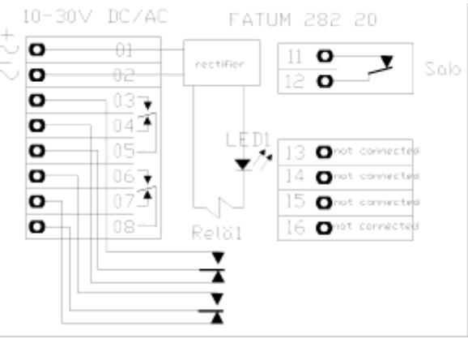
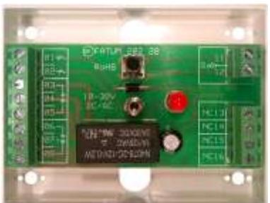

## **Reläbox 10-30V DC/AC**

*Reläbox med sabotageskydd. 1 relä med 2-polig växling. 10-30V DC/AC. Lysdiod i serie med reläspolen.*

*4 extra oanslutna terminaler tillgängliga för ytterligare förbindningar.*

| Ledaranslutning - skruv        | Area 0,14 - 1,5 mm2 |
|--------------------------------|---------------------|
| Minimum reläspänning           | 10 V                |
| Rekommenderad max belastning   | 60 V / 2 A          |
| Sabotagekontakt max belastning | 50 mA               |
| Storlek (HxBxD)                | 59 x 77 x 26 mm     |
| Strömförbruking @12VAC (typ)   | 28,6 mA             |
| Strömförbruking @12VDC (typ)   | 11,7 mA             |
| Strömförbruking @24VAC (typ)   | 59,2 mA             |
| Strömförbruking @24VDC (typ)   | 23,2 mA             |

## **28220.03** *50 152 99*

**Reläbox mini; 10-30V DC/AC, skruv**