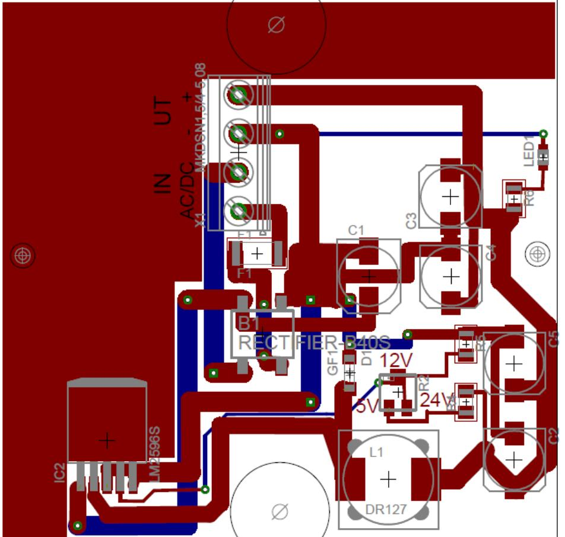

## **INKOPPLINGSANVISNING DCK1**

- DC/DC omvandlare i kopplingsdosa
- Anslut först kablarna spänningskällan.
- Kontrollera att utspänningen är riktig och att den gröna lysdioden tänds
- Om lysdiod för spänningsindikering ej tänds kontrollera inspänning och ingångssäkringarna.
- Löser säkringarna, kontrollera inkoppling och inkopplade apparater.
- Vid behov justera utspänningen på DC/DC omv med pot V1 ( 5-20V utsp.)
- Anslut lasten

## **INKOPPLINGSANVISNING DCD1**

- DC/DC omvandlare med DIN-skene fäste
- Anslut först kablarna spänningskällan.
- Kontrollera att utspänningen är riktig och att den gröna lysdioden tänds
- Om lysdiod för spänningsindikering ej tänds kontrollera inspänning och ingångssäkringarna.
- Löser säkringarna, kontrollera inkoppling och inkopplade apparater.
- Vid behov justera utspänningen på DC/DC omv med pot V1 ( 5-20V utsp.)
- Anslut lasten

Postadress/Postal address **Swansons Telemekanik AB**  Hålstensvägen 4 SE-446 37 Älvängen

Telefon nr/Telephone no +46(0)303-746 320 Hemsida/Webb www.swtm.se

Telefax nr/Telefax no +46(0)303-748 490 e-post info@swtm.se

VAT.NO SE556289017701