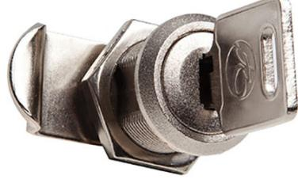

# Lås Cylinderlås **Höger**

# Produktbeskrivning

Lås är ett litet men viktigt element i både fastigetsboxar och värdeförvaring. Vi erbjuder färdigmonterade elektroniska lås, klassiska cylinderlås eller de enklare hänglåsklinkorna till alla våra fastighetsboxar. Alla DinBox lås är tillverkade i mässing och förnicklat stål.

### Funktioner

- » Cylinderlås för fastighetsbox och värdefack
- » 3 st nycklar per lås
- » DinBox standardlås och kommer installerat
- » Enkelt att byta själv
- » Sluten serie

# Specifikationer

- » Mässing och förnicklat stål
#### Artikel

| Artikelnummer  | Bredd (mm) | Höjd (mm) | Djup (mm) | Vikt (kg) |
|----------------|------------|-----------|-----------|-----------|
| SL01-9996-1000 | -          | -         | -         | -         |

DinBox Sverige AB Drottninggatan 97 113 60 Stockholm 010-33 000 10 info@dinbox.se http://dinbox.se