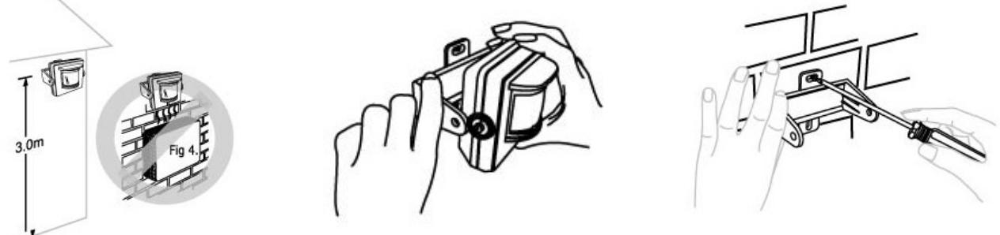
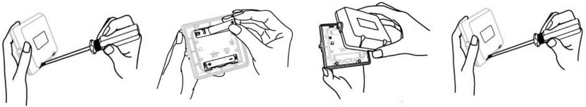
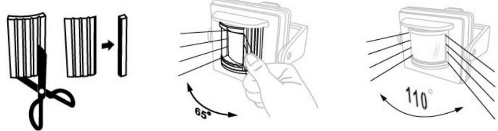
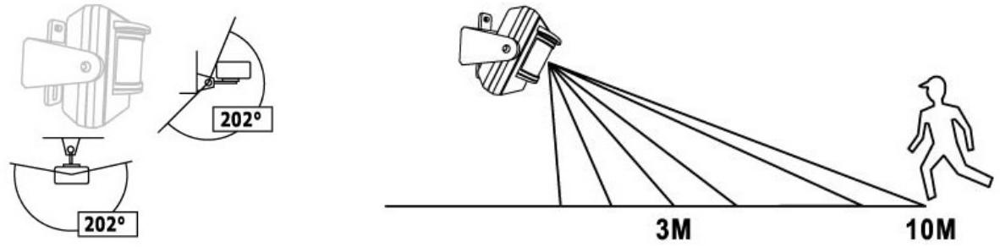
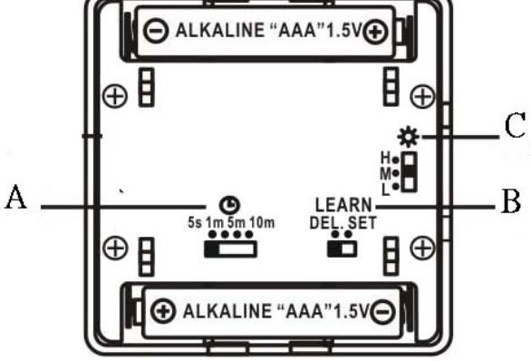
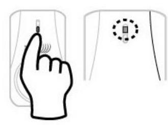

## **BRUKSANVISNING**

## **Modell: ROMDT-810**

Rörelsevakt / IR som sänder självlärande kodsignal till ansluten Nexa mottagare

### **FUNKTIONER:**

- * 67 miljoner kodkombinationer, inga störningar från grannarna.
- * Enkel användning, ingen ledningsdragning, batteridriven.
- * För utomhusbruk, fungerar tillsammans med System Nexa självprogrammerande mottagare, anslutna till lampa eller dörrklocka som hemmasäkerhetssystem (passar inte dimmermottagare).
- * Omkopplare för avstängningsfördröjning. Efter fördröjningstiden skickar ROMDT-810 en signal för att stänga av mottagaren.
- * Indikering av svagt batteri.

# **INSTALLATION: A. INSTALLATIONSANVISNINGAR:**

- 1. Välj önskad placering, 3-4 meter över marken, inte i närheten av träd, direkta värmekällor eller utsatt för direkt solljus.
- 2. Ta loss ROMDT-810 från fästet. Använd fästet som mall, markera och borra fyra hål.
- 3. Sätt fast fästet på väggen med skruvar.
- 4. Sätt tillbaka ROMDT-810.
- 5. Ställ in vinkel och riktning.
- 6. Så här byter du batteri:

#### **B. DETEKTERINGSVINKEL OCH AVSTÅND**

a. Detekteringsvinkeln för ROMDT-810 är 110 grader. Om du vill minska detekteringsvinkeln, behåll linsskyddet på. Du kan klippa av linsskyddet och därigenom välja detekteringsvinkel mellan 20 och 110 grader.

b. Detekteringsavstånd högst 10 meter. Ställ in önskat avstånd genom att vrida ROMDT-810 i fästet.

### **OMKOPPLARNAS FUNKTION:**

### **A. Omkopplare för avstängningsfördröjning:** 4 alternativ – *5 sek/1 min/5 min/10 min*.

När respektive tidsperiod har gått skickar ROMDT-810 en signal till mottagaren för att stänga av denna och den anslutna lampan (dörrklockor begränsas inte av avstängningsfördröjningen). När ROMDT-810 åter detekterar ett föremål skickar den en signal som slår på mottagaren och tänder den anslutna lampan eller aktiverar dörrklockan igen. Avstängningsfördröjningen börjar räkna ned när föremålet slutar röra sig. **B. Inlärningsomkopplare:** 2 alternativ, DEL/SET.

*DEL* betyder ta bort inlärningskoden från den anslutna mottagaren.

*SET* betyder ange inlärningskod för en ansluten mottagare.

**C. Inställning av ljusstyrka:** 3 alternativ – H/M/L.

*H*: Aktiv dygnet runt. När ett föremål kommer inom

detekteringsavstånd detekteras det. Vid inställningen "H" är avstängningsfördröjningen inaktiverad.

** Om ROMDT-810 används med en mottagare för dörrklocka ska läget H användas.

*M*: Detekterar när ljusstyrkan är lägre än 20 +/-5 lux (sen eftermiddag).

*L*: Detekterar när ljusstyrkan är lägre än 10 +/-5 lux (sen kväll).

Efter omställning mellan t.ex. "M" och "L" ska du låta ROMDT-810 vara i oförändrade ljusförhållanden och inte utsättas för rörelse under minst 30 sekunder så att ljusstyrkan blir exakt inställd (aktiveras från produktens kretsar). När det blir mörkare än ljusnivån "L" kan ROMDT-810 detektera föremål. Detsamma gäller vid växling mellan "H" och "M" och mellan "H" och "L" eller tvärtom, vid växling mellan mörkare och ljusare nivå. Enheten måste förbli opåverkad i minst 30 sekunder enligt beskrivningen ovan.

# **D. Indikator för urladdat batteri**

Batteriindikatorn är placerad inuti givarens lins. När batteriet är urladdat blinkar indikatorn när fördröjningstiden har gått. Inom fördröjningstiden fungerar ROMDT-810 fortfarande normalt.

När batteriet är slut börjar batteriindikatorn blinka för att informera användaren om att det är dags att byta batteri. När batteriet är slut (indikatorn blinkar) fungerar inte ROMDT-810 förrän batteriet har bytts ut och enheten startats om.

# **ANVÄNDNING:**

## **A. Kodinlärning:**

- 1. Placera ROMDT-810 i "DEL"-läge nära den självprogrammerande mottagaren som den ska arbeta tillsammans med.
- 2. Tryck på mottagarens inlärningsknapp. Dess lysdiod blinkar kontinuerligt.
- 3. Skjut inlärningsomkopplaren på ROMDT-810 från "DEL" till "SET". Den sänder sin kod till mottagaren.
- 4. Den lampa som är ansluten till mottagaren blinkar två gånger för att bekräfta kodinlärningen. Mottagarens lysdiod slutar blinka.

- **B. Ställ in omkopplaren för avstängningsfördröjning** (*5 sek/1 min/5 min/10 min*) enligt önskemål (se OMKOPPLARNAS FUNKTION).
- **C. Ställ in ljusstyrkan. Ställ omkopplaren** (**H/M/L**) enligt önskemål (se OMKOPPLARNAS FUNKTION). Observera att ljuskällor i närheten kan påverka ljuset och valet av inställning för ljusstyrka. Exempelvis ska inställningen för sent på kvällen vara "L". Om det finns en lampa i det område som ROMDT-810 ska övervaka kan det dock vara bättre att välja inställningen "M".

Efter varje inställningsprocess kan ROMDT-810 känna av rörelser inom detekteringsområdet, tända lampan och efter den inställda fördröjningstiden automatiskt släcka lampan igen.

## **Manuell omkoppling:**

När koden har lärts in kan SET/DEL-omkopplaren även användas som strömbrytare för att tända och släcka lampan manuellt. Ställ omkopplaren på "SET" för att tända lampan och ställ den på "DEL" för att släcka. Om omkopplaren ställs på "DEL" när ROMDT-810 känner av rörelse tänds ändå lampan, och den släcks automatiskt när fördröjningstiden har gått. Om lampan tänds genom att manuellt ställa omkopplaren på "SET" släcks dock inte lampan automatiskt efter fördröjningstiden. Då måste en annan ansluten sändare användas för att släcka lampan.

## **D. Ta bort koden:**

Om du inte vill att ROMDT-810 längre ska fungera tillsammans med en viss mottagare kan du ta bort koden igen.

I så fall ska du ta bort koden från ROMDT-810 från den självprogrammerande mottagarens minne för att frigöra detta för inställning av en ny sändarkod.

- 1. Placera ROMDT-810 i "SET"-läge nära den självprogrammerande mottagaren som den arbetar tillsammans med.
- 2. Tryck på mottagarens inlärningsknapp. Dess lysdiod blinkar kontinuerligt.
- 3. Skjut inlärningsomkopplaren på ROMDT-810 från "SET" till "DEL". Den sänder sin kod till mottagaren.
- 4. Den lampa som är ansluten till mottagaren blinkar två gånger för att bekräfta att koden tagits bort. Mottagarens lysdiod slutar blinka.
- 5. ROMDT-810 och mottagaren är inte längre sammankopplade.

# **TEKNISK SPECIFIKATION:**

Avstängningsfördröjning: 5 sek/1 min/5 min/10 min Inlärningsomkopplare: Står i läget "DEL" från fabrik. Inställning av ljusstyrka: H/M/L Frekvens: 433,92 MHz Kapslingsklass: IP44 Överföringsavstånd till mottagare: 20 m i slutna utrymmen Batteri: 3 V (2 st 1,5 V) alkaliska AAA-batterier (medföljer inte ROMDT-810 vid leverans) Detekteringsvinkel:

Lodrätt: max. 202 grader

Vågrätt: max. 110 grader utan linsskydd till 20 grader med helt linsskydd (vid leverans).

# **FELSÖKNING:**

- a. Ingen aktivering: Kontrollera batteriernas spänning och polaritet och att mottagaren är korrekt ansluten.
- b. Mottagaren är på hela tiden: ROMDT-810 kan vara utsatt för kontinuerlig aktivering. Lös problemet genom att ändra detektorns läge/vinkel.
- ** Obs: Efter installation ska du kontrollera att ROMDT-810 fungerar korrekt i alla inställningslägen gentemot en kompatibel självprogrammerande mottagare.

## **VARNING:**

- ** En mottagare som arbetar tillsammans med ROMDT-810 fungerar INTE tillsammans med en annan sändare. Om mottagaren (lampan) redan har tänts med någon annan sändare (till exempel handsändaren LYCT-705) och ROMDT-810 detekterar rörelse och skickar signalen "PÅ" till samma mottagare, kommer denna mottagare (lampa) att börja dimras.
## **** Använd inte ROMDT-810 tillsammans med en dimmer.**

- ** 2 st nya AAA-batterier (1,5 V) måste användas i ROMDT-810 för att lämna stadig spänning och ge bättre detektering och överföringskapacitet. Byt alltid båda batterierna samtidigt för bästa batterilivslängd.
 www.nexa.se support@nexa.se