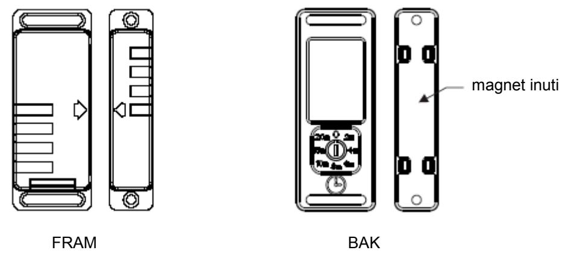
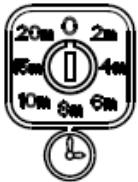
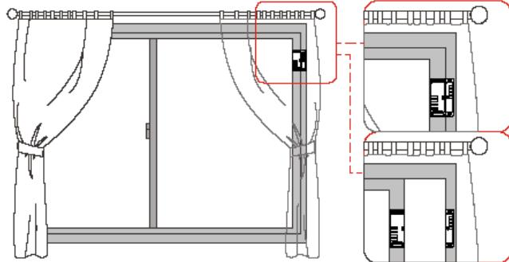
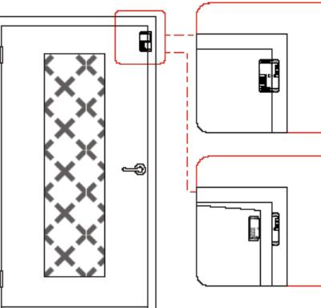
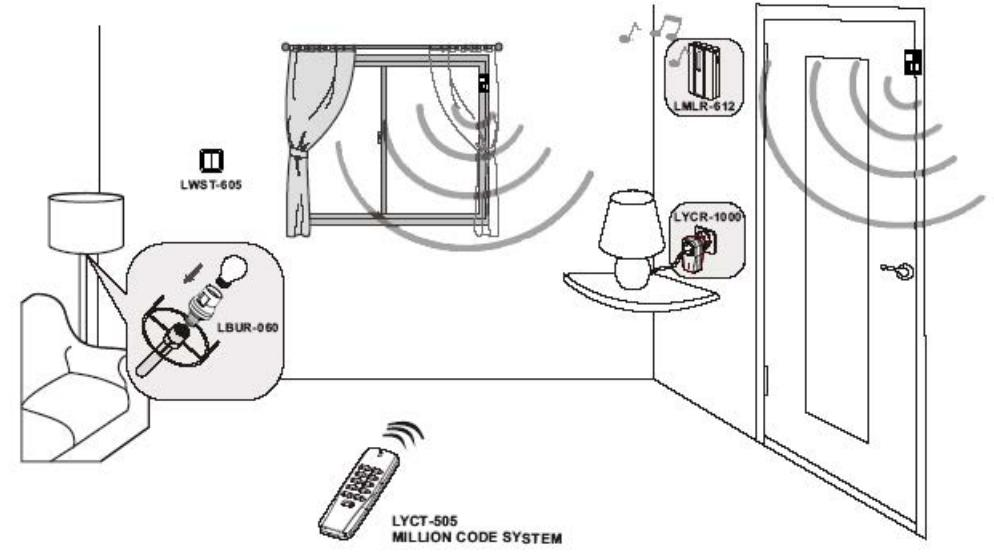

#### **Modell: LMST-606 Trådlös magnetisk sensorstyrning**

#### **Egenskaper**

- Enkel att installera
- Enkel att använda
- Fördröjd avstängning: 8 olika tidsinställningar (0 2, 4, 6, 8, 10, 15 och 20 min.)
- 0: Ingen fördröjning. När du öppnar LMST-606, sänder den en PÅ-kod till mottagaren (om tex. mottagaren är kopplad till en lampa, tänds den). När du stänger LMST-606, sänder den en AV-kod till mottagaren (lampan släcks.
- 2 min.: När LMST-606 (öppen) har sänt en PÅ-kod till mottagaren (mottagaren är kopplad till tex. en lampa), kommer inte lampan att släckas oavsett om LMST-606 öppnas eller stängs inom de två minuterarna, efter vilka LMST-606 automatiskt sänder en AV-kod till mottagaren (mottagaren är kopplad till en lampa: lyset släcks).

3 min.: Osv.

Figur A Figur B

Installation

• På fönsterkarm

- På dörrkarm
Skruvas fast.

#### **Monteringsavstånd mellan magnet och huvuddel**

Utstående (fönster eller dörr) karm: Avståndet mellan magneten och huvuddelen får vara maximalt 10 mm (se figur A)

Infälld (fönster eller dörr) karm: Avståndet mellan magneten och huvuddelen får vara maximalt 10 mm (se figur B)

# **Användning**

Efter installation:

- 1. Ställ LMST-606 tidsinställning på "0".
- 2. Koppla mottagaren till exempelvis en lampa.
- 3. Koppla mottagaren till nätkontakten.
- 4. Tryck på inlärningsknappen på mottagaren och lysdioden börjar att blinka.
- 5. Öppna LMST-606 (minst 10 cm öppning) för att sända en inlärningskod till mottagaren.

6. När mottagaren lär sig koden, blinkar lampan två gånger för att bekräfta att den mottagit koden.

Normal användning:

Efter ovanstående förstagångsinställning, kan du använda den normalt::

* När tidsinställningen är satt till "0":

- 1. Öppna LMST-606 (minst 10 cm öppning). En PÅ-kod sänds till mottagaren; lyset tänds.
- 2. Stäng LMST-606. En AV-kod sänds till mottagaren; lyset släcks.
- * När tidsinställningen är aktiverad (tex. på 8 min):
- PÅ i 8 minuter (kommer att slås AV den åttonde minuten)
- 1. Ställ in LMST-606 på "8 m".
- 2. Öppna LMST-606 för att sätta PÅ lampan.
- 3. Ingenting händer med lyset under 8 minuter, oavsett om LMST-606 öppnas eller stängs under tiden.
- 4. LMST-606 kommer automatiskt att sända en AV-kod till lampan den åttonde minuten.
- PÅ i mindre än 8 min. (dvs. ej inställd för att stänga AV den åttonde minuten)
- 1. Ställ in LMST-606 på "8 m".
- 2. Öppna LMST-606 för att sätta PÅ lampan.
- 3. Om användaren tex. efter 4 minuter vill stänga AV lampan: använd då en annan fjärrkontroll för att stänga AV lampan (mottagare AV).

# **Felsökning**

- Byt batteri
- Ställ in fördröjningstiden

# **Specifikationer**

Radiofrekvens: 433,92 MHz 3 V CR2032 litiumbatteri (ingår) Överföringsavstånd: 30 meter (70 meter i öppet rum)