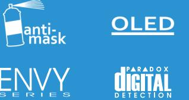
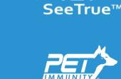
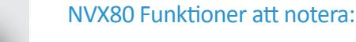
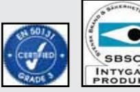
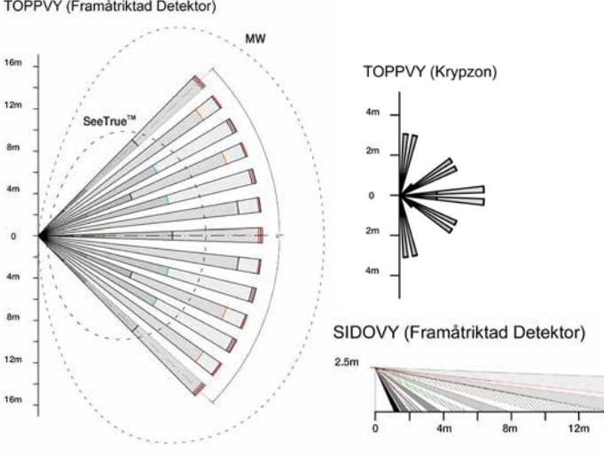

# NVX80

Högprestanda Rörelsedetektor med Anti-Mask och SeeTrueTM Teknologi för installation Inomhus / Utomhus

Ultimat Prestanda för Extrema omgivningar Inomhus och Utomhus

Paradox NVX80 Rörelsedetektorn är överlägsen allt annat i sin klass. NVX80 tål extrema förhållanden, har en kombination av aktiv infraröd anti-mask och mikrovågs närhets teknologier för att känna av maskeringsförsök, och oöverträffad detekteringsprestanda med SeeTrueTM. NVX80 är den enda detektorn i industrin som ger 8 detekteringskanaler – 4X frammåtriktade PIR kanaler (2X quad Interlock Geometry sensorer), 2X mikrovågs kanaler och 2X fristående krypzons detektorer (1 quad sensor med Interlock Geometry).

SeeTrueTM ökar markant detektering av inkräktare som försöker avskärma sig från PIR detektering med isolerande material som tjocka jackor, kartongpapp, paraplyn, etc.

Kombinationen av avancerade teknologier i NVX80 klarar tekniska hinder som traditionella PIR detektorer inte kan hantera, till exempel detekteringsnedsättningarna i områden med hög temperatur.

För installatören ger installation via skena och industrins första OLED skärm med intuitiva menyer ett enkelt sätt att programmera och installera enheten utan mekaniska inställningar (byglar). NVX80 har även diagnostiksverktyg för att testa PIR, anti-mask, och mikrovågs inställningarna, tillsammans med SoloTestTM för enkla gångtest.

Den eleganta, vandalsäkra och tåliga NVX80 är ett bra val för installation i kommersiella, industriella och bostads områden.

- } Paradox SeeTrueTM teknologin ökar markant detekteringshastigheten och detektering av maskerade rörelser samtidigt som den minskar chansen för falsklarm med två detekteringslägen: Säkert och Barriär
- } Perfekt för Kommersiella, Industriella högsäkerhets områden och Bostads inomhus/utomhus installationer
- } Åtta detekterings kanalers (8X) detekterings system
- } Paradoxs väl beprövade Husdjursimmunitet för djur up till 20kg
- } Full färgs OLED skärm med menybaserade intuitiva skärmar
- } SoloTest™ för enkla gångtest
- } Elegant, vandalsäker design och tålig konstruktion
- } Följer EN 50131 Grad 3
- } Ansluter till EVO centraler via BUS kommunikation

Godkänd enligt SBSC larmklass

#### SeeTrueTM med två nivåer

#### Säkert Läge

Detta läge är SeeTrue funktionens standardläge för inomhusinstallation och ger ökad detektering. Säkert läge kräver att Husdjursimmunitets funktionen är avaktiverad och krypzonen aktiverad.

#### Barriär Läge

NVX80 detekterar alla rörelser i SeeTrueTM Funktionens 12 m detekterings område, vilket gör det nästan omöjligt att korsa området utan att bli detekterad.

2014-10-10

# SeeTrue™ Teknologi

Paradox SeeTrue™ teknologi, utvecklad exclusivt för NVX80 rörelse detektorn, utnytjar avancerad signalbehandling för att starkt förbättra detekteringen för dual-tech rörelsedetektorer.

SeeTrue™ kan detektera på högsta prestandanivå, även vid tillfällen då de flesta PIR eller dual-tech detektorer misslyckas. NVX80 har SeeTrue™, som kan detektera inkräktare i högtemperatursområden, kamoflerade rörelser (till och från enheten), och inkräktare som använda isolerade material som paraplyer, tjocka jackor eller kartongpapp som används för att blockera vanliga PIR detektorer, Samtidigt som den ger oöverträffad falsklarmsdetektering.

## Anti-Mask Detektering

NVX80s Paradox utvecklade aktiva IR anti-mask mekanisk skyddar mot avsiktlig vandalism av huvudlinsen via ett brett sortiment av material, till exempel klarlack, aluminium folie och genomskinlig tejp och överstiger EN50131 grad 3 kraven. NVX80 detekterar även objekt placerade nära detektorn som kan minska detektorns effektiva räckvidd.

### Fristående Krypzons Detektor

NVX80 enhetens krypzons detektering har en egen optimerad detektoroch hindrar inkräktare från att nå skyddade ytor genom att krypa direkt under detektorn.

### Husdjursimmunitet

När husdjur är närvarande i det skyddade området ger NVX80 den bästa husdjursimmuniteten i industrin. Detta låter hundar, katter och andra djur, up till en viss storlek och under 20kg, att vandra fritt i det skyddade området utan att generera larm.

## Enkel Programmering

NVX80 använder ett revolutionerande nytt tillvägagångssätt för inställning och testning. Via intuitiva menyer kan installatören enkelt programmera och testa enheten. Alla inställningar, testlägen och kalibreringar kan utföras vida den färgstarka OLED skärmen och de 4 knapparna. Inga byglar, mekaniska inställningar eller användarmanualer krävs.

#### Täckning

www.paradox-security.se

#### Paradox levererar 3:e generationens digital

#### detekterings teknologi

- } Anti-mask funktion detekterar många olika material och objekt som blockerar enheten
- } Använder intelligent detekteringslogik för att ge pålitlig, noggrann detektering och falsklarmsskydd i tuffa omgivningar
- } Bättre detekterings och signalerings skärpa
- } Tålig design som klarar tuffa omgivningar, för installation inomhus och utomhus
- } Ingen manual krävs: intuitiva, menybaserade inställningar och test via OLED skärmen
- } Komplett diagnostik: individuell testning av PIR, MW och anti-mask funktionerna
- } Enkel installation via skena
- } Tre justerbara reläutgångar Dessa utgångar rapporteras även av Digiplex EVO bussen
- } Förbättrad detektering och falsklarms avvisning

#### Tekniska Specifikationer

| SeeTrueTM                         | Inomhus användning, två nivåer, Säker och Barriär                                                                                                                                             |
|-----------------------------------|--------------------------------------------------------------------------------------------------------------------------------------------------------------------------------------------------|
| Effektiv Räckvidd                 | Upp till 12 m                                                                                                                                                                                    |
| Dubbel Anti-Mask                  | Ställbar: 1) Aktiv IR: Närhet och blockering, följer/överstiger EN50131 grad 3 för alla material och vätskor, med inomhus /utomhus nivåer. 2) Aktiva Mikrovågor närhets detektering. |
| Strålmönster Krypzons Detektor | 16 m 90º Upp till 3 m 90º nedåtriktad                                                                                                                                                         |
| Installations Höjd                | 2.5 - 3.0 m                                                                                                                                                                                      |
| Strömförbrukning (vid 12v)        | 75 mA - 100 mA                                                                                                                                                                                   |
| Utgångar                          | Relä 1: 1A 24 VDC Relä 2 och 3: 150 mA / 24 VDC                                                                                                                                               |
| Skärm                             | OLED, 16-bit, 96 x 64 pixlar                                                                                                                                                                     |
| Dimensioner                       | 9.8 cm x 22.9 cm x 9.2 cm                                                                                                                                                                        |
| Sabotage                          | Dubbelt: Skal och Vägg                                                                                                                                                                           |
| RF Immunitet                      | 10 V/m upp till 2.7 GHz                                                                                                                                                                          |
| Driftstemperatur                  | -35º till 60º C                                                                                                                                                                                  |
| Buss Anslutning                   | Paradox EVO Serien, 4-tråds                                                                                                                                                                      |
| Certifiering                      | EN 50131 Grad 3 Klass IV / Certification Body: Intertek                                                                                                                                    |
| Material                          | ASA UV Resistant                                                                                                                                                                                 |
| Tillval                           | Allvädersskal                                                                                                                                                                                    |
|                                   | Vridbart Fäste                                                                                                                                                                                   |
| Programmering                     | Interaktiv 4-knapps programmering med grafisk meny eller via EVO buss                                                                                                                         |
| Vikt                              | 520 gr                                                                                                                                                                                           |
| PIR Fram                          | 2X quad sensorer med interlock geometry                                                                                                                                                       |
| PIR Krypzon                       | 1X quad sensorer med interlock geometry                                                                                                                                                       |
| Mikrovågs                         | Dubbla utgångar 10.5 GHz                                                                                                                                                                         |

2014-5-22TNVX80-G2K rev.00 - ENVY Series is a trademark or registered trademark of Paradox Security Systems (Bahamas) Ltd. or its affiliates in Canada, the United States and/or other countries. One or more of the following US patents may apply: 7046142, 6215399, 6111256, 6104319, 5920259, 5886632, 5721542, 5287111, and RE39406 and other pending patents may apply. Canadian and international patents may also apply. All rights reserved. Specifications may change without prior notice. © 2013 Paradox Ltd. or Paradox Security Systems (Bahamas) Ltd.