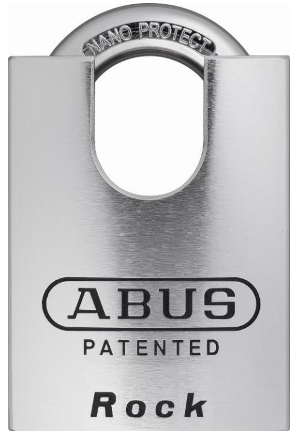

## **83CS/80 Rock**

- Godkänd I SBSC klass 4 / Grade 5
- Låshus och bygel tillverkade i härdat specialstål med NANO PROTECT™ ytbehandling för bästa korrosions motstånd
- Förstärkt, upphöjt, bygelskydd och borrskyddad bottenplatta för maximalt skydd mot fysiska attacker
- Bygeln är löstagbar vid olåst läge och dubbelreglad med solida, härdade, stålkulor vid låst läge
- Anpassad till Skandinaviska ovalcylindrar ( levereras utan cylinder)

## **Tekniska data**

- a 80 mm
- b 29 mm c 38 mm
- d 15 mm
- e 32 mm
- f 120 mm
- Vikt: 1,4 kg
- Best. enhet: 3 st.

