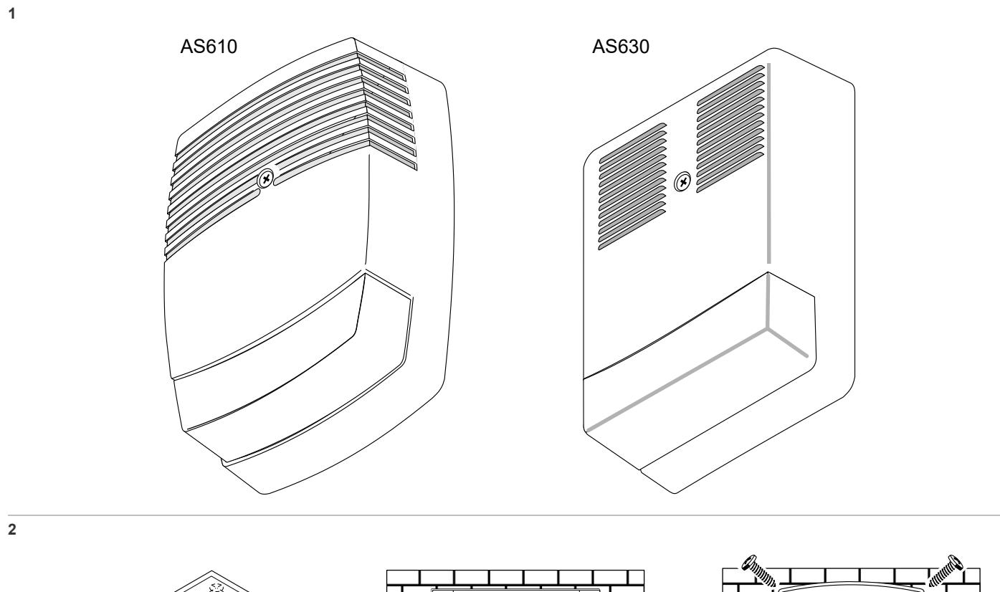
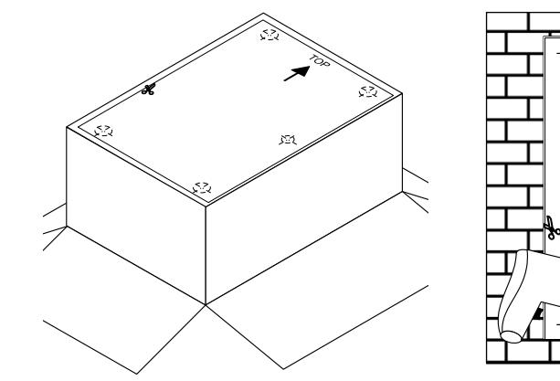
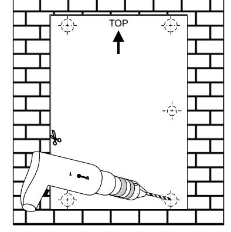
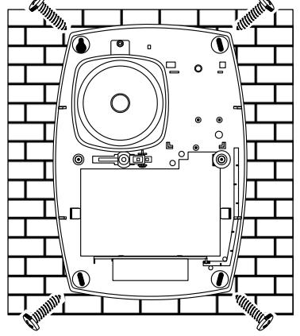
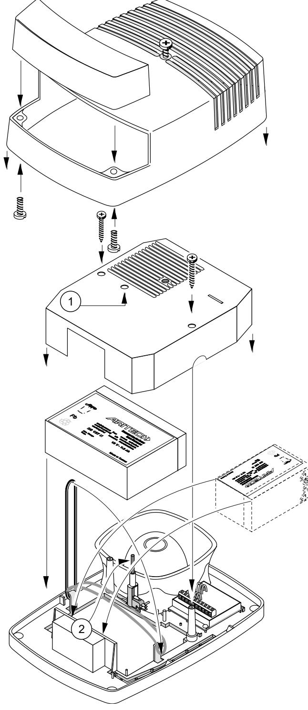
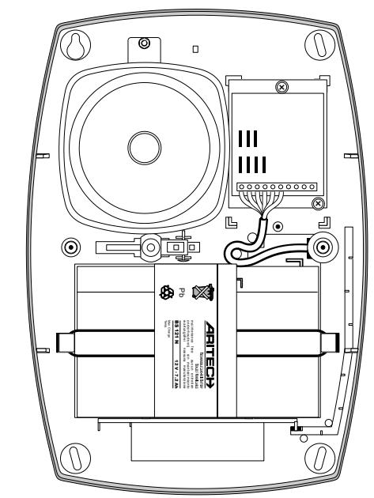
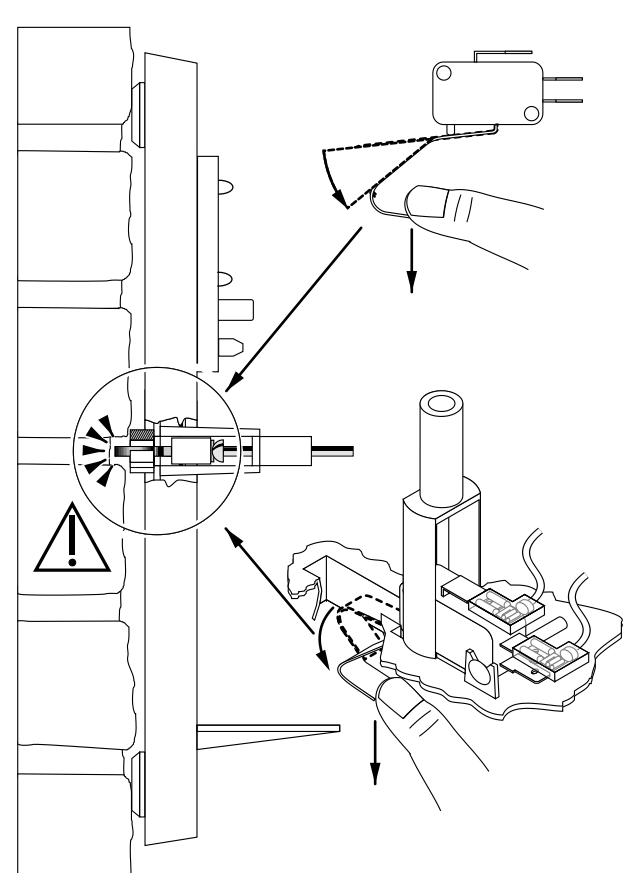
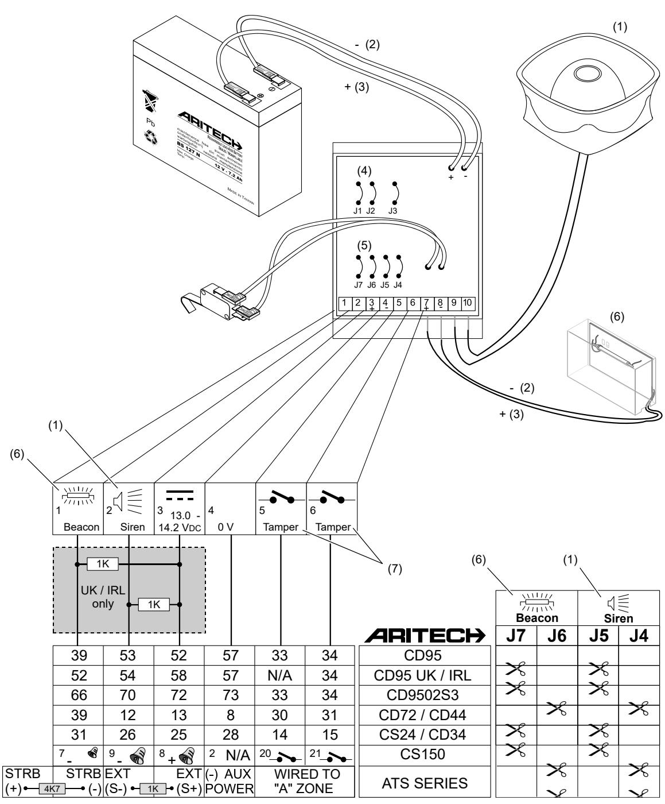
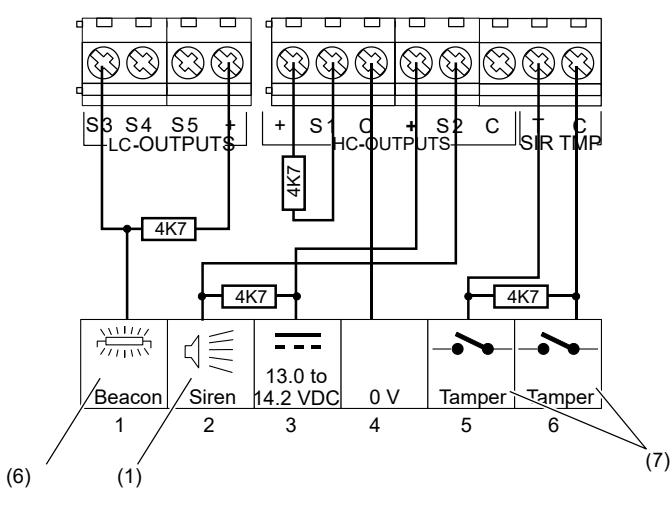

# AS610/AS630 Outdoor Siren Installation Sheet

#### **EN SV**

4

5

3

## **7 EN: Installation Sheet**

#### **Description**

AS61x series is a high quality installer-friendly self activating outdoor siren with a sound output of 120 dB at 1 metre and a single beacon, which meet today's security and environmental requirements. The housing is made of tough UV proof and impact resistant 3.5 mm polycarbonate and has a foamresistant steel inner cover for the ultimate in protection.

AS630 is a high quality installer-friendly self activating outdoor siren with a sound output of 120 dB at 1 metre and a single amber beacon, which meet today's security and environmental requirements. The cover is made of highly polished stainless

steel and has a foam-resistant steel inner cover for the ultimate in protection.

### **Wiring procedure**

First, wire the control panel (power down) to the siren as shown above, before connecting the battery. When the battery is connected for the first time, the siren will give a short beep. The siren cannot be activated until all inputs (input power and hold-off voltages) are correct. The siren will be activated if the input power is removed or drops significantly or if the siren hold-off voltage is removed.

Siren cut-off time is controlled by J1 and J2.

For use without a battery, cut jumper J3.

**Note:** J3 is not available in the AS619 but the AS619 can be used with or without battery.

Figure 7 shows an example connection between the siren and an Advisor Advanced control panel.

#### **Figures 6 and 7**

- (1) Siren
- (2) − wire (black)
- 
- (3) + wire (red) (4) Cut-off timer
- (6) Beacon (7) Tamper

(5) Hold-off programming

**WARNING:** The beacon uses high voltage. To avoid personal injury or death from electrocution, do not touch bare wires and beacon electronics before the energy discharges.

#### **Table 1: Timer programming**

| J1      | J2 | Time (min) | J1 | J2 | Time (min) |  |
|---------|----|------------|----|----|------------|--|
| Default |    | 3          |    |   | 10         |  |
|        |    | 5          |   |   | 20         |  |

#### **Table 2: Hold-off programming**

| Siren   |                  |         | Beacon |                  |  |
|---------|------------------|---------|--------|------------------|--|
| J5      | Terminal 2       | J6      | J7     | Terminal 1       |  |
| Default | Floating         | Default |        | Floating         |  |
|        | 12 V or floating |         |       | 12 V or floating |  |
|         | 0 V or floating  |        |        | 0 V or floating  |  |
|         |                  |         |        |                  |  |

## **Specifications**

| Supply [1]          | 13.0 to 14.2 V                                                                                         |  |  |  |
|---------------------|---------------------------------------------------------------------------------------------------------|--|--|--|
| Standby current     | 25 mA (closed line)                                                                                     |  |  |  |
| Operating current   | 0.6 A                                                                                                   |  |  |  |
| Sound output [2]    | 118 dB at 1 m; 109 dB at 3 m                                                                            |  |  |  |
| Frequency           | 1.8 to 2.8 kHz                                                                                          |  |  |  |
| Cut off timer       | Preset at 3 min, adjustable 5, 10, 20 min                                                               |  |  |  |
| Working temperature | −25 to +70°C (without battery) EN 50131: −25 to +55°C (without battery) 0 to +40°C (with battery) |  |  |  |
| Relative humidity   | EN 50131: 93% max.                                                                                      |  |  |  |
| Weight              | 2.5 kg                                                                                                  |  |  |  |
| Dimensions          | 305 x 220 x 87 mm                                                                                       |  |  |  |
| Recommended battery | BS127 or BS121                                                                                          |  |  |  |
| Beacon              |                                                                                                         |  |  |  |
| Supply              | 13.8 V                                                                                                 |  |  |  |

| Operating current            | 110 mA              |
|------------------------------|---------------------|
| Light output                 | 100.000 peak lumens |
| Life time                    | 1.000.000 flashes   |
| Flash rate                   | 1 Hz                |
| Spike suppression network | Standard fitted     |

- [1] To be connected to an external current limited power supply (advised 5 A)
- [2] Sound output for AS619: 85 dB at 3 m

When on the AS619, the siren hold off voltage is removed the siren output is activated in a one minute on — one minute off sequence.

## **Regulatory information**

| Manufacturer  | PLACED ON THE MARKET BY: UTC Fire & Security Americas Corporation, Inc. 3211 Progress Drive, Lincolnton, NC, 28092, USA AUTHORIZED EU REPRESENTATIVE: UTC Fire & Security B.V. Kelvinstraat 7, 6003 DH Weert, Netherlands                                                                                                                                   |
|---------------|----------------------------------------------------------------------------------------------------------------------------------------------------------------------------------------------------------------------------------------------------------------------------------------------------------------------------------------------------------------------------|
| Certification |                                                                                                                                                                                                                                                                                                                                                                            |
|               | The AS610, AS619 and AS630 are EN 50131-4 Security grade 3, Environmental class III. All mounting screws have to be fitted as that they form a part of the tamper device.                                                                                                                                                                                         |
|               | Tested and certified by the Norwegian testing and certification body DNV.                                                                                                                                                                                                                                                                                               |
|               | The AS610, AS619 and AS630 are certified for EN 50131-4 only if used without a battery.                                                                                                                                                                                                                                                                                 |
|               | UTC Fire & Security hereby declares that this device is in compliance with the applicable requirements and provisions of one or more of the Directives 1999/5/EC, 2014/30/EU and 2014/35/EU. For more information see www.utcfireandsecurity.com or www.interlogix.com.                                                                                     |
|               | 2002/96/EC (WEEE directive): Products marked with this symbol cannot be disposed of as unsorted municipal waste in the European Union. For proper recycling, return this product to your local supplier upon the purchase of equivalent new equipment, or dispose of it at designated collection points. For more information see: www.recyclethis.info. |

## **Contact information**

www.utcfireandsecurity.com or www.interlogix.com.

For customer support, see www.utcfssecurityproducts.eu