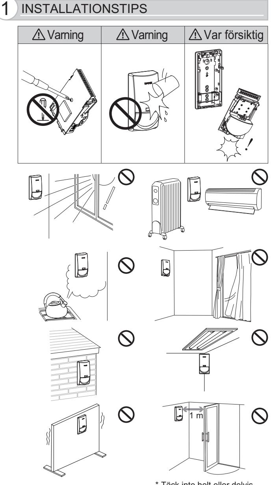
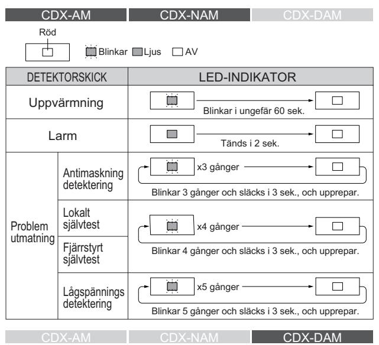
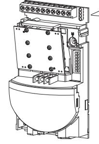
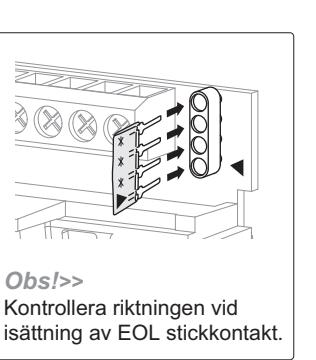
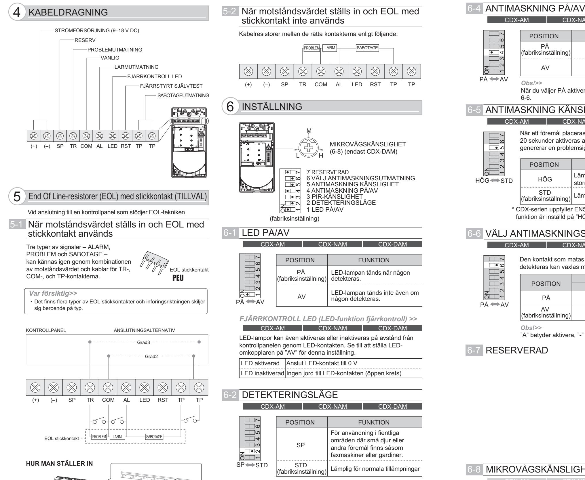
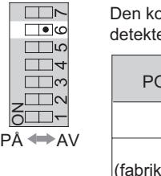
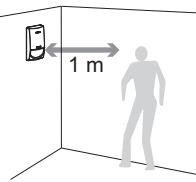
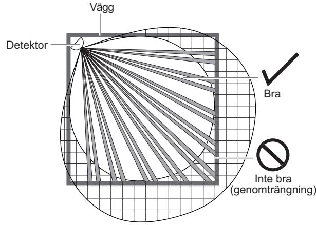

INSTALLATIONSINSTRUKTIONER

No.59-1900-4

Denna symbol indikerar ett förbud.

• CDX-serien uppfyller följande direktiv/standarder. Direktiv: EMC-direktiv 2004/108/EG Tillämpade standarder: EN 50130-4: 2011 +A1: 1998 +A2: 2003 EN 55022: 2006 • EN50131-1 Grader och miljöklass: Säkerhetsgrad 3 och miljöklass II. Tillämpade standarder: EN 50131-2-2 (CDX-NAM/CDX-AM) EN 50131-2-4 (CDX-DAM) Testad och certifierad av Telefication.

- CDX DAM uppfyller även följande direktiv/standarder markerade Klass II, Direktiv: R&TTE Direktiv 1999/5/EG Tillämpade standarder: EN 300 440-1: 2009 EN 300 440-2: 2009 EN 301 489-1: 2008 EN 301 489-3: 2002
 EN 50371: 2002 EN 60950-1: 2006 +A11: 2009

Följande tabell indikerar de områden där utrustningen är avsedd att användas och alla kända begränsningar. För länder som inte finns med i denna lista, kontakta ansvarig

| spektrumhanteringsförmedling. |  |
|-------------------------------|--|
|                               |  |

# 10 SPECIFIKATIONER

FCC ID: DC9 OPMW IC: 4012A-OPMW This device complies with Part 15 of the FCC Rules. Operation is subject to the following two conditions:

(1) This device may not cause harmful interference.

- (2) This device must accept any interference received, including interference that may cause undesired operation.
## UPPFYLLANDE

# TILLVAL 9 LED-INDIKERING

| Land för avsedd användning |            | Begränsningar Land för avsedd användning Begränsningar |            |
|----------------------------|------------|--------------------------------------------------------|------------|
| Österrike                  | 9,900 GHz  | Luxemburg                                              | 10,525 GHz |
| Belgien                    | 10,525 GHz | Nederländerna                                          | 10,525 GHz |
| Danmark                    | 10,525 GHz | Spanien                                                | 10,525 GHz |
| Finland                    | 9,900 GHz  | Sverige                                                | 10,525 GHz |
| Frankrike                  | 10,587 GHz | Storbritannien                                         | 10,587 GHz |
| Grekland                   | 10,525 GHz | Andra icke-EU: Island                                  | 10,525 GHz |
| Irland                     | 10,587 GHz | Norge                                                  | 10,525 GHz |
| Italien                    | 10,525 GHz | Schweiz                                                | 10,525 GHz |

| Modell                              | CDX-NAM                                                                                     | CDX-AM  | CDX-DAM                                  |
|-------------------------------------|---------------------------------------------------------------------------------------------|---------|------------------------------------------|
| Detekteringsmetod                   | Passiv infraröd                                                                             |         | Passiv infraröd och mikrovåg          |
| Detektor standard                | EN50131-2-2 (Grad 3)                                                                        |         | EN50131-2-4 (Grad 3)                  |
| Metod för maskningsdetektering   |                                                                                             | AIR-typ |                                          |
| PIR-täckning [detekteringszoner] | 24 m × 2 m . smal 15 m × 15 m . 85° bred [20 zoner] [82 zoner]                     |         |                                          |
| Strömförsörjning                    | 9–18 VDC                                                                                    |         |                                          |
| Nuvarande förbrukning            | 17 mA (normal) / 20 mA (max.) vid 12 VDC                                                 |         | 19 mA (normal) / 26 mA (max.) vid 12 VDC |
| Larmutmatning                       | N.C. 28 VDC 0,2 A max.                                                                      |         |                                          |
| Sabotageutmatning                   | N.C. öppnas när höljet tas bort eller väggsabotagekontakten aktiveras. 28 VDC 0,1 A max. |         |                                          |
| Problemutmatning                    | N.C. 28 VDC 0,2 A max.                                                                      |         |                                          |
| Drifttemperatur                     | -10°C – +50°C                                                                               |         |                                          |
| Omgivande luftfuktighet          | 95% max.                                                                                    |         |                                          |
| RF-störningar                       | Inget larm 10 V/m                                                                           |         |                                          |
| Monteringshöjd                      | 1,8 – 2,4 m .                                                                               |         |                                          |
| Vikt                                | 180 g                                                                                       |         |                                          |
| Mått (H×B×D)                     | 140 × 70 × 52,3 mm                                                                          |         |                                          |

OPTEX CO., LTD. (JAPAN) (ISO9001 Certified) (ISO14001 Certified) 5-8-12 Ogoto Otsu Shiga 520-0101 JAPAN TEL: +81-77-579-8670 FAX: +81-77-579-8190 URL: http://www.optex.co.jp/e/

OPTEX INCORPORATED (USA) TEL: +1-909-993-5770 Tech: (800)966-7839 URL: http://www.optexamerica.com/

OPTEX (EUROPE) LTD. (UK) TEL: +44-1628-631000 URL: http://www.optex-europe.com/

OPTEX SECURITY SAS (FRANCE) TEL: +33-437-55-50-50 URL: http://www.optex-security.com/

OPTEX SECURITY Sp.z o.o. (POLAND) TEL: +48-22-598-05-55 URL: http://www.optex.com.pl/

OPTEX KOREA CO., LTD. (KOREA) TEL: +82-2-719-5971 URL: http://www.optexkorea.com/

OPTEX (DONGGUAN) CO., LTD. SHANGHAI OFFICE (CHINA) TEL:+86-21-34600673

URL:http://www.optexchina.com/

FA-1W: Fästkonsol för vägg justerbar ±45° (horisontellt), 0–20° (vertikalt nedåt) FA-3: Konsol för kompakt vägg och tak

- justerbar ±45°(horisontellt), 0–10° (vertikalt nedåt) PEU: EOL-resistorenhet med stickkontakt Fråga din återförsäljare om mer information om tillgänglig typ.
## OBS!

CDX-serien är bara en del av ett komplett system, därför kan vi inte acceptera fullt ansvar för eventuella skador eller andra konsekvenser som härrör från ett intrång.

| DETEKTORSKICK                        |                             | LED-INDIKATOR                                                    |  |
|--------------------------------------|-----------------------------|------------------------------------------------------------------|--|
|                                      | Uppvärmning                 | Blinkar i ungefär 60 sek.                                        |  |
|                                      | Larm                        | Tänds i 2 sek.                                                   |  |
|                                      | PIR-detektering             | Den gröna tänds i 2 sek.                                         |  |
|                                      | MV-detektering              | Den gula tänds i 2 sek.                                          |  |
|                                      | Antimaskning detektering | x3 gånger Blinkar 3 gånger och släcks i 3 sek., och upprepar. |  |
| Problem                              | Lokalt självtest         | x4 gånger                                                        |  |
| utmatning Fjärrstyrt självtest |                             | Blinkar 4 gånger och släcks i 3 sek., och upprepar.              |  |
|                                      | Lågspännings detektering | x5 gånger Blinkar 5 gånger och släcks i 3 sek., och upprepar. |  |

- *•* 15 m Vidvinkel med nedåtområde (CDX-AM/CDX-DAM)
- *•* 24 m Lång räckvidd (CDX-NAM)
- *•* Respekterad dubbelledande avskärmning (CDX-AM/CDX-NAM) - Extremt hög ljus- och RFI-immunitet
- *•* Extremt motståndskraftig mikrovågsmodul (CDX-DAM)
- *•* EOL-resistorer med stickkontakt (PEU) (TILLVAL)
- *•* Avancerad teknologi för antimaskning med IR-strålning

| CDX-AM PIR med aktiv IR-antimaskning (Grad 3)               |
|-------------------------------------------------------------|
| CDX-NAM CDX-AM med långsmal lins (Grad 3)                   |
| CDX-DAM PIR och mikrovåg med aktiv IR-antimaskning (Grad 3) |

### **PD6662: 2010**

* Täck inte helt eller delvis över detektorns synfält.

Blinkar Ljus AV

larm klass 3, miljö klass II

larm klass 3, miljö klass II

CDX-AM CDX-NAM CDX-DAM

CDX-AM CDX-NAM CDX-DAM

### 6-3 PIR-KÄNSLIGHET

| 6-8 MIKROVÅGSKÄNSLIGHET |                                                                                                                                                                                                                                                                 |               |      |
|----------------------------|-----------------------------------------------------------------------------------------------------------------------------------------------------------------------------------------------------------------------------------------------------------------|---------------|------|
|                            | CDX-AM CDX-NAM CDX-DAM                                                                                                                                                                                                                                    |               |      |
| M                          |                                                                                                                                                                                                                                                                 | MV-KÄNSLIGHET |      |
|                            | L                                                                                                                                                                                                                                                               | M             | H    |
| L H                     | 9 m                                                                                                                                                                                                                                                             | 12 m          | 15 m |
|                            | Var försiktig>> Ovanstående avståndsindikationer är endast vägledande. Sätt inte MV-känsligheten för lågt. Detta kan orsaka tekniskt fel på MV. Det är viktigt att justera känsligheten så att detekteringsområdet för MV och PIR överlappar. |               |      |

### 6-6 VÄLJ ANTIMASKNINGSUTMATNING

Om mikrovågskänsligheten är inställd för högt kan den detektera rörelser utanför detekteringsområdet, vilket leder till falsklarm. Genom att skapa ett mikrovågsdetekteringsområde som anpassar sig till PIR-detekteringsområdet, uppnås en högre detekteringsprestation och falsklarm förhindras.

| CDX-AM     |                             | CDX-NAM                                           | CDX-DAM  |
|------------|-----------------------------|---------------------------------------------------|----------|
| ON         | POSITION                    |                                                   | FUNKTION |
|            | HÖG                         | Lämplig för plats som kräver större känslighet |          |
|            | STD (fabriksinställning) | Lämplig för normala tillämpningar                 |          |
| HÖG STD |                             |                                                   |          |

## 7-1 LOKALT SJÄLVTEST

# 7-2 FJÄRRSTYRT SJÄLVTEST

# 7 SJÄLVTEST

# 8 SAMMANFATTNING PROBLEMUTMATNING

|                                | POSITION                                                                                              |         | FUNKTION    |  |
|--------------------------------|-------------------------------------------------------------------------------------------------------|---------|-------------|--|
| ON AVPÅ                     | PÅ (fabriksinställning)                                                                            |         | Aktiverad   |  |
|                                | AV                                                                                                    |         | Inaktiverad |  |
|                                | Obs!>> När du väljer PÅ aktiveras funktionerna för 6-5 och 6-6.                                 |         |             |  |
| 6-5 ANTIMASKNING KÄNSLIGHET |                                                                                                       |         |             |  |
| CDX-AM                         |                                                                                                       | CDX-NAM | CDX-DAM     |  |
|                                | När ett föremål placeras nära linsytan under mer än 20 sekunder aktiveras antimaskningskretsen som |         |             |  |

*Obs!>>*

"A" betyder aktivera, "-" betyder ej tillgänglig.

CDX-DAM Detta test kan aktiveras från kontrollpanelen genom att applicera 0 V till RST-kontakten.

Denna funktion kontrollerar detekteringsförmågans funktion för PIR och mikrovågor. Detta garanterar att enheten alltid fungerar korrekt.

Lokalt självtest styrs av detektorn och körs periodvis för att testa kretsarnas funktionalitet.

Om det lokala självtestet misslyckas aktiveras PROBLEM-reläet och LED-lampor blinkar (se 9 ).

Om det fjärrstyrda testet lyckas, aktiveras LARM-reläet i 5 sekunder. Om testet misslyckas aktiveras PROBLEM-utmatningen och LED-lampor blinkar (se 9 ).

| ON HÖG STD | genererar en problemsignal. |                                                   |  |
|------------------|-----------------------------|---------------------------------------------------|--|
|                  | POSITION                    | FUNKTION                                          |  |
|                  | HÖG                         | Lämplig för plats som kräver större känslighet |  |
|                  | STD (fabriksinställning) | Lämplig för normala tillämpningar                 |  |
|                  |                             |                                                   |  |

|                            | UTMATAD KONTAKT |         |  |
|----------------------------|-----------------|---------|--|
| POSITION                   | LARM            | PROBLEM |  |
| PÅ                         | A               | A       |  |
| AV (fabriksinställning) | -               | A       |  |

## 7-3 GÅNGTEST

Håll dig minst 1 meter bort från detektorn och utan några föremål i vägen.

| Antimaskning detektering | När ett föremål placeras nära linsytan under mer än 20 sekunder aktiveras PIR antimaskningskretsen som genererar en problemsignal.                                                                                                                       |
|-----------------------------|-------------------------------------------------------------------------------------------------------------------------------------------------------------------------------------------------------------------------------------------------------------------|
| Lokalt självtest         | Lokalt självtest styrs av detektorn och körs periodvis för att testa kretsarnas funktionalitet. Om det lokala självtestet misslyckas aktiveras PROBLEM-reläet och LED-lampor blinkar (se 9 ).                                                            |
| Fjärrstyrt självtest     | Detta test kan aktiveras från kontrollpanelen genom att applicera 0 V till RST-kontakten. Om det fjärrstyrda testet lyckas, aktiveras LARM reläet i 5 sekunder. Om testet misslyckas aktiveras PROBLEM utmatningen och LED-lampor blinkar (se 9 ). |
| Lågspännings detektering | När strömförsörjningen sjunker, aktiveras detekteringskretsen för lågspänning och matar ut PROBLEM.                                                                                                                                                         |

Den kontakt som matas ut när antimaskning detekteras kan växlas med denna omkopplare.

- * CDX-serien uppfyller EN50131-2-2/-2-4 när denna funktion är inställd på "STD".
* CDX-serien uppfyller EN50131-2-2/-2-4 när denna funktion är inställd på "HÖG".