# EN NY GENERATION AV DETEKTORER

## **INOMHUSDETEKTORER LARMKLASS 3**

CDX-DAM CDX-NAM CDX-AM

15m x 15m PIR & MW detektor med Anti-mask 24m x 2m långstrålande PIR detektor med Anti-mask 15m x 15m standard PIR detektor med Anti-mask

**DIGITAL QUAD ZONE LOGIC**

CDX-serien har 82 täta

detektering.

bevakningszoner, för detektering måste fyra eller era zoner aktiveras för att skilja mellan människa eller djur. Dessutom ger Optex nyutvecklade digitala MPU "CORE PLATTFORM" en mer säker

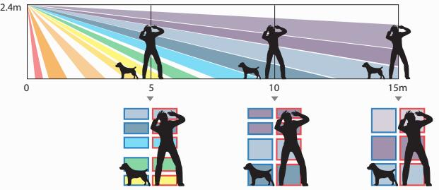

CDX-serien använder AIR-teknologi för att upptäcka maskering. För en hög driftsäkerhet kan detektorer i CDX-serien skilja mellan äkta maskering och annan maskering som orsakas av miljöförändringar såsom damm/smuts, temperaturförändringar och direkt ljus genom att optimera känsligheten.

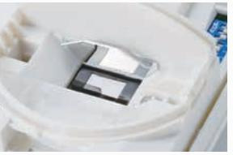

# **AKTIV IR DIGITAL ANTI-MASKING ROBUST EGENUTVECKLAD MIKROVÅGSMODUL**

De esta kombinationsdetektorer på marknaden använder en universell MW modul. OPTEX har utvecklat en egen MW modul speciellt framtagen för säkerhetsapplikationer. Det optimerar detekteringsprestanda och ger lång och säker drift.

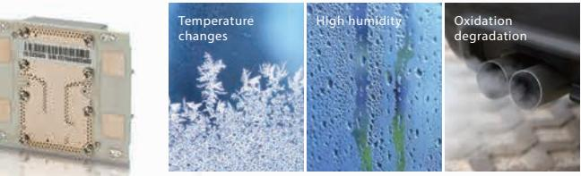

## **INOMHUSDETEKTORER LARMKLASS 3**

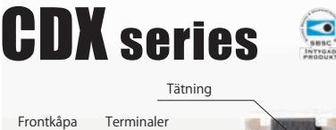

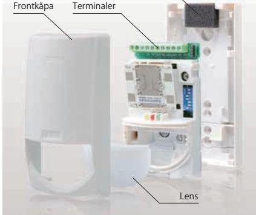

## **Double Conductive Shielding (CDX-AM/DAM)**

Med tekniken Double Conductive Shielding, blockeras synligt vitt ljus och RFI.

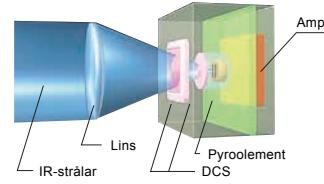

#### **Riktad mikrovågsteknik (CDX-DAM)**

Konventionell mikrovågsteknik kan medföra oönskat stort detekteringsområde. Med riktad MW teknik elimineras dessa områden för att skapa ett detekteringsområde som överlappar IR-detektorns.

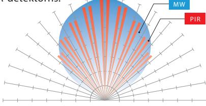

## **Enkel installation Plug-in EOL Modul (TILLVAL)**

Plug-in modul för att enkelt ställa motståndsvärden för normal, larm och sabotage beroende på aktuellt systems krav.

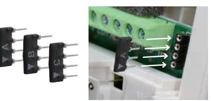

#### **Enkel installation Kabelgenomföring**

Rymlig kabelgenomföring i detektorns bakstycke ger en estetisk installation och lämnar också en exibilitet att anpassa detektorn efter inkoppling.

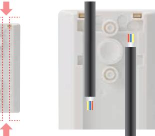

## **Enkel installation Snabbt byte av detektor**

Genom en enkelt utbytbar huvudenhet kan detektorn snabbt och enkelt bytas ut mot en annan modell i CDX-serien enligt nya

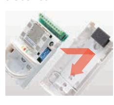

förutsättngar som kan uppstå.

#### **BEVAKNINGSOMRÅDE**

BREDSTRÅLANDE (CDX-AM/DAM)

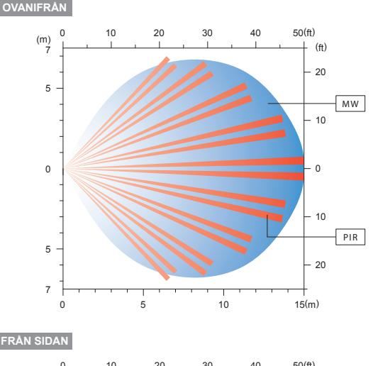

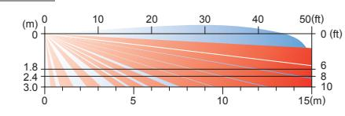

#### LÅNGSTRÅLANDE (CDX-NAM)

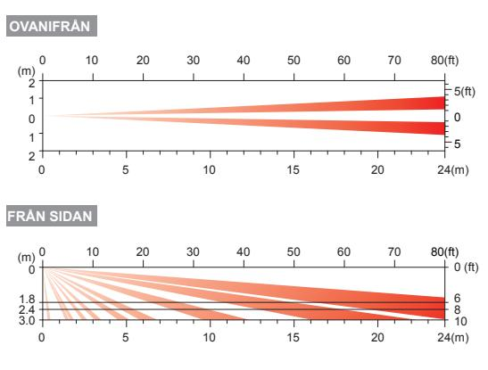

| Model                    | CDX-NAM                                        | CDX-AM                                        | CDX-DAM                                   |
|--------------------------|------------------------------------------------|-----------------------------------------------|-------------------------------------------|
| Detektering              | Passiv infraröd                                |                                               | Passive infraröd & Mikrovåg               |
| Uppfyller standard       | EN50131-2-2 (Grade 3)                          |                                               | EN50131-2-4 (Grade 3)                     |
| Anti-mask teknik      | AIR type                                       |                                               |                                           |
| PIR Bevaknings område | 24m x 2m (80ft. x 7ft.) smal (20 zoner)     | 15m x 15m (50ft. x 50ft.) 85° bred (82 zoner) |                                           |
| Spänning                 | 9 - 18VDC                                      |                                               |                                           |
| Ström                    | 17mA (normal) / 20mA (max.) vid 12V DC      |                                               | 19mA (normal) / 26mA (max.) vid 12V DC |
| Larmutgång               | N.C. 28V DC 0.2A max.                          |                                               |                                           |
| Sabotage                 | N.C. 28V DC 0.1A max.                          |                                               |                                           |
| Felutgång                | N.C. 28V DC 0.2A max.                          |                                               |                                           |
| Arbetstemperatur         | -10°C - +50°C (14°F - 122°F)                   |                                               |                                           |
| Luftfuktighet            | 95% max.                                       |                                               |                                           |
| RF immunitet             | Inget larm 10V/m                               |                                               |                                           |
| Monteringshöjd           | 1.8 - 2.4m (6 - 8ft.)                          |                                               |                                           |
| Vikt                     | 180g (6.3oz)                                   |                                               |                                           |
| Dimensioner (HxBxD)      | 140 x 70 x 52.3 mm (5.51 x 2.76 x 2.06 inches) |                                               |                                           |
|                          |                                                |                                               |                                           |

*Specifikation och design kan komma att ändras utan meddelande.

För mer information kontakta Teletec Connect AB. Nordens ledande leverantör av professionella säkerhetsprodukter. www.teletec.se

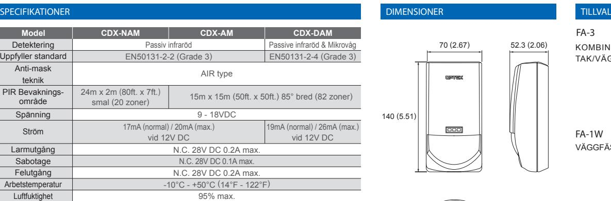

FA-3 KOMBINERAT TAK/VÄGGFÄSTE

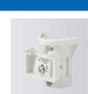

FA-1W VÄGGFÄSTE

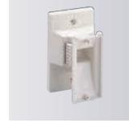

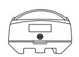

Unit:mm (inch)

5-8-12 Ogoto, Otsu, Shiga, 520-0101 Japan TEL +81(0)77 579 8670 FAX +81(0)77 579 8190 http://www.optex.co.jp/e/ **OPTEX CO., LTD.** (ISO 9001 Certied / ISO14001 Certied) OPTEX INCORPORATED (USA) http://www.optexamerica.com/

OPTEX (EUROPE) LTD. (UK) http://www.optex-europe.com/ (ISO9001 Certied)

OPTEX SECURITY SAS (FRANCE) http://www.optex-security.com/ OPTEX KOREA CO., LTD. (KOREA) http://www.optexkorea.com/ OPTEX SECURITY Sp. z o.o. (POLAND) http://www.optex.com.pl/ OPTEX (DONGGUAN) CO., LTD. http://www.optexchina.com/ SHANGHAI OFFICE (CHINA)