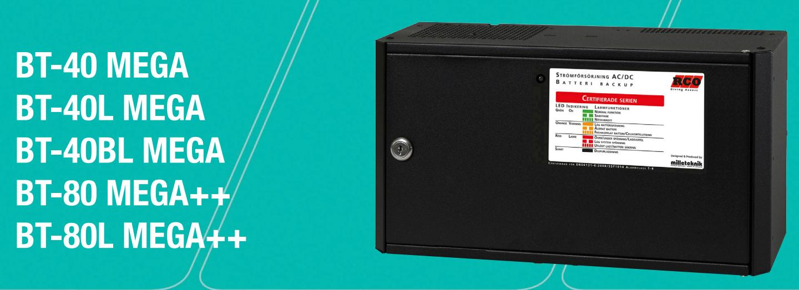
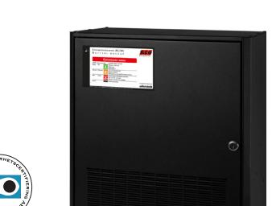
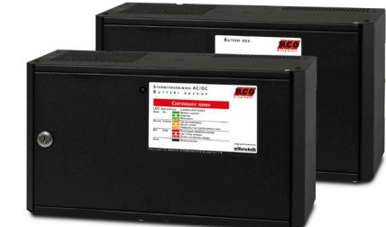
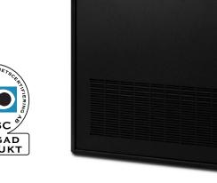
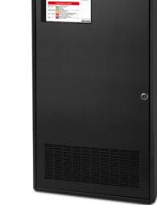
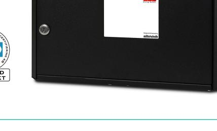
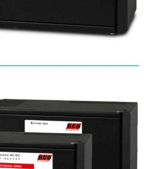
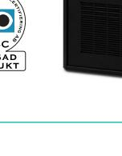

# **CERTIFIERAD BATTERIBACKUP**

## **STRÖMFÖRSÖRJNING FÖR BATTERIBACKUP – FULL KOMMUNIKATION MOT UC-50**

Larmen från batteribackupen fås via en kommunikationskabel mellan batteribackup och UC-50 (max 2 meter). Samtliga larmfunktioner visas separerade i klartext utan krav på programmering i R-CARD M5. Batteribackuperna erbjuder primärswitchteknik med mycket hög verkningsgrad. Samtliga produkter är avsedda att monteras på vägg.

#### **TEKNISK DATA**

|                                  | BT-40 MEGA  | BT-40L MEGA | BT-40BL MEGA         | BT-80++ MEGA | BT-80L++ MEGA |
|----------------------------------|-------------|-------------|----------------------|--------------|---------------|
| Inspänning:                      | 230 V AC    | 230 V AC    | 24 V DC              | 230 V AC     | 230 V AC      |
| Utspänning:                      | 27,3 V DC   | 27,3 V DC   | -                    | 27,3 V DC    | 27,3 V DC     |
| Max ström:                       | 5 A         | 5 A         | -                    | 5 A          | 10 A          |
| Godkänd medellast larmklass 1/2: | 1,35 A      | 4,5 A       | 4,5 A (inkl. BT-40)  | 3,3 A        | 6,8 A         |
| Godkänd medellast larmklass 3:   | 0,55 A      | 1,85 A      | 1,85 A (inkl. BT-40) | 1,25 A       | 2,75 A        |
| Godkänd medellast larmklass 4:   | -           | -           | -                    | 1,25 A       | 2,75 A        |
| Avsedd batterityp:               | 2x20 Ah     | 6x20 Ah     | 4x20 Ah              | 2x45 Ah      | 4x45 Ah       |
| Verkningsgrad:                   | 84 %        | 84 %        | -                    | 84 %         | 84 %          |
| Mått (mm, BxHxD):                | 430x210x205 | 430x420x205 | 430x210x205          | 475x245x420  | 765x245x420   |
| Vikt exklusive batterier:        | 5,45 kilo   | 9,75 kilo   | 4,30 kilo            | 11,10 kilo   | 16,60 kilo    |
| SBSC-intyg:                      | 12-769      | 12-769      | 12-769               | 14-142       | 14-143        |

#### **FUNKTIONER**

- Skydd mot överlast, överspänning, övertemperatur, kortslutning och djupurladdning
- 1x2-poligt avsäkrad utgång BT-40/BT40L
- 10x2-poligt avsäkrade utgångar BT-80++/BT-80L++
- Lysdiodsindikering på skåpets front

- Sabotagekontakt som standard
• Larm för följande: nätavbrott med tidsfördröjning, låg batterispänning, över/underspänning, utlöst lastsäkring, cellkortslutning, frånkopplat batteri, åldrat batteri, låg systemspänning och sabotage

### **ELEKTRONISKA LÅS FÖR HEM OCH FÖRETAG**

#### **BT-40 MEGA, 24 V, SSF 1014 larmklass 3**

Artikelnummer: 28 160 040 E-nummer: 58 700 68

- Godkänd för en medellast om max 1,35 A enligt larmklass 1/2 samt 0,55 A enligt larmkass 3
- Godkänd för 2x20 Ah-10–12-årsbatterier

Artikelnummer: 28 160 042 E-nummer: 58 700 69

- Godkänd för en medellast om max 4,5 A enligt larmklass 1/2 samt 1,85 A enligt larmkass 3
- Godkänd för 6x20 Ah-10–12-årsbatterier

Artikelnummer: 28 160 044 E-nummer: 58 700 70

- Godkänd tillsammans med BT-40 för en medellast om max 4,5 A enligt larmklass 1/2 samt 1,85 A i larmklass 3
- Godkänd för 4x20 Ah-10–12-årsbatterier

#### **BT-80 MEGA++, 24 V, SSF 1014 larmklass 3/4**

Artikelnummer: 28 160 046 E-nummer: 52 600 80

- Godkänd för en medellast om max 3,3 A enligt larmklass 1/2 samt 1,25 A enligt larmkass 3/4*
- Godkänd för 2x45 Ah-10–12-årsbatterier

#### **BT-80L MEGA++, 24 V, SSF 1014 larmklass 3/4**

Artikelnummer: 28 160 048 E-nummer: 52 600 81

- Godkänd för en medellast om max 6,8 A enligt larmklass 1/2 samt 2,75 A enligt larmkass 3/4*
- Godkänd för 4x45 Ah-10–12-årsbatterier

** Observera att artikelnummer 28 160 070 (seismiska detektorer) behövs i BT80 MEGA++ för att erhålla larmklass 4, respektive artikelnummer 28 160 071 (seismiska detektorer) i BT80L MEGA++ för att erhålla larmklass 4.*

#### *För 5 års garanti gäller följande krav:*

*• Omgivningstemperaturen får aldrig överstiga 25ºC. Temperaturen loggas av systemet och felaktig omgivningstemperatur kan påvisas vid garantiyrkande. • Batteribyte ska ske senast vart femte år.*

# **ELEKTRONISKA LÅS FÖR HEM OCH FÖRETAG**

RCO Security AB | 08-546 560 00 | Order 08-546 560 10 | info@rco.se | www.rco.se

