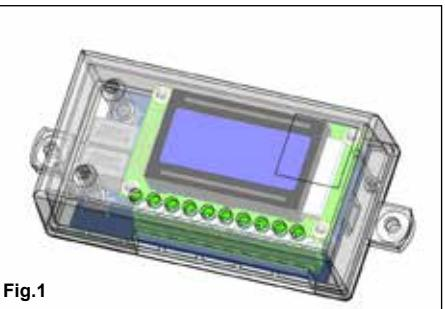
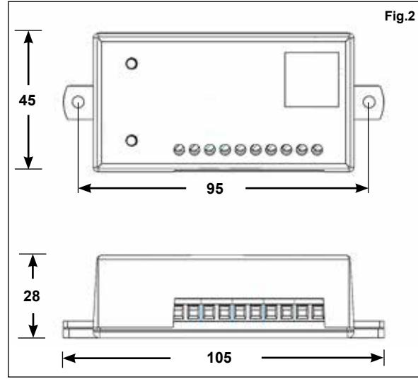
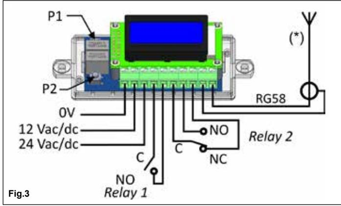
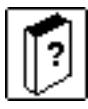
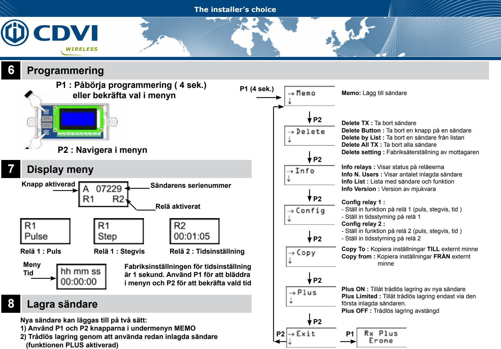
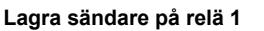
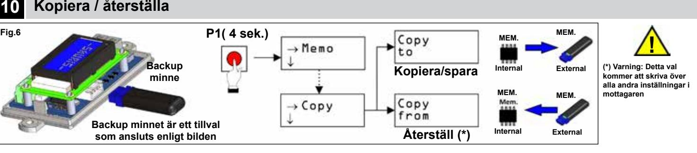

**1 Introduktion**

# **RADIOMOTTAGARE RRA100-2XPL**

**Fabricant de Contrôle d'Accès depuis 1985 The installer's choice Manufacturing Access Control since 1985**

Radiomottagare RRA100-2XPL är en mycket användarvänlig och säker mottagare med integrerad kryptering typ Keeloq Rolling code. Ett inbyggt system ser till att mottagare och sändare alltid är synkroniserade med varandra. Den kod som tas emot från sändaren ändras vid varje knapptryckning vilket förhindrar obehörigt utnyttjande. Mottagaren har två potentionalfria reläutgångar, en NO och en NO/NC. Man kan ansluta mottagaren till alla typer av reläfunktioner, tex larm, grindar, portar, jalusidörrar, rullgaller,

belysning med mera. Reläerna klarar en belastning på 24W eller 24VA.

Alla steg i programmeringen visas på en upplyst LCD display. Informationen som finns i radiomottagaren kan sparas/hämtas från/till ett externt minnseskort.

### **2 Teknisk specifikation**

Mottagningstyp: Superheterodyn Modulation: AM/ASK Frekvensband 433.92 Mhz Ingångskänslighet (för god signal): -115 dBm Ingångsimpedans: 50 Ohm Spänningsmatning: 12 eller 24V AC/DC Strömförbrukning (@12V DC): från 25 mA till 90 mA (max) Antal relä: 2 (1 NO och 1 NO/NC) Max belastning på utgående relä: 24VA, max 60V Max antal sändare: 100 sändare Säkerhetsprotokoll: Keeloq® rolling code Antal kombinationer 2exp64 (18,5 triljoner) Arbetstemperatur: -20 till + 70 °C Dimensioner ( Fig. 2): 105 x 45 x 28 mm Vikt: 65 gr Reläernas funktion: Puls (monostabil), stegvis (bistabil,

ON/OFF), tidsinställning Tidsinställning: från 1 sek. till 24tim:59 min

#### **3 Kopplingsschema**

### **I/O Connections** Kontakt Förklaring Kontakt Förklaring 1 0V 6 Relä 2-C 2 12 V AC/DC 7 Relä 2-NO 3 24 V AC/DC 8 Relä 2-NC 4 Relä 1-C 9 Antenn GND 5 Relä 1-NO 10 Antenn

(*) OBSERVERA: Det rekommenderas att använda en skärmad antenn, typ EREONE SEA433 för att få maximal mottagningsförhållanden.

### **4 Användbara sändare 5 Varningar**

Samtliga sändare i RTA-serien samt ER-serien från CDVI/Erone

Radiomottagarens placering är väldigt viktig för att uppnå full funktion. Placera mottagaren långt ifrån störande källor såsom magnetiska fält eller annan radiostrålning. Installationen och positioneringen av antennen är också viktig, vi rekommenderar att ni gör tester på plats. Avståndet mellan två mottagare bör vara mer än 1,5 meter för att minimera störningar.

Produktens kostruktion följer EU:s direktiv 2006/95/CE, 2004/108/CE, 99/05/CE samt standard EN 60335-1.

## **9 Trådlös lagring av nya sändare (PLUS funktionen aktiverad)**

**BEF. BEF. NY**

(*) : Tryck på knappen på den sändaren som skall lagras **INNAN** pipet slutar

NOTERING : Om alternativet «PLUS LIMITED» är valt kan endast den först inlagda sändaren aktivera funktionen trådlös lagring.

Om alternativet PLUS är OFF är trådlös lagring avaktiverad för alla sändare.

Om alternativet PLUS är ON kan alla befintliga sändare aktivera funktionen trådlös lagring av nya sändare.

Funktionen PLUS är aktiv bara om minst en sändare är lagrad i mottagaren. När minnet är tomt läggs den första sändarn in via undermenyn MEMO i displayen.

**Fig.5**

#### **GARANTI**

*Garantin för denna produkt löper under 60 månader från tillverkningsdatum. Om produkten under denna period inte fungerar på avsett sätt på grund av någon defekt komponent, kommer produkten att repareras eller bytas ut, allt efter tillverkarens beslut. Garantin gäller inte för apparatens plasthölje. Varje garantiåtgärd utförs vid tillverkarens säte.*